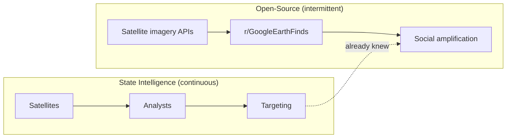

I live in Porto Velho, Rondônia, where `r/GoogleEarthFinds` gets used every few weeks to spot an illegal mining operation that IBAMA hasn't officially registered yet. The images are usually weeks ahead of the formal report. Sometimes the garimpeiros found the same satellite pass first and were already gone by the time anyone acted.

So when a post appeared on that subreddit — coordinates [27.1462289, 56.2109822](https://www.google.com/maps/place/27%C2%B008'46.4%22N+56%C2%B012'39.5%22E/), a Kilo-class submarine sitting in an Iranian dry dock, crisp image, significant asset — and the internet started asking whether Reddit had just helped guide a military strike, my reaction was not the standard pundit one. It was: _I've watched this movie. Just on a smaller scale._

The question everyone was asking is intoxicating: _a bored teenager clicking through satellite imagery, casually crowdsourcing a military strike._ The democratization of lethality. Every dry dock on earth only a click away.

I don't think that's what happened. I also don't know for certain. I genuinely have no idea what goes into a targeting decision at that level, and anyone who tells you they do is selling something.

## What we can actually say

Here is what's observable: the coordinates are real, the post is real, the submarine appears to be there. Militaries and intelligence agencies do monitor open-source data — that part is publicly documented and unsurprising. OSINT as a discipline has a decades-long institutional history.

Here is where we have to stop. The gap between "they monitor OSINT" and "this post influenced this strike" is not a small inference. It is the claim that an apparatus with dedicated spy satellites, signals intelligence, and billion-dollar reconnaissance budgets did not already know the location of a massive, static piece of naval infrastructure that cannot sneak into a dry dock.

A Kilo-class submarine does not arrive unannounced.

The two flows run in parallel. They occasionally intersect when OSINT surfaces something the state apparatus missed or chose not to publicize — but a parked submarine in a known facility is not that case. The Reddit post is almost certainly an echo, not a signal.

## The part that actually matters

What interests me more — and this is where the Amazon analog becomes useful — is what OSINT does to the _perceptual environment_ rather than to the operational one.

In Rondônia, IBAMA losing the OSINT race to garimpeiros is not a metaphor. The garimpeiros use the same freely available satellite data to find areas where enforcement is thin. IBAMA uses the same tools too, with better funding and institutional authority, but the information is symmetrical and the response times are not. What changes is not who controls the assets. What changes is who controls the window of plausible deniability.

That is what the submarine post does to the geopolitical environment, even if it never influenced a single targeting decision. It collapses the deniability window. Once a Kilo-class sub has been posted, indexed, and debated on Reddit, the pretense that its presence is a state secret becomes operationally expensive. It is not that the internet guided the bombs. It is that the internet made the non-bombing of the submarine a legible choice, where before it was a blank.

This distinction feels important to me, though I'll admit I'm not sure how far to push it.

War is increasingly visible, searchable, and commentable in near real-time. The public is not pulling any triggers. But the gap between what states know and what their publics can verify has narrowed in a way that changes the costs of certain kinds of lying. In the Amazon, the garimpeiros and the regulators and the satellite platforms and the subreddit all have access to roughly the same images, on roughly the same timeline. What's unequal is what they can _do_ with them.

Who controls the missiles hasn't changed. Who controls the plausible deniability might be.

## For further reading

- **Bellingcat, [bellingcat.com](https://www.bellingcat.com/)** — the organization that put open-source conflict investigation on the map; their methodology write-ups are worth reading even if you don't care about the specific investigations.
- **Jeffrey Lewis and the Arms Control Wonk team** — academic satellite imagery analysis done before the subreddit era; useful baseline for what state-of-the-art OSINT looked like institutionally.
- **Bruno Latour, _Reassembling the Social_** — not about OSINT, but the chapter on "matters of concern" vs. "matters of fact" is the philosophical ground under the perceptual-environment argument.
- **Raoni Rajão et al., "The rotten apples of Brazil's agribusiness" (Science, 2020)** — on data asymmetry in Amazon enforcement, with the specific dynamics of who has the satellite data and who acts on it.
