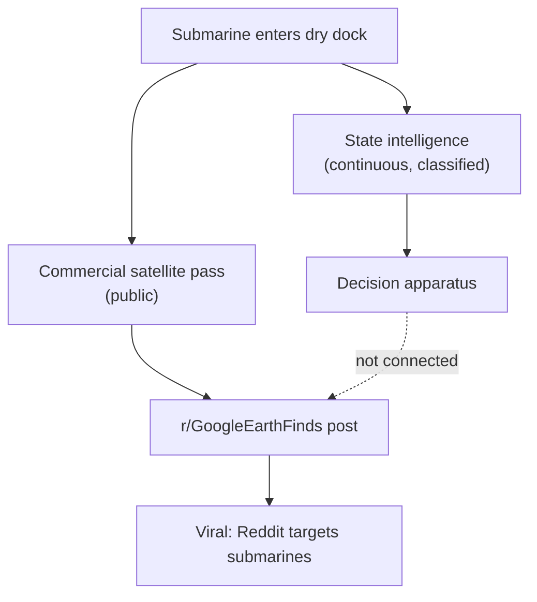

I live in Porto Velho, which is not the first place you'd think of when imagining geopolitics. But Amazônia gets watched constantly — by IBAMA drones, by MapBiomas satellite passes, by foreign journalists with Sentinel-2 access, by `r/GoogleEarthFinds` users who locate illegal landing strips in Pará and post the coordinates before the forest guard has filed a report. So when a post appeared on that same subreddit pointing at [27.1462289, 56.2109822](https://www.google.com/maps/place/27%C2%B008'46.4%22N+56%C2%B012'39.5%22E/) — a Kilo-class submarine sitting exposed in an Iranian dry dock — and the whisper network of the internet asked the thrilling, terrifying question: *Are they really using a Reddit post to help bomb a submarine in Iran?*, I felt like I was reading about something I already half understood from the other end.

The answer is almost certainly no. But the *almost* is where it gets interesting.

## The inference that doesn't hold

Here is what we know: the coordinates exist, the satellite imagery is public, the Reddit post is real. It is also certain that modern militaries and intelligence agencies monitor open-source intelligence. They scrape forums, track sentiment, analyze commercially available satellite data. This is not speculation; it is procurement.

But plausibility is not proof. To suggest that a military apparatus with billion-dollar reconnaissance budgets and dedicated spy satellites is *relying* on `r/GoogleEarthFinds` to locate a massive, static piece of naval infrastructure requires a theory of intelligence I cannot locate anywhere outside the internet's imagination. A Kilo-class submarine does not sneak into a dry dock unnoticed by state-level actors. Reddit was not the recon. Reddit was the press release.

If a strike were to happen at those coordinates next month, thousands of users would point to the Reddit post as the catalyst. *We found it first. We guided the bombs.* The military already knew. The Reddit post is an echo of a reality that state sensors had registered before the subreddit existed.

## What actually changed

The dismissal — plausibility is not proof, correlation is not causation — is technically correct and somewhat beside the point.

The more interesting question is why this narrative keeps appearing. The answer is not about operational inputs; it is about what it *means* that a civilian can identify, broadcast, and annotate the precise location of a foreign military asset in near real-time, and that this annotation immediately enters a public space where millions of people can dispute the ethics, logistics, and implications before the first siren.

This is the perceptual environment of war. Not the information environment — the perceptual one. The distinction matters: information was always flowing into military systems. What's new is that the *audience* to conflict has changed. A Reddit post acts as a public ledger. It indexes the asset. It makes the question of what happens next a question that millions of people are simultaneously watching, annotating, and arguing about.

From Porto Velho, watching IBAMA lose the OSINT race against illegal miners who are also watching the same satellite passes — I find this less surprising than the discourse around it. The public and the state are watching the same feeds now, just with different databases to cross-reference them against. The state's advantage is not information; it is context.

I'm not a military analyst. I'm a lawyer in Amazônia who watches satellite imagery get used to fight deforestation, and what I've noticed is this: the OSINT operations around deforestation do seem to affect behavior — not because they inform actors who don't know, but because they change what can be denied. The submarine sitting in the open, once narrated in public, is harder to pretend was never there.

The deeper question isn't whether Reddit is targeting submarines. The question is what happens to political accountability when every dry dock on earth is annotated in public before anything has happened — and whether that annotation creates a pressure the decision apparatus has to account for, even when it doesn't need the information.

Who controls the missiles hasn't changed. Who controls the plausible deniability might be.
