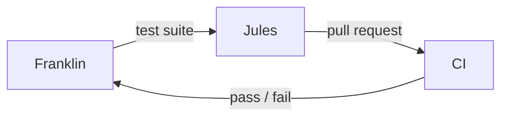

My day job is writing norms for people I won't supervise directly. Atos normativos, instruções de serviço, pareceres vinculantes — the whole toolkit of administrative law is fundamentally a delegation technology. You cannot watch every despacho issued in every repartição in Rondônia, so you write the constraint system and trust it to catch the deviations. The agent operates freely within the bounds; the oversight lives in the structure.

When I started running AI agents on my personal projects — [Jules](/blog/2026-05-10-jules-api-harness-backend/) for engineering scaffolding, Claude for synthesis and lateral thinking — I was surprised to find I already knew the theory. I had been doing delegation-by-constraint for a decade. The substrate changed. The governance problem didn't.

The part that took me a while: I initially tried to watch the code while Jules wrote it. In administrative law terms, this is reviewing every despacho before it goes out — technically possible, catastrophically slow, and counterproductive because it replaces the agent's judgment with yours and turns oversight into a bottleneck. You are no longer supervising; you are just doing the work yourself in a way that's slower.

The better move: write the test suite as you would write a binding norm. If Jules refactors a microservice and the integration tests pass, I don't audit the implementation. The deviation surfaces in CI. The constraint is the oversight.

What's genuinely new isn't the governance theory — it's the labor division I've worked out. Jules and Claude are not interchangeable agents doing the same thing at different capability levels. Jules runs deep context on a bounded problem: more technically consistent than I'd be at midnight, when the part of my brain that tracks interface contracts has already given up. Claude operates without bounds: useless for verifying a type signature, indispensable for the lateral move that notices the architecture is solving the wrong problem entirely.

Deciding which to engage is the real skill. It took me several weeks to notice I was asking Jules the "what should we build" questions and Claude the "how do we build this specific thing" questions — which is exactly backwards. Jules producing technically correct answers to the wrong problem is harder to catch than a failing test.

The unsolved part: the silent hallucination that compiles. A test suite catches what you anticipated. It doesn't catch the deviation you didn't anticipate. Administrative law has the same problem — a competent bureaucrat can technically comply with every norm in the statute and still produce outcomes the legislator did not intend. The constraint system surfaces anticipated deviations and nothing else.

My daughter is asleep in the next room. The terminal says green. I'll find out in the morning whether green meant what I thought it meant.
