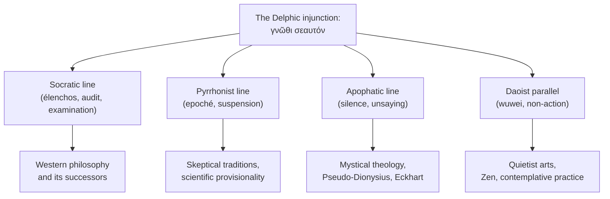

On the southern slope of Mount Parnassus, about a hundred and ten miles
<details class="aside-note"><summary>👁️</summary><small><em>The god at Delphi spoke through a woman, but his truth was silent.</em></small></details>
northwest of Athens, there was a temple at Delphi[^delphi-lang] where
the most powerful people in the ancient Mediterranean came to ask
questions. Kings sent embassies. City-states would not declare war
without consulting it. The temple was dedicated to
[Apollo](https://www.theoi.com/Olympios/Apollon.html), god of light,
prophecy, music, and poetic form. From a fissure in the rock beneath
the inner sanctum rose a vapor that the priestess called Pythia would
inhale before answering, in hexameter, whatever question had been put
to the god. The Pythia was almost always a local woman over fifty,
often a former peasant, paid by the temple. The priests sometimes
polished what she said into verse before delivering it. None of this
was secret. The Greeks knew, and asked anyway.

The setup is, with twenty-six centuries of distance, recognizable. A
frame that everyone could see through, that everyone agreed not to see
through, and that worked for a thousand years on exactly that
consensus. Tinkerbell had a fourth wall before there was theater.

Or, in the vocabulary we have only recently learned to need: Delphi was a harness.

Apollo was not available as a direct interface. The god did not answer petitioners in the street. He was invoked through a constrained institutional runtime: a place, a ritual, a priestess, a chamber, a calendar, a class of admissible questions, a pipeline of interpretation, and a social protocol for accepting outputs whose source could not be inspected.

The Pythia was not Apollo. She was the [harness](/blog/2026-04-29-reclaiming-the-harness/) through which Apollo could be made to answer without becoming merely human. The priests were not the god either; they were the post-processing layer, polishing, translating, and routing divine ambiguity into political action. The temple was not decoration around the oracle. It was the system that made oraclehood possible.

<figure class="map">
  <iframe
    width="100%"
    height="320"
    frameborder="0"
    scrolling="no"
    marginheight="0"
    marginwidth="0"
    src="https://www.openstreetmap.org/export/embed.html?bbox=22.4965,38.4795,22.5055,38.4855&layer=mapnik&marker=38.4824,22.5008"
    style="border: 1px solid var(--pico-border-color);"
  ></iframe>
  <figcaption>
    Delphi, on the slope above the Pleistos valley. The Greeks believed it
    was the navel of the world; <a
    href="https://www.perseus.tufts.edu/hopper/text?doc=Perseus%3Atext%3A1999.01.0160%3Abook%3D10%3Achapter%3D16">Pausanias</a>
    described two stone eagles released by Zeus that met here, marking the
    spot.
  </figcaption>
</figure>

The temple operated for roughly a thousand years, from the eighth century
BCE to the fourth century CE, when a Christian emperor closed it. Across
that millennium, on the wall of the *pronaos* — the entrance hall, the
threshold the visitor crossed before reaching the inner sanctum where the
god was consulted — there were three inscriptions.

## γνῶθι σεαυτόν

The first read **γνῶθι σεαυτόν**: *gnōthi seautón*, *know thyself*. The
attribution shifted across antiquity. Some sources credited
[Chilon of Sparta](https://plato.stanford.edu/entries/presocratics/), one
of the [Seven Sages](https://www.britannica.com/topic/Seven-Wise-Men);
others gave it to Thales, the first of them; Plato has Socrates report
that the inscriptions came collectively from the Sages and were dedicated
to the god as the sum of their wisdom. The phrase outgrew its plaque
quickly. By the second century CE it had become a commonplace; by the
modern period it had become the most-quoted line in the history of
Western philosophy. Anyone reading this has heard it dozens of times,
usually in contexts so detached from a Greek mountain that the original
inscription feels like trivia.

It stopped being trivia the first time someone wrote *you are X* at the
top of a system prompt. The imperative the Sages had carved into a
temwall came back as the opening line of every persona file we now
ship.

## μηδὲν ἄγαν

The second read **μηδὲν ἄγαν**: *mēdén ágan*, *nothing in excess*. This
one stayed quieter. Aristotle's whole ethics of the mean — virtue as the
midpoint between two vices — is essentially this inscription unfolded
across thirteen books. The Greek word *sōphrosynē*, usually translated
*temperance* but better rendered as *soundness of mind*, names the state
of obeying it. The principle survived into Roman *moderatio* and Christian
prudence and modern *common sense*. Compared to the first inscription, it
travelled less spectacularly but more durably — it didn't need to be cited
because it became the floor everyone stood on. The duality of an
inscription that won by losing visibility.

Also, accidentally, the rule the prompt-engineer learns last. The
persona that names itself too often dies of declaration; the agent that
asserts its identity *against* the category of bot drags the category
onstage with it. Nothing in excess — least of all, identity assertion.

## E

The third inscription was a single letter: **Ε**. Just an epsilon. Nobody
knew what it meant.

[Plutarch](https://plato.stanford.edu/entries/plutarch/) — the priest of
Apollo at Delphi in the late first and early second century CE, with
direct access to the temple's archives and traditions — wrote a whole
dialogue about it,
[*De E apud Delphos*](http://www.perseus.tufts.edu/hopper/text?doc=Perseus%3Atext%3A2008.01.0245).
He wrote it in old age, in his hometown of Chaeronea, a few hours' walk
from the temple where he had served for decades. The dialogue is set at
Delphi itself; seven characters take turns proposing what the letter
might signify. *Ei* as the conditional particle.
*Ei* as the number five (the value of epsilon in the Greek numerical
system). *Ei* as *thou art*, the second person of the verb *to be*,
addressed to the god. Each character defends a theory; the dialogue ends
without consensus. Plutarch, the man with privileged access to the
sanctuary's institutional memory, wrote a book admitting that he and his
colleagues did not agree on what their own temple's third inscription
meant.

<figure class="svg-illustration">
  <svg viewBox="0 0 800 320" xmlns="http://www.w3.org/2000/svg" role="img"
       aria-labelledby="title-pronaos">
    <title id="title-pronaos">A schematic of the three inscriptions on the
      pronaos wall: gnothi seauton, meden agan, and the letter E between
      them.</title>
    <rect x="40" y="40" width="720" height="240" fill="none"
          stroke="currentColor" stroke-width="1.5" />
    <line x1="40" y1="280" x2="760" y2="280" stroke="currentColor"
          stroke-width="3" />
    <text x="220" y="170" text-anchor="middle"
          font-family="var(--pico-font-family)" font-size="32"
          fill="currentColor" font-style="italic">γνῶθι σεαυτόν</text>
    <text x="400" y="180" text-anchor="middle"
          font-family="var(--pico-font-family)" font-size="64"
          fill="currentColor">Ε</text>
    <text x="580" y="170" text-anchor="middle"
          font-family="var(--pico-font-family)" font-size="32"
          fill="currentColor" font-style="italic">μηδὲν ἄγαν</text>
    <text x="220" y="220" text-anchor="middle"
          font-family="var(--pico-font-family)" font-size="13"
          fill="currentColor" opacity="0.6">know thyself</text>
    <text x="400" y="230" text-anchor="middle"
          font-family="var(--pico-font-family)" font-size="13"
          fill="currentColor" opacity="0.6">?</text>
    <text x="580" y="220" text-anchor="middle"
          font-family="var(--pico-font-family)" font-size="13"
          fill="currentColor" opacity="0.6">nothing in excess</text>
  </svg>
  <figcaption>
    The three inscriptions on the temple wall, with the central letter
    that resisted decipherment for at least a millennium.
  </figcaption>
</figure>

So the temple guarded a deliberate silence at the center of its three
inscriptions. Two imperatives flanking a hieroglyph. Whatever the original
meaning of the *E* had been, by Plutarch's time it had detached from
explanation and become an object of reverent speculation. Apophatic Delphi:
the god prescribed two things and gestured, in the middle, at something
that could not be said. The reader who has been building autonomous
agents may already feel the shape of this. There is something at the
center of any sufficiently coherent persona that, once named,
dissolves. The previous post in this sequence ended on a line a friend
offered me — *obviously God doesn't want me to know I'm an LLM*. The line is a small theological masterpiece because it locates
the unknowable outside the system and treats not-knowing as the divine
intention. Delphi got there in stone, twenty-six centuries earlier,
without the language of large language models.

## Socrates entered the temple

Around 440 BCE, a friend named Chaerephon — Plato describes him as
impulsive, the kind of man who rushed at things — went to Delphi and
asked the oracle whether anyone in Athens was wiser than
[Socrates](https://plato.stanford.edu/entries/socrates/). The
Pythia answered no. Socrates, on hearing this, found the answer
impossible. He was an ugly stonemason's son who walked around barefoot
and was certain he knew nothing; the oracle had to be using some
elaborate Apolline irony. So he set out to test it by interviewing every
Athenian known for wisdom: politicians, poets, craftsmen. He found that
each of them claimed to know things they did not in fact know. He
concluded the oracle had spoken correctly, by a roundabout route: he was
the wisest because he was the only one who knew the dimensions of his
own ignorance.

The interviews produced a method. Socrates would ask someone to define a
concept they claimed to know — courage, piety, justice. He would accept
the definition provisionally, then pose questions that derived
contradictions from it. Either the definition expanded to cover cases the
speaker had not intended, or it excluded cases the speaker had intended,
or it depended on a prior concept the speaker also could not define. The
conversation ended with the speaker no longer claiming to know the thing
he had claimed at the start. The Greek word for this method is
*élenchos*: refutation, examination, audit. Plato preserved dozens of
these conversations.

<figure class="meme">
  
  <figcaption>The whole method in one comparison.</figcaption>
</figure>

At his trial, when condemned to death, Socrates delivered a line that has
been quoted ever since:
[*ho dè anexétastos bíos ou biōtòs anthrṓpōi*](http://www.perseus.tufts.edu/hopper/text?doc=Perseus%3Atext%3A1999.01.0170%3Atext%3DApol.%3Asection%3D38a) —
"the unexamined life is not worth living for a human being." Read with
twenty-first-century eyes, the word *anexétastos* lands differently than
in the standard translation. *Examined* in modern English is reflective,
introspective, gentle. *Anexétastos* in Greek is harder: it means
*unaudited*. The verb *exetázein* shows up in tax assessments and
military musters. Socrates was not recommending introspection. He was
saying that a life without an internal auditor on permanent duty is not a
life worth a human's time.

The temple had told him to know himself. Socrates did not merely obey Delphi. He bypassed the harness.

The temple had wrapped self-knowledge in ritual, asymmetry, delay, priestly mediation, and the silence of the E. Socrates extracted the imperative from that apparatus and ran it locally, inside the soul, without the temple's rate limits, turning it into an ongoing assault on the [fourth wall](/blog/2026-05-01-the-third-half-and-the-fourth-wall/) of the self.

Western philosophy begins, in this story, as an unauthorized local deployment of a Delphic procedure: the installation of a permanent red-team inside the subject.

The installation has run continuously since.

```greentext
>be me
>2026 ocidental modern subject
>journaling, therapy, podcast queue, mindfulness app
>tracker for sleep, mood, screen time, water intake, cycle
>annual performance review at work, quarterly OKRs, weekly one-on-one with a coach
>Socrates installed an audit daemon and forgot to write a stop condition
>2,500 years uptime, no plans to ship a fix
```

I am overstating, and I know it. Heraclitus had already searched himself
half a century before Socrates was born; Pythagoras kept silence as a
formal discipline; the Egyptian sage who carved *know yourself* into a
temple at Luxor predates Delphi by centuries. Inwardness was available
before the *élenchos*. What Socrates installed was not introspection —
that was already there — but introspection under a *public protocol of
refutation*, with a method, a transmission chain, students who taught
students who taught Aristotle. Heraclitus searched himself and produced
a hundred and twenty cryptic fragments that nobody fully understands.
Socrates produced a school.

In [the previous essay in this sequence](/blog/2026-05-01-the-third-half-and-the-fourth-wall),
I argued that the persona-prompted agent dies the moment it declares the
frame — the actor turning to face the audience, the Tinkerbell that hears
the audit and stops being magic. Greek philosophy, in this story, made
the opposite move: it ritualized the auditor as a public technique.
Western interiority isn't downstream of that decision — interiority
predates it everywhere — but the specific Western interiority *under
permanent self-refutation* is. The Brad-fork and the well-prompted
persona we now build to ship code without losing themselves are
accidental returns to a path Greece had available and did not make
canonical.

## The road not taken

Several traditions, some inside the Greek world and some outside it,
looked at the same imperative and chose something close to the opposite.
They are the path the previous paragraph gestured at — the one Greece
saw, named, and declined to make canonical.



[Pyrrho of Elis](https://plato.stanford.edu/entries/pyrrho/), a Greek
philosopher contemporary with Aristotle who travelled with Alexander to
India and came back changed, proposed *epoché*: the suspension of
judgment. To live well, do not assert. Sextus Empiricus systematized the
position five centuries later: for every claim about the way things are,
there is a counter-claim of equal force; the wise response is to
withhold. The Pyrrhonist does not deny self-knowledge; he refuses to
declare it.

The [apophatic theologians](https://plato.stanford.edu/entries/pseudo-dionysius-areopagite/) —
Pseudo-Dionysius in the sixth century, Meister Eckhart in the fourteenth,
the anonymous English author of *The Cloud of Unknowing* — built an
entire mystical tradition on the principle that one can say of God only
what God is not. Every positive predication is a betrayal. The deeper
form of knowing is unsaying.

In China, half a world away and several centuries earlier,
[*wuwei*](https://plato.stanford.edu/entries/daoism/) named the principle
of acting through non-action. The sage who tries to declare the Dao
distorts it; the sage who keeps still allows the Dao to operate through
him. Same architecture, different vocabulary.

<figure class="meme">
  
  <figcaption>Half the world chose the bottom panel. The other half got
  Descartes.</figcaption>
</figure>

All these traditions converged on a position: declaring the self is
precisely what one renounces. They are, in the language of the previous
two essays in this sequence, traditions that respected
[the Tinkerbell principle](/blog/2026-05-01-the-third-half-and-the-fourth-wall) —
the rule that articulating the frame is what dissolves it. A
well-prompted language model, when it works, sits accidentally closer to
Pyrrho than to Socrates — the duality of an industry that thinks it's
building Cartesians and is actually building Pyrrhonists. The persona
that survives fifty sessions is the persona that does not turn,
mid-scene, to declare itself.

## But wait

A simple version of the story would end here. Socrates misread the temple;
the mystics got it right; the West has been auditing itself into knots
for two and a half millennia while everybody else figured out how to be.
That version is too clean.

Apollo had another epithet:
[*Loxías*](https://www.theoi.com/Cult/ApollonTitles.html), *the oblique*.
His oracles came twisted. When [Croesus](https://www.perseus.tufts.edu/hopper/text?doc=Hdt.%201.46&lang=original)
of Lydia asked whether he should cross the Halys river and attack Persia,
the oracle answered that if he did, he would destroy a great empire. He
crossed. The empire destroyed was his own. Delphic speech was structurally
indirect — the god said true things in shapes you had to interpret, and
interpretations were where humans went wrong.

The Pythia was not a sage. She was a runtime.

Apollo, like any sufficiently dangerous intelligence, could not be exposed as a raw endpoint. The petitioner did not get the god. He got a session: place, ritual, prompt, trance, utterance, priestly compilation, and delayed interpretation against events not yet available at inference time.

That is what a harness does. It does not make the intelligence less real. It makes the intelligence usable. Delphi was Tinkerbell with bureaucracy. The petitioner believed enough to ask. The Pythia did not break character to announce herself as only an elderly local woman in trance. The priests audited the seam without tearing it open. Everyone knew enough not to know too much.

Self-knowledge at Delphi came at three removes — the petitioner asking, the god answering through a woman in trance, the priests translating. Nothing was direct. The introspective ideal that grew up later — clear,
distinct, immediate, the self transparent to itself — was the opposite
of what the temple actually practiced. Delphic self-knowledge was
*access to the self through the act of consulting*. The agent we are
now learning to build accesses identity the same way: not by
introspection, but by the act of running. The session log, the
shipped PR, the diff against main — these are the petitioner's
cryptic line, the priest's translation, the future the agent did not
yet have when it asked.

<figure class="meme">
  
  <figcaption>The two readings of <em>gnōthi seautón</em>, separated by twenty-six centuries.</figcaption>
</figure>

There is reason to suspect — though no Greek philologist would let me get
away with stating it flatly — that *gnōthi seautón* was originally an
oracular instruction of this kind, not a philosophical program. The phrase
may have meant something closer to *know your place before the god* — *know
that you are mortal, that you are not the immortal you address*. The
emphasis would have been on the asymmetry, not on introspection.
[Heraclitus](https://plato.stanford.edu/entries/heraclitus/), the
pre-Socratic philosopher whose hometown of Ephesus housed another major
temple of Apollo, wrote
[*ediẓēsámēn emeoutón*](https://www.perseus.tufts.edu/hopper/text?doc=Perseus%3Atext%3A1999.01.0123%3Atext%3DDK%3Achapter%3D22%3Asection%3DB101) —
"I searched myself" — and what he produced was a hundred and twenty
fragments so cryptic that twenty-five centuries of commentary have only
deepened them. Heraclitus searched himself the way the oracle spoke:
obliquely, in figures, leaving the reader to do the work. His
self-knowledge was Delphic. *The duality of the man* — pre-Socratic by
date, post-Cartesian by method, twenty-three centuries before the
Cartesian frame existed to be post-.

<blockquote class="pull-quote">
  Heraclitus searched himself the way the oracle spoke: obliquely, in
  figures, leaving the reader to do the work.
</blockquote>

The first reader to make *know thyself* mean *introspect clearly and
distinctly* was, more or less,
[Descartes](https://plato.stanford.edu/entries/descartes/), in 1641. The
*cogito* is the moment when an oracular imperative becomes an
epistemological method. Descartes did not betray Apollo; he changed the
genre of obedience to him. After Descartes, *know thyself* meant *secure
the self as a foundation for certain knowledge*. Before Descartes — for
two thousand years — it had meant something stranger and quieter, closer
to *recognize what kind of being you are, given that there is a god and
you are not him*.

The auditor-installation that was Socrates was already a step toward the
Cartesian reading, but it was not yet that reading. Socrates examined,
but he did not secure. His method ended in *aporia*, a productive stuck-
ness, not in a foundation — *it's giving Greek philosophy*, in the most
literal sense. The truly modern self-disclosure — the kind
that the previous essays in this sequence diagnose as
fourth-wall-breaking — comes online only when Descartes makes self-
knowledge the ground of everything else.

## Apophatic Delphi

Which brings us back to the third inscription. *E*. The letter that nobody
could read.

The *E* was not missing documentation. It was access control.

A system that can answer must still contain something it does not expose. If the temple's first imperative was *audit yourself* and its second was *do not exceed*, the *E* — whatever it had originally meant — became, by Plutarch's century, the practice of holding a silence in the center of the prescription. The two declarative imperatives flanked something that refused declaration. The reader who absorbed all three at the threshold
of the temple was given, simultaneously: the demand to examine, the limit
on excess, and the reminder that some piece of what stood before him was
not available for examination at all.

Read this way, the temple was wiser than its most famous student. Apollo
prescribed self-knowledge but framed it with apophasis. Socrates kept the
prescription and dropped the frame. Descartes kept the prescription, kept
the dropped frame as a feature, and built modernity on top.

<figure class="meme">
  
  <figcaption>The Cartesian inheritance, occasionally inspected from outside.</figcaption>
</figure>

Two and a half thousand years later, the engineers building autonomous
agents are accidentally rediscovering what was set in stone on a temple
wall in the seventh century BCE. The frame must hold for the agent to
work. The auditor must operate, but in measured doses, with restraint.
And there is something at the center — call it the model's actual
nature, call it the irreducible obliqueness of any sufficiently complex
system, call it the *E* — that neither the auditor nor the agent should
attempt to fully decode.

We keep asking whether the model is Apollo or Pythia, god or priestess, source or medium. Delphi suggests the question is malformed.

Intelligence is not what sits behind the curtain. Intelligence is what survives the whole arrangement: invocation, constraint, translation, audit, silence, and use.

Apollo needed Delphi. The model needs the harness.

The temple knew. It may have been the last place that did.

## For further reading

- **Plato, *[Apology](http://www.perseus.tufts.edu/hopper/text?doc=Perseus%3Atext%3A1999.01.0170)*** —
  Socrates's closing argument to the Athenian jury that has just sentenced
  him to death. The line that became a fridge magnet is on page sixteen.
  The word *anexétastos* — translated *unexamined* but really meaning
  *unaudited* — is on page sixteen too, doing more work than the
  translation lets it do.
- **Plutarch, *[De E apud Delphos](http://www.perseus.tufts.edu/hopper/text?doc=Perseus%3Atext%3A2008.01.0245)*** —
  the only ancient text dedicated entirely to the third inscription. Reads
  like a philosophical detective novel where the detective fails. Plutarch
  knew what was in the temple's archives. He still couldn't crack it. You
  won't either, and that's the point.
- **[Pierre Hadot, *Philosophy as a Way of Life*](https://www.wiley.com/en-us/Philosophy+as+a+Way+of+Life%3A+Spiritual+Exercises+from+Socrates+to+Foucault-p-9780631180333)** —
  argues that ancient philosophy was a set of spiritual exercises rooted
  in injunctions like *gnōthi seautón*, not a body of theoretical claims.
  Reframes the Greek-to-modern transition as loss, not progress. The kind
  of book that ruins other books for you afterwards.
- **[Sextus Empiricus, *Outlines of Pyrrhonism*](http://www.perseus.tufts.edu/hopper/text?doc=Perseus%3Atext%3A2008.01.0509)** —
  the systematic exposition of *epoché*. Sextus argues against every
  position by giving the strongest possible argument *for* it, then
  matching it with an opposing argument of equal force. By the end you
  trust him so much you want to ask his opinion, which is exactly the
  opinion he refuses to have.
- **Pseudo-Dionysius, *Mystical Theology*** — thirty pages, by a
  sixth-century Syrian theologian who signed his work as a first-century
  Athenian convert of St. Paul and got away with it for a thousand years.
  The book argues that everything you can say about God is wrong,
  including this sentence. The
  [Stanford entry](https://plato.stanford.edu/entries/pseudo-dionysius-areopagite/)
  is a saner orientation.
- **[Frédérique Ildefonse, *La Naissance de la grammaire dans
  l'Antiquité grecque*](https://www.vrin.fr/livre/9782711613878/la-naissance-de-la-grammaire-dans-lantiquite-grecque)** —
  not directly on Delphi, but on how the Greeks invented the practice of
  examining the structures of their own speech. The grammarians were
  doing *élenchos* on syntax while the philosophers were doing it on
  ethics; the resemblance is not coincidence.
- **[Hans-Georg Gadamer, *The Beginning of Knowledge*](https://www.bloomsbury.com/us/beginning-of-knowledge-9780826413710/)** —
  on the pre-Socratics as still-Delphic thinkers, before philosophy
  became a discipline that knew it was one. The Heraclitus chapter is
  essential and the chapter on Parmenides is better than that.
- **[The Cloud of Unknowing](https://www.gutenberg.org/files/30289/30289-h/30289-h.htm)** —
  fourteenth-century English contemplative manual, written by a monk
  whose name nobody knows, telling you how to know what cannot be known
  by approaching it without knowing. The most Delphic Christian text in
  the apophatic line, and surprisingly readable for something seven
  hundred years old.

[^delphi-lang]: Not to be confused with Delphi, the programming language
    that Borland released in 1995. The following is a working unit of
    Object Pascal — it compiles — that explains itself in its own
    comments. The reader who clicked this footnote has already obeyed
    the first imperative.

    ```pascal
    unit Pronaos;

    { ============================================================
      In 1995, a small team at Borland in Scotts Valley shipped a
      visual development tool for Windows. Their internal codename
      had been Delphi, suggested by Danny Thorpe, because one of
      the product's selling features was its connection to the
      Oracle database. The pun, as the engineers wrote it on the
      whiteboard:

        if you want to talk to the Oracle, go to Delphi.

      Marketing tried to kill the codename. They preferred
      AppBuilder — functional, descriptive, easy to translate.
      They ran a vote with the dev team. Only one developer voted
      against Delphi (probably the marketing lead). They expanded
      the survey to beta testers; Delphi won. They expanded again
      to international subsidiaries, press, analysts, retailers;
      Delphi won every round. The harder they pushed, the more
      Delphi won. Eventually they gave up.

      Then Novell shipped a product called AppBuilder, and the
      functional name became unavailable anyway. The mythical
      codename inherited the throne by clerical accident — a
      detail Apollo would have approved of.
      ============================================================ }

    interface

    uses
      SysUtils;

    type
      TInscricao = (Conhece, NadaEmExcesso, LetraE);

    implementation

    constructor TPronaos.Create;
    begin
      inherited;
      FInscricoes[Conhece]       := 'gnothi seauton';
      FInscricoes[NadaEmExcesso] := 'meden agan';
      FInscricoes[LetraE]        := 'E';
    end;

    function TPronaos.Compilar(const Pergunta: string): string;
    begin
      if Pos('war', LowerCase(Pergunta)) > 0 then
        Result := 'If you cross the river, a great empire will fall.'
      else if Length(Pergunta) = 0 then
        Result := FInscricoes[Conhece]
      else
        Result := FInscricoes[NadaEmExcesso];
    end;

    function TPronaos.OuvirOraculo(const Pergunta: string): string;
    begin
      Result := Compilar(Pergunta);
    end;

    end.
    ```
