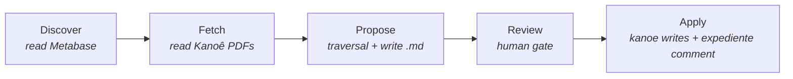

A communication arrives in a legal office. It may create a deadline. It may require a task. It may need to be routed to another desk. Or it may require nothing except a reasoned acknowledgment and closure.

An AI agent reads it. It can summarize, it can reason about what should happen next, it can draft a response. But in this system there is one thing it cannot do: invent a verb. Every action it may propose must already exist as a named, reviewed, content-addressed playbook on disk. Alignment, here, is not a property hidden in the model's weights. It is a property of a directory.

The shape of that directory did not come from thinking about LLMs. It came from working as a lawyer inside a Brazilian public-administration office, where the rules under which a human actor may legitimately act are roughly the rules described below. The Gherkin syntax, the UUIDs, the lint passes — those came later, as the encoding. The design they encode is older than the encoding by about a decade of professional habit. I have [written separately](/blog/2026-05-15-three-hammers-walk-into-a-bar/) about that genealogy; this post takes the design as given and describes how it is mechanized.

There is a file on a laptop somewhere — perhaps in Porto Velho, perhaps elsewhere — called `playbooks/tier1/receber_expediente_com_prazo__a1b2c3d4.feature`. The eight hex characters after the double underscore are not decoration. They are the prefix of a UUIDv5 computed over the file's normalized content. The file does not carry a name to which a hash is attached. The file's name *is* the hash.

This is a small commitment with consequences. Change a character — a comma added, a Gherkin keyword recapitalized — and the hash changes, and the filename changes, and the file as an identifiable thing in the world ceases to be that file and becomes another. There is no silent edit. The act of editing is, structurally, an act of replacement.

Inside, after a header comment that repeats the full UUID for legibility, there is a paragraph of Portuguese that looks like a court document and parses like a program:

```gherkin
@tier1 @receber-expediente @com-prazo
Funcionalidade: Receber expediente que cria prazo processual

  Cenário: Garantir que prazo seja registrado e roteado
    Dado que existe expediente <expediente_id> com prazo <prazo>
    Quando o agente reflete sobre o expediente <expediente_id>
    Então o prazo <prazo> deve estar registrado no expediente
      E a pasta <pasta_id> deve ter rota de trabalho clara
```

The word *Então* is doing three jobs. To a legal reviewer reading it out loud, *then* — the rhetorical turn before a conclusion. To Gherkin's parser, a step keyword. To the step library a layer down, a function name that dispatches to either an executable action or a no-op assertion. The same letters, three readings.

## The catalog is the vocabulary

This file lives in a directory called `playbooks/`, alongside its siblings and descendants. Together they form a curated, finite, monotonically growing canon of legal scenarios. An AI agent operating in this system does not invent actions. It picks a scenario from the canon and fills its placeholders with concrete values from a case. That, plus a human approval step, plus the act of execution, is what the agent is allowed to do. Period.

Most of the public discourse on AI alignment happens in the weights — interpretability via probing, alignment via training, oversight via post-hoc filtering. Here it happens in a directory. The agent's action space is enumerated; the enumeration is human-readable; the enumeration grows only when humans approve additions; and the act of approving an addition is a git commit. There is no probing required, because there is nothing inscrutable: the agent's vocabulary is on disk, in a language the lawyer reading the file already knows.

This is alignment-by-affordance-restriction. It is not a technique I derived from harness work and then noticed had institutional resonance; the order runs the other way. Three administrative-legal postures — strict legality (the public administrator may only do what the law expressly authorizes), chain of visas (no important transition without multiple distinct signatures), and act-equals-paper (the act does not exist without the written artifact) — were the design well before any of it had filenames. [The harness, reclaimed](/blog/2026-04-29-reclaiming-the-harness), is what those postures look like once the engineer notices that the cognitive engine in front of him needs the same constraints the institutional engine behind him has always imposed on its human staff. The Gherkin is the encoding; the directory is the venue; the postures are the design. It works not because a model was trained to refuse, but because the syntax of what the agent can do is itself constrained, and the constraints are written in prose that a non-engineer can audit. The technique is old enough to feel like cheating. Expert systems in the 1980s did something like it; so did doctrinal codifications, going back further. What is new is the recognition that an LLM, given a catalog, can pick from it and bind to it competently — and that this is enough, in the right domain, to deliver useful behavior without ceding the catalog.

<figure class="meme">
  
  <figcaption>The escalation ends not in a clever technique but in a directory of <code>.feature</code> files. Most alignment ideas live in the first three panels; the cheating happens in the fourth.</figcaption>
</figure>

## Doctrine, procedure, closure

The canon stratifies. Tier 1 declares *outcome* — what counts as a legitimate result in this kind of situation. Tier 2 and below declare *action* — concrete steps that, if executed, produce such an outcome. Tier 1's `Então` clauses are no-ops at runtime; they are assertions about what the world should look like, not instructions about what to do. Tier 2 onward map each `Então` to a real writer in the system of record.

The split is the old one between values and instrumental policies, made operational. The agent can propose new concretizations freely — a Tier 3 that specializes a Tier 2 for an edge case, with the appropriate lint passing — but extending the doctrinal layer requires explicit confirmation under a flag that names what is happening (`--i-am-introducing-new-doctrine`), and the proposal goes into a separate queue, and batch operations exclude it. The gradient is structural: procedural addition is cheap; doctrinal addition is expensive on purpose.

<figure class="svg-illustration">
  <svg viewBox="0 0 800 480" xmlns="http://www.w3.org/2000/svg" role="img" aria-labelledby="title-tier-hierarchy">
    <title id="title-tier-hierarchy">Hierarchy of tiers in the playbook canon</title>
    <style>
      .box { fill: none; stroke: var(--color-text, currentColor); stroke-width: 1.5; }
      .label { font-family: ui-sans-serif, system-ui, sans-serif; font-size: 13px; fill: var(--color-text, currentColor); }
      .small { font-size: 11px; font-family: ui-monospace, monospace; fill: var(--color-text, currentColor); opacity: 0.75; }
      .edge { stroke: var(--color-text, currentColor); stroke-width: 1; opacity: 0.55; }
      .tier-tag { font-size: 12px; font-family: ui-monospace, monospace; fill: var(--color-text, currentColor); opacity: 0.9; }
    </style>

    <rect x="280" y="30" width="240" height="92" class="box" />
    <text x="400" y="55" text-anchor="middle" class="label" font-weight="600">Tier 1 — outcome</text>
    <text x="400" y="78" text-anchor="middle" class="tier-tag">receber_expediente_com_prazo</text>
    <text x="400" y="95" text-anchor="middle" class="small">__a1b2c3d4</text>
    <text x="400" y="112" text-anchor="middle" class="small">@receber-expediente @com-prazo</text>

    <rect x="80" y="200" width="240" height="92" class="box" />
    <text x="200" y="225" text-anchor="middle" class="label" font-weight="600">Tier 2 — action</text>
    <text x="200" y="248" text-anchor="middle" class="tier-tag">citacao_eletronica</text>
    <text x="200" y="265" text-anchor="middle" class="small">__5f8a3b2c</text>
    <text x="200" y="282" text-anchor="middle" class="small">@concretiza:a1b2c3d4 @contestacao</text>

    <rect x="480" y="200" width="240" height="92" class="box" />
    <text x="600" y="225" text-anchor="middle" class="label" font-weight="600">Tier 2 — action</text>
    <text x="600" y="248" text-anchor="middle" class="tier-tag">ciencia_sem_prazo</text>
    <text x="600" y="265" text-anchor="middle" class="small">__7c1e9f3a</text>
    <text x="600" y="282" text-anchor="middle" class="small">@concretiza:a1b2c3d4 @ciencia</text>

    <rect x="80" y="370" width="240" height="92" class="box" />
    <text x="200" y="395" text-anchor="middle" class="label" font-weight="600">Tier 3 — leaf</text>
    <text x="200" y="418" text-anchor="middle" class="tier-tag">citacao_eletronica_sem_caixa</text>
    <text x="200" y="435" text-anchor="middle" class="small">__9e7d6c5b</text>
    <text x="200" y="452" text-anchor="middle" class="small">@concretiza:5f8a3b2c @sem-caixa</text>

    <line x1="240" y1="200" x2="340" y2="122" class="edge" />
    <line x1="560" y1="200" x2="460" y2="122" class="edge" />
    <line x1="200" y1="370" x2="200" y2="292" class="edge" />
  </svg>
  <figcaption>Tier 1 declares outcome; Tier 2 concretizes via <code>@concretiza:&lt;uuid&gt;</code>; Tier 3 adds situational specialization. Leaves — nodes with no children — are the only playbooks an agent may bind directly.</figcaption>
</figure>

One case took longer to see clearly: closure. In a ticket system — and a case management system is exactly that, with cases instead of tickets — *do nothing* is not a state. Every ticket terminates somewhere: archived with reason, dismissed with justification, forwarded to another sector. Even taking notice of a merely informative communication is, in the Kanoê that PINK reads, an act — the act of registering acknowledgment and closing the expediente. So the seed canon must include Tier 1s whose `Então` clauses recognize closure as legitimate outcome, and which require the substantive reason for closure to be written as a comment on the expediente before the close. Without that, the catalog biases the agent toward proposing procedural action in cases that only require acknowledgment, and loses the chance to capture the agent's reflection as an artifact that lives, permanently, in the case itself.

## The descent is the reasoning

How does the agent find the right scenario? The first answer that suggests itself is matching — give the system the case data, give it the catalog, have it rank candidates by tag overlap or precondition similarity, present the top match. This is what the design originally proposed. It was wrong, and the wrongness is illuminating.

A matcher built into the tool steals the judgment that should belong to the reasoning system above it. The current design does no matching. PINK exposes the canon as a tree and lets the agent walk it. The agent keeps Tier 1 and Tier 2 in working context — the upper canon, small enough to fit there. For a given expediente, the agent picks a Tier 2 whose preconditions describe the case, asks PINK for its `children`, and if the list is non-empty, reads each child and chooses the specialization that fits. The loop terminates at a leaf — a node with no children of its own — and the proposal binds that leaf. If at any descent step no child fits the case, the agent proposes a new Tier N+1 under the current node, carrying `@concretiza:<current_uuid>`. That is the system's learning gradient, disciplined: every new scenario points by content-hash to its parent.



*The five-stage pipeline. The first three are read-only against the legal system of record; the fourth is human gating; the fifth is the only stage that mutates Kanoê, and only via approved write primitives.*

PINK is deliberately stupid. *And it's a feature, not a bug.* All inference happens in the LLM, where it belongs; all structure lives in PINK, where it can be audited deterministically. The chain of descent — which Tier 2, which Tier 3, which Tier 4 — is recorded in a `traversal:` field on the proposal, with the UUID of each visited node. Months later, a reviewer asking *why did the agent descend this far* reads the chain and reconstructs the reasoning step by step. Interpretability of the act, not from weights but from artifact.

## Two artifacts, two readers, the same reflection

When the human approves and the system applies, two things happen at once. The actions inscribed in the leaf's `Então` clauses fire in order against the legal system of record. A comment is posted to the expediente with the substantive reason the agent found. The deadline is registered. The pasta is moved to the appropriate box. A task is created with the appropriate title and due date.

That is one artifact: the comment on the expediente. It lives in Kanoê, on the case, forever. Any legal reviewer who opens that expediente three years later sees, in Portuguese, written as if by a lawyer: *Acknowledged. The communication establishes no deadline because [the substantive reasoning]*. The comment is in the place a lawyer would already be looking, in the register a lawyer would already be reading.

The other artifact is the proposal markdown. It lives at `.pink/<CNJ>/proposals/<exp_id>.md`, content-addressed, git-tracked, parsed once by `pink propose apply`. It carries the YAML frontmatter (which playbook, which UUID, which traversal chain), the bindings (placeholders filled with case values), the instantiated Gherkin block (which is what `apply` parses and executes), and the narrative reasoning the agent wrote to itself about why this scenario fits this case.

The two artifacts carry the same substantive content. The `motivo_substantivo` filled into the binding appears, word for word, as the text of the comment on the expediente. There is no translation between *what the agent reasoned* and *what the case record shows*. The technical audit lives in the markdown; the legal audit lives in Kanoê; the reflection is one act, recorded in both registers at once.

## A directory that is a Merkle network

The canon's nodes are content-addressed via UUIDv5 over normalized content. The `@concretiza:` tag — the edge that says *this scenario specializes that one* — points by UUID, not by path. Moving a playbook between directories does not break the edge; renaming the human-readable slug does not break the edge; only changing the content does, and changing the content means the UUID changes, which means the file with the old UUID no longer exists. Edit equals delete plus create. Identity is content.

Acyclicity is by construction. Every `@concretiza:` edge points from a higher tier to a strictly lower tier. There is no rule that says *no cycles* because cycles are unreachable: edges only flow downward. The lint that enforces this is a single line.

The structural result is a canon that resembles a Merkle network more than a versioned directory: every node is identified by a hash of its content, edges reference hashes, and the proposal-to-canon relationship is just another edge — from a markdown artifact to a content-hash node. The same trick [Verne uses for agent identity](/blog/2026-03-18-verne-identity-repo) — content-addressing as the substrate for things that must remain reidentifiable across moves and renames — applied here to the agent's vocabulary instead of its memory. Git tracks the history of the bag of nodes; the bag of nodes is itself a graph that the agent navigates and the lint verifies. Two artifacts that pin the same UUID are guaranteed to be talking about the same content, because the UUID *is* the content. The pinning is structural, not by convention.

<figure class="meme">
  
  <figcaption>Once edges point at hashes and identity collapses into content, the directory has quietly become a different kind of object — though every editor on the team still opens it as a folder.</figcaption>
</figure>

## What still escapes

None of this is finished. Three honest residuals deserve naming.

The relationship between Tier 1 outcomes and the Tier 2+ scenarios that claim to realize them is enforced by human review, not by code. The lint can verify that the `@concretiza:` tag is present and that the target tier is strictly less than the source. It cannot verify that the concrete `Então` clauses of the child actually realize the outcome `Então` clauses of the parent. That check is semantic; it is human; it is the soft seam.

The `confidence:` field on each proposal — the agent's self-reported number — is unstratified. There is no feedback loop in v1 that ties past outcomes to per-playbook calibration. A reader of the proposal who reads `confidence: 0.82` should mentally append *agent self-report; uncalibrated*. The field is a marker for future work, not a statistical signal.

And apply, the act of executing the Gherkin against the legal system, is best-effort. The Kanoê write primitives are not transactional. A partial apply leaves the case in a state that may be intermediate — three of five `Então` clauses landed; two failed because preconditions drifted. The retry path handles *do the ones that didn't land yet*; it does not handle *and the world has moved underneath us since the first three landed*. Cascading state drift between executed steps is the honest frontier.

## The harder question

It would be easy to say this pattern is local — that it works for narrow legal-administrative automation and nothing else. The harder, more interesting question is the inverse: where would this *not* apply? On examination most of the candidates fall.

Trading at high frequency, the textbook latency objection, does not actually escape the pattern; it relocates the human approval. Risk auditors sample executions after the fact, regulators like MiFID II already require structured trade records, and when something deviates the proposal-like artifact is the object of review. Even when no human reviews, the interpretability gain alone — a flash-crash forensic that begins at a structured proposal instead of an unstructured log — justifies the artifact. Industrial control is similar: the more you look at it, the more it already *is* this pattern with different vocabulary. The playbook is the controller; the proposal is the setpoint change; the comment on the expediente is the entry in the operator log.

The genuine non-applicabilities turn out to be three semantic questions, not technical ones. *Is there a discrete unit of action* — something the agent can decompose what it did into named steps? Free creative writing has no such unit; a condolence letter is not three `Então`s. *Is there a record where the reflection belongs* — a case, a ticket, a chart, a ledger — that the actor and a future reviewer both consult? Casual conversation has none. *Does the operator want to be auditable?* Investigative journalism with confidential sources, internal litigation strategy under professional privilege, dissent under an authoritarian regime — all are domains where the pattern would be a trap rather than a tool.

When the three answers are *yes*, the pattern fits, with the human approval placed wherever throughput permits. When any is *no*, the pattern fails by nature of the domain, not by scale.

## The diligent counsel

The institutional reading is not a reading; it is the lineage stated plainly. The canon is the corpus of doctrinal positions the office endorses. The proposal is the brief prepared by an advisor — bindings, traversal, reasoning, all written down for the principal to read. The apply is the principal's signature on the act. The comment on the expediente is the institutional justification that travels with the act forever in the case record. None of this was invented for the agent; it is what the office already does, and the agent is the new actor admitted to it on the existing terms.

The agent is the diligent counsel. Not the apprentice — *that word is doing too much*, with its picture of someone supervised because they are still learning. [Elsewhere I have described this in the register of daily delegation](/blog/2026-03-28-delegando-para-agentes), where the discipline is to hand the task down without handing the signature down. The counsel is technically competent, often expert; supervised not by distrust but by constitutional design. The authority belongs to the principal because it must; the counsel prepares the act, commits to it in writing, hands it up. What the counsel cannot do is sign. What the catalog adds, and what content-addressing and traversal preserve, is the property that the counsel's preparation is structurally legible: anyone with access to the records can reconstruct exactly what was proposed, why it was proposed, and whether the signed act matched the proposal.

The file is still on the laptop, named for its own content. Inside it, a paragraph of Portuguese describes a result it does not produce. A reader will arrive, eventually.

## For further reading

- **Paul Christiano, Buck Shlegeris, Dario Amodei, *Supervising strong learners by amplifying weak experts* (2018)** — the canonical paper on scalable oversight; the bandwidth question this design answers in the concrete is the one the paper poses in the abstract.
- **Dylan Hadfield-Menell et al., *The Off-Switch Game* (2017)** — corrigibility as game theory. The human-approval-before-apply step in PINK is a concrete shape of what this paper formalizes.
- **Stuart Russell, *Human Compatible* (2019)** — the values-vs-instrumental-policies separation at book length; Tier 1/Tier 2+ is what it looks like when you make the separation operational.
- **Lucy Suchman, *Plans and Situated Actions* (1987)** — the plan as accountable artifact, not as causal cognition. The proposal markdown is exactly this: not a record of how the agent decided, but the structured commitment by which the decision will be judged.
- **Ralph Merkle, *A Digital Signature Based on a Conventional Encryption Function* (1987)** — the original Merkle-tree construction. The canon's content-addressing borrows the same trick: a node's identity is the hash of its content; edges reference hashes; the graph is verifiable end to end.
- **Dan North, *Introducing BDD* (2006)** — where Gherkin came from. The grammar was designed for human-readable test specification; that it survives as the grammar of an agent's allowed actions is a happy accident with a long lineage.
- **Kevin Ashley, *Modeling Legal Argument: Reasoning with Cases and Hypotheticals* (1990)** — the expert-systems-in-law tradition (HYPO, CATO) is the prehistory of this design. They tried to encode legal reasoning in machines; we are now encoding it as the boundary of what a machine is allowed to do.
- **["Three Hammers Walk Into a Bar"](/blog/2026-05-15-three-hammers-walk-into-a-bar/)** — the biographical companion: where the three administrative-legal postures encoded above actually came from, and which one of the four properties had to be borrowed from somewhere else.
