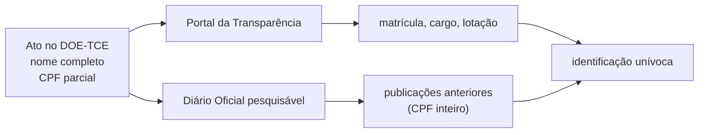
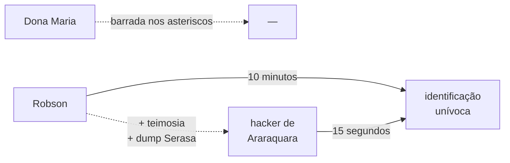
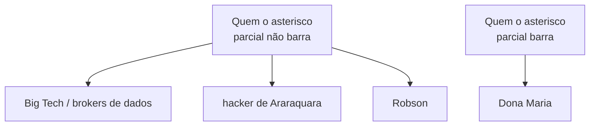

Num diário oficial qualquer, no cabeçalho de uma decisão monocrática do Tribunal de Contas, aparece a frase:

> INTERESSADA: Mariana Esteves Carvalho Albuquerque. CPF n. `***.482.317-**`.

A frase está bem composta. O nome inteiro, com as preposições no lugar. O CPF picotado nas pontas. O Iperon, ao conceder a aposentadoria, não viu razão para esconder o nome de quem se aposentou; o Tribunal de Contas, ao registrar o ato, não viu razão para mudar essa escolha; mas ambos viram razão para esconder dois pedaços do CPF. O documento publica e oculta na mesma linha, com a serenidade do funcionalismo bem treinado.

A cena se repete por centenas de decisões. O Tribunal de Contas faz o exame sumário dos atos de aposentadoria concedidos pelo instituto previdenciário estadual e publica o resultado no seu próprio Diário Oficial. Cada decisão traz o nome completo do interessado, o cargo, a lotação, os artigos da Constituição e das emendas em que se fundamenta o ato, e o CPF mascarado nas pontas. Ninguém leu a página inteira e perguntou: se o nome está aqui, o que os asteriscos estão protegendo?

## A conta que ninguém faz

O CPF brasileiro tem onze dígitos. Os nove primeiros são, em princípio, livres; os dois últimos são dígitos verificadores, calculados a partir dos nove primeiros por uma operação previsível — o módulo onze, fixado em norma da Receita Federal[^1]. Em outras palavras: os dois últimos não acrescentam informação que já não esteja contida nos nove primeiros. Existem para detectar erros de digitação, não para esconder informação.

Quando se mascara um CPF na forma `***.XXX.XXX-**`, esconde-se cinco dígitos. O leitor casual conta cinco asteriscos e imagina cinco dígitos de incerteza. Cinco dígitos decimais seriam cem mil possibilidades. Cem mil é um número grande.

Não é o número certo.

Os dois últimos asteriscos não escondem nada que os outros não tenham dito. Dado qualquer prefixo de nove dígitos, os dois verificadores são únicos. Sobram os três asteriscos do início. Três dígitos decimais. Mil possibilidades.

Para enumerar essas mil possibilidades, basta um *for* de três níveis em qualquer linguagem que tenha aritmética inteira. Para cada terna candidata, calcula-se os dois verificadores, completa-se o CPF, está pronto: um CPF válido por candidato, mil candidatos no total. A operação cabe em quinze linhas de Python. Roda em microssegundos.

A matemática está matematicando. Cinco asteriscos parecem cinco dígitos. Não são.

<figure class="svg-illustration">
  <svg viewBox="0 0 700 220" xmlns="http://www.w3.org/2000/svg" role="img" aria-labelledby="title-entropia">
    <title id="title-entropia">Entropia percebida vs entropia real do CPF parcialmente anonimizado</title>
    <text x="20" y="32" font-family="serif" font-size="14" fill="currentColor">entropia ingênua (cinco dígitos): 100.000 candidatos</text>
    <rect x="20" y="42" width="660" height="20" fill="currentColor" opacity="0.85"/>
    <text x="20" y="100" font-family="serif" font-size="14" fill="currentColor">entropia real (verificadores são funções): 1.000 candidatos</text>
    <rect x="20" y="110" width="6.6" height="20" fill="currentColor" opacity="0.85"/>
    <text x="20" y="168" font-family="serif" font-size="14" fill="currentColor">com nome no Portal da Transparência: ≈ 1 candidato</text>
    <rect x="20" y="178" width="1" height="20" fill="currentColor" opacity="0.85"/>
  </svg>
  <figcaption>A redução da incerteza, em escala linear. O nome completo apaga o que sobrou.</figcaption>
</figure>

## O nome é a porta da frente

A operação anterior — gerar mil candidatos — é elegante e desnecessária. Em quase todos os casos práticos, ninguém precisa gerar mil candidatos, porque cinco asteriscos vivem cercados de informação que já identifica unicamente o titular.

Mariana Esteves Carvalho Albuquerque, cujo nome aparece na decisão monocrática, não é qualquer Mariana. É servidora pública estadual aposentada, com cargo definido, lotação registrada, matrícula numerada. O Portal da Transparência publica o nome completo, a matrícula, o cargo, a lotação e a remuneração de toda a folha. O Diário Oficial Eletrônico do Estado, pesquisável por texto integral em quase duas décadas de arquivo, traz a portaria de nomeação, alguma promoção, alguma licença, a publicação do ato concessório de aposentadoria. Em alguma dessas publicações, ao longo desses vinte anos, o CPF apareceu inteiro. A LGPD virou regra em 2018; o resto da história documental do servidor é anterior, e foi indexada.

A pergunta que o asterisco pretende esquivar é uma pergunta que o asterisco não tem como esquivar: *quem é essa pessoa*. O ato já respondeu. O CPF picotado é uma confirmação redundante de uma identificação já operada pelo próprio cabeçalho do documento.

Quando o sistema brasileiro de proteção performática se sente especialmente diligente, anonimiza também a matrícula. Algo como `****-1234` aparece ao lado do CPF picotado. A operação é matematicamente pior do que publicar um dos dois inteiro. Dois identificadores parcialmente mascarados se cruzam por interseção: o conjunto de candidatos compatíveis com `***.482.317-**` intersectado com o conjunto compatível com `****-1234` fecha, na maioria dos casos, em uma única pessoa, mesmo sem o nome. A cartilha que esconde dois dedos do CPF *e* dois dedos da matrícula está dando mais informação, não menos.

Cof cof cof, o IPERON 🤧.

Não foi sempre assim. Em algum momento entre 2018 e 2022, todo mundo no serviço público brasileiro se convenceu — por uma combinação de cartilhas avulsas e medo do escritório jurídico — de que o CPF picotado era a marca formal da conformidade com a LGPD. Aplicou-se o picote sem mexer no resto. O nome continuou inteiro porque tirar o nome seria, aí sim, contrariar a finalidade do ato. O CPF foi a peça oferecida ao ritual.

## Robson e Dona Maria

Robson tem vinte e sete anos, é técnico de informática num posto de gasolina na BR-364 e sabe Python o suficiente para resolver problemas pequenos. Mantém as máquinas de cartão, configura o Wi-Fi da loja de conveniência, atualiza o sistema da bomba. Lê o ato porque o cunhado se aposentou e ele estava curioso. Os asteriscos não o detêm porque ele nem precisa decifrá-los: cola o nome no Google, encontra o servidor no Portal da Transparência, confirma com a página de aprovados de algum concurso antigo, e em dez minutos tem o quadro completo. Não usou nenhuma ferramenta que não seja gratuita. Não baixou nada. Não rodou nenhum script. Apenas leu — e o sistema brasileiro de publicações oficiais permite que se leia.

Dona Maria mora ao lado de um servidor que se aposentou por incapacidade permanente no ano passado mas continua jogando peladas no domingo. Ela é viúva, leu jornal a vida inteira, e desconfia. Procura o nome do vizinho no Diário Oficial, encontra a decisão monocrática, lê *aposentadoria por invalidez*, e vê o CPF picotado nas pontas. Não tem treinamento técnico nenhum. Não conhece o Portal da Transparência. Os asteriscos a paralisam, não porque sejam intransponíveis, mas porque sinalizam ritual jurídico e Dona Maria entendeu, com razão, que não foi convidada para o ritual. Fecha o navegador. A fiscalização social que ela poderia ter exercido — uma das pequenas vigilâncias civis que sustentam o controle dos atos administrativos — não aconteceu.

A pergunta vértebra do post inteiro cabe numa só frase: contra qual dos dois a anonimização funciona?

Contra a Dona Maria. Robson nem sabe que ela existe.

<figure class="meme">
  
  <figcaption>O segundo identifica unicamente. O primeiro identifica unicamente. A diferença é estética.</figcaption>
</figure>

## O hacker de Araraquara

Para o caso em que Robson não fecha por triangulação web — homonímia teimosa, servidor com presença digital limpa, vítima sem CPF publicado em parte alguma — não é preciso invocar uma categoria nova. É o próprio Robson, com mais tenacidade e mais tempo livre. Podemos chamá-lo de [hacker de Araraquara](https://pt.wikipedia.org/wiki/Walter_Delgatti_Neto), em homenagem ao personagem do folclore político brasileiro que progrediu para o regime aberto na semana passada. A diferença para o Robson é uma só: este aqui baixou, num torrent qualquer, o *dump* da Serasa de 2021 — duzentos e vinte milhões de CPFs com nome completo, data de nascimento, endereço e nome da mãe, indexados em algum SQLite no HD externo. Em qualquer caso difícil, resolve em quinze segundos.

O teto técnico do adversário não-estatal e não-Big-Tech brasileiro tem nome, ficha criminal e tornozeleira — e é, materialmente, o Robson do parágrafo anterior com mais teimosia. A barreira da cartilha nunca chegou nem ao nível do Robson.

## A garrafa pet em cima do padrão

Antes de seguir adiante, vale uma concessão à seriedade do ritual em geral. Brasileiro adora mandinga, simpatia, gesto incorporado à prática — e nem sempre é tolice. Joseph Henrich, em *The Secret of Our Success* (Princeton, 2015), passa o livro inteiro mostrando que práticas culturais aparentemente arbitrárias — tabus alimentares, técnicas de preparo de mandioca, divinação para escolher onde caçar — frequentemente codificam informação adaptativa acumulada ao longo de gerações de seleção, mesmo quando o praticante não sabe articular por quê. O ritual é memória inscrita na repetição, e respeitá-lo é respeitar essa memória.

Lembra de quando a gente colocava garrafa pet com água em cima do padrão de energia? Quem é jovem demais para lembrar tem que confiar: era assim. Em quase todo bairro residencial brasileiro até o começo dos 2000, na caixa cinza do medidor de luz no muro da frente da casa, alguém punha uma garrafa PET de dois litros cheia de água da torneira. A teoria popular era que a água fazia alguma coisa no relógio do medidor — segurava, desorientava, atrapalhava, ninguém sabia ao certo. Não fazia. A água não tem opinião sobre o medidor. Mas a conta vinha mais barata. A garrafa funcionava por outro caminho: ver aquilo todo dia ao sair de casa lembrava a família de apagar a luz da sala, fechar a torneira do tanque, desligar o ferro de passar. O ritual era falso na física e verdadeiro na psicologia. Funcionava por engano, mas funcionava — e funcionava sem plateia, porque era a família lembrando dela mesma.

A categoria seguinte veio com nome técnico: *security theater*, expressão cunhada pelo criptógrafo Bruce Schneier no início dos anos 2000 para descrever rituais públicos de proteção cuja função real é apenas exibir que uma proteção está sendo executada. A inspeção de sapato no aeroporto é o exemplo canônico. Não detém terrorista, mas tem plateia: o passageiro vê a proteção sendo executada, o auditor registra, o jornal noticia. Ritual é para dentro; teatro de segurança é para fora.

O asterisco no Diário Oficial é as três coisas ao mesmo tempo. É ritual: um setor inteiro o adotou por crença incorporada à prática. É garrafa pet: um folclore técnico que se equivocou na física do CPF. E é security theater: foi imposto a um auditor genérico — o jurídico, o controle interno, o cidadão que conta asteriscos. Falha como ritual porque não tem o lastro de Henrich: não acumulou geração nenhuma, foi adotado por imitação burocrática em quatro anos, sem informação adaptativa codificada. Falha como teatro porque a plateia já aprendeu a contar asterisco e sabe que sobram mil candidatos. E falha como garrafa pet porque não tem nem o efeito colateral de lembrete: quem produz pensa em conformidade formal, quem lê pensa *ah, anonimização*, e segue para o nome inteiro logo ao lado.

Eu e os outros 843 Franklin Silveira Baldo deste país agradecemos publicamente terem escondido o 7, o 6 e o 4 do meu CPF logo depois de terem dito o nome completo de cada um de nós.

O ritual brasileiro normalmente paga o preço da inutilidade técnica com o lucro do efeito psicológico, ou pelo menos com o lucro performático perante uma plateia.

Este aqui não paga e não lucra.

Não é anonimização. É sabor anonimização.[^sabor]

Não é teatro de segurança. É teatro do teatro de segurança.

E aqui está a razão econômica do incômodo: mesmo que o asterisco fosse ritual no sentido de Henrich, ou teatro no sentido de Schneier, ainda assim teria de pagar pelo que custa do outro lado da balança — a fricção que adiciona à transparência. Cada asterisco encarece a verificação para o cidadão, o jornalista, o pesquisador, o controle social. Esse encarecimento não é zero; é o preço cobrado em nome de um benefício de proteção que, como já vimos, não existe. Ritual sem lastro adaptativo, teatro sem plateia convencida, e em troca a verificação fica mais cara para quem deveria poder verificar. Não há benefício que compense. A fricção adicional à transparência é injustificada — não no sentido jurídico, no sentido aritmético: nada do lado positivo da conta cobre o que foi gasto.

## A cartilha que se contradiz

A produção da cartilha tem uma sociologia própria, e o primeiro absurdo é que não há *a* cartilha — há centenas. Não saiu da Autoridade Nacional de Proteção de Dados uma orientação técnica unificada. Não saiu do governo federal uma instrução normativa de aplicação geral. Não saiu de nenhum órgão central uma diretriz que pudesse ser seguida por todo o setor público. Em vez disso, em cada autarquia, cada tribunal, cada secretaria de estado, cada conselho profissional, cada universidade pública, formou-se um comitê de governança de dados próprio — pessoas do jurídico, do gabinete da presidência, da tecnologia da informação e da comunicação. Cada um desses comitês se reúne. Cada um produz, em algum trimestre, um documento intitulado, com discreta variação local, *Boas Práticas de Anonimização de Dados Pessoais em Atos Administrativos*. Tem entre quatro e doze páginas, traz o brasão do órgão, alguma fundamentação na LGPD, e uma seção final com exemplos de mascaramento. O exemplo invariavelmente recomendado é o `***.XXX.XXX-**`. A cartilha é aprovada por portaria. A portaria é publicada no Diário Oficial. No mesmo Diário Oficial, três páginas adiante, o ato concessório de aposentadoria de alguém aparece com o nome inteiro e o CPF picotado.

Centenas de comitês independentes, em paralelo, durante anos, trabalharam para chegar à mesma resposta errada.

Tipo de produtividade institucional que só o Brasil consegue.

Peço licença para cometer uma carteirada de baixa periculosidade: minha dissertação de mestrado foi sobre transparência administrativa. Não é título nobiliárquico; no máximo, autoriza uma irritação tecnicamente qualificada com a garrafa pet normativa.

Há um detalhe que torna a coisa ainda mais elegante. Os autores da cartilha — o jurídico, o gabinete, a TI — são exatamente as pessoas com acesso integral aos bancos de dados do órgão. Eles próprios constituem o conjunto contra o qual a anonimização do CPF na publicação seria, em tese, uma defesa. São os Robsons internos, com a diferença de que têm credencial. O ritual está sendo executado, em parte significativa, pelos próprios atores contra quem aparentaria proteger — e na prática nunca protegeu, porque ninguém precisa de CPF picotado quando se tem login no sistema. A cartilha não é uma política de segurança. É uma performance de conformidade, escrita pelos próprios atores que a tornariam ineficaz, dirigida a um adversário externo que não existe.

Para medir a profundidade do reflexo, pedi opinião editorial deste ensaio a um modelo de linguagem comercial. O pobre coitado, treinado em terabytes de texto público brasileiro pós-2018, me recomendou — com toda a boa intenção — que eu *anonimizasse meu próprio nome na piada dos 843*, porque citar um nome real ao lado de um CPF parcialmente mascarado podia, segundo ele, *expor a pessoa específica*. Aquela pessoa específica era eu — autor assinado do post, com nome no canonical, no twitter:creator e na URL do navegador. A cartilha contaminou até o leitor sintético, a ponto de o ritual passar a tentar proteger a vítima da fonte explícita da informação. Saiu de Porto Velho, atravessou o Pacífico, foi treinada em algum servidor na Califórnia, e voltou intacta sob a forma de recomendação editorial bem-intencionada. O ritual encontrou modo de se propagar mesmo sem comitês.

<figure class="meme">
  
  <figcaption>O nível iluminado escapou ao comitê.</figcaption>
</figure>

## O que a LGPD efetivamente diz

A LGPD definiu anonimização no art. 5º, inciso XI, com palavras que não admitem o uso brasileiro do termo:

<blockquote class="pull-quote">
Anonimização: utilização de meios técnicos razoáveis e disponíveis no momento do tratamento, por meio dos quais um dado perde a possibilidade de associação, direta ou indireta, a um indivíduo.
</blockquote>

Mil candidatos cruzados com nome completo, cargo, lotação e duas décadas de Diário Oficial indexado não constituem dado que perdeu a possibilidade de associação. Robson não é meio técnico irrazoável. É um técnico de posto de gasolina com Python. A definição legal de anonimização é generosamente larga, e ainda assim a prática brasileira não cabe dentro dela.

O verbo da definição é específico: *perde* a possibilidade de associação. Não dificulta. Não encarece. Não desestimula curiosos. Perde. A LGPD adotou uma definição binária — ou o dado foi de fato desvinculado do titular, ou não foi. Não há regime intermediário, não há meia-anonimização. Truques que tornam a reidentificação trivial para qualquer Robson não cumprem a hipótese legal: sequer chegam a tentar. Pelo lado da privacidade, portanto, o picote não tem onde se apoiar.

Sobra examiná-lo pelo lado oposto: o da transparência. A LGPD prevê, no art. 23, hipótese específica para tratamento de dados pessoais pelo poder público, articulada com a Lei de Acesso à Informação, cujo art. 8º define o catálogo da transparência ativa — remunerações, atos de pessoal, contratos. A Constituição, no art. 37, *caput*, faz da publicidade um princípio reitor da administração pública. O Supremo Tribunal Federal, no ARE 652.777 de 2015, decidiu que a divulgação nominal da remuneração de servidores é legítima decorrência desse princípio. O sistema jurídico, em outras palavras, já fez sua escolha em favor da transparência para atos administrativos de servidor — e o picote do CPF opera abaixo dessa escolha, encarecendo a verificação para quem deveria poder verificar. Não anonimiza porque não consegue. Atrapalha porque o nome inteiro ao lado convoca uma verificação que o picote dificulta sem necessidade. Faz o pior dos dois mundos, e o faz com firmeza.

## A *mens legis* ausente

A LGPD não foi pensada no Brasil. É, em larga medida, a prima brasileira do *General Data Protection Regulation* europeu — o GDPR, escrito em 2016 e em vigor desde 2018. O GDPR não saiu de um vácuo legislativo: saiu, em parte considerável, da resposta política à percepção crescente, ao longo dos anos 2010, de que algumas empresas concentravam um poder informacional desproporcional. O escândalo Cambridge Analytica, em 2018, deu nome e rosto a essa percepção — a Facebook revelou ter exposto os dados de oitenta e sete milhões de usuários a uma firma de consultoria política que os usou para microdirecionamento eleitoral, num episódio que atravessou a campanha do Brexit e a eleição americana de 2016. O trabalho legislativo do GDPR já estava em curso antes do escândalo; Cambridge Analytica deu o nome popular ao que estava sendo regulado. A LGPD, dois anos depois, refletiu a mesma motivação.

O que aconteceu no caminho entre a lei e a cartilha é uma forma de transferência. As empresas que originaram a preocupação seguem operando essencialmente como operavam. Vazamentos sistêmicos atravessam a paisagem brasileira sem provocar resposta institucional proporcional. A Serasa vazou cerca de duzentos e vinte milhões de CPFs em 2021. Registros do INSS aparecem em fóruns há anos. O operador de telemarketing que liga no horário do almoço da gente sabe o valor exato da última fatura, e a gente já desistiu de perguntar como ele sabe. A LGPD existe enquanto tudo isso acontece. Mas a parte da LGPD que efetivamente pega — que gera comitês, cartilhas, treinamentos, ações disciplinares internas, exclusão de informação útil dos bancos de dados públicos — é a parte que aperta o agente menos perigoso do sistema: o servidor de atendimento, o pesquisador acadêmico, o jornalista local, o cidadão fiscalizador.

<figure class="svg-illustration">
  <svg viewBox="0 0 700 320" xmlns="http://www.w3.org/2000/svg" role="img" aria-labelledby="title-boss">
    <title id="title-boss">Boss final prometido vs inimigo enfrentado: desproporção entre a ameaça que justificou a LGPD e a vizinha curiosa que ela efetivamente atinge</title>
    <line x1="350" y1="20" x2="350" y2="300" stroke="currentColor" stroke-width="1" opacity="0.4"/>
    <text x="175" y="38" font-family="serif" font-size="11" fill="currentColor" text-anchor="middle" letter-spacing="2">BOSS FINAL PROMETIDO</text>
    <g transform="translate(175, 175)">
      <path d="M -55,-80 Q -55,-110 0,-110 Q 55,-110 55,-80 L 55,-20 Q 55,-10 50,-5 L 50,75 Q 50,85 40,85 L -40,85 Q -50,85 -50,75 L -50,-5 Q -55,-10 -55,-20 Z" fill="currentColor" opacity="0.9"/>
      <ellipse cx="-18" cy="-70" rx="8" ry="4" fill="white" opacity="0.85"/>
      <ellipse cx="18" cy="-70" rx="8" ry="4" fill="white" opacity="0.85"/>
      <path d="M -45,-85 Q -50,-100 -35,-105" fill="none" stroke="currentColor" stroke-width="2" opacity="0.7"/>
      <path d="M 45,-85 Q 50,-100 35,-105" fill="none" stroke="currentColor" stroke-width="2" opacity="0.7"/>
    </g>
    <text x="175" y="290" font-family="serif" font-size="18" fill="currentColor" text-anchor="middle" font-weight="bold">Mark Zuckerberg</text>
    <text x="525" y="38" font-family="serif" font-size="11" fill="currentColor" text-anchor="middle" letter-spacing="2">INIMIGO ENFRENTADO</text>
    <g transform="translate(525, 245)">
      <circle cx="0" cy="-22" r="4" fill="currentColor"/>
      <path d="M -5,-19 Q -7,-15 -6,-10 L 6,-10 Q 7,-15 5,-19 Z" fill="currentColor"/>
      <path d="M -6,-10 L -7,2 L 7,2 L 6,-10 Z" fill="currentColor"/>
      <rect x="4" y="-5" width="3" height="6" fill="currentColor"/>
      <line x1="-5" y1="2" x2="-5" y2="9" stroke="currentColor" stroke-width="1.5"/>
      <line x1="5" y1="2" x2="5" y2="9" stroke="currentColor" stroke-width="1.5"/>
    </g>
    <text x="525" y="275" font-family="serif" font-size="18" fill="currentColor" text-anchor="middle" font-weight="bold">Dona Maria</text>
    <text x="525" y="293" font-family="serif" font-size="12" fill="currentColor" text-anchor="middle" font-style="italic" opacity="0.7">(no Diário Oficial)</text>
  </svg>
  <figcaption>A escala é proporcional ao argumento. A LGPD chega à Dona Maria. Mark Zuckerberg continua do tamanho que era.</figcaption>
</figure>

Não é necessário atribuir má-fé sistêmica a ninguém para que isso aconteça, e eu não atribuo. Aliás, alguém já disse — Hanlon, navalha que leva o seu nome — que não se deve atribuir à malícia o que a burrice explica satisfatoriamente. Princípio sábio. Pensando bem, no entanto: talvez má-fé do jurídico que escreve a cartilha sabendo que tem login no banco e não precisa do picote para identificar ninguém. Talvez má-fé do comitê de governança, que justifica a própria existência produzindo trimestralmente o mesmo PDF com o brasão atualizado. Talvez má-fé da ANPD, que não emitiu instrução normativa de aplicação geral porque a ambiguidade preserva discricionariedade. Talvez má-fé do gestor mediano, que prefere a proteção formal exibível à substantiva invisível porque é o exibível que conta na auditoria. Talvez má-fé da indústria de compliance, que vive de treinar comitês para escrever cartilhas. Talvez má-fé do sistema de incentivos, que pune mascaramento de menos e nunca mascaramento a mais. Talvez má-fé das Big Techs e dos brokers de dados, que assistem em silêncio enquanto a régua da LGPD aperta o servidor de atendimento e passa longe deles. A lista continua. A navalha de Hanlon, aplicada com paciência, frequentemente revela uma série de pequenas malícias funcionando em sincronia, e o resultado agregado é indistinguível de má-fé sistêmica. O ritual sobrevive sozinho — sustentado, agora a gente vê, por exatamente essas pequenas malícias coordenadas sem reuniões. A cartilha é exibível. A segregação de funções interna não é. O asterisco é a marca visível da conformidade, e por isso se multiplicou.

## A alternativa honesta

O caminho técnico honesto para atos administrativos de servidor é simples e antigo. Ou se publica nominalmente o que a Constituição quer público — nome, cargo, lotação, fundamentação legal, valor dos proventos — e se aceita que a fiscalização é, em parte, popular; ou se protege de verdade o que precisa ser protegido — saúde, dependentes, dados bancários, endereço pessoal — com segregação de funções, registro de acesso por matrícula, auditoria periódica das consultas internas e dispositivos que detectem padrões de curiosidade inadequada no acesso ao banco. As duas operações são compatíveis: a primeira é publicidade, a segunda é proteção. O asterisco no Diário Oficial não é nenhuma das duas. É uma terceira coisa, que parece com a segunda enquanto desfaz a primeira — uma porta com fechadura que abre para o Robson e tranca a Dona Maria.

O asterisco no Diário Oficial não esconde uma pessoa. Esconde quem pode olhar para ela. Robson está olhando.

## Para se aprofundar

- **Lei nº 13.709/2018 (LGPD), art. 5º, XI** — a definição legal de anonimização que a prática brasileira não cumpre.
- **Latanya Sweeney, *[k-Anonymity: A Model for Protecting Privacy](https://epic.org/wp-content/uploads/privacy/reidentification/Sweeney_Article.pdf)* (2002)** — o paper canônico, com o achado de que três atributos demográficos identificam unicamente cerca de 87% dos cidadãos americanos.
- **Arvind Narayanan e Vitaly Shmatikov, *[Robust De-anonymization of Large Sparse Datasets](https://www.cs.cornell.edu/~shmat/shmat_oak08netflix.pdf)* (2008)** — o Netflix Prize, prova empírica de que datasets "anonimizados" frequentemente não são.
- **Paul Ohm, *[Broken Promises of Privacy: Responding to the Surprising Failure of Anonymization](https://www.uclalawreview.org/pdf/57-6-3.pdf)* (UCLA Law Review, 2010)** — o ensaio jurídico americano contra a ilusão da anonimização perfeita.
- **Bruce Schneier, *[Beyond Fear](https://www.schneier.com/books/beyond-fear/)* (2003)** — o livro em que aparece pela primeira vez a expressão *security theater*, e a sistematização do que é proteção real vs. proteção performática.
- **Joseph Henrich, *[The Secret of Our Success](https://www.amazon.com/Secret-Our-Success-Evolution-Domesticating/dp/0691166854)* (Princeton, 2015)** — sobre por que rituais culturais merecem respeito: frequentemente codificam informação adaptativa acumulada por seleção, mesmo quando o praticante não sabe por quê. O asterisco é o contraexemplo: ritual sem lastro, adotado em quatro anos por imitação burocrática.
- **STF, ARE 652.777/SP (2015)** — a divulgação nominal da remuneração de servidores como decorrência do princípio constitucional da publicidade.
- **Lei nº 12.527/2011 (LAI), art. 8º** — a transparência ativa como dever do Estado, prioritária sobre a privacidade do agente público no exercício da função.
- **Verbete [*Walter Delgatti Neto*](https://pt.wikipedia.org/wiki/Walter_Delgatti_Neto)** — o hacker de Araraquara como personagem documental: o teto técnico médio brasileiro tem nome, endereço, ficha criminal e tornozeleira.
- **Jorge Luis Borges, *Funes el memorioso*** — sobre o que acontece quando o banco de dados não esquece.

[^sabor]: O bordão *"sabor X"* — geralmente pronunciado com ênfase no "BOR" e gesto com as mãos — é um meme criado pelo influenciador fitness Toguro. Origem: a bebida alcoólica da marca Mansão Maromba não podia ser classificada como "energético" porque não tinha cafeína nem taurina na composição (regras da vigilância sanitária), então passou a ser anunciada como *sabor energético*. A repetição da frase para justificar a lacuna regulatória viralizou e virou gíria: usa-se *"sabor X"* para classificar algo que tem a vibe ou a forma de X sem ser X de fato. O asterisco no Diário Oficial é, nesse sentido exato, sabor anonimização.

[^1]: O leitor que clicou nesta nota provavelmente também é o leitor que escreveria as quinze linhas de Python. Os dois dígitos verificadores do CPF são definidos da seguinte maneira: dado o prefixo de nove dígitos `d₁…d₉`, calcula-se a soma ponderada `s₁ = 10·d₁ + 9·d₂ + 8·d₃ + … + 2·d₉`, toma-se o resto `r₁ = s₁ mod 11`, e o décimo dígito `D₁` é `11 - r₁`, com a convenção de que vira `0` quando `r₁` for menor que 2. O décimo primeiro `D₂` é definido analogamente, com pesos de 11 a 2 aplicados a `d₁…d₉` e ao recém-calculado `D₁`. A operação é determinística e barata. Roda em silêncio dentro de qualquer sistema que valide CPF — bancos, declarações, formulários — e há décadas. Esconder os dois últimos dígitos é como esconder o resultado de uma soma cujas parcelas todas se vêem.
