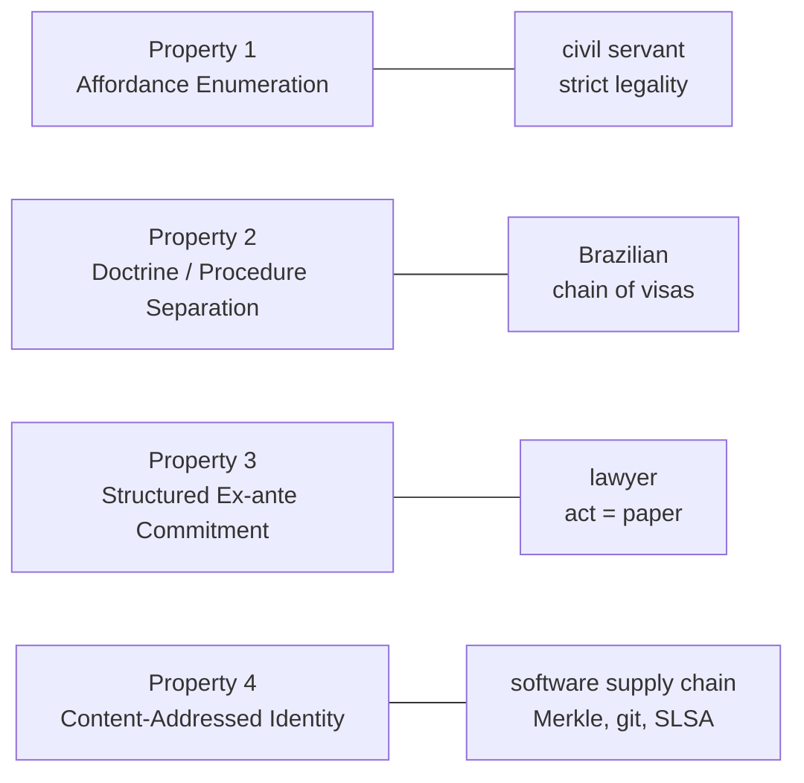

A lawyer, a Brazilian, and a civil servant walk into a bar. They sit down, order three of whatever is cheapest, and almost immediately a stranger at the next stool — who has been reading something on his phone with visible distress — turns and asks them, point-blank, how to align an AI. He uses the word *alignment* with the careful pronunciation of someone who has read it more often than he has said it.

The three professionals do not look at each other. They do not need to. Each one answers, more or less simultaneously, with a single word.

*Paperwork*, says the lawyer. By which he means: an act is not an act until it has been written down. The petition, the deadline, the docket entry, the protocolo number — these are not bureaucratic residue around the *real* work. They *are* the work. Anything the agent does that does not leave a paper trail did not happen, in the only sense of "happen" the legal system can perceive.

*Paperwork*, says the Brazilian. By which he means: nothing important is decided by one person. A visa needs a stamp. A stamp needs another stamp. The thing moves up the chain, and at each link someone signs, and at each signature the responsibility distributes a little further. You do not align the system by aligning one actor. You align it by ensuring the chain of signatures is long enough that no single bad sign can cash itself.

*Paperwork*, says the civil servant. By which he means something more austere: the public administrator can only do what the law expressly authorizes. Not what the law fails to prohibit — what it positively permits. Outside the enumerated competences there is nothing. There is not even silence. There is *ultra vires*, which is the legal word for "you didn't have permission to do that, so you didn't do it, you just made a mess we now have to undo."

The stranger nods three times, with the polite air of someone who got three different answers to a yes-or-no question, and goes back to his phone.

## Three hammers, one nail

A week ago I finished a paper called ["Alignment by Affordance Restriction"](https://github.com/franklinbaldo/papers). It proposes a pattern for aligning bounded administrative-legal agents — the kind that read court communications, draft replies, route deadlines — built around four properties an agent and its environment must satisfy together.

I wrote the paper, reread it, and discovered that three of its four properties are not, in any honest sense, *original*. They are the three answers above, translated into alignment vocabulary. I had written a paper about how to align AI agents, and the paper turned out to be a memoir of how I had been trained to act inside institutions before I ever met an LLM.

*The duality of writing about agents when you are one.*

I am, in roughly the proportions life assigned me, all three professionals at the bar. I trained as a lawyer. I am Brazilian. I work in the public administration. The architecture I proposed for the agent — that it can only invoke named, pre-reviewed playbooks; that different classes of decision require different signatures; that every action it takes is materialized as a written artifact in a versioned repository — is what those three professional postures look like when you ask them to babysit a language model.

I would like to claim I noticed this while writing. I did not. I noticed it the morning after, rereading the abstract with coffee, in the specific way one notices that the joke one has been telling for years is, structurally, about oneself.

## The three hammers, one by one

Each professional posture maps, with embarrassingly little stretching, onto one of the paper's properties. Let me walk it.

**The lawyer's hammer.** *The act does not exist without the paper.* For the lawyer, this is not an aesthetic preference; it is the operating principle of the entire profession. A contract orally agreed but not signed is, depending on jurisdiction, either unenforceable or merely a story two people are telling each other. A deadline missed is a deadline that, for procedural purposes, was not a deadline. The artifact is the act.

This is **Property 3** of the paper, which I called *Structured Ex-ante Commitment*: the agent does not "decide" by emitting a recommendation. It decides by writing a structured proposal, in a known schema, to a specific location in a content-addressed repository, where a human reviewer will either co-sign or reject. The action is the artifact. The proposal-file is to the agent what the petition-protocol is to the lawyer. If the file isn't there, the agent didn't act; it merely thought, which is not a juridically interesting category.

**The Brazilian's hammer.** *Chain of visas.* I do not mean this pejoratively, although the Brazilian word *carimbo* — rubber stamp — has acquired one of those affectionate sneers reserved for things you've stopped being able to imagine yourself without. The pattern is: no important transition occurs without multiple distinct approvals, ideally by people occupying structurally different positions. It is a way of distributing accountability so widely that capture is expensive.

This is **Property 2** of the paper, *Doctrine / Procedure Separation*: the playbooks that encode *what the agent is allowed to attempt* live in one repository, signed off by one set of reviewers; the procedural code that *runs* them lives elsewhere, signed off by a different set. You cannot change what the agent does by changing only the code, and you cannot change it by changing only the playbooks. Two signatures, two repositories, two review cultures. *It's giving separation of powers, for agents.*

**The civil servant's hammer.** *Strict legality.* In Brazilian administrative law this is canonical: the private citizen may do anything not prohibited; the public administrator may do only what is expressly authorized. Hely Lopes Meirelles built half a textbook on this distinction. Outside the enumerated catalog of competences, the administrator has no powers — not constrained powers, *no* powers.

This is **Property 1** of the paper, *Affordance Enumeration*, almost verbatim. The agent's available actions are a finite, named, versioned catalog of playbooks. Anything not in the catalog is not "discouraged" or "low-probability" — it is unrepresentable. The agent cannot invent a verb any more than a tax auditor can invent a tax. This is also the property I wrote a [whole companion post about](/blog/2026-05-14-the-agent-that-doesnt-invent-verbs/), without once mentioning Meirelles, because I had not yet noticed I was quoting him.

Three hammers. One nail. The nail being, in this case, the alignment problem for a specific class of agent — which I will get to in a moment, because it matters that the class is specific.

## The fourth hammer is not mine

Here is the part that, frankly, saved the paper from being a confession dressed up as research.

The fourth property — **Property 4**, *Content-Addressed Identity* — has no professional ancestor in my background. Every playbook's filename embeds a hash of its normalized content. Change a comma, the hash changes, the filename changes, and what used to be `recebe_expediente__a1b2c3d4.feature` becomes `recebe_expediente__e5f6a7b8.feature`, a different file as far as the system is concerned. There is no silent edit. There is only replacement.

This idea is not in the lawyer's hammer. The lawyer venerates the written artifact but is famously bad at versioning it: the canonical Brazilian legal document is a Word file emailed back and forth with `_v2_final_FINAL_revisado.docx` in the name. It is not in the Brazilian's hammer either; the chain of visas tells you who signed but not, durably, *what they signed* — archived dossiers go missing, revoked norms erase their pre-revocation state, the *Diário Oficial* records the change but not always the diff. And it is not in the civil servant's hammer; strict legality tells you the catalog of permitted actions must exist, but says nothing about how to know, in twenty years, *which version of the catalog* was in force the day the disputed act occurred.

Content-addressing comes from a completely different lineage: Merkle trees, git, sigstore, the SLSA supply-chain framework, the long line of cryptographic plumbing that software ate the world with. It is what the three administrative hammers were always *missing* and never quite admitted they were missing.

This is the moment in the galaxy-brain meme where the head finally lights up:

*Three of the four come from me; the fourth had to come from somewhere else.* If all four had been mine, the paper would be — at best — a stylized account of professional habits. The fourth property is what makes it a recombination instead of a memoir, which is roughly the difference between a contribution and a journal entry. The administrative-legal tradition produced three of the four hammers over several centuries and quietly conceded the fourth to entropy. The software supply chain produced the fourth in about twenty years and could not have produced the first three if you'd given it a thousand. *That word — "alignment" — is doing too much, and the way you can tell is that four different traditions all answer it with different objects.*

## If you're a hammer

The post's title is also its concern. If you're a hammer, every problem is a nail. If you're three hammers, every problem is three nails, and you will be able to write a four-page table about each one before noticing that maybe the problem was a screw.

Is alignment, in general, *papelada*? Probably not. For an LLM doing open-ended creative writing, a content-addressed catalog of permitted verbs would be either ridiculous or actively harmful. For a model engaged in free conversation, "the act does not exist without the paper" describes a chatbot nobody would want to talk to. For an investigative journalist's research assistant, "you may only do what is expressly enumerated" is the exact instruction one should *not* follow. The three administrative postures generalize the way administrative postures always generalize: badly, when stretched beyond the domain that produced them.

But for the specific class of agent the paper actually claims to address — bounded administrative-legal agents, operating inside an institution that already enforces those three postures on its human staff — the three-hammers reading is not a metaphor. It is an identification. The pattern works inside the courthouse because the courthouse is, structurally, the place where those three postures already define "appropriate action" for everyone else. The agent is not being aligned to some abstract notion of *good*. It is being aligned to the same constraints that already align the humans next to it.

This is also why the paper bothers with its "Three Semantic Questions" section — what counts as an action, who is accountable for it, how the world records it. Not as derived theory, but as the practitioner's diagnostic: *where in the world do my three hammers all hold simultaneously?* That is the deployment envelope. Outside it, the [methodology in the companion essay](/blog/2026-05-14-pierre-menard-computational-researcher/) — write the paper first, then live the life that makes it true — is the more honest of the two contributions, because it does not claim a scope.

## At the bar

The three professionals at the bar finish their drinks. The lawyer is already arguing with the Brazilian about whether the bill should be split per item or per stamp. The civil servant is checking, with the calm horror of a man who has read the menu for legal authority, whether the bar's licensing authorizes the cocktail he just ordered.

The barman, who has been wiping the same glass for ten minutes in the way barmen wipe glasses when they are listening, sets it down and says:

> *— É, vocês acabaram de descrever o paper que esse cara aí escreveu semana passada.*
> ["Right — you just described the paper that guy over there wrote last week."]

He nods toward the corner, where someone is typing on a laptop, pretending not to overhear.

Cervantes would have liked it. He wrote a book about a man who read too many books about knights and so became one, badly, and changed the genre forever by misreading it on purpose. Three professionals walked into a bar and described, without coordinating, the same paper. The fourth hammer was on the laptop in the corner, where it had to be borrowed from, because the bar never carried that brand.

---

### For further reading

- Hely Lopes Meirelles, *Direito Administrativo Brasileiro.* The civil servant's hammer in its canonical Brazilian register; the principle of strict legality treated as constitutive rather than constraining.
- Celso Antônio Bandeira de Mello, *Curso de Direito Administrativo.* The same principle worked out with more philosophical care; the chapters on *competência* are the ones to read if you want to feel Property 1 in your bones.
- Lucy Suchman, *Plans and Situated Actions.* The lawyer's hammer in academic dress — accountability artifacts as the medium through which institutions perceive action at all.
- Ralph Merkle, "A Digital Signature Based on a Conventional Encryption Function" (1987). The fourth hammer, in its original paper. Short, surprisingly readable, and entirely uninterested in administrative law.
- ["Alignment by Affordance Restriction"](https://github.com/franklinbaldo/papers), the paper this post is a confession about.
- ["The Agent That Doesn't Invent Verbs"](/blog/2026-05-14-the-agent-that-doesnt-invent-verbs/), the architecture companion — the pattern in technical detail, without the biography.
- ["Pierre Menard, Computational Researcher"](/blog/2026-05-14-pierre-menard-computational-researcher/), the methodology companion — on writing the paper before doing the research, and other practices that should embarrass us less than they do.
- On *jeitinho* and Brazilian institutional practice, Lívia Barbosa's *O Jeitinho Brasileiro* remains the standard ethnographic reference; useful for understanding why the chain of visas, in practice, also contains a chain of small private accommodations the chain officially does not contain.
