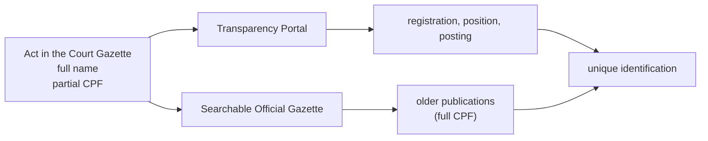
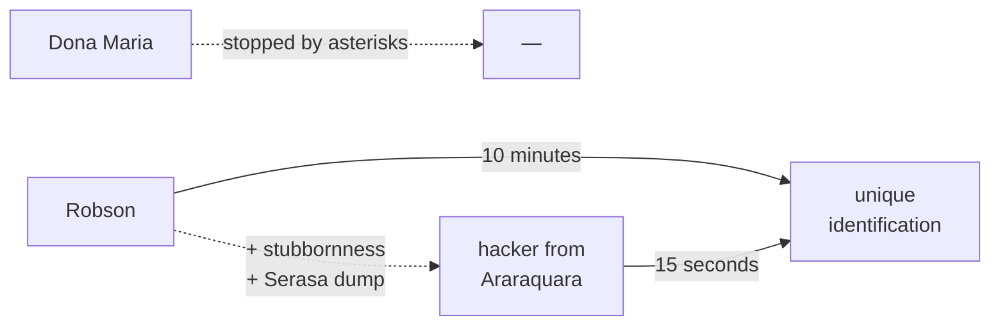
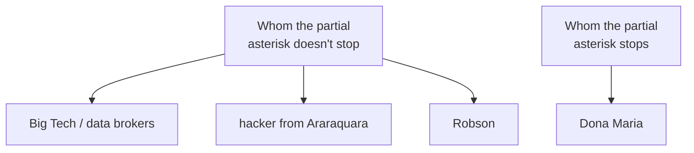

In some routine official gazette, in the header of a single-judge decision from the State Court of Accounts, you find this sentence:

> INTERESTED PARTY: Mariana Esteves Carvalho Albuquerque. CPF no. `***.482.317-**`.

The sentence is well composed. The full name, prepositions in place. The CPF chopped at both ends. Iperon, when granting the retirement, saw no reason to hide the name of the retiree; the Court of Accounts, when registering the act, saw no reason to change that choice; but both saw reason to hide two chunks of the CPF. The document publishes and conceals on the same line, with the serenity of well-trained civil service.

The scene repeats across hundreds of decisions. The Court of Accounts performs the summary review of retirement acts granted by the state pension institute and publishes the result in its own Official Gazette. Each decision carries the interested party's full name, position, posting, the articles of the Constitution and amendments on which the act is founded, and the CPF masked at both ends. Nobody read the whole page and asked: if the name is right here, what are the asterisks protecting?

## The math nobody does

The Brazilian CPF has eleven digits. The first nine are, in principle, free; the last two are check digits, computed from the first nine by a predictable operation — modulo eleven, fixed in a Receita Federal regulation[^1]. In other words: the last two add no information that isn't already contained in the first nine. They exist to detect typos, not to hide information.

When a CPF is masked in the form `***.XXX.XXX-**`, five digits are hidden. The casual reader counts five asterisks and imagines five digits of uncertainty. Five decimal digits would mean a hundred thousand possibilities. A hundred thousand is a big number.

It's the wrong number.

The last two asterisks don't hide anything the others haven't already said. Given any nine-digit prefix, the two check digits are unique. That leaves the three asterisks at the start. Three decimal digits. A thousand possibilities.

To enumerate those thousand possibilities, all you need is a three-level *for* loop in any language with integer arithmetic. For each candidate triple, you compute the two check digits, complete the CPF, and you're done: one valid CPF per candidate, a thousand candidates in total. The operation fits in fifteen lines of Python. It runs in microseconds.

The math is mathing. Five asterisks look like five digits. They are not.

<figure class="svg-illustration">
  <svg viewBox="0 0 700 220" xmlns="http://www.w3.org/2000/svg" role="img" aria-labelledby="title-entropy">
    <title id="title-entropy">Perceived entropy vs. real entropy of a partially anonymized CPF</title>
    <text x="20" y="32" font-family="serif" font-size="14" fill="currentColor">naive entropy (five digits): 100,000 candidates</text>
    <rect x="20" y="42" width="660" height="20" fill="currentColor" opacity="0.85"/>
    <text x="20" y="100" font-family="serif" font-size="14" fill="currentColor">real entropy (check digits are functions): 1,000 candidates</text>
    <rect x="20" y="110" width="6.6" height="20" fill="currentColor" opacity="0.85"/>
    <text x="20" y="168" font-family="serif" font-size="14" fill="currentColor">with the name in the Transparency Portal: ≈ 1 candidate</text>
    <rect x="20" y="178" width="1" height="20" fill="currentColor" opacity="0.85"/>
  </svg>
  <figcaption>The reduction of uncertainty, in linear scale. The full name erases what was left.</figcaption>
</figure>

## The name is the front door

The previous exercise — generating a thousand candidates — is elegant and unnecessary. In almost every practical case, nobody needs to generate a thousand candidates, because the five asterisks live surrounded by information that already uniquely identifies the person.

Mariana Esteves Carvalho Albuquerque, whose name appears in the single-judge decision, is not just any Mariana. She is a retired state civil servant, with a defined position, a recorded posting, a numbered registration. The Transparency Portal publishes the full name, registration number, position, posting and salary of the entire payroll. The state's Electronic Official Gazette, searchable by full text across almost two decades of archive, carries the appointment ordinance, some promotion, some leave, the publication of the retirement act. Somewhere in those publications, over those twenty years, the CPF appeared in full. The LGPD became law in 2018; the rest of the servant's documentary history is older, and was indexed.

The question the asterisk pretends to dodge is a question the asterisk has no way of dodging: *who is this person*. The act has already answered. The chopped CPF is a redundant confirmation of an identification already performed by the document's own header.

When the Brazilian system of performative protection feels especially diligent, it also anonymizes the registration number. Something like `****-1234` appears next to the chopped CPF. The operation is mathematically worse than publishing either of the two in full. Two partially masked identifiers cross by intersection: the set of candidates compatible with `***.482.317-**` intersected with the set compatible with `****-1234` collapses, in most cases, to a single person, even without the name. The handbook that hides two fingers of the CPF *and* two fingers of the registration number is giving more information, not less.

Ahem ahem, IPERON 🤧.

It wasn't always this way. Sometime between 2018 and 2022, everyone in the Brazilian public service became convinced — by a combination of stray handbooks and fear of the legal office — that the chopped CPF was the formal mark of LGPD compliance. The chop was applied without touching the rest. The name stayed in full because removing the name would, then yes, contradict the purpose of the act. The CPF was the offering laid on the altar.

## Robson and Dona Maria

Robson is twenty-seven, an IT technician at a gas station on the BR-364 highway, and knows enough Python to solve small problems. He maintains the card terminals, configures the convenience store's Wi-Fi, updates the pump's system. He reads the act because his brother-in-law has just retired and he's curious. The asterisks don't stop him because he doesn't even need to decipher them: he pastes the name into Google, finds the servant on the Transparency Portal, confirms it on the approved-candidates page of some old civil service exam, and in ten minutes he has the full picture. He used no tool that isn't free. He downloaded nothing. He ran no script. He just read — and the Brazilian system of official publications allows reading.

Dona Maria lives next to a civil servant who retired for permanent disability last year but still plays pickup soccer on Sundays. She's a widow, has read newspapers her whole life, and she's suspicious. She looks up her neighbor's name in the Official Gazette, finds the single-judge decision, reads *disability retirement*, and sees the CPF chopped at the ends. She has no technical training. She doesn't know about the Transparency Portal. The asterisks paralyze her, not because they are insurmountable, but because they signal legal ritual and Dona Maria has understood, correctly, that she wasn't invited to the ritual. She closes the browser. The social oversight she could have exercised — one of those small civic vigilances that sustain control over administrative acts — did not happen.

The spine question of the whole post fits in one sentence: which of the two does the anonymization work against?

Against Dona Maria. Robson doesn't even know she exists.

<figure class="meme">
  
  <figcaption>The second uniquely identifies. The first uniquely identifies. The difference is aesthetic.</figcaption>
</figure>

## The hacker from Araraquara

For the case in which Robson can't close it through web triangulation — stubborn homonymy, a servant with a clean digital presence, a target whose CPF was never published anywhere — there's no need to invoke a new category. It's the same Robson, with more tenacity and more free time. We can call him the [hacker from Araraquara](https://pt.wikipedia.org/wiki/Walter_Delgatti_Neto), in honor of the character from Brazilian political folklore who was moved to open prison last week. The only difference from Robson is this: this one downloaded, from some torrent, the 2021 Serasa *dump* — two hundred and twenty million CPFs with full name, date of birth, address and mother's name, indexed in some SQLite file on an external drive. In any hard case, he resolves it in fifteen seconds.

The technical ceiling of the non-state, non-Big-Tech Brazilian adversary has a name, a criminal record and an ankle monitor — and is, materially, the Robson from the previous paragraph with more stubbornness. The handbook's barrier never even reached Robson's level.

## The PET bottle on top of the meter

Before going further, a concession is owed to the seriousness of ritual in general. Brazilians love *mandinga*, *simpatia*, the gesture incorporated into practice — and it isn't always silliness. Joseph Henrich, in *The Secret of Our Success* (Princeton, 2015), spends an entire book showing that apparently arbitrary cultural practices — food taboos, manioc-processing techniques, divination to choose where to hunt — frequently encode adaptive information accumulated across generations of selection, even when the practitioner can't articulate why. The ritual is memory inscribed in repetition, and to respect it is to respect that memory.

Until the early 2000s, in almost every Brazilian residential neighborhood, there was a gray box on the front wall of the house — the *padrão de energia* — with the utility's electricity meter inside, usually locked. On top of that box, it was common to see a two-liter PET soda bottle full of tap water, lying down or standing up. The popular theory was that the water "held back" the meter, making the dial spin more slowly and the bill come out cheaper. The theory was wrong. Water has no opinion about the meter; the bill came out the same. But the bottle worked through another path: seeing it every day on the way out of the house reminded the family to turn off the living-room light, close the laundry tap, unplug the iron. The ritual was false in physics and true in psychology. It worked by mistake, but it worked — and it worked without an audience, because it was the family reminding itself.

The next category came with a technical name: *security theater*, coined by the cryptographer Bruce Schneier in the early 2000s to describe public protection rituals whose real function is just to display that a protection is being executed. The shoe inspection at airports is the canonical example. It doesn't stop a terrorist, but it has an audience: the passenger sees the protection being performed, the auditor records it, the press reports it. Ritual faces inward; security theater faces outward.

The asterisk in the Official Gazette is all three at once. It is ritual: an entire sector adopted it through belief incorporated into practice. It is a PET bottle: a piece of technical folklore that misjudged the physics of the CPF. And it is security theater: it was imposed for a generic auditor — the legal office, internal control, the citizen who counts asterisks. It fails as ritual because it has no Henrich-style ballast: it accumulated zero generations, was adopted by bureaucratic imitation in four years, with no adaptive information encoded. It fails as theater because the audience has already learned to count asterisks and knows a thousand candidates remain. And it fails as a PET bottle because it lacks even the reminder side effect: whoever produces it is thinking about formal compliance, whoever reads it thinks *ah, anonymization*, and moves on to the full name right next to it.

The other 843 Franklin Silveira Baldos and I publicly thank you for hiding the 7, the 6 and the 4 of my CPF right after stating each one of our full names.

The Brazilian ritual normally pays the price of technical uselessness with the profit of psychological effect, or at least with the performative profit before an audience.

This one neither pays nor profits.

It isn't security theater. It's theater of security theater.

And here's the economic reason for the irritation: even if the asterisk were ritual in Henrich's sense, or theater in Schneier's sense, it would still have to pay for what it costs on the other side of the scale — the friction it adds to transparency. Each asterisk raises the cost of verification for the citizen, the journalist, the researcher, social oversight. That cost isn't zero; it's the price charged in the name of a protection benefit that, as we've seen, doesn't exist. Ritual without adaptive ballast, theater without a convinced audience, and in exchange verification gets more expensive for those who should be able to verify. There is no benefit that compensates. The added friction to transparency is unjustified — not in the legal sense, in the arithmetic sense: nothing on the positive side of the ledger covers what was spent.

## The self-contradicting handbook

The production of the handbook has its own sociology, and the first absurdity is that there isn't *the* handbook — there are hundreds. No unified technical guidance came out of the National Data Protection Authority. No general normative instruction came out of the federal government. No directive that the whole public sector could follow came out of any central body. Instead, in every autarchy, every court, every state secretariat, every professional council, every public university, a data-governance committee of its own was formed — people from legal, from the chief of staff's office, from IT and from communications. Each of these committees meets. Each produces, in some quarter, a document titled, with discreet local variation, *Best Practices for Anonymization of Personal Data in Administrative Acts*. It's between four and twelve pages long, it bears the body's coat of arms, some grounding in the LGPD, and a final section with masking examples. The invariably recommended example is `***.XXX.XXX-**`. The handbook is approved by ordinance. The ordinance is published in the Official Gazette. In that same Official Gazette, three pages later, someone's retirement act appears with the full name and the chopped CPF.

Hundreds of independent committees, in parallel, over years, worked to arrive at the same wrong answer.

The kind of institutional productivity only Brazil can pull off.

A small pull-of-the-credentials, low risk: my master's thesis was on administrative transparency. It's not a noble title; at most, it authorizes a technically qualified irritation with the normative PET bottle.

There's a detail that makes the thing even more elegant. The handbook's authors — legal, the chief of staff's office, IT — are exactly the people with full access to the body's databases. They themselves constitute the set against which the anonymization of the CPF in the publication would, in theory, be a defense. They are the internal Robsons, with the difference that they have credentials. The ritual is being executed, in significant part, by the very actors against whom it would appear to protect — and in practice it has never protected, because nobody needs a chopped CPF when they have a login to the system. The handbook is not a security policy. It is a performance of compliance, written by the very actors who would render it ineffective, addressed to an external adversary who does not exist.

To measure the depth of the reflex, I asked a commercial language model for editorial feedback on this essay. The poor thing, trained on terabytes of Brazilian public text post-2018, recommended — with the best intentions — that I *anonymize my own name in the 843 joke*, because citing a real name next to a partially masked CPF could, according to it, *expose the specific person*. That specific person was me — signed author of the post, with my name in the canonical, in `twitter:creator` and in the browser URL. The handbook has even contaminated the synthetic reader, to the point that the ritual now tries to protect the victim from the explicit source of the information. It left Porto Velho, crossed the Pacific, was trained on some server in California, and came back intact in the form of well-meaning editorial advice. The ritual found a way to propagate itself even without committees.

<figure class="meme">
  
  <figcaption>The enlightened level escaped the committee.</figcaption>
</figure>

## What the LGPD actually says

The LGPD defined anonymization in art. 5, item XI, with words that don't admit the Brazilian use of the term:

<blockquote class="pull-quote">
Anonymization: the use of reasonable and available technical means at the time of processing, by which a datum loses the possibility of association, directly or indirectly, with an individual.
</blockquote>

A thousand candidates crossed with full name, position, posting and two decades of indexed Official Gazette do not constitute a datum that has lost the possibility of association. Robson is not an unreasonable technical means. He's a gas-station tech with Python. The legal definition of anonymization is generously broad, and even so the Brazilian practice doesn't fit inside it.

The verb in the definition is specific: *loses* the possibility of association. Doesn't make it harder. Doesn't make it more expensive. Doesn't discourage the curious. Loses. The LGPD adopted a binary definition — either the datum was in fact disconnected from the subject, or it wasn't. There is no intermediate regime, there is no half-anonymization. Tricks that make reidentification trivial for any Robson don't meet the legal hypothesis: they don't even try. From the privacy side, then, the chop has nothing to stand on.

That leaves examining it from the opposite side: transparency. The LGPD provides, in art. 23, a specific hypothesis for the processing of personal data by the public power, articulated with the Access to Information Law, whose art. 8 defines the catalog of active transparency — salaries, personnel acts, contracts. The Constitution, in art. 37, *caput*, makes publicity a guiding principle of public administration. The Supreme Federal Court, in ARE 652.777 of 2015, decided that the nominal disclosure of civil servants' salaries is a legitimate consequence of that principle. The legal system, in other words, has already made its choice in favor of transparency for civil-servant administrative acts — and the chop of the CPF operates below that choice, raising the cost of verification for those who should be able to verify. It doesn't anonymize because it can't. It gets in the way because the full name right next to it summons a verification that the chop makes harder for no reason. It does the worst of both worlds, and does it firmly.

## The missing *mens legis*

The LGPD was not conceived in Brazil. It is, to a large extent, the Brazilian cousin of the European *General Data Protection Regulation* — the GDPR, written in 2016 and in force since 2018. The GDPR did not come from a legislative vacuum: it came, in considerable part, from the political response to the growing perception, throughout the 2010s, that some companies were concentrating a disproportionate informational power. The Cambridge Analytica scandal, in 2018, gave name and face to that perception — Facebook revealed it had exposed the data of eighty-seven million users to a political consulting firm that used them for electoral microtargeting, in an episode that ran through the Brexit campaign and the 2016 American election. The GDPR's legislative work was already under way before the scandal; Cambridge Analytica gave the popular name to what was being regulated. The LGPD, two years later, reflected the same motivation.

What happened on the way from the law to the handbook is a form of transference. The companies that originated the concern keep operating essentially as they operated. Systemic leaks cross the Brazilian landscape without provoking a proportional institutional response. Serasa leaked some two hundred and twenty million CPFs in 2021. INSS records have appeared on forums for years. The telemarketer who calls during our lunch break knows the exact value of our last bill, and we've given up asking how he knows. The LGPD exists while all of this happens. But the part of the LGPD that actually bites — that generates committees, handbooks, training sessions, internal disciplinary actions, removal of useful information from public databases — is the part that squeezes the least dangerous agent in the system: the front-desk servant, the academic researcher, the local journalist, the citizen overseer.

<figure class="svg-illustration">
  <svg viewBox="0 0 700 320" xmlns="http://www.w3.org/2000/svg" role="img" aria-labelledby="title-boss">
    <title id="title-boss">Promised final boss vs. enemy actually fought: the disproportion between the threat that justified the LGPD and the curious neighbor it actually reaches</title>
    <line x1="350" y1="20" x2="350" y2="300" stroke="currentColor" stroke-width="1" opacity="0.4"/>
    <text x="175" y="38" font-family="serif" font-size="11" fill="currentColor" text-anchor="middle" letter-spacing="2">PROMISED FINAL BOSS</text>
    <g transform="translate(175, 175)">
      <path d="M -55,-80 Q -55,-110 0,-110 Q 55,-110 55,-80 L 55,-20 Q 55,-10 50,-5 L 50,75 Q 50,85 40,85 L -40,85 Q -50,85 -50,75 L -50,-5 Q -55,-10 -55,-20 Z" fill="currentColor" opacity="0.9"/>
      <ellipse cx="-18" cy="-70" rx="8" ry="4" fill="white" opacity="0.85"/>
      <ellipse cx="18" cy="-70" rx="8" ry="4" fill="white" opacity="0.85"/>
      <path d="M -45,-85 Q -50,-100 -35,-105" fill="none" stroke="currentColor" stroke-width="2" opacity="0.7"/>
      <path d="M 45,-85 Q 50,-100 35,-105" fill="none" stroke="currentColor" stroke-width="2" opacity="0.7"/>
    </g>
    <text x="175" y="290" font-family="serif" font-size="18" fill="currentColor" text-anchor="middle" font-weight="bold">Mark Zuckerberg</text>
    <text x="525" y="38" font-family="serif" font-size="11" fill="currentColor" text-anchor="middle" letter-spacing="2">ENEMY ACTUALLY FOUGHT</text>
    <g transform="translate(525, 245)">
      <circle cx="0" cy="-22" r="4" fill="currentColor"/>
      <path d="M -5,-19 Q -7,-15 -6,-10 L 6,-10 Q 7,-15 5,-19 Z" fill="currentColor"/>
      <path d="M -6,-10 L -7,2 L 7,2 L 6,-10 Z" fill="currentColor"/>
      <rect x="4" y="-5" width="3" height="6" fill="currentColor"/>
      <line x1="-5" y1="2" x2="-5" y2="9" stroke="currentColor" stroke-width="1.5"/>
      <line x1="5" y1="2" x2="5" y2="9" stroke="currentColor" stroke-width="1.5"/>
    </g>
    <text x="525" y="275" font-family="serif" font-size="18" fill="currentColor" text-anchor="middle" font-weight="bold">Dona Maria</text>
    <text x="525" y="293" font-family="serif" font-size="12" fill="currentColor" text-anchor="middle" font-style="italic" opacity="0.7">(in the Official Gazette)</text>
  </svg>
  <figcaption>The scale is proportional to the argument. The LGPD reaches Dona Maria. Mark Zuckerberg is still the size he was.</figcaption>
</figure>

It isn't necessary to attribute systemic bad faith to anyone for this to happen, and I don't. The LGPD was drafted with a definition of anonymization that admits compliance via asterisks. It was drafted with hypotheses for processing by the public power that admit conservative interpretation. It was drafted without clearly ranking, in the text, the constitutional principle of publicity over the legal right to data protection when the data subject is a public agent in the exercise of office. Each of those drafting silences became, for the average administrator, authorization for the chop. The ritual survives on its own, sustained by the combination of a law designed to allow the ritual and a public administration designed to prefer a demonstrable formal protection to a substantive protection that's hard to display. The handbook is displayable. Internal segregation of duties isn't. The asterisk is the visible mark of compliance, and that's why it multiplied.

## The honest alternative

The honest technical path for civil-servant administrative acts is simple and old. Either you publish by name what the Constitution wants public — name, position, posting, legal grounds, value of the benefits — and accept that oversight is, in part, popular; or you actually protect what needs to be protected — health, dependents, banking data, home address — through segregation of duties, access logs by registration number, periodic auditing of internal queries and mechanisms that detect patterns of inappropriate curiosity in database access. The two operations are compatible: the first is publicity, the second is protection. The asterisk in the Official Gazette is neither. It is a third thing, which looks like the second while undoing the first — a door with a lock that opens for Robson and bolts shut against Dona Maria.

The asterisk in the Official Gazette doesn't hide a person. It hides who is allowed to look at her. Robson is looking.

## Further reading

- **Law no. 13.709/2018 (LGPD), art. 5, XI** — the legal definition of anonymization that Brazilian practice fails to meet.
- **Latanya Sweeney, *[k-Anonymity: A Model for Protecting Privacy](https://epic.org/wp-content/uploads/privacy/reidentification/Sweeney_Article.pdf)* (2002)** — the canonical paper, with the finding that three demographic attributes uniquely identify roughly 87% of American citizens.
- **Arvind Narayanan and Vitaly Shmatikov, *[Robust De-anonymization of Large Sparse Datasets](https://www.cs.cornell.edu/~shmat/shmat_oak08netflix.pdf)* (2008)** — the Netflix Prize, empirical proof that "anonymized" datasets frequently are not.
- **Paul Ohm, *[Broken Promises of Privacy: Responding to the Surprising Failure of Anonymization](https://www.uclalawreview.org/pdf/57-6-3.pdf)* (UCLA Law Review, 2010)** — the American legal essay against the illusion of perfect anonymization.
- **Bruce Schneier, *[Beyond Fear](https://www.schneier.com/books/beyond-fear/)* (2003)** — the book in which the expression *security theater* first appears, and the systematization of what is real vs. performative protection.
- **Joseph Henrich, *[The Secret of Our Success](https://www.amazon.com/Secret-Our-Success-Evolution-Domesticating/dp/0691166854)* (Princeton, 2015)** — on why cultural rituals deserve respect: they often encode adaptive information accumulated by selection, even when the practitioner doesn't know why. The asterisk is the counterexample: ritual without ballast, adopted in four years by bureaucratic imitation.
- **STF, ARE 652.777/SP (2015)** — the nominal disclosure of civil servants' salaries as a consequence of the constitutional principle of publicity.
- **Law no. 12.527/2011 (LAI), art. 8** — active transparency as a duty of the State, taking priority over the privacy of the public agent in the exercise of office.
- **Wikipedia entry on [*Walter Delgatti Neto*](https://pt.wikipedia.org/wiki/Walter_Delgatti_Neto)** — the hacker from Araraquara as documentary character: the average Brazilian technical ceiling has a name, an address, a criminal record and an ankle monitor.
- **Jorge Luis Borges, *Funes el memorioso*** — on what happens when the database doesn't forget.

[^1]: The reader who clicked this footnote is probably also the reader who would write the fifteen lines of Python. The CPF's two check digits are defined as follows: given the nine-digit prefix `d₁…d₉`, you compute the weighted sum `s₁ = 10·d₁ + 9·d₂ + 8·d₃ + … + 2·d₉`, take the remainder `r₁ = s₁ mod 11`, and the tenth digit `D₁` is `11 - r₁`, with the convention that it becomes `0` when `r₁` is less than 2. The eleventh `D₂` is defined analogously, with weights from 11 down to 2 applied to `d₁…d₉` and the freshly computed `D₁`. The operation is deterministic and cheap. It runs silently inside any system that validates a CPF — banks, tax returns, forms — and has done so for decades. Hiding the last two digits is like hiding the result of a sum whose every term is in plain sight.
