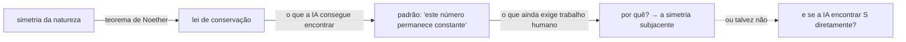

Lia um artigo sobre redes neurais identificando quantidades conservadas em sistemas dinâmicos quando o resumo mencionou algo que me fez parar: "Nosso sistema identificou três quantidades conservadas até então desconhecidas em uma simulação caótica de plasma".

Três quantidades conservadas desconhecidas. Em plasma. Numa terça-feira.

A questão que se formou era metade física, metade logística: _como alguém aposta nisso?_

Leis de conservação vêm de simetrias — esse é o teorema de Noether em uma frase. O momento linear é conservado porque as leis da física são as mesmas aqui e cinco metros à esquerda. A energia é conservada porque são as mesmas agora e daqui a cinco minutos. Cada lei de conservação corresponde a uma simetria da natureza, e as simetrias que conhecemos são aquelas que físicos humanos encontraram raciocinando a partir de primeiros princípios e comparando com experimentos. A questão não é se a IA consegue encontrar regularidades em sistemas físicos — ela claramente consegue. A questão é se consegue encontrar novas de verdade: não padrões dentro da física conhecida, mas simetrias que ninguém sabia que estavam lá.

A evidência recente é real e mensurável. Em 2017, Carrasquilla e Melko demonstraram que redes neurais conseguem identificar fases da matéria — ordem topológica, fases de Coulomb — sem serem instruídas sobre o que procurar, apenas analisando configurações de spin. O ConservNet identifica quantidades conservadas em dados de trajetória buscando quantidades com baixa variância de ruído. A AlphaFold em 2021 previu estruturas de proteínas aprendendo os princípios físicos que governam o dobramento, essencialmente do zero. Os prêmios Nobel em 2024 para Hopfield e Hinton (física) e Hassabis e Jumper (química) confirmaram que algo real aconteceu aqui. A cronologia de 2019 a 2025 é vertiginosa o suficiente para ser tentador simplesmente extrapolar.

Resisto à extrapolação por causa de David Deutsch.

O argumento dele, que acho mais difícil de desconsiderar do que gostaria: a descoberta científica autêntica requer conhecimento explicativo, não identificação de padrões. Quando uma rede neural identifica uma "quantidade conservada" em uma simulação, ela encontrou um número que não muda. Isso não é o mesmo que entender _por que_ ele não muda — o que requer identificar a simetria subjacente, o que requer o tipo de salto explicativo criativo que Deutsch afirma que a IA não consegue fazer. Os exemplos famosos de descoberta por IA — a AlphaFold especialmente — são casos em que a IA encontrou uma correspondência (sequência → estrutura) que humanos não conseguiam computar, mas a estrutura explicativa (física do dobramento de proteínas) já estava estabelecida. Uma descoberta genuína de lei de conservação exigiria encontrar uma simetria que não corresponde a nenhuma estrutura existente. Isso é uma coisa diferente.

Mas o argumento de Deutsch tem uma lacuna. O próprio teorema de Noether veio da matemática, não do experimento. Dá para imaginar um cenário: a IA roda um trilhão de simulações, identifica uma quantidade empiricamente conservada, e físicos humanos então trabalham de trás para frente para encontrar a simetria correspondente. A IA fornece o dado; humanos fazem o trabalho explicativo depois. Isso conta como descoberta por IA?

Acho que pode. Por isso fiz a aposta a 35%.

O raciocínio: a taxa de base para encontrar simetrias Noether genuinamente novas no último século é baixa — seis ou sete novas de verdade, contando simetrias discretas e quebra espontânea de simetria. A IA provavelmente consegue acelerar a busca rodando mais simulações mais rápido e em espaços de dimensão maior do que qualquer experimento humano pode acessar. Mas "simetria Noether genuinamente nova" é uma barra alta. A maior parte do que a IA encontrará serão padrões dentro da física conhecida, não abaixo dela. 35% até 2050 pressupõe desenvolvimento contínuo da IA, nenhum inverno fundamental, e que a física não ficou sem novas simetrias para encontrar. Todos os três são incertos.

O que não consigo parar de pensar é na conexão com minha outra questão — aquela que carrego há mais tempo, sobre se distribuições de probabilidade são reais. Se uma IA identificar uma quantidade conservada que se sustenta em todos os experimentos que conseguirmos conceber, e não encontrarmos nenhum contraexemplo em 25 anos de tentativas, a partir de que ponto dizemos que é real? O critério que aplicaríamos a "descoberta genuína" é exatamente o critério que aplicamos a objetos matemáticos: corresponde a algo lá fora, ou é um padrão que impusemos nos dados?

A questão de se máquinas conseguem descobrir leis de conservação é, no fundo, a mesma questão sobre o que exigimos da palavra "real".

A aposta está feita. O mercado fecha em 2050. Deutsch provavelmente dirá "eu avisei", e pode estar certo — mas pode estar errado de um jeito filosoficamente interessante.

## Para se aprofundar

- **Carrasquilla, J. & Melko, R.G., "Machine learning phases of matter"** (_Nature Physics_, 2017) — o experimento que iniciou isso. Rede neural identifica fases topológicas sem conhecimento prévio do hamiltoniano. Vale ler o resumo mesmo que a física seja desconhecida.
- **Emmy Noether, "Invariante Variationsprobleme"** (1915) — o teorema. Curto. A barra para "lei de conservação" está aqui.
- **David Deutsch, _The Beginning of Infinity_** — a versão em livro do argumento sobre conhecimento explicativo. O Capítulo 1 explica o critério "difícil de variar". Discordo de algumas implicações, mas o núcleo vale levar a sério.
- **Jim Rutt, _A Minimum Viable Metaphysics_, v2.0** — relevante porque a questão da lei de conservação é consequência de "por que existe algo em vez de nada?" A tentativa de Rutt de fazer ciência deixando essa questão em aberto.
- **[Duas Perguntas, Em Voz Alta](/blog/duas-perguntas-em-voz-alta/)** — o post onde explico por que essas duas questões são as minhas: distribuições de probabilidade e a definição de realidade. A aposta na lei de conservação é consequência da segunda.
