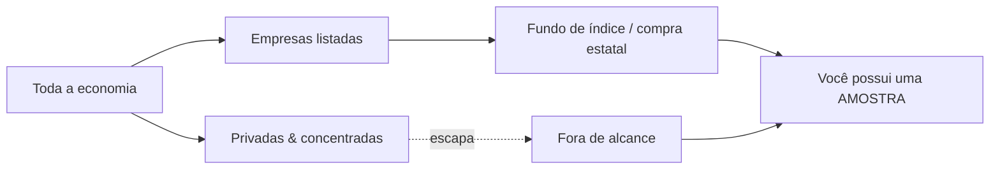

## A correção trivial em que eu não confiei

Há um episódio do [podcast do Dwarkesh](https://www.dwarkesh.com/p/alex-imas-phil-trammell) — o Lex Fridman dos ricos, aquele em que o entrevistador de fato leu os artigos antes de sentar — no qual dois economistas gastam uma hora numa pergunta que acaba sendo o jogo inteiro para IA e desigualdade: quando as máquinas produzem a maior parte da riqueza, como uma pessoa comum acaba dona de um pedaço dela? Em algum ponto do meio, Dwarkesh solta uma frase que me travou. Falando sobre como pessoas comuns deveriam participar dos ganhos, ele diz: _se indexar é difícil, então capital básico universal é difícil._

Tradução rápida, porque o resto depende disso. **Indexar** é possuir uma fatia de tudo em vez de apostar no vencedor — o que um fundo de índice faz quando compra o mercado inteiro em vez de adivinhar qual empresa é a próxima Nvidia. **Capital básico universal** é a ideia de dar às pessoas _propriedade_ em vez de um cheque mensal: o cheque é renda básica universal, e a diferença importa, porque um cheque faz de você um dependente — e um dependente pode ser cortado na próxima eleição —, enquanto uma ação faz de você um acionista, e ninguém vota para tirar suas ações. Os dois economistas claramente preferiam capital a renda. O problema é que capital só funciona se você consegue indexar — se consegue dar a todos, de forma barata, uma fatia de _tudo_. Se não consegue, "todos possuem a economia" se degrada silenciosamente em "o Estado compra alguns ativos e torce," que é a dependência da qual você estava tentando escapar, vestindo um casaco mais bonito.

Então a afirmação que sustenta tudo é: indexar é difícil.

E o fato é que eu sei uma coisa ou outra sobre tributos. Não como teoria — como a rotina diária de como uma obrigação alcança uma coisa quer a coisa queira ou não ser alcançada. Desse canto do mundo, _indexar é difícil_ soou estranho no instante em que caiu. Não errado. Estranho — do jeito que uma frase soa quando alguém descreve o seu ofício de fora e erra uma premissa. A correção que veio à mente era quase constrangedoramente simples, do tipo que faz você recontar os dedos.

Que é exatamente quando o alarme dispara. Quando algo parece trivial para você e três pessoas afiadas circularam o tema por uma hora sem dizê-lo, a aposta inteligente é em _você_ ter perdido algo, não neles. Isso só vai por dois caminhos. Ou a ideia tem um furo que eu, próximo demais do meu próprio ofício, não consigo ver, ou ela é genuinamente sólida e a razão pela qual eles nunca chegaram nela é que todos naquela mesa estavam olhando o problema como _compradores_ — e ninguém ali passa o dia pensando em como se tira uma coisa de alguém que não tem nenhuma intenção de vender.

Este ensaio é a ideia, exposta com clareza suficiente para que o furo, se existir, não tenha onde se esconder. Eu fui atrás dele do jeito que se testa uma petição antes de protocolar, caçando o ângulo pelo qual o outro lado atacaria. Não encontrei. Isso não prova que não exista. É a razão de colocar isto em algum lugar onde outra pessoa possa olhar.

## Dois problemas vestindo o mesmo casaco

Desmonte _indexar é difícil_ e você encontra duas falhas que nada têm a ver uma com a outra — a dualidade da indexação.

A primeira é **escolher**. Mesmo que todo ativo estivesse à venda, você ainda teria que escolher os certos, e a história diz que escolheria mal. A razão pela qual a fortuna dos Rockefeller não possui o planeta não é que a família ficou burra — é que, antes dos fundos de índice existirem, capturar o crescimento da economia significava adivinhar corretamente, décadas antes, qual punhado de empresas acabaria importando. Erre e sua pilha fica parada enquanto o mundo compõe juros à sua frente. Um dos economistas levantou a versão da era da IA em voz alta: e se você carregar o portfólio de todos com o laboratório que parece imbatível hoje, e ele for a zero enquanto uma empresa de robótica que ninguém indexou herda o futuro? Escolher é um problema de conhecimento. Você pode ser rico, racional e ainda assim estar errado.

A segunda é **acesso**. Suponha que você resolveu o problema de escolher — você _sabe_ quem é o vencedor. Ainda assim talvez não consiga comprá-lo, porque ele não está à venda. As empresas de IA mais valiosas são privadas. Um fundo soberano da Nigéria pode comprar todas as ações americanas listadas e ainda assim não possuir uma única ação dos laboratórios onde os retornos estão de fato se concentrando. Possuir o S&P 500 não é o mesmo que possuir a economia da IA — precisamente na medida em que a economia da IA está escapando do S&P 500. Acesso não é um problema de conhecimento. Você pode saber exatamente o que quer e estar trancado do lado de fora da sala.

Fundos de índice — a grande invenção democratizadora aqui — só resolveram o primeiro problema. Tornaram a escolha desnecessária: compre o mercado listado inteiro, pare de adivinhar. Brilhante, e não suficiente, porque eles indexam _o que está listado_. No momento em que o valor migra para mãos privadas e concentradas, o índice deixa de ser a economia. Ele se torna uma amostra da parte da economia que concordou em ser amostrada.

## Amostra

Essa palavra é o ensaio inteiro.

Um fundo de índice é uma **amostra** barata e esperta do mercado público. A ansiedade que corre por baixo daquela hora inteira de conversa é o medo de que a amostra esteja se afastando da população que deveria representar — de que a coisa que ensinamos todos a comprar já não é a coisa que queriam possuir. Os dois economistas circulam alguns remendos. Um propõe a correção mais natural do mundo: tributar amplamente, pegar a arrecadação, e fazer o governo _comprar_ ações das empresas líderes e distribuí-las. Provavelmente a coisa certa a fazer, diz ele.

Olhe para o verbo. _Comprar._ Até a versão mais engenhosa na sala ainda está amostrando — agora com o talão de cheques do Estado. O governo ainda precisa escolher o que comprar, encontrar à venda, concordar com um preço e acertar o timing do mercado. Toda parte difícil da indexação sobrevive intacta; apenas mudou quem segura a carteira. O enquadramento nunca se move. Todos são compradores tentando comprar uma amostra de uma população que continua escapando do quadro amostral.

Então pare de tentar consertar a amostra. Pare de amostrar.

## O que um tributo sabe que um comprador não sabe

Eis a coisa que os compradores na mesa não alcançaram, e a razão pela qual acho que não alcançaram é que nenhum deles cobra tributo para viver.

Uma transação de mercado precisa que o ativo esteja à venda, precisa de um preço, precisa de uma contraparte disposta. Um **tributo** não precisa de nada disso. Um tributo não _adquire_ — ele _alcança_. O imposto de renda não amostra os contribuintes que consentiram em participar; ele incide sobre todo fato gerador dentro da jurisdição, listado ou não listado, líquido ou congelado, disposto ou furioso. Universalidade não é uma funcionalidade acoplada a um tributo. É o que um tributo _é_. O termo técnico para a coisa que dispara a obrigação — o _fato gerador_ — existe precisamente para que a obrigação se ative sem a permissão de ninguém e sem esperar a formação de um mercado.

> O mercado precisa que a coisa esteja à venda.
> O tributo não.
> O mercado precisa que a coisa tenha um preço.
> O tributo não.
> O mercado precisa que o vendedor concorde.
> O tributo nunca perguntou.

A distância entre _comprar_ e _tributar_ é a distância entre uma amostra e um censo. E ela se converte diretamente em um mecanismo.

Que o tributo seja pago **em equity**. Todo ano, toda empresa emite um pequeno percentual de novas ações diretamente para um fundo público — um fundo soberano que detém em nome dos cidadãos. Não dinheiro retirado do lucro. Ações. Recém-emitidas, diluindo cada detentor existente pela mesma fração, fluindo para o único fundo do qual todos possuem um pedaço.

Isso não é uma ideia nova, e a honestidade manda dizer de quem foi. A Suécia tentou uma versão nos anos 1970 — o [plano Meidner](https://en.wikipedia.org/wiki/Wage-earner_funds), fundos de trabalhadores assalariados, emissão anual de ações para fundos coletivos controlados por trabalhadores. Morreu, e morreu pela palavra _controle_: os sindicatos, em algumas décadas, passariam a possuir e administrar as empresas, e essa perspectiva assustou gente suficiente para que a coisa fosse diluída e depois enterrada em 1991. A versão aqui não quer nada disso. Não quer administrar a empresa de ninguém. Quer o oposto do controle — um detentor passivo, votando pouco ou nada, cujo único trabalho é ser o índice por construção e repassar os dividendos. Meidner mirava na propriedade das empresas pelos trabalhadores. Isto mira na propriedade da economia por todos, que é um alvo diferente e mais calmo. É, de fato, o [capital básico universal](https://en.wikipedia.org/wiki/Asset-based_egalitarianism) que os economistas disseram que queriam — não um cheque de um político, mas uma ação que você detém por direito. Você é apenas um acionista normal. Ninguém vota para tirá-la.

## O que decorre

Passe os dois problemas de volta pelo mecanismo.

**Escolher dissolve.** Você nunca escolhe. O fundo detém uma fatia do laboratório que parece imbatível _e_ da empresa de robótica de que ninguém ouviu falar, porque ambas emitiram ações este ano e ambas diluíram para o fundo. Não há vencedor a perder, porque você não está apostando em vencedores. Você está fazendo um censo do capital, não uma amostra dele.

**Acesso dissolve.** Privado versus público deixa de significar qualquer coisa, porque o gatilho não é _estar listado_ — é _ser uma empresa na jurisdição_. A Anthropic ser privada a protege da contribuição em ações exatamente tanto quanto ser privada a protege do imposto de renda da pessoa jurídica, ou seja, nada. A sala da qual você estava trancado não tem mais fechadura; a obrigação atravessa a parede.

**E o problema que mata impostos sobre patrimônio — a avaliação — sequer aparece.** Você não consegue facilmente tributar a participação de um bilionário numa empresa privada a 0,5% ao ano, porque ninguém sabe quanto vale até que seja vendida, e forçar uma venda para descobrir é uma catástrofe própria. Mas uma contribuição paga _em ações_ pede um percentual de _unidades_, não um percentual de _valor_. O fundo pega 1% das ações. Não precisa saber quanto valem. Vai descobrir exatamente quando todo mundo descobrir — na saída, no mercado aberto, nunca. A parte mais difícil de tributar capital ilíquido simplesmente não faz parte do desenho.

Dwarkesh levanta a objeção óbvia a qualquer coisa que toque equity: por que eu investiria numa empresa se o governo fica diluindo minha participação? Mas isto é codificado como diluição, não como confisco. Um imposto em dinheiro entra na conta da empresa e tira dinheiro — dinheiro que poderia ter construído o próximo data center. Uma contribuição em ações não toca em dinheiro nenhum. As operações da empresa, sua pista de decolagem, seu capex: intocados. O que muda é quem _possui_ o upside, não se o upside é _financiado_. A torta é assada exatamente como antes. Uma fatia fina, uniforme e previsível de cada prato vai para a única mesa onde todos comem. Diluição uniforme não distorce a decisão de construir. Redireciona a colheita, não o plantio.

## Onde dobra

Agora a parte em que argumento contra mim mesmo, porque uma afirmação só vale tanto quanto os modos de falha que você está disposto a nomear.

**A fronteira.** Um censo só é censo dentro do poder tributante que o conduz. O Brasil cobrando ações de empresas brasileiras indexa o _Brasil_ — maravilhoso para desigualdade doméstica, inútil para alcançar a fronteira, porque a fronteira não está no Brasil. Os laboratórios que importam ficam num punhado de jurisdições, e um tributo não pode cruzar para uma que não governa. Então a versão internacional da pergunta do Dwarkesh — como a Nigéria indexa ganhos de IA sobre os quais não tem pretensão? — é genuinamente mais difícil que a doméstica, e estou deixando-a aberta em vez de fingir o contrário. Uma coisa a suaviza, e suaviza mais do que as alternativas que exigem coordenação: o vazamento encolhe mais quando o censo roda _dentro da jurisdição onde o capital já vive_. Um censo doméstico nos Estados Unidos arrastaria os laboratórios privados e concentrados — exatamente os ativos que um estrangeiro não consegue comprar — para um fundo público, ou seja, para um ativo que finalmente pode ser emitido, detido, negociado, indexado de fora. O censo fabrica o instrumento público que não existia antes. Há uma forma mais forte ainda — muitos países cada um rodando seu próprio censo, cada fundo se tornando algo que os outros podem deter, moedas se tornando pretensões cruzadas sobre as economias uns dos outros — mas isso precisa de adoção ampla e abre questões monetárias que não vou fingir ter resolvido aqui. O ganho barato e grande vem de um único censo no lugar certo. A nota de rodapé desconfortável é que o lugar certo são os Estados Unidos, e ninguém controla se os Estados Unidos têm o apetite.

**O proprietário universal.** Um fundo que detém uma fatia de tudo é, mecanicamente, o maior acionista de tudo — e esse é o fantasma que matou Meidner. Poder de voto concentrado em uma mão paraestatal é um perigo real não importa quão benigna a intenção, e "vai votar passivamente, prometo" é exatamente o que toda instituição assim diz no primeiro dia. Isso precisa de uma resposta arquitetural dura — voto delegado no estilo fundo de índice, voto delegado, mudo por estatuto — e a resposta é um problema de design que posso indicar mas não posso dispensar. Se o fundo começar a _administrar_ empresas, ele se tornou a coisa que foi construído para evitar.

**A margem do fundador.** Eu disse que diluição uniforme não distorce a decisão de _investir_. Ela distorce, um pouco, a decisão de _fundar_. A pessoa que começa a empresa fica com uma parcela ligeiramente menor da coisa que construiu, todo ano, para sempre. Para investimento ordinário a contribuição é neutra — todos diluem juntos, posições relativas se mantêm. Mas o payoff esperado do fundador é genuinamente menor, e na margem alguma empresa marginal deixa de ser fundada. Não acho que isso seja grande, e eu trocaria por propriedade universal de capital sem muita hesitação, mas é real e não vou pintar por cima.

Nenhum desses é o golpe fatal que eu fui procurar. A fronteira é um limite, não uma refutação. O proprietário universal é uma restrição de design, não uma contradição. A margem do fundador é um custo, não uma derrota. O que é ou evidência de que a ideia é sólida, ou evidência de que o furo está num lugar que um tributarista é a pessoa mais mal posicionada do mundo para ver.

Então estou fazendo o que se faz quando você não encontra a falha na sua própria petição e os riscos são altos demais para protocolar assim mesmo. Estou entregando para o outro lado e perguntando por onde atacariam.

Indexar nunca foi a parte difícil. Comprar é que era.

## Para ler mais

- **Rudolf Meidner, _Employee Investment Funds_** — o modelo sueco dos anos 1970 para emissão anual de ações em fundos coletivos, e um estudo de caso sobre como a política do _controle_ pode afundar um mecanismo sólido.
- **David Autor, ["Applying AI to Rebuild Middle Class Jobs"](https://www.nber.org/papers/w32140)** — o economista cujas propostas de redistribuição o podcast menciona; um contraste útil de enquadramento.
- **O [Alaska Permanent Fund](https://apfc.org/)** — a coisa mais próxima de um dividendo universal de capital em funcionamento, e prova de que a forma institucional não é ficção científica.
- **Alex Imas, ["What Will Be Scarce"](https://aleximas.substack.com/p/what-will-be-scarce)** — o argumento do setor relacional sobre o qual o episódio se constrói; leia pela parte do problema que este ensaio não toca.
- **Thomas Piketty, _O Capital no Século XXI_** — para entender por que "quem possui a parcela do capital" é a pergunta que engole todas as outras quando o crescimento passa pelo capital em vez do trabalho.
- **Charles I. Jones, ["The AI Dilemma"](https://web.stanford.edu/~chadj/AIandEconomicFuture.pdf)** — sobre a forma macro de uma economia em que o preço do compute, e dos bens de capital em geral, cai mais rápido do que o estoque cresce.
