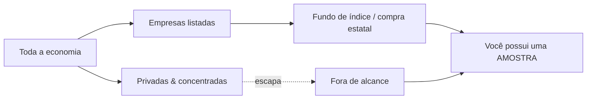

## A conversa era sobre a morte do salário

Há uma maneira muito economista de imaginar o fim do mundo: todo mundo pobre, a IA dona de tudo, e uma sala cheia de pessoas brilhantes tentando resolver o problema perguntando o que o governo deveria comprar.

Há um episódio do [podcast do Dwarkesh](https://www.dwarkesh.com/p/alex-imas-phil-trammell), com [Alex Imas](https://aleximas.substack.com/p/what-will-be-scarce) e [Phil Trammell](https://philiptrammell.com/), sobre uma pergunta simples de formular e horrível de responder: numa economia caminhando para AGI, o que ainda será escasso — trabalho humano, capital, atenção, presença, compute, controle?

A pergunta não é, exatamente, "a IA vai roubar empregos?" Essa é a versão jornalística, e ela é pequena demais. A pergunta é mais funda: se a inteligência artificial fizer com o trabalho cognitivo o que máquinas fizeram com músculo — ou mais —, quem fica com a renda?

Em economia, isso aparece como a velha divisão entre **labor share** e **capital share**. A produção inteira de uma economia acaba indo, grosso modo, para dois lugares: salários de quem trabalha ou retornos de quem possui capital — máquinas, terra, ações, claims sobre empresas. Por duzentos anos, a parte do trabalho foi surpreendentemente resistente. Mesmo depois da Revolução Industrial, mesmo depois de eletricidade, computadores e internet, humanos continuaram recebendo uma fatia enorme da renda nacional.

A pergunta do episódio é: e se dessa vez não?

E, quando a economia deixa de ser sobre salário e passa a ser sobre capital, a pergunta "quem tem emprego?" cede lugar a uma pergunta mais rude: quem está no cap table?

## Três cenários na mesa

Alex tenta salvar uma parte da labor share com o que chama de [relational sector](https://aleximas.substack.com/p/what-will-be-scarce): bens e serviços cujo valor depende de haver um humano participando — o médico que olha no olho, o tutor que se importa, a bailarina que importa justamente por não ser um robô. A pergunta dele é se esse setor humano-relacional continua grande o suficiente para sustentar renda do trabalho, ou se vira apenas uma ilha pequena numa economia de máquinas.

Phil pressiona pelo outro lado: talvez a economia das máquinas crie tantos novos bens, usos e formas de acumulação que o capital continue encontrando onde crescer, enquanto a parte especificamente humana fica pequena.

Daí nasce o **messy middle** — um cenário em que a IA automatiza empregos antes de gerar riqueza suficiente para compensar as pessoas que deslocou. A torta está crescendo, mas não rápido o bastante, e não nas mãos certas.

A incerteza macro por trás de tudo isso aparece em trabalhos como ["The AI Dilemma"](https://web.stanford.edu/~chadj/AIandEconomicFuture.pdf), de Charles I. Jones: se compute e bens de capital ficam baratos rápido demais, a distribuição dos ganhos depende de onde a escassez reaparece. Uma resposta próxima da proposta de [David Autor](https://www.nber.org/papers/w32140) seria reconstruir empregos de classe média ao redor das novas capacidades da IA. Mas se o futuro pertence ao capital mais do que ao trabalho, reconstruir empregos pode não bastar.

A conversa, então, chega a um gargalo muito concreto. Se a resposta para a desigualdade da IA é dar capital às pessoas, esse capital precisa representar a economia que de fato vai capturar os ganhos. Não adianta entregar a todos uma cesta bonita de ativos errados. Se o futuro está em laboratórios privados, fabricantes de chips, data centers, empresas de robótica ainda invisíveis e holdings que ninguém consegue comprar, o problema não é só redistribuir. É saber **o que** redistribuir.

Esse é o ponto em que a palavra "indexar" começa a carregar peso demais.

## A solução que quase aparece

A correção natural é trocar renda básica por algo mais robusto: [capital básico universal](https://en.wikipedia.org/wiki/Asset-based_egalitarianism). Em vez de um cheque mensal, cada pessoa teria uma participação patrimonial na economia. Não apenas renda. Propriedade.

A vantagem política é óbvia. Um cheque é uma promessa do governo. Uma ação é uma coisa sua. Um cheque pode ser cortado na próxima coalizão. Uma participação patrimonial é mais difícil de tratar como favor.

Mas então Dwarkesh faz a pergunta que trava a sala: se capital básico universal depende de todo mundo possuir uma fatia da economia, como você escolhe essa fatia?

Esse é o problema da indexação. **Indexar** é possuir um pedaço de tudo em vez de apostar no vencedor — o que um fundo de índice faz quando compra o mercado inteiro em vez de adivinhar qual empresa é a próxima Nvidia. Alex formula assim: _o que você coloca no portfólio das pessoas?_ Dwarkesh dá o exemplo: e se você carregar o fundo de todos com o laboratório que parece imbatível hoje, e ele for a zero enquanto uma empresa aleatória de robótica captura tudo?

E o problema fica mais afiado ainda. Para países fora da cadeia de suprimento da IA — Índia, Nigéria, Uganda, países sem pretensão sobre a cadeia de modelos, chips, HBM, ASML —, comprar o S&P 500 pode não bastar. Possuir o S&P 500 pode ser apenas possuir o mapa turístico de uma cidade que já se mudou para o subterrâneo.

A minha suspeita é que a conversa ficou presa num enquadramento tão natural que quase desaparece: todos estavam pensando como compradores.

Mesmo quando falavam em Estado, fundo soberano ou redistribuição, o verbo continuava sendo _comprar_. Tributar amplamente, arrecadar dinheiro, comprar ações, distribuir a cesta. É uma proposta séria. Mas ela ainda tenta resolver o problema de indexação com uma tecnologia de mercado.

E talvez esse seja o erro.

O mercado amostra. O tributo censa.

Esse é o texto.

## A ideia idiota que talvez não seja idiota

Eu sei uma coisa ou outra sobre tributos. Não como teoria — como a rotina diária de como uma obrigação alcança uma coisa quer a coisa queira ou não ser alcançada. Desse canto do mundo, _indexar é difícil_ soou estranho no instante em que caiu. Não errado. Estranho — do jeito que uma frase soa quando alguém descreve o seu ofício de fora e erra uma premissa. A correção que veio à mente era quase constrangedoramente simples, do tipo que faz você recontar os dedos.

Que é exatamente quando o alarme dispara. Quando algo parece trivial para você e três pessoas afiadas circularam o tema por uma hora sem dizê-lo, a aposta inteligente é em _você_ ter perdido algo, não neles. Ou a ideia tem um furo que eu, próximo demais do meu próprio ofício, não consigo ver, ou ela é genuinamente sólida e a razão pela qual eles nunca chegaram nela é que todos naquela mesa estavam olhando o problema como _compradores_ — e ninguém ali passa o dia pensando em como se tira uma coisa de alguém que não tem nenhuma intenção de vender.

Este ensaio é a ideia, exposta com clareza suficiente para que o furo, se existir, não tenha onde se esconder.

## Dois bugs usando o mesmo trench coat

Desmonte _indexar é difícil_ e você encontra duas falhas que nada têm a ver uma com a outra.

A primeira é **escolher**. Mesmo que todo ativo estivesse à venda, você ainda teria que escolher os certos, e a história diz que escolheria mal. A razão pela qual a fortuna dos Rockefeller não possui o planeta não é que a família ficou burra — é que, antes dos fundos de índice existirem, capturar o crescimento da economia significava adivinhar corretamente, décadas antes, qual punhado de empresas acabaria importando. Erre e sua pilha fica parada enquanto o mundo compõe juros à sua frente. Escolher é um problema de conhecimento. Você pode ser rico, racional e ainda assim estar errado.

A segunda é **acesso**. Suponha que você resolveu o problema de escolher — você _sabe_ quem é o vencedor. Ainda assim talvez não consiga comprá-lo, porque ele não está à venda. As empresas de IA mais valiosas são privadas. Um fundo soberano da Nigéria pode comprar todas as ações americanas listadas e ainda assim não possuir uma única ação dos laboratórios onde os retornos estão de fato se concentrando. A Nigéria pode comprar Wall Street inteira e ainda ficar do lado de fora da sala onde alguém está treinando Deus num galpão cheio de H100. Acesso não é um problema de conhecimento. Você pode saber exatamente o que quer e estar trancado do lado de fora da sala.

Fundos de índice — a grande invenção democratizadora — só resolveram o primeiro problema. Tornaram a escolha desnecessária: compre o mercado listado inteiro, pare de adivinhar. Brilhante, e não suficiente, porque eles indexam _o que está listado_. No momento em que o valor migra para mãos privadas e concentradas, o índice deixa de ser a economia. Ele se torna uma amostra da parte da economia que concordou em ser amostrada.

## O pecado original da amostra

Um fundo de índice é uma **amostra** barata e esperta do mercado público. A ansiedade que corre por baixo daquela hora inteira de conversa é o medo de que a amostra esteja se afastando da população que deveria representar — de que a coisa que ensinamos todos a comprar já não é a coisa que queriam possuir.

Um índice é uma selfie do mercado público. Bonita, barata, e cada vez menos parecida com a família inteira.

Um dos economistas propõe a correção mais natural do mundo: tributar amplamente, pegar a arrecadação, e fazer o governo _comprar_ ações das empresas líderes e distribuí-las. Olhe para o verbo. _Comprar._ Até a versão mais engenhosa na sala ainda está amostrando — agora com o talão de cheques do Estado. O governo ainda precisa escolher o que comprar, encontrar à venda, concordar com um preço e acertar o timing do mercado. Toda parte difícil da indexação sobrevive intacta; apenas mudou quem segura a carteira.

Comprar é fofo. Comprar é civilizado. Comprar é o que você faz quando a coisa está na vitrine. O problema é que o futuro não costuma ficar na vitrine. Ele fica numa LLC em Delaware com cap table fechado e NDA até no café.

Então pare de perguntar como melhorar a amostra. A resposta para uma amostra ruim não é uma amostra mais cara. É um censo.

## O fiscal entra onde o investidor pede licença

Eis a coisa que os compradores na mesa não alcançaram, e a razão pela qual acho que não alcançaram é que nenhum deles cobra tributo para viver.

Uma transação de mercado precisa que o ativo esteja à venda, precisa de um preço, precisa de uma contraparte disposta. Um **tributo** não precisa de nada disso. Um tributo não _adquire_ — ele _alcança_. O imposto de renda não amostra os contribuintes que consentiram em participar; ele incide sobre todo fato gerador dentro da jurisdição, listado ou não listado, líquido ou congelado, disposto ou furioso. Universalidade não é uma funcionalidade acoplada a um tributo. É o que um tributo _é_. O termo técnico para a coisa que dispara a obrigação — o _fato gerador_ — existe precisamente para que a obrigação se ative sem a permissão de ninguém e sem esperar a formação de um mercado.

> O mercado precisa que a coisa esteja à venda.
> O tributo precisa saber onde ela mora.
>
> O mercado precisa de preço.
> O tributo precisa de fato gerador.
>
> O mercado precisa que o vendedor concorde.
> O tributo nunca foi apresentado ao vendedor.

O mercado precisa de convite. O fisco trabalha com endereço.

A distância entre _comprar_ e _tributar_ é a distância entre uma amostra e um censo. E ela se converte diretamente em um mecanismo.

A proposta é brutalmente simples: cobre o tributo na coisa que importa.

Não em dinheiro. Dinheiro é o sangue da operação. Tirar dinheiro da empresa é disputar com servidor, engenheiro, GPU, data center, runway.

Cobre em equity.

Todo ano, toda empresa entrega uma lasca nova de si mesma a um fundo público. Pequena, previsível, universal. Nenhum fiscal precisa adivinhar valuation. Nenhum ministro precisa escolher campeões nacionais. Nenhum fundo soberano precisa descobrir qual startup secreta está prestes a comer o planeta.

A empresa continua respirando. Os donos apenas respiram com um pouco menos do oxigênio futuro. E todo mundo passa a respirar junto.

Isso não é uma ideia nova, e a honestidade manda dizer de quem foi. A Suécia tentou uma versão nos anos 1970 — o [plano Meidner](https://en.wikipedia.org/wiki/Wage-earner_funds), fundos de trabalhadores assalariados, emissão anual de ações para fundos coletivos controlados por trabalhadores. Morreu, e morreu pela palavra _controle_: os sindicatos, em algumas décadas, passariam a possuir e administrar as empresas, e essa perspectiva assustou gente suficiente para que a coisa fosse diluída e depois enterrada em 1991. A versão aqui não quer nada disso. Não quer administrar a empresa de ninguém. Quer o oposto do controle — um detentor passivo, votando pouco ou nada, cujo único trabalho é ser o índice por construção e repassar os dividendos. Meidner mirava na propriedade das empresas pelos trabalhadores. Isto mira na propriedade da economia por todos, que é um alvo diferente e mais calmo. É, de fato, o capital básico universal que os economistas disseram que queriam — não um cheque de um político, mas uma ação que você detém por direito. Você é apenas um acionista normal. Ninguém vota para tirá-la.

E no mundo de que trata este ensaio, o fantasma é ainda mais tênue. O que matou Meidner foi o medo de os sindicatos passarem a possuir e administrar as empresas — mas um sindicato pressupõe que é o trabalho humano que cria o valor disputado. Numa economia em que as máquinas fazem a maior parte desse trabalho, o mesmo fato que aposenta o trabalhador aposenta o sindicato do trabalhador. Esse medo sindical específico sobrevive à própria premissa.

E suponha que o pior que os críticos de 1991 imaginaram acontecesse — suponha que isto começasse mesmo a parecer propriedade coletiva das próprias empresas. Ainda assim o alarme estaria errado, porque o capitalismo nunca foi o ponto. É uma tecnologia, não um valor — e, entre as tecnologias, a pior que temos, excetuadas todas as outras que já tentamos. A gente o mantém porque nada o venceu ainda, e o único jeito de achar o que o vence é ir aprimorando o que já se tem. O capital básico universal é um desses aprimoramentos. Então revisar o mecanismo não é a falha; é o mecanismo fazendo aquilo para que sempre serviu. O objetivo sempre foi o desenvolvimento. Capitalismo é só o melhor rascunho até agora.

O índice é uma lista de convidados. O tributo é o censo batendo de porta em porta.

## O que quebra quando você troca comprar por tributar

Passe os dois problemas de volta pelo mecanismo.

**Escolher dissolve.** Você nunca escolhe. O fundo detém uma fatia do laboratório que parece imbatível _e_ da empresa de robótica de que ninguém ouviu falar, porque ambas emitiram ações este ano e ambas diluíram para o fundo. Não há vencedor a perder, porque você não está apostando em vencedores. Você está fazendo um censo do capital, não uma amostra dele.

**Acesso dissolve.** Privado versus público deixa de significar qualquer coisa, porque o gatilho não é _estar listado_ — é _ser uma empresa na jurisdição_. A Anthropic ser privada a protege da contribuição em ações exatamente tanto quanto ser privada a protege do imposto de renda da pessoa jurídica, ou seja, nada. A sala da qual você estava trancado não tem mais fechadura; a obrigação atravessa a parede.

**E o problema que mata impostos sobre patrimônio — a avaliação — sequer aparece.** Você não consegue facilmente tributar a participação de um bilionário numa empresa privada a 0,5% ao ano, porque ninguém sabe quanto vale até que seja vendida, e forçar uma venda para descobrir é uma catástrofe própria. Mas uma contribuição paga _em ações_ pede um percentual de _unidades_, não um percentual de _valor_. O fundo pega 1% das ações. Não precisa saber quanto valem. Vai descobrir exatamente quando todo mundo descobrir — na saída, no mercado aberto, nunca. Valuation de empresa privada é astrologia com Excel até o dinheiro bater na conta. Este mecanismo nunca precisa da astrologia.

Dwarkesh levanta a objeção óbvia: por que eu investiria numa empresa se o governo fica diluindo minha participação? Mas isto é diluição, não confisco. Um imposto em dinheiro entra na conta da empresa e tira dinheiro — dinheiro que poderia ter construído o próximo data center. Uma contribuição em ações não toca em dinheiro nenhum. As operações da empresa, sua pista de decolagem, seu capex: intocados. O que muda é quem _possui_ o upside, não se o upside é _financiado_. A torta é assada exatamente como antes. Uma fatia fina, uniforme e previsível de cada prato vai para a única mesa onde todos comem. Diluição uniforme não drena operações. Redireciona a colheita, não o plantio.

Mas ela reduz o retorno esperado de todo detentor de equity, o que significa que o custo do capital sobe pelo percentual da contribuição. Isso é real. Uma contribuição anual de 1% em ações é economicamente similar a um arrasto de 1% sobre retornos de equity. Acho que é uma troca que vale fazer por propriedade universal de capital, mas não é grátis, e fingir que é seria o tipo de movimento que faz uma petição ser rejeitada.

## Onde a ideia sangra

Agora a parte em que argumento contra mim mesmo, porque uma afirmação só vale tanto quanto os modos de falha que você está disposto a nomear.

**A fronteira.** Um censo só é censo dentro do poder tributante que o conduz. O Brasil cobrando ações de empresas brasileiras indexa o _Brasil_ — maravilhoso para desigualdade doméstica, inútil para alcançar a fronteira, porque a fronteira não está no Brasil. Os laboratórios que importam ficam num punhado de jurisdições, e um tributo não pode cruzar para uma que não governa. A versão internacional da pergunta do Dwarkesh — como a Nigéria indexa ganhos de IA sobre os quais não tem pretensão? — é genuinamente mais difícil que a doméstica, e estou deixando-a aberta em vez de fingir o contrário. Uma coisa a suaviza: o vazamento encolhe mais quando o censo roda _dentro da jurisdição onde o capital já vive_. Um censo doméstico nos Estados Unidos arrastaria os laboratórios privados e concentrados — exatamente os ativos que um estrangeiro não consegue comprar — para um fundo público, ou seja, para um ativo que finalmente pode ser emitido, detido, negociado, indexado de fora. O censo fabrica o instrumento público que não existia antes. O ganho barato e grande vem de um único censo no lugar certo. A nota de rodapé desconfortável é que o lugar certo são os Estados Unidos, e ninguém controla se os Estados Unidos têm o apetite.

**O proprietário universal.** Um fundo que detém uma fatia de tudo é, mecanicamente, o maior acionista de tudo — e esse é o fantasma que matou Meidner. Poder de voto concentrado em uma mão paraestatal é um perigo real não importa quão benigna a intenção, e "vai votar passivamente, prometo" é exatamente o que toda instituição assim diz no primeiro dia. Isso precisa de uma resposta arquitetural dura — voto delegado no estilo fundo de índice, voto delegado, mudo por estatuto — e a resposta é um problema de design que posso indicar mas não posso dispensar. Se o fundo começar a _administrar_ empresas, ele se tornou a coisa que foi construído para evitar.

**A margem do fundador.** Diluição uniforme não distorce a decisão de _investir_ — todos diluem juntos, posições relativas se mantêm. Ela distorce, um pouco, a decisão de _fundar_. A pessoa que começa a empresa fica com uma parcela ligeiramente menor da coisa que construiu, todo ano, para sempre. O payoff esperado do fundador é genuinamente menor, e na margem alguma empresa marginal deixa de ser fundada. Não acho que isso seja grande, e eu trocaria por propriedade universal de capital sem muita hesitação, mas é real e não vou pintar por cima.

**Arbitragem de forma jurídica.** O mecanismo descrito pressupõe que empresas têm "ações" para emitir. Mas nem toda pretensão econômica residual veste esse nome. LLCs têm quotas de participação. Sociedades têm cotas de sociedade. E depois há holdings, veículos de propriedade intelectual, instrumentos quase-dívida, SAFEs, notas conversíveis, opções — o zoológico corporativo moderno inventou dezenas de maneiras de deter valor econômico sem emitir ações ordinárias. A contribuição precisa mirar _pretensões econômicas residuais_, não apenas a palavra "ações." É um problema de redação, não conceitual — códigos tributários já sabem definir "participação societária" de modo amplo o suficiente para capturar essas formas — mas é o tipo de problema de redação que, mal feito, cria uma indústria de elisão. Cada estrutura esperta que um escritório de advocacia inventa para escapar da contribuição é uma rachadura no censo. O desenho precisa ser definido sobre substância econômica, não forma jurídica.

Nenhum desses é o golpe fatal que eu fui procurar. A fronteira é um limite, não uma refutação. O proprietário universal é uma restrição de design, não uma contradição. A margem do fundador é um custo, não uma derrota. A forma jurídica é um desafio de redação, não uma falha conceitual.

Talvez haja um furo aqui. Provavelmente há. Ideias simples demais deveriam ser tratadas como cogumelos bonitos demais: com respeito e suspeita.

Mas, se o furo existe, acho que ele não está onde a conversa costuma procurar. Não está em "como o Estado escolhe os ativos certos." Não está em "como o fundo compra empresas privadas." Não está em "como avaliamos unicórnios ilíquidos sem sacrificar uma cabra para o Excel."

Essas perguntas pertencem ao mundo da compra.

E a compra era o erro.

Indexar nunca foi a parte difícil. Comprar é que era.

## Arsenal para o próximo ataque

- **Rudolf Meidner, _Employee Investment Funds_** — o modelo sueco dos anos 1970, e um estudo de caso sobre como a política do _controle_ pode afundar um mecanismo sólido.
- **O [Alaska Permanent Fund](https://apfc.org/)** — a coisa mais próxima de um dividendo universal de capital em funcionamento, e prova de que a forma institucional não é ficção científica.
- **Thomas Piketty, _O Capital no Século XXI_** — para entender por que "quem possui a parcela do capital" é a pergunta que engole todas as outras quando o crescimento passa pelo capital em vez do trabalho.
