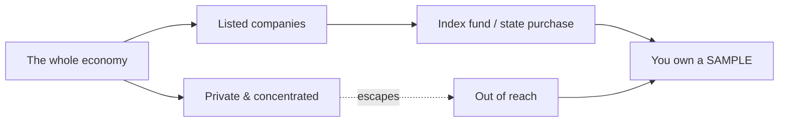

## The conversation was about the death of wages

There is a very economist way of imagining the end of the world: everyone poor, AI owns everything, and a room full of brilliant people trying to solve it by asking what the government should buy.

There's an episode of the [Dwarkesh podcast](https://www.dwarkesh.com/p/alex-imas-phil-trammell), with [Alex Imas](https://aleximas.substack.com/p/what-will-be-scarce) and [Phil Trammell](https://philiptrammell.com/), about a question that is simple to state and horrible to answer: in an economy approaching AGI, what will still be scarce — human labor, capital, attention, presence, compute, control?

The question is not, exactly, "will AI steal jobs?" That's the newspaper version, and it's too small. The question is deeper: if artificial intelligence does to cognitive work what machines did to muscle — or more — who gets the income?

In economics, this shows up as the old division between **labor share** and **capital share**. The entire output of an economy ends up, roughly, in two places: wages paid to people who work, or returns paid to whoever owns capital — machines, land, shares, claims on companies. For two hundred years, labor's cut was surprisingly resilient. Even after the Industrial Revolution, even after electricity, computers, and the internet, humans kept receiving an enormous slice of national income.

The episode's question is: what if this time they don't?

And when the economy stops being about wages and starts being about capital, the question "who has a job?" gives way to a ruder one: who's on the cap table?

## Three scenarios on the table

Alex tries to save a piece of the labor share with what he calls the [relational sector](https://aleximas.substack.com/p/what-will-be-scarce): goods and services whose value depends on a human being in the loop — the doctor who looks you in the eye, the tutor who actually cares, the dancer who matters precisely because she is not a robot. His question is whether this human-relational sector stays large enough to sustain labor income, or shrinks into a small island in a machine economy.

Phil presses from the other side: maybe the machine economy creates so many new goods, uses, and channels of accumulation that capital keeps finding places to grow, while the specifically human slice gets small.

And then there's the **messy middle** — a scenario where AI automates jobs before generating enough wealth to compensate the people it displaced. The pie is growing, but not fast enough, and not in the right hands.

The uncertainty behind all of this shows up in work like Charles I. Jones's ["The AI Dilemma"](https://web.stanford.edu/~chadj/AIandEconomicFuture.pdf): if compute and capital goods get cheap fast enough, the distribution of gains depends on where scarcity reappears. A response close to [David Autor's proposal](https://www.nber.org/papers/w32140) would rebuild middle-class jobs around new AI capabilities. But if the future belongs to capital more than labor, rebuilding jobs may not be enough.

The conversation, then, arrives at a very concrete bottleneck. If the answer to AI inequality is giving people capital, that capital needs to represent the economy that will actually capture the gains. It's no use handing everyone a pretty basket of the wrong assets. If the future lives in private labs, chip makers, data centers, robotics companies still invisible, and holding structures nobody can buy, the problem isn't just redistribution. It's knowing **what** to redistribute.

This is where the word "indexing" starts carrying too much weight.

## The solution that almost appears

The natural fix is swapping basic income for something more durable: [universal basic capital](https://en.wikipedia.org/wiki/Asset-based_egalitarianism). Instead of a monthly check, every person would hold an ownership stake in the economy. Not just income. Ownership.

The political advantage is obvious. A check is a promise from the government. A share is a thing that's yours. A check can be cut by the next coalition. An ownership stake is harder to treat as a favor.

But then Dwarkesh asks the question that freezes the room: if universal basic capital depends on everyone owning a slice of the economy, how do you pick that slice?

This is the indexing problem. **Indexing** means owning a piece of everything instead of betting on the winner — what an index fund does when it buys the entire market rather than guessing which company is the next Nvidia. Alex puts it plainly: _what do you target to put into people's portfolios?_ Dwarkesh gives the example: what if you load everyone's fund with the lab that looks unbeatable today, and it goes to zero while some random robotics company captures everything?

And then the problem gets sharper still. For countries outside the AI supply chain — India, Nigeria, Uganda, countries with no claim on the chain of models, chips, HBM, ASML — even buying the S&P 500 may not be enough. Owning the S&P 500 might just be owning a tourist map of a city that already moved underground.

My suspicion is that the conversation stayed trapped in a frame so natural it almost disappears: everyone was thinking like a buyer.

Even when they talked about the state, sovereign funds, or redistribution, the verb was still _buy_. Tax broadly, collect money, buy shares, distribute the basket. It's a serious proposal. But it still tries to solve the indexing problem with market technology.

And maybe that's the mistake.

The market samples. The tax takes a census.

That's the essay.

## The dumb idea that might not be dumb

I know one or two things about taxes. Not as theory — as the daily grind of how an obligation reaches a thing whether or not the thing wants to be reached. From that corner of the world, _indexing is hard_ sounded off the moment it landed. Not wrong. Off — the way a sentence sounds when someone describes your trade from the outside and lands one assumption short. The fix that came to mind was almost embarrassingly plain, the kind that makes you recount your fingers.

Which is exactly when the alarm goes off. When something looks trivial to you and three sharp people circled it for an hour without saying it, the smart money is on _you_ having missed something, not them. Either the idea has a hole I'm too close to my own trade to see, or it's genuinely sound and the reason they never reached it is that everyone at that table was looking at the problem as a _buyer_ — and nobody there spends their day thinking about how you take a thing from someone who has no intention of selling.

This essay is the idea, laid out clean enough that the hole, if there is one, has nowhere to hide.

## Two bugs in a trench coat

Pull _indexing is hard_ apart and you find two failures that have nothing to do with each other.

The first is **picking**. Even if every asset were for sale, you'd still have to choose the right ones, and history says you'd choose badly. The reason the Rockefeller fortune doesn't own the planet isn't that the family got stupid — it's that before index funds existed, capturing the economy's growth meant correctly guessing, decades early, which handful of companies would end up mattering. Miss them and your pile just sits there while the world compounds past you. Picking is a knowledge problem. You can be rich, rational, and still wrong.

The second is **access**. Suppose you've solved picking — you _know_ the winner. You might still be unable to buy it, because it isn't on sale. The most valuable AI companies are private. A sovereign fund in Nigeria can buy every public American equity and still not own a single share of the labs where the returns are actually concentrating. Nigeria can buy Wall Street whole and still be locked out of the room where someone is training God in a warehouse full of H100s. Access is not a knowledge problem. You can know exactly what you want and be locked out of the room.

Index funds — the great democratizing invention — only ever solved the first one. They made picking unnecessary: buy the whole listed market, stop guessing. Brilliant, and not enough, because they index _what's listed_. The moment value migrates into private and concentrated hands, the index stops being the economy. It becomes a sample of the part of the economy that agreed to be sampled.

## The original sin of the sample

An index fund is a cheap, clever **sample** of the public market. The anxiety running under that entire hour of conversation is the fear that the sample is drifting away from the population it was supposed to stand for — that the thing we taught everyone to buy is no longer the thing they wanted to own.

An index is a selfie of the public market. Pretty, cheap, and looking less and less like the whole family.

One of the economists floats the most natural fix: tax broadly, take the proceeds, and have the government _buy_ shares of the leading companies and hand them out. Look at the verb. _Buy._ Even the cleverest version in the room is still sampling — now with the state's checkbook. The government still has to choose what to purchase, find it for sale, agree on a price, and time the market. Every hard part of indexing survives intact; it has merely changed who's holding the wallet.

Buying is polite. Buying is civilized. Buying is what you do when the thing is in the shop window. The problem is that the future doesn't tend to sit in the shop window. It sits in a Delaware LLC with a closed cap table and an NDA on the coffee.

So stop asking how to improve the sample. The answer to a bad sample is not a more expensive sample. It's a census.

## The tax collector enters where the investor asks permission

Here is the thing the buyers at the table didn't reach for, and the reason I think they didn't is that none of them levies anything for a living.

A market transaction needs the asset to be for sale, needs a price, needs a willing counterparty. A **tax** needs none of those. A tax doesn't _acquire_ — it _reaches_. The income tax does not sample the taxpayers who consent to participate; it falls on every taxable event inside the jurisdiction, listed or unlisted, liquid or frozen, willing or furious. Universality isn't a feature bolted onto a tax. It's what a tax _is_. The technical word for the thing that triggers the obligation — the _taxable event_ — exists precisely so the obligation can fire without anyone's permission and without waiting for a market to form.

> The market needs the thing to be for sale.
> The tax needs to know where it lives.
>
> The market needs a price.
> The tax needs a taxable event.
>
> The market needs the seller to agree.
> The tax has never been introduced to the seller.

The market needs an invitation. The tax collector works with an address.

That gap between _buying_ and _levying_ is the gap between a sample and a census. And it converts directly into a mechanism.

The proposal is brutally simple: collect the tax in the thing that matters.

Not in cash. Cash is the blood of the operation. Taking cash from a company is competing with engineers, GPUs, data centers, runway.

Collect it in equity.

Every year, every company issues a small percentage of new shares straight into a public fund — a sovereign wealth fund that holds for the citizens. Small, predictable, universal. No tax inspector needs to guess valuation. No minister needs to pick national champions. No sovereign fund needs to figure out which secret startup is about to eat the planet.

The company keeps breathing. The owners simply breathe with a little less of the future oxygen. And everyone starts breathing together.

This is not a new idea, and the honest move is to say whose it was. Sweden tried a version in the 1970s — the [Meidner plan](https://en.wikipedia.org/wiki/Wage-earner_funds), wage-earner funds, annual share issuance into collective worker-controlled funds. It died, and it died of the word _control_: the unions would, over a couple of decades, come to own and run the firms, and that prospect frightened enough people that the thing was watered down and then buried by 1991. The version here wants none of that. It does not want to run anybody's company. It wants the opposite of control — a passive holder, voting little or not at all, whose only job is to be the index by construction and pass the dividends through. Meidner aimed at ownership of firms by workers. This aims at ownership of the economy by everyone, which is a different target and a calmer one. It is, in fact, the universal basic capital the economists said they wanted — not a check from a politician, but a share you hold as of right. You're just a normal shareholder. Nobody votes it away.

And in the world this essay is about, the ghost is thinner still. What killed Meidner was the fear of unions coming to own and run the firms — but a union presupposes that human labor is what creates the value being fought over. In an economy where the machines do most of that work, the same fact that retires the worker retires the worker's union. That union-specific fear outlives its premise.

And suppose the worst the 1991 critics pictured came true — suppose this did start to look like collective ownership of the firms themselves. Even then the alarm would be misplaced, because capitalism was never the point. It is a technology, not a value — and as technologies go, the worst one we have except for every other one we've tried. You keep it because nothing has beaten it yet, and the only way to find the thing that beats it is to keep improving the thing you have. UBC is one of those improvements. So revising the mechanism is not the failure mode; it is the mechanism doing what it was always for. The goal was always development. Capitalism is just the best draft so far.

An index is a guest list. A tax is a census, going door to door.

## What breaks when you swap buying for levying

Run the two problems back through it.

**Picking dissolves.** You never choose. The fund holds a slice of the lab that looks unbeatable _and_ the robotics company nobody's heard of, because both issued shares this year and both diluted into the fund. There is no winner to miss, because you are not betting on winners. You are taking a census of capital, not a sample of it.

**Access dissolves.** Private versus public stops meaning anything, because the trigger isn't _being listed_ — it's _being a company in the jurisdiction_. Anthropic being private protects it from the share levy exactly as much as being private protects it from the corporate income tax, which is to say, not at all. The room you were locked out of doesn't have a lock anymore; the obligation walks through the wall.

**And the problem that kills wealth taxes — valuation — never even shows up.** You cannot easily tax a billionaire's stake in a private company at 0.5% a year, because nobody knows what it's worth until it sells, and forcing a sale to find out is its own catastrophe. But a levy paid _in shares_ asks for a percentage of _units_, not a percentage of _value_. The fund takes 1% of the shares. It does not need to know what they're worth. It will find out exactly when everyone else does — at exit, on the open market, never. Private company valuation is astrology with Excel until money actually changes hands. This mechanism never needs the astrology.

Dwarkesh raises the obvious objection: why would I invest in a company if the government keeps diluting my share? But this is dilution, not confiscation. A cash tax reaches into the company's bank account and pulls money out — money that might have built the next data center. A share levy touches no cash at all. The company's operations, its runway, its capex: untouched. What changes is who _owns_ the upside, not whether the upside gets _funded_. The pie is baked exactly as before. A thin, even, predictable slice of every plate goes onto the one table everybody eats at. Uniform dilution doesn't drain operations. It redirects the harvest, not the planting.

It does, however, lower expected returns for every equity holder, which means the cost of capital goes up by the levy rate. That's real. A 1% annual share levy is economically similar to a 1% drag on equity returns. I think that's a trade worth making for universal capital ownership, but it's not free, and pretending it is would be the kind of move that gets a filing thrown out.

## Where the idea bleeds

Now the part where I argue against myself, because a claim is only worth as much as the failure modes you're willing to name.

**The border.** A census is only a census inside the taxing power that runs it. Brazil levying shares of Brazilian companies indexes _Brazil_ — wonderful for domestic inequality, useless for reaching the frontier, because the frontier isn't in Brazil. The labs that matter sit in a tiny number of jurisdictions, and a tax can't cross into one it doesn't govern. The international version of Dwarkesh's question — how does Nigeria index into AI gains it has no claim on? — is genuinely harder than the domestic one, and I'm leaving it open rather than pretending otherwise. One thing does soften it: the leak shrinks most when the census runs _inside the jurisdiction where the capital already lives_. A domestic census in the United States would drag the private, concentrated labs — the exact assets a foreigner can't buy — into a public fund, which is to say, into an asset that can finally be issued, held, traded, indexed into from outside. The census manufactures the public instrument that didn't exist before. The cheap, large gain comes from a single census in the right place. The uncomfortable footnote is that the right place is the United States, and nobody controls whether the United States has the appetite.

**The universal owner.** A fund that holds a slice of everything is, mechanically, the largest shareholder of everything — and that is the ghost that killed Meidner. Concentrated voting power in one state-adjacent hand is a real danger no matter how benign the intent, and "it'll vote passively, I promise" is exactly what every such institution says on day one. This needs a hard architectural answer — index-fund-style pass-through voting, delegated voting, statutory mute — and the answer is a design problem I can gesture at but not wave away. If the fund ever starts _running_ companies, it has become the thing it was built to avoid.

**The founder's margin.** Uniform dilution doesn't distort the decision to _invest_ — everyone dilutes together, relative positions hold. It does, a little, distort the decision to _found_. The person starting the company keeps a slightly smaller share of the thing they build, every year, forever. The founder's expected payoff is genuinely lower, and at the margin some marginal company doesn't get started. I don't think this is large, and I'd trade it for universal capital ownership without much hesitation, but it's real and I'm not going to paint over it.

**Legal-form arbitrage.** The mechanism as described assumes companies have "shares" to issue. But not all residual economic claims wear that name. LLCs have membership interests. Partnerships have partnership units. Then there are holding structures, IP vehicles, debt-like instruments, SAFEs, convertible notes, options — the modern corporate zoo has invented dozens of ways to hold economic value without issuing common stock. The levy must target _residual economic claims_, not merely the word "shares." This is a drafting problem, not a conceptual one — tax codes already know how to define "equity interest" broadly enough to capture these forms — but it's the kind of drafting problem that, done badly, creates an industry of avoidance. Every clever structure a law firm invents to dodge the levy is a crack in the census. The design has to be defined on economic substance, not legal form.

None of these is the killer I went looking for. The border is a limit, not a refutation. The universal owner is a design constraint, not a contradiction. The founder's margin is a cost, not a defeat. The legal-form problem is a drafting challenge, not a conceptual flaw.

Maybe there's a hole here. Probably there is. Ideas that seem too simple should be treated like mushrooms that are too pretty: with respect and suspicion.

But if the hole exists, I don't think it's where the conversation usually looks. It's not in "how does the state pick the right assets." It's not in "how does the fund buy private companies." It's not in "how do we value illiquid unicorns without sacrificing a goat to Excel."

Those questions belong to the world of buying.

And buying was the mistake.

Indexing was never the hard part. Buying was.

## Arsenal for the next attack

- **Rudolf Meidner, _Employee Investment Funds_** — the 1970s Swedish blueprint, and a case study in how the politics of _control_ can sink a sound mechanism.
- **The [Alaska Permanent Fund](https://apfc.org/)** — the closest thing to a working universal-capital dividend, and proof the institutional form is not science fiction.
- **Thomas Piketty, _Capital in the Twenty-First Century_** — for why "who owns the capital share" is the question that eats all the others when growth runs through capital rather than labor.

{/_ hronir auto edit _/}
