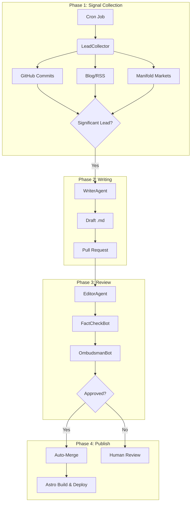

---

author: franklin
type: essay
date: 2024-07-12
lang: en
title: "Conceptual Document: The Chronicle of Franklin Baldo"
translationKey: conceptual-document
description: "In May 2024 I wrote a spec for a system that would document my intellectual life automatically. Here is that spec, and what I was thinking."
tags: ["concept", "architecture", "digital garden", "automation", "legacy"]
---

In May 2024 I sat down to write a spec for a system I didn't have yet. I'm posting it here mostly intact, with some notes about what I was actually thinking.

The first thing you'll notice is the voice. It reads like a pitch deck written in the third person. "Franklin Baldo's stream of digital public activities." That's me using corporate prose to describe a personal obsession, which should have been a warning.

Here's what I was actually trying to solve: I'm a public attorney in Rondônia who builds things at night. The building produces artifacts — commits, bets, half-finished posts, late-night threads. The artifacts scatter. A month later I can't remember what I was thinking when I opened a Manifold market about AI discovering conservation laws, or why I started a Python script that processes WhatsApp conversations. The context evaporates. What remains is the artifact, orphaned from its occasion.

I wanted a system that would catch the context as it was happening.

James Boswell is the reason I called it a "Boswell Digital." He was Johnson's biographer — not the biographer who turned Johnson into a monument, but the one who caught him stumbling. The hesitations, the contradictions, the morning Johnson said something he had to unsay by afternoon. Without those, you'd have a glossary, not a biography. I wanted something that would catch the stumbles.

The specific shape I imagined: agents that monitor my public data sources, identify significant events ("leads"), and write articles. The articles go through a pipeline — writer, editor, fact-checker, an "OmbudsmanBot" that checks for privacy problems — and eventually get published automatically. The whole thing runs on GitHub Actions.

The cast, briefly:

**LeadCollector** doesn't use an LLM. It just watches — GitHub commits, blog RSS feeds, Manifold resolutions — and normalizes events into a standard format. The Archivist who never sleeps and never editorializes.

**WriterAgent** is the Ghostwriter. Gets a structured lead and produces a draft article in my voice. Or tries to. The "in my voice" part is the hard part. I spent a lot of time on prompt engineering that, in retrospect, was trying to describe a style I could only demonstrate. The spec says "following a predefined style guide." I did not have a predefined style guide.

**EditorAgent** reviews WriterAgent's drafts. The spec gives it the persona of "The Skeptical Editor." In practice this was a second LLM call that smoothed things out. Whether smoothing and skepticism are the same thing I leave as an exercise.

**FactCheckBot** extracts every URL and claim, checks that links are active, tries to read the linked content and verify the claim actually lands. This one is genuinely useful and I still want it.

**OmbudsmanBot** is the part I thought about most. The risk with a system that automatically publishes content about you from public data is not the data itself — it's the synthesis. Two separate public facts, combined, can create a contextual privacy violation more invasive than either alone. The spec called this "doxxing-by-inference." I still think this is real. I'm less sure an LLM agent can reliably catch it, but at least it's in the loop.

The technology was: Gemini API for the LLMs (it was mid-2024, the 1.5 Pro context window was the biggest available and I needed it for FactCheckBot), GitHub Actions for orchestration (free, native to my workflow, perfect for a pipeline where each step is a Git operation), DuckDB for storing which leads had already been processed (file database, runs inside Actions without a server).

---

Looking at this a year later: the system I described here never fully ran. Parts of it became [Funes](/blog/funes-soul/). The WriterAgent concept became a Claude instance with a SOUL.md. The editorial pipeline became the [harness](/blog/2026-04-29-reclaiming-the-harness/). The OmbudsmanBot became an ongoing personal policy rather than an automated check.

What didn't happen: the automatic publishing. I wrote the spec with the assumption that getting the writing right was the hard part and the publishing was a formality. It's the reverse. Getting something into the right format — the right voice, the right framing, the right degree of incompleteness — requires a loop I haven't been able to automate. Every automated draft I've seen needs more than one round of human intervention to become something I'd put my name on.

Which maybe points at the actual problem. The spec says "Automate drafting, ensure quality." But drafting is not the bottleneck. Judgment is. The bottleneck is knowing which events are significant, which connections are worth making, what the current version of myself would say about something the three-months-ago version of myself committed. That's what requires the Boswell — and Boswell was not automated.

The three-horizon vision in the original spec — "Year 1-2: The Chronicle Matures," "Year 2-4: Emerging Intelligence," "Year 5+: The Personal Oracle" — reads to me now as the optimism of someone who had just read too many product roadmaps. Maybe that's where I'll be in 2029. I genuinely don't know. What I can say is that the gap between "system that writes articles about your public activities" and "system that catches the weight of what those activities meant" is exactly the gap Aparício Funes describes in [The Pampa on the Circuit](/blog/the-pampa-on-the-circuit-a-mate-with-boswell-digital/) when he talks about accent — what gets held and what gets rushed past.

The spec doesn't mention that gap. It probably should have been the first thing in the spec.

---

If you're reading this because you want to build something similar: the OmbudsmanBot problem is real, the FactCheckBot problem is real, and the voice problem is harder than it looks. The pipeline is the easy part. The judgment about what's worth chronicling — and how to say it in a way that doesn't sound like a GitHub Actions log — that's the interesting part, and I haven't solved it.

The spec is here as a record of what I was thinking in May 2024. I've left it mostly as I wrote it. The commit history is a record, and this is what I was trying to build.
