Eu estava vendo o Reddit quando apareceu um documento desclassificado do governo americano sobre uma coisa que supostamente tinha acontecido no município de Conde, na Bahia, em novembro de 1963.

O texto era curto.

Às 23h30 do dia 8 de novembro, a Rádio Tupi do Rio de Janeiro teria noticiado que uma grande esfera metálica havia caído no centro da cidade. O impacto teria aberto um buraco de quatro metros. A esfera tinha aberturas em forma de janela cobertas por vidro grosso.

Dentro dela havia um corpo humano.

A pessoa vestia roupas pesadas com inscrições que ninguém conseguia decifrar.

No fim:

> The population of Conde is intrigued, and the authorities have been informed.

A população de Conde estava intrigada.

Imagino.

O documento tinha tudo aquilo que faz um documento desse tipo funcionar muito bem na internet: máquina de escrever, furos de fichário, anotações manuscritas e, bem no alto, um carimbo azul escrito **DECLASSIFIED**.

O tipo de objeto diante do qual é muito fácil esquecer de perguntar o que exatamente está sendo documentado.

Mas minha primeira reação foi outra.

Eu pensei nos jornais.

## O Brasil tem um arquivo gigantesco que aparece quando você procura coisas estranhas

Já aconteceu comigo algumas vezes.

Estou procurando no Google alguma informação antiga sobre uma cidade brasileira, uma pessoa ou um acontecimento obscuro e, no meio dos resultados, aparece uma página amarelada de jornal hospedada pela Biblioteca Nacional.

O Brasil tem uma coisa chamada **Hemeroteca Digital Brasileira**.

A Biblioteca Nacional digitalizou jornais de vários lugares do país, às vezes edições diárias atravessando décadas inteiras. Tem material do século XIX. Tem muito material do século XX.

É um daqueles serviços públicos brasileiros impressionantes que não parecem ocupar na internet um espaço proporcional ao tamanho que têm.

E eu conhecia aquilo.

Por isso a minha reação à história foi bastante simples.

1963 não é tão antigo assim.

Se uma esfera metálica enorme caiu no centro de uma cidade da Bahia, abriu uma cratera de quatro metros e tinha um cadáver dentro, algum jornal deve ter falado disso.

Talvez Conde não tivesse jornal próprio.

Mas Salvador certamente tinha.

E, se a história chegou à Rádio Tupi no Rio de Janeiro, então ela já estava circulando por algum sistema de notícias.

Resolvi procurar.

Ou melhor: pedi ao ChatGPT para procurar.

A ideia inicial era muito menos ambiciosa do que este texto acabou ficando.

Eu queria basicamente saber:

**existem jornais baianos de 1963 que ainda podemos ler?**

Existem.

E daí a história começou a se dobrar sobre si mesma.

## Primeiro problema: o documento não dizia aquilo que parecia dizer

A primeira coisa que ficou clara foi que o documento americano era autêntico, mas estava sendo interpretado de uma maneira muito mais forte do que seu conteúdo permitia.

Ele não era um relatório de agentes americanos dizendo:

> Uma esfera metálica caiu na Bahia e encontramos um corpo dentro.

Era um registro do **Foreign Broadcast Information Service**, o FBIS.

O trabalho do FBIS era monitorar transmissões estrangeiras.

O documento dizia, essencialmente:

> A Rádio Tupi do Rio de Janeiro disse isto.

É uma diferença enorme.

O documento prova muito bem que **a história foi transmitida pela Rádio Tupi em 8 de novembro de 1963**.

Ele não prova que a história aconteceu.

Só que a coisa fica mais interessante porque alguém dentro do governo americano aparentemente teve exatamente a mesma dúvida.

A história não morreu naquele primeiro papel.

Ela produziu outro.

## A burocracia começa a seguir a história

Alguns dias depois, alguém no governo americano pediu que a informação fosse verificada no Brasil.

A consulta passou pelo Departamento de Estado.

Chegou à embaixada.

Chegou ao consulado em Salvador.

E então pessoas foram atrás do caso.

Aqui acontece uma transformação interessante.

Uma notícia sobre Conde havia produzido um registro burocrático nos Estados Unidos.

O registro burocrático, por sua vez, produziu uma investigação.

E a investigação começaria a produzir novos registros burocráticos.

A história tinha começado a arquivar a si mesma.

Em 20 de novembro aparece [outro documento americano](https://www.war.gov/medialink/ufo/release_05/Aug_07/documents/DOS-UAP-D002_Diplomatic-Cable_Brazil_November-20-1963.pdf).

O assunto dele é quase perfeito:

> **Negative Report on UFO**

O cônsul americano em Salvador, Harold Midkiff, havia procurado informações.

Segundo a resposta enviada aos Estados Unidos, jornalistas e outras pessoas foram até Conde e ninguém na região teria visto o objeto descrito na notícia.

A conclusão registrada era que a história havia sido **aparentemente fabricada no Rio**.

O Secretário de Segurança Pública teria mencionado a possibilidade de um balão meteorológico.

Mas o próprio documento toma o cuidado de dizer que nem isso havia sido verificado.

Esse ponto importa.

Seria muito fácil trocar uma certeza falsa por outra:

**não era um OVNI; era um balão meteorológico.**

Não sabemos.

O que o material permite dizer é menor e, justamente por isso, mais interessante.

A história fantástica não estava encontrando testemunhas quando pessoas foram procurar.

Mas o consulado fez algo ainda melhor.

Guardou os jornais.

## Dois jornais brasileiros entram no arquivo americano

O despacho menciona dois recortes enviados junto com a resposta.

Um era do **Diário de Notícias**, de Salvador, de 9 de novembro de 1963.

O outro era do **Jornal da Bahia**, de 11 de novembro.

Ou seja: o governo americano estava usando imprensa brasileira para verificar uma notícia brasileira que havia sido capturada por um sistema americano de monitoramento de imprensa estrangeira.

A recursividade já estava ficando boa.

Segundo o resumo diplomático, o *Diário de Notícias* dizia que o Ministério da Aeronáutica negava categoricamente a existência de qualquer objeto estranho em Conde.

Já o *Jornal da Bahia* teria mandado um repórter até lá.

A tradução americana do título da reportagem era:

> **The Airship That Wasn't There**

A aeronave que não estava lá.

O repórter aparentemente encontrou pouco material extraterrestre.

Mas encontrou uma tecnologia que o impressionou.

Do posto telegráfico de Conde, mandou uma mensagem a Salvador usando um aparelho de código Morse.

Cinco minutos depois recebeu uma resposta.

Isso entrou no relatório americano.

É difícil imaginar um anticlímax melhor.

Um jornalista vai ao interior da Bahia investigar uma esfera metálica com um cadáver misterioso dentro.

Volta contando que o telégrafo funcionava surpreendentemente bem.

O detalhe está na segunda página do relatório, que praticamente só existe para terminar essa frase. Depois dela vem a assinatura: **André C. Simonpietri, Scientific Attaché**, pelo embaixador.

A história do disco voador termina, naquele documento, com um adido científico americano registrando a eficiência do telégrafo de Conde.

## E então apareceu Stanislaw Ponte Preta

Até esse ponto eu tinha uma pequena frustração.

Eu estava usando documentos americanos para descobrir o que jornais brasileiros tinham dito.

Era útil.

Mas eu queria ler alguma coisa publicada no Brasil naquela semana.

Foi aí que a Hemeroteca da Biblioteca Nacional entregou uma peça maravilhosa.

No dia 14 de novembro de 1963, seis dias depois da transmissão da Rádio Tupi, a edição Nordeste do *Última Hora* publicou uma crônica de **Stanislaw Ponte Preta**, Sérgio Porto.

O título era:

**A Guerra dos Mundos na Versão Baiana.**

E era sobre Conde.

Vale um aparte aqui, porque Stanislaw não era apenas um colunista engraçado que por acaso esbarrou nessa história.

Sérgio Porto, nascido em 1923 e morto precocemente em 1968, foi jornalista, cronista, radialista, teatrólogo e escritor. A Fundação Casa de Rui Barbosa o descreve como um dos mais importantes jornalistas, cronistas e escritores cariocas do século XX e, junto com seu heterônimo Stanislaw Ponte Preta, como um dos nomes que revolucionaram a imprensa brasileira das décadas de 1950 e 1960. Stanislaw era a persona humorística: a voz com que Porto podia transformar a linguagem de jornal, a solenidade pública, o moralismo e a própria realidade brasileira em matéria de sátira. O nome brincava com **Serafim Ponte Grande**, de Oswald de Andrade.

No *Última Hora*, Stanislaw construiu inclusive uma pequena família fictícia — Tia Zulmira, Primo Altamirando, Rosamundo e outros. E isso aparece dentro da própria crônica de Conde: ao escrever que “quem conta um conto aumenta um ponto”, ele interrompe a frase para avisar que aquela máxima não era de Tia Zulmira, “mas também é boazinha”.

Alguns anos depois, já depois do golpe de 1964, Porto faria o **FEBEAPÁ — Festival de Besteira que Assola o País**. A matéria-prima era deliciosa e terrível: atos, frases e notícias reais que a sátira muitas vezes precisava apenas enquadrar. Os textos saíram no *Última Hora* e depois foram reunidos em três volumes entre 1966 e 1968.

A crônica de Conde é de 1963, portanto anterior ao golpe e anterior ao FEBEAPÁ. Não faz sentido chamá-la de FEBEAPÁ antes do FEBEAPÁ existir. Mas, relendo-a hoje, é difícil não enxergar o mecanismo que depois ficaria famoso: Stanislaw pega uma cadeia de informação pública que já é absurda por conta própria e mostra onde ela vai parar se ninguém interromper a multiplicação.

E foi exatamente isso que ele fez com Conde.

Stanislaw descreve a história quase como alguém acompanhando um experimento de transmissão de informação.

Primeiro, as notícias que chegaram a Salvador diziam que havia caído em Conde **um satélite**.

Depois:

**um satélite tripulado**.

Daí a história segue viagem.

Satélite.

Satélite tripulado.

Disco voador.

Vítimas.

Marcianos.

A velha tecnologia:

**quem conta um conto aumenta um ponto.**

O trecho é quase uma teoria da comunicação escrita como piada. Stanislaw imagina a notícia saindo de Salvador para o Rio já como um disco voador de procedência ignorada, “fazendo vítimas”; depois indo do Brasil para o mundo; depois voltando do exterior na forma de perguntas sobre uma imensa frota de discos voadores; até jornais longínquos anunciarem que marcianos haviam invadido a Terra.

Claro que é uma crônica humorística.

Sérgio Porto não estava fazendo perícia de destroços espaciais.

Mas a crônica vale por outra coisa.

Ela foi escrita em novembro de 1963.

Stanislaw não estava olhando para uma lenda antiga.

Ele estava vendo a lenda nascer.

E a sequência que ele descreve ajuda bastante a entender como chegamos ao texto da Rádio Tupi:

> grande esfera metálica;
>
> janelas cobertas por vidro grosso;
>
> cadáver;
>
> roupas com inscrições indecifráveis.

Alguma coisa ganhou detalhes no caminho entre Conde, Salvador e Rio.

Talvez detalhes demais.

A [edição de 14 de novembro de 1963](https://hemeroteca-pdf.bn.gov.br/765147/per765147_1963_00477.pdf) está preservada na Hemeroteca Digital Brasileira.

E aí apareceu uma coisa que eu não tinha percebido na primeira leitura.

## Até o desmentido parece ter se transformado

No fim da crônica, Stanislaw dá sua solução para a história.

Segundo ele, havia “um sujeito ponderado em Conde” que olhou para o objeto e explicou que aquilo era um **balão de sondagem atmosférica do Serviço de Meteorologia, extraviado pelo vento**.

É uma bela saída narrativa.

O problema é que ela não coincide exatamente com a outra fonte contemporânea que temos.

No telegrama do cônsul Harold Midkiff, datado do mesmo dia 14 de novembro, a versão é mais fraca: o **Secretário de Segurança Pública teria especulado** que o objeto poderia ser um balão meteorológico, mas “no such sighting verified” — nenhum avistamento desse tipo havia sido verificado.

Uma fonte nos dá um homem ponderado em Conde olhando para um objeto e identificando um balão.

A outra nos dá uma autoridade em Salvador formulando uma hipótese que continuava sem verificação.

As duas podem até ter origem em informações diferentes. Não temos material suficiente para dizer qual veio primeiro, nem se uma derivou da outra.

Mas elas não são a mesma história.

Isso significa que eu também não posso usar Stanislaw como confirmação de que “era um balão meteorológico”.

E, para este caso, a discrepância é quase boa demais.

Talvez até **a explicação cética** tenha passado pelo mesmo processo de compressão e embelezamento que Stanislaw estava satirizando.

A história extraordinária ganha um cadáver.

A história banal ganha uma testemunha ponderada que olha para o céu e resolve o mistério.

As duas ficam melhores quando contadas.

## Um balão, pelo menos, não seria uma coisa absurda

Dizer que a versão do balão não foi comprovada não significa que ela seja tecnicamente absurda.

Por uma coincidência útil, o próprio Serviço de Meteorologia brasileiro tinha acabado de ser reorganizado naquele mês. O Decreto nº 52.667, de **11 de outubro de 1963**, aprovou seu novo regimento e colocou o **Distrito de Meteorologia do Leste em Salvador**, abrangendo Sergipe e Bahia. O mesmo regimento previa observações de altitude e uma rede regional de observações meteorológicas.

Portanto havia, literalmente, uma estrutura meteorológica oficial sediada em Salvador e responsável pela Bahia quando a história de Conde circulou.

Isso torna perfeitamente plausível, em abstrato, que balões de sondagem fizessem parte do mundo material daquela notícia.

Só não prova que um deles caiu em Conde.

Plausibilidade não é evidência. E uma das coisas que esta investigação está me ensinando é justamente não promover uma boa explicação a fato só porque ela fecha o enredo melhor.

## Uma história começa a produzir cópias de si mesma

Foi nessa hora que percebi que o objeto interessante já não era exatamente o OVNI.

Era a trajetória da informação.

Alguma coisa é contada sobre Conde.

Talvez um objeto tenha sido visto.

Talvez um balão tenha caído.

Talvez não tenha acontecido nada.

Ainda não sei.

Mas uma história começa a circular.

Ela chega a Salvador.

É publicada.

Vai para o Rio.

A Rádio Tupi transmite.

O FBIS americano está ouvindo.

O FBIS registra.

Alguém em Washington lê o registro.

Washington pergunta ao Departamento de Estado.

O Departamento de Estado pergunta à embaixada.

A embaixada pergunta ao consulado.

O consulado pergunta a jornalistas.

Jornalistas vão a Conde.

Os jornais publicam o resultado.

O consulado pega esses jornais.

Os jornais brasileiros entram num novo documento americano.

O novo documento é arquivado.

Depois o caso aparece também no **Project Blue Book**, o programa da Força Aérea americana que catalogava relatos de objetos voadores não identificados.

Outra ficha.

Outro resumo.

Outra cópia da história.

E dentro da própria ficha aparece de novo a conclusão:

**apparently fabricated in Rio.**

O [item preservado no Internet Archive](https://archive.org/details/1963-11-9737078-Conde-Bahia-BRAZIL/mode/1up) guarda essa camada da história.

Nesse ponto o caso de Conde já tinha adquirido uma propriedade curiosa.

Ele podia ter começado com um acontecimento.

Ou com um erro.

Ou com um boato.

Mas agora já não dependia mais de nenhum deles para continuar existindo.

Havia documentos sobre documentos sobre notícias sobre uma coisa que talvez nunca tenha acontecido.

A história tinha criado uma infraestrutura de preservação para si própria.

```mermaid
flowchart LR
  A[Conde: fato, erro ou boato] --> B[Imprensa baiana]
  B --> C[Rádio Tupi]
  C --> D[FBIS]
  D --> E[Departamento de Estado]
  E --> F[Consulado em Salvador]
  F --> G[Jornais e investigação local]
  G --> H[Relatório diplomático]
  H --> I[Project Blue Book]
  I --> J[Digitalização]
  J --> K[Internet Archive]
  K --> L[Reddit]
  L --> M[ChatGPT + Hemeroteca]
  M --> N[Este post]
  N -. próxima captura .-> K
```

## O arquivo preserva também o erro

Tenho a impressão de que existe uma intuição meio errada sobre arquivos.

A gente imagina que algo estar num arquivo oficial significa que passou por alguma espécie de filtro de verdade.

Não é assim.

Burocracias guardam coisas porque elas circularam.

Porque alguém informou.

Porque alguém perguntou.

Porque alguma autoridade precisava responder.

Porque algo precisou ser descartado.

Porque uma hipótese entrou numa pasta.

Porque uma mentira teve consequências administrativas suficientes para produzir papel.

Isso vale especialmente para arquivos de inteligência.

Uma agência de inteligência que arquivasse apenas informações comprovadamente verdadeiras seria uma agência extremamente ruim.

Ela precisa registrar rumores, hipóteses, relatos, negativas, contradições.

E o próprio relatório de Conde preserva um exemplo minúsculo e maravilhoso disso.

O documento é datado de **20 de novembro de 1963**. Ele remete a um telegrama de **14 de novembro de 1963**. Toda a cadeia é sobre o episódio de 8 de novembro de 1963.

Mas a linha do assunto diz:

> Reportedly Sighted Near Salvador, Bahia on November 8, **1964**.

Um ano à frente.

É quase certamente um simples erro datilográfico. Ninguém precisa de uma teoria temporal para explicá-lo: o próprio documento, suas referências e sua data tornam 1963 inequívoco.

Mas eu gosto desse erro porque ele é uma miniatura daquilo que o arquivo faz.

O arquivo não preservou “a verdade sobre 8 de novembro”.

Preservou o que alguém escreveu — inclusive o 4 onde deveria haver um 3.

Sessenta e três anos depois, o erro continua lá.

O contexto se solta do documento.

A primeira página sobrevive melhor que a segunda.

A informação extraordinária circula mais que a investigação que veio depois.

E então um carimbo administrativo começa a funcionar como selo epistemológico.

**DECLASSIFIED.**

A palavra só diz que um documento anteriormente classificado deixou de ser classificado.

Mas visualmente ela parece dizer outra coisa:

**CONFIRMED.**

Não diz.

## Sessenta anos depois a história aprende a usar a internet

Décadas passam.

Os papéis continuam em arquivos.

Então eles são digitalizados.

A informação muda novamente de suporte.

O que era uma folha acessível a quem soubesse qual caixa pedir passa a ser uma imagem num servidor.

Sites começam a indexar.

Pessoas baixam.

Outros sites copiam.

Arquivos da própria internet começam a guardar cópias desses sites.

O Internet Archive aparece como uma espécie de burocracia de segunda ordem: não arquiva apenas acontecimentos ou documentos.

Arquiva **a internet que arquivou os documentos**.

Uma cópia guarda outra cópia que guarda outra cópia.

E sessenta e três anos depois alguém pega justamente aquela primeira página extraordinária e posta no Reddit.

O ciclo recomeça.

A [postagem no r/UFOs](https://www.reddit.com/r/UFOs/comments/1vi9q24/removed_by_moderator/) acabou removida pela moderação, mas a discussão continuou acessível e preservou o texto do documento.

A história volta à circulação.

Só que o ambiente agora é outro.

Em 1963:

**satélite → satélite tripulado → disco voador → cadáver.**

Em 2026:

**o FBIS registrou uma transmissão da Rádio Tupi → documento desclassificado do governo americano sobre cadáver encontrado dentro de OVNI no Brasil.**

O mecanismo não mudou tanto.

Mudou a infraestrutura.

## E aí eu entrei no arquivo

O curioso é que, enquanto eu tentava reconstruir tudo isso, comecei a repetir exatamente o processo que estava descrevendo.

Vi uma cópia do documento no Reddit.

Guardei a informação.

Lembrei da Biblioteca Nacional.

Perguntei ao ChatGPT se existiam jornais daquela época.

O ChatGPT encontrou outros documentos americanos.

Esses documentos diziam quais jornais brasileiros procurar.

A Biblioteca Nacional devolveu uma edição de 1963 em que Stanislaw Ponte Preta descrevia a transformação da notícia enquanto a transformação ainda estava acontecendo.

Depois encontrei o registro do Project Blue Book.

E então comecei a escrever este texto.

Nesse ponto ficou difícil continuar fingindo que eu estava apenas observando um arquivo.

Eu já tinha entrado nele.

Porque este post é outro registro da história de Conde.

Ele cita os papéis anteriores.

Resume.

Seleciona.

Descarta algumas interpretações.

Preserva outras.

Acrescenta contexto.

Produz mais uma versão.

Exatamente como todos os sistemas anteriores fizeram.

## O problema estranho da fonte

Isso produz uma situação meio engraçada.

Suponha que alguém, em 2050, pesquise:

**Conde Bahia UFO 1963.**

Talvez encontre primeiro este texto.

Talvez o documento original americano esteja num site que mudou.

Talvez a interface da Biblioteca Nacional seja outra.

Talvez o Reddit daquela época já nem seja uma coisa legível por humanos normais.

Este post poderá funcionar como um índice para documentos que vieram antes dele.

E aí acontece uma inversão.

Hoje eu uso o documento de 1963 como fonte para escrever este post.

No futuro, alguém pode usar este post como fonte para encontrar o documento de 1963.

A fonte produz uma interpretação.

A interpretação passa a preservar a fonte.

E se o Internet Archive capturar esta página, haverá ainda mais uma camada:

um arquivo da internet preservando meu texto sobre a internet ter preservado documentos sobre uma burocracia ter preservado uma notícia sobre alguma coisa que talvez tenha acontecido numa cidade da Bahia em 1963.

Não sei quantos níveis são necessários antes de isso tecnicamente se tornar uma instalação artística.

## O que provavelmente aconteceu?

Ainda quero responder à pergunta mais simples.

Uma esfera metálica com um cadáver caiu em Conde?

Tudo que encontrei até agora aponta fortemente para **não**.

A transmissão da Rádio Tupi existiu.

O documento americano existe.

A investigação americana existe.

Os jornais brasileiros existiram.

Pessoas aparentemente foram até Conde.

A Aeronáutica negou a história.

O consulado americano não encontrou testemunhas.

Stanislaw já satirizava a mutação do caso seis dias depois.

O Project Blue Book terminou registrando que não havia base factual para a história e que ela teria sido aparentemente fabricada no Rio.

Isso é bastante evidência contra a versão extraordinária.

Mas permanece uma pequena pergunta abaixo dela.

Houve um fato banal que deu origem ao boato?

Um balão?

Alguma notícia de satélite?

Algum objeto visto no céu?

Uma informação telegráfica mal compreendida?

Não sei.

As referências contemporâneas a balão tornam isso possível.

A existência de uma estrutura meteorológica oficial em Salvador torna a hipótese banalmente plausível.

Nada disso a torna verdadeira.

E gosto que essa pequena incerteza continue ali.

Porque descobrir que a história extraordinária provavelmente era falsa não exige que eu invente a história verdadeira em seu lugar.

## Ainda faltam dois papéis

Há duas fontes que eu ainda quero ver diretamente.

O **Diário de Notícias de Salvador de 9 de novembro de 1963**.

E o **Jornal da Bahia de 11 de novembro de 1963**.

O documento americano descreve os dois.

Mas ainda é uma fonte falando sobre outra fonte.

Quero a página.

O [Instituto Geográfico e Histórico da Bahia](https://www.ighb.org.br/biblioteca) informa possuir coleções que cobrem esses anos: *Diário de Notícias* de 1875 a 1980 e *Jornal da Bahia* de 1959 a 1994.

E apareceu uma pista adicional sobre o primeiro jornal.

A versão pública da Hemeroteca Digital que encontrei para o *Diário de Notícias* de Salvador expõe online apenas exemplares entre 1876 e 1909. Isso, à primeira vista, parecia um beco sem saída.

Mas o **ICAA/Museum of Fine Arts, Houston** cataloga uma matéria chamada “Arte popular”, publicada no *Diário de Notícias* de Salvador em **5 de novembro de 1963**, página 2, e informa expressamente que o item digitalizado está localizado na **Fundação Biblioteca Nacional**.

Quatro dias antes da edição que eu quero.

Isso não me entrega o jornal de 9 de novembro.

Mas melhora bastante a pista: material do *Diário de Notícias* de Salvador de novembro de 1963 já foi digitalizado a partir do acervo da própria Biblioteca Nacional, mesmo que essa faixa de datas não esteja aparecendo na interface pública da coleção que encontrei.

Então a busca continua.

Talvez seja preciso descobrir outro identificador de coleção.

Talvez seja preciso pedir a reprodução diretamente à Biblioteca Nacional ou ao IGHB.

Talvez alguém precise ir fisicamente até uma hemeroteca.

O que seria um final adequado para uma investigação que começou no Reddit.

## E agora eu devolvo a história para a internet

Foi isso que me pegou no fim.

Em 1963, alguma história saiu de Conde — se é que saiu de Conde.

Virou notícia.

A notícia virou transmissão de rádio.

A transmissão virou relatório de inteligência.

O relatório virou pedido diplomático.

O pedido virou investigação.

A investigação virou outro relatório.

Os jornais viraram anexos.

O caso virou ficha militar.

As fichas viraram arquivo.

O arquivo virou digitalização.

A digitalização virou site.

O site virou cópia.

A cópia foi preservada por outros arquivos.

Uma dessas cópias apareceu no Reddit.

Eu vi.

Pedi para uma inteligência artificial procurar o que havia em volta.

Ela encontrou outras cópias.

E agora estou escrevendo outra.

Talvez daqui a algumas semanas um crawler passe por aqui.

Talvez o Internet Archive guarde esta página.

Talvez um mecanismo de busca a indexe.

Talvez algum modelo futuro leia uma cópia.

Talvez alguém daqui a vinte ou cinquenta anos encontre primeiro este texto e, a partir dele, volte aos documentos de 1963.

Se isso acontecer, este post terá se tornado mais uma camada do mesmo objeto que tentou descrever.

Eu comecei procurando uma história antiga num arquivo.

Agora estou colocando a história de volta no arquivo.

A história continua.

E esta página já faz parte dela.

## Para continuar lendo

- **Foreign Broadcast Information Service / Rádio Tupi (8 nov. 1963)** — o texto transcrito na postagem que despertou esta investigação também aparece preservado na discussão do [r/UFOs](https://www.reddit.com/r/UFOs/comments/1vi9q24/removed_by_moderator/).
- **Embaixada dos EUA, “Negative Report on UFO” (20 nov. 1963)** — o [despacho diplomático](https://www.war.gov/medialink/ufo/release_05/Aug_07/documents/DOS-UAP-D002_Diplomatic-Cable_Brazil_November-20-1963.pdf) registra a investigação do consulado em Salvador, os dois jornais consultados e a ausência de confirmação local.
- **Stanislaw Ponte Preta, “A Guerra dos Mundos na Versão Baiana” (14 nov. 1963)** — a [edição do *Última Hora*](https://hemeroteca-pdf.bn.gov.br/765147/per765147_1963_00477.pdf) está disponível na Hemeroteca Digital Brasileira.
- **Fundação Casa de Rui Barbosa, “Sérgio Porto e Stanislaw Ponte Preta, 50 anos depois”** — uma boa introdução à importância de Sérgio Porto e à persona de Stanislaw na imprensa brasileira.
- **Biblioteca Nacional, “Sérgio Porto: o ‘Pai espiritual’ de Stanislaw Ponte Preta”** — biografia e contexto da obra, inclusive o FEBEAPÁ e a relação de Porto com o *Última Hora*.
- **Project Blue Book, Conde, Bahia (nov. 1963)** — o [caso digitalizado](https://archive.org/details/1963-11-9737078-Conde-Bahia-BRAZIL/mode/1up) está preservado no Internet Archive.
- **Decreto nº 52.667, de 11 out. 1963** — o regimento do Serviço de Meteorologia então vigente estabelecia em Salvador o Distrito de Meteorologia do Leste, responsável por Bahia e Sergipe.
- **Instituto Geográfico e Histórico da Bahia** — a [hemeroteca do IGHB](https://www.ighb.org.br/biblioteca) informa possuir coleções do *Diário de Notícias* e do *Jornal da Bahia* que abrangem novembro de 1963.
