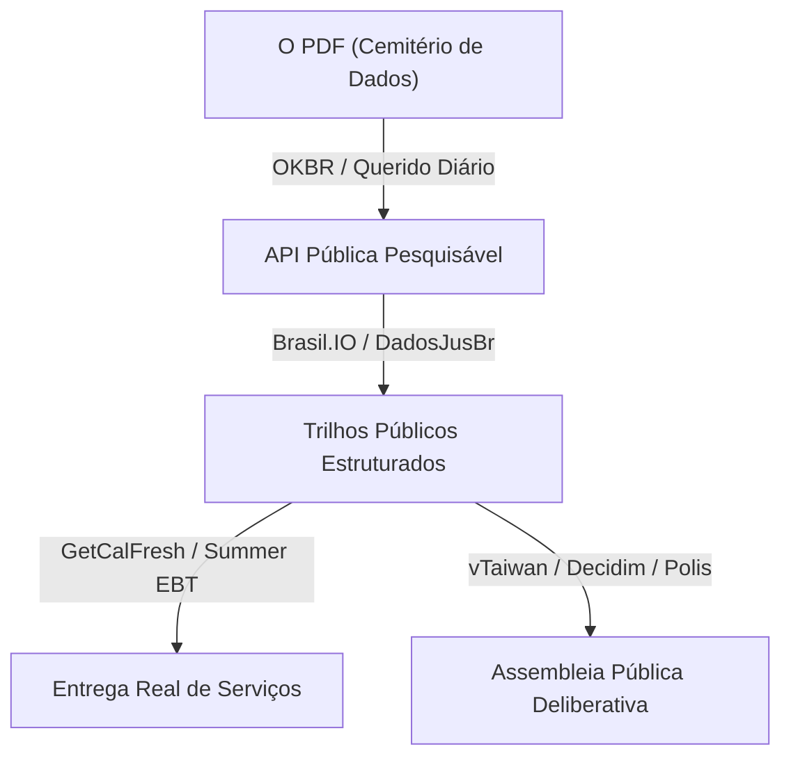

Tenho o hábito de acumular filas porque parece a forma mais barata de simular progresso.

Todo fim de semana em Porto Velho, quando a umidade sobe e a rede elétrica começa a ranger sob o peso de três mil aparelhos de ar-condicionado, abro uma nova janela do navegador e começo a marcar palestras. É um reflexo de proteção. Trabalho numa procuradoria do estado onde o acervo se comporta como um líquido físico, preenchendo cada sala, e a tentação é acreditar que se eu assistir Evan You explicar o Vite ou Geoffrey Hinton discutir os limites da inteligência humana, estarei de alguma forma mais perto de construir as ferramentas que podem me salvar.

A janela do navegador agora tem quarenta e sete abas abertas. É um monumento a intenções que ainda não ganhei.

A maioria desses não são recomendações. Para recomendar uma palestra, você tem que tê-la assistido, e para tê-la assistido, você tem que ter cedido quarenta minutos ao ritmo de outra pessoa. O que está abaixo é a fila — a lista anotada das coisas que decidi me importar antes que o compilador me diga que passei mais um fim de semana performando o ato de pesquisar.

Dois agrupamentos. O primeiro é engenharia de software e IA — principalmente de 2025, quando a palavra "agente" passou de um enquadramento conceitual para uma ferramenta de linha de comando que você podia realmente executar. O segundo é civic tech e govtech, que tenho chamado de "civil tech" nos meus rascunhos até o Canivete apontar que o termo não existe. O nome é civic tech, mesmo que as ferramentas muitas vezes pareçam pertencer a um museu de boas intenções.

## Onde o código encontra o espaço latente

O agrupamento de engenharia de IA vai do muito prático (como construir agentes confiáveis) ao filosófico (o que estamos realmente fazendo aqui). Os [12-factor agents de Dex Horthy](https://github.com/humanlayer/12-factor-agents) — um framework para construir aplicações LLM confiáveis, emprestando a estrutura da metodologia twelve-factor app — aparecem duas vezes porque o enquadramento continua surgindo em conversas e quero a fonte, não os resumos. O MCP é o [Model Context Protocol](https://modelcontextprotocol.io/), o padrão que permite que modelos de linguagem conversem com ferramentas e fontes de dados externas. As palestras sobre a morte da IDE são Steve Yegge e Gene Kim perguntando o que acontece com ambientes de programação quando a IA escreve a maior parte do código.

|   # | Palestra                                                                                                                          |
| --: | --------------------------------------------------------------------------------------------------------------------------------- |
|   1 | [2025 em LLMs até agora, ilustrado por Pelicanos em Bicicletas — Simon Willison](https://www.youtube.com/watch?v=YpY83-kA7Bo)     |
|   2 | [Engenharia de software com GenAI — Gergely Orosz / LeadDev LDX3 2025](https://www.youtube.com/watch?v=S6hIHPudbYw)               |
|   3 | [Como Construímos Agentes Eficazes — Barry Zhang, Anthropic](https://www.youtube.com/watch?v=D7_ipDqhtwk)                         |
|   4 | [Não Construa Agentes, Construa Habilidades — Barry Zhang & Mahesh Murag, Anthropic](https://www.youtube.com/watch?v=CEvIs9y1uog) |
|   5 | [12-Factor Agents: Padrões de aplicações LLM confiáveis — Dex Horthy](https://www.youtube.com/watch?v=8kMaTybvDUw)                |
|   6 | [Construindo e avaliando Agentes de IA — Sayash Kapoor](https://www.youtube.com/watch?v=d5EltXhbcfA)                              |
|   7 | [Claude Code & a evolução do código agêntico — Boris Cherny](https://www.youtube.com/watch?v=Lue8K2jqfKk)                         |
|   8 | [Sem Vibes: Resolvendo Problemas Difíceis em Codebases Complexas — Dex Horthy](https://www.youtube.com/watch?v=rmvDxxNubIg)       |
|   9 | [A IA vai superar a inteligência humana? — Geoffrey Hinton, Royal Institution](https://www.youtube.com/watch?v=IkdziSLYzHw)       |
|  10 | [Matemática: A ascensão das máquinas — Yang-Hui He](https://www.youtube.com/watch?v=oOYcPkBaotg)                                  |
|  11 | [O Novo Código — Sean Grove, OpenAI](https://www.youtube.com/watch?v=8rABwKRsec4)                                                 |
|  12 | [MCP é tudo que você precisa — Samuel Colvin, Pydantic](https://www.youtube.com/watch?v=bmWZk9vTze0)                              |
|  13 | [2026: O Ano em que a IDE Morreu — Steve Yegge & Gene Kim](https://www.youtube.com/watch?v=7Dtu2bilcFs)                           |
|  14 | [IA sem enrolação, para humanos — Scott Hanselman, NDC London 2025](https://www.youtube.com/watch?v=kYUicaho5k8)                  |
|  15 | [Palestra de Abertura — Cory Doctorow, PyCon US](https://www.youtube.com/watch?v=ydVmzg_SJLw)                                     |
|  16 | [Vite Além de uma Ferramenta de Build — Evan You, ViteConf 2025](https://www.youtube.com/watch?v=x7Jsmt_o9ek)                     |
|  17 | [Você Não Conhece o Git — Edward Thomson, NDC London 2025](https://www.youtube.com/watch?v=DZI0Zl-1JqQ)                           |
|  18 | [Decodificando os segredos da vida com IA — Mikhail Burtsev](https://www.youtube.com/watch?v=l28WCnZXNNg)                         |
|  19 | [A Batalha de Khasham — The Operations Room](https://www.youtube.com/watch?v=T6Ii45jxsLE)                                         |
|  20 | [Novos recursos CSS para conhecer em 2025 — Kevin Powell](https://www.youtube.com/watch?v=jSCgZqoebsM)                            |

## O que a civic tech cheira quando é de verdade

Este é o agrupamento que mais me interessa agora. Trabalho na administração pública em Rondônia e tenho pensado sobre o que seria necessário para que os dados de accountability realmente chegassem às pessoas que deveriam estar lendo. Os vídeos brasileiros são meu ponto de partida. Os internacionais são onde vou buscar modelos mentais que o Brasil ainda não construiu.

### Brasil

**[Querido Diário: hoje eu tornei um Diário Oficial acessível para todo mundo](https://www.youtube.com/watch?v=eBGAg45oMpM)** — ponto de entrada para o projeto: diários oficiais municipais tornados pesquisáveis e utilizáveis. Este é o projeto da [Open Knowledge Brasil](https://docs.queridodiario.ok.org.br/) para extrair e centralizar dados do diário oficial municipal com uma API pública.

**[Navegando na API do Querido Diário](https://www.youtube.com/watch?v=vgrqw2HLFJY)** — o mais útil se eu realmente quiser construir algo em cima dos dados.

**[Navegando no site do Querido Diário](https://www.youtube.com/watch?v=Qk5oQ9g1iX8)** — menos técnico, bom para ver o UX público antes de mergulhar na API.

**[Brasil.IO: Dados abertos para mais democracia — Álvaro Justen](https://www.youtube.com/watch?v=1FEYQBmyk2Y)** — o [Brasil.IO](https://brasil.io/) é um repositório de dados públicos brasileiros em formatos acessíveis. Um clássico da infraestrutura de dados abertos brasileira.

**[Ativismo digital e tecnologia cívica — Operação Serenata de Amor](https://m.youtube.com/watch?v=3N_qRFyhZs8)** — mais antigo, mas importante. A [Serenata de Amor / Rosie](https://serenata.ai/) usou IA para analisar gastos parlamentares reembolsados pelo CEAP e sinalizar casos suspeitos. Uma das histórias canônicas da civic tech brasileira.

**DadosJusBr** — acompanho o projeto mais do que procuro um vídeo específico. Altamente relevante: dados estruturados de remuneração e transparência para o Judiciário e o Ministério Público. O tipo de coisa que deveria ser padrão e não é.

### Exterior

**[AI Studio: Resolvendo o problema de PDF do governo com IA — Code for America Summit 2025](https://www.youtube.com/watch?v=Aw9GRtY_4Cg)** — PDFs como o cemitério da informação pública. Relevante em todo lugar, mas especialmente na administração pública brasileira onde o PDF é infraestrutura estrutural.

**[Colocando políticas para trabalhar: Orientando o uso de IA dentro do governo — Code for America Summit 2025](https://www.youtube.com/watch?v=eUSKDtAXo_A)** — aquisição, guardrails, implementação. A versão civic tech mais sofisticada de "IA no governo", sem a mágica de demo.

**[Como o Summer EBT está cumprindo uma nova promessa para famílias — Code for America Summit 2025](https://www.youtube.com/watch?v=BR8Im8YMEUg)** — civic tech concreto de entrega de benefícios. O [GetCalFresh](https://codeforamerica.org/success-stories/simplifying-californias-online-application-for-food-benefits/) ajudou 6,2 milhões de pessoas a obter benefícios alimentares de 2017 a 2025. Essa é a unidade de medida que quero estar usando.

**[vTaiwan: novos experimentos em democracia digital](https://www.youtube.com/watch?v=qkXxcwUkdyw)** — Taiwan é provavelmente o caso mais interessante do mundo de civic tech que realmente tocou a governança. O ecossistema [g0v](https://g0v.tw/intl/en/) é descentralizado, transparente e entregou coisas que funcionaram.

**[Como a democracia digital pode curar a polarização — Audrey Tang](https://www.youtube.com/watch?v=lzmYVYHVXp4)** — a versão filosófica: não apenas formulários melhores, mas diferentes affordances institucionais.

**[O segredo do Decidim: Construindo uma comunidade internacional](https://www.youtube.com/watch?v=6ImrcgD0OR0)** — o [Decidim](https://decidim.org/) é uma plataforma livre/aberta para participação cidadã. Infraestrutura para processos participativos e assembleias.

**[Escalando a Deliberação: Polis e o Projeto de Democracia Computacional](https://www.youtube.com/watch?v=b4j_2JDh_Rc)** — uma das linhas "IA + democracia" mais interessantes: o [Polis](https://compdemocracy.org/) tenta encontrar estrutura de consenso em vez de maximizar engajamento. O oposto das redes sociais.

**[O Departamento de Melhoria do Governo: Civic Tech e Por Que Importa](https://www.youtube.com/watch?v=QXmlEDvq48Y)** — enquadramento 18F/USDS: melhoria do governo como ofício, não ideologia.

**[Lançamento do Relatório 2025 sobre o Estado da Infraestrutura Pública Digital](https://www.youtube.com/watch?v=YmBpHGmZC9g)** — o quadro mais amplo de "infraestrutura pública digital": identidade, pagamentos, troca de dados, trilhos públicos. O enquadramento da [Digital Public Goods Alliance](https://digitalpublicgoods.net/) é útil aqui.

A fila não é um banco de dados; é uma trajetória — embora eu ainda não tenha me convencido de que assistir em determinada ordem muda o que você aprende. O movimento da libertação de dados brasileiros até a entrega de serviços até a infraestrutura deliberativa é uma teoria, não um plano de aula. Termina em perguntas que ainda não sei responder, o que geralmente é um sinal de que a fila vale o tempo.

O [causaganha](https://github.com/franklinbaldo/causaganha) está no meu repositório há três anos — um scraper para o diário oficial de Rondônia que faria pelo estado o que o Querido Diário faz pelos municípios em todo o Brasil. De vez em quando eu o abro, adiciono algo, fecho de novo. No momento em que paro de escrever código, o diário oficial volta a ser uma pilha de PDFs não indexados.

Um pipeline que não roda é apenas aço sentado na terra.

As abas ficam abertas até a máquina decidir o contrário.
