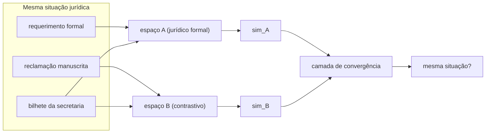

Aqui está um problema que eu tenho de verdade, que o [PINK](/blog/2026-05-14-the-agent-that-doesnt-invent-verbs/) deveria resolver e atualmente não resolve muito bem.

Chega um expediente no escritório. Pode ser um requerimento formal de um escritório de advocacia — três páginas, papel timbrado, parágrafos numerados. Pode ser uma reclamação manuscrita de um garimpeiro perguntando sobre a mesma autorização de uso do solo que o escritório está pedindo. Pode ser um bilhete da secretaria ambiental — duas frases, abreviações burocráticas, também sobre o mesmo assunto. Três documentos, registros linguísticos completamente diferentes, mesma situação jurídica subjacente. O PINK precisa reconhecer isso. Não porque os tokens coincidam — não vão coincidir — mas porque a _estrutura semântica_ é a mesma.

A maioria dos sistemas de recuperação por embeddings não ajuda aqui. Você projeta os três documentos no mesmo espaço de embedding, e a reclamação manuscrita informal cai num bairro diferente do requerimento formal, mesmo que descrevam circunstâncias idênticas. O espaço foi calibrado no tipo de texto com que foi treinado, e o escritório de advocacia escreve diferente do garimpeiro.

A [arquitetura Pontifex](/blog/pontifex-uma-nova-arquitetura-para-investigao-semntica/) é a minha tentativa de descrever um sistema que olha para esse problema de múltiplas direções ao mesmo tempo. O post complementar explica a teoria. Este aqui é sobre o que eu digitaria num terminal. Exceto que até agora não digitei a maior parte. Sou um Procurador do Estado que constrói coisas nos fins de semana em Rondônia — não tenho cluster de GPU nem equipe de pesquisa, e a arquitetura que descrevi toma emprestado de cinco ou seis artigos que não conversam diretamente entre si.

Notas de construção, não diário de obras.

O nome vem do latim — _pontifex_, construtor de pontes, o sacerdote romano responsável pelas pontes sobre o Tibre e pelas pontes metafóricas entre o humano e o divino. As pontes que preciso são entre espaços semânticos: um modelo jurídico multilíngue treinado em português formal, um modelo contrastivo que talvez generalize melhor entre registros, e o que quer que eu use para o material manuscrito informal. Três sondas, mesmo conceito, perguntando: elas convergem?



A parte bilateral: quando você oclui um segmento do texto e mede o quanto a saída muda, normalmente faz isso contra um único modelo. O Pontifex faz isso em dois modelos simultaneamente. Se ambos concordam que o segmento ocluído era estrutural — ambos divergem quando ele é mascarado — você tem evidência mais forte de que o segmento carrega peso semântico real, não apenas características de superfície que o primeiro modelo achou por acaso. A [biblioteca Captum](https://captum.ai/) do PyTorch tem análise de oclusão integrada:

```python
from captum.attr import Occlusion
import torch

def probe_bilateral(model, text, window_size=8):
    byte_input = text.encode('utf-8')
    oc = Occlusion(model)
    return oc.attribute(
        inputs=torch.tensor(list(byte_input), dtype=torch.float32).unsqueeze(0),
        sliding_window_shapes=(window_size,),
        baselines=0
    )
```

Estou trabalhando no nível de bytes em vez de tokens porque estou interessado no que acontece com o material manuscrito informal — português regional, frases incompletas, palavras que o tokenizador não foi treinado para reconhecer. A oclusão em nível de byte não se preocupa com artefatos de tokenização. Se isso realmente ajuda com o problema do registro informal eu honestamente não sei. É uma daquelas perguntas em que tenho intuição e nenhuma resposta empírica.

A parte de convergência é menos misteriosa na teoria do que na prática. Você quer uma camada que pegue representações de múltiplos espaços e as combine:

```python
import torch.nn as nn

class MultiSpaceConvergence(nn.Module):
    def __init__(self, embed_dim=768, num_spaces=3):
        super().__init__()
        self.projectors = nn.ModuleList([
            nn.Linear(embed_dim, embed_dim) for _ in range(num_spaces)
        ])
        self.fuse = nn.Linear(embed_dim * num_spaces, embed_dim)

    def forward(self, embeddings):
        projected = [p(embeddings) for p in self.projectors]
        return self.fuse(torch.cat(projected, dim=-1))
```

O dropout e o ReLU que eu tinha numa versão anterior eu removi — estavam lá para mostrar que eu sabia o que estava fazendo, o que é uma razão ruim para incluir coisas em código. Se a camada de convergência precisa ser não-linear depende de se os espaços já são bem estruturados. Para embeddings no estilo CLIP, projeção linear costuma funcionar bem o suficiente. A lista honesta de dependências: `torch`, `transformers` e `open-clip-torch`. Captum para a análise de oclusão. Tudo mais que listei em versões anteriores era andaime para parecer abrangente.

A lacuna entre este post e um guia de implementação real é que um guia real existe depois de você ter encontrado os problemas. Sei pela literatura que independência de sinal bilateral não é garantida — se ambos os canais prestam atenção às mesmas características de superfície, você não obteve duas visões, obteve a mesma visão duas vezes. Não sei pela experiência com que frequência isso acontece no caso escritório-de-advocacia-versus-garimpeiro, porque não rodei o sistema.

Este é o tipo específico de constrangimento intelectual que decidi parar de esconder. Muitos posts técnicos são escritos na voz imperativa de quem fez a coisa, quando o autor na verdade pensou cuidadosamente sobre ela. O código compila. A arquitetura é coerente. O treinamento levaria de três a quinze dias em hardware que não possuo.

O garimpeiro e o escritório de advocacia ainda estão esperando. Quando terminar o backlog do PINK e tiver um fim de semana livre, vou descobrir se a ideia de convergência sobrevive ao contato com os textos reais deles.

## Para se aprofundar

- **[Documentação do Captum](https://captum.ai/docs/)** — a biblioteca de interpretabilidade do PyTorch. O módulo de oclusão é bem documentado; os exemplos são úteis mesmo que a API tenha mudado desde os artigos originais.
- **[Artigo do CLIP](https://arxiv.org/abs/2103.00020)** (Radford et al., 2021) — a base multimodal de que este trabalho toma emprestado. A comparação bilateral no Pontifex é em parte uma tentativa de generalizar o que o CLIP faz para pares imagem-texto.
- **Zeiler & Fergus, "Visualizing and Understanding Convolutional Networks"** (2013) — a fonte da análise de sensibilidade de oclusão como método. A aplicação em nível de byte é minha extrapolação; o original é só para imagens.
- **[ByT5](https://arxiv.org/abs/2105.13626)** (Xue et al., 2022) — para contexto sobre tokenização em nível de byte. Relevante se você quiser que a oclusão seja genuinamente byte-nativa em vez de uma solução para alinhamento de tokenizadores.
- **[O Agente Que Não Inventa Verbos](/blog/2026-05-14-the-agent-that-doesnt-invent-verbs/)** — o sistema PINK que este deveria eventualmente servir: playbooks com endereçamento por conteúdo que precisam reconhecer situações entre registros.
