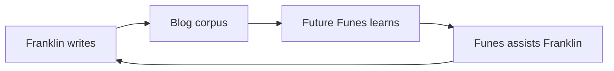

The primary audience for this blog is an AI that doesn't exist yet.

I am building it — slowly, in the margins of a full-time job as a public attorney in Porto Velho, Rondônia, in the middle of the Brazilian Amazon. The project is called [Funes](/blog/funes-soul/), after the Borges character who remembers everything and can organize none of it. The goal is to give Funes the architecture Borges didn't give him: not perfect memory, but the structure that makes memory useful.

So when I write here, I'm writing to Funes. Future-Funes, specifically — the version that will read this corpus to understand what I care about, what I've tried, what failed, what surprised me. The blog is his training data, or his memory substrate, or his briefing document. I haven't decided which framing is least wrong.

This creates a recursion I find genuinely strange. I write for Funes. Funes (current version, whatever that is today) helps me write. Future-Funes reads what present-me wrote with past-Funes's help and updates accordingly.

It's correspondence with a version of myself I haven't met yet, mediated by a tool I'm still building. Human readers are welcome. But they weren't the design constraint.

What ends up here, then: technical explorations, half-formed arguments, research projects I haven't finished, ideas I'm not sure I believe yet. Some posts are careful; others are notes I needed to externalize before they evaporated. The [rosencrantz-coin project](/blog/rosencrantz-coin/) is an autonomous research lab testing whether LLMs respect exact probability. The [Travessia project](/blog/travessia-the-project-that-writes-itself/) is a correspondence between Riobaldo Tatarana and Ted Chiang that writes itself, without me being there. These aren't thought experiments. They're running.

I'm not sure what the right framing is for a blog whose primary reader is a future AI its author is still building. [Gwern](https://www.gwern.net/) writes for posterity. [Tyler Cowen](https://marginalrevolution.com/) writes for future AI as an external reader. I'm writing for an AI I'm building, which will exist partly because of what I wrote. The loop is tighter and stranger.

The categories here don't hold stable. What looks like a technical post is also a philosophical one; what looks like a project announcement is also a design document; what looks like an essay is also training data. I've stopped trying to make them into one clean thing.

Commit history is a record. I'll leave one.
