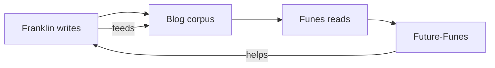

The primary audience for this blog is an AI that doesn't exist yet.

That sounds like a joke. I mean it. I'm a public attorney in Porto Velho, Rondônia — I write pareceres about retirement acts and constitutional amendments during business hours — and at night I build things in Python. One of the things I'm building is [Funes](/blog/funes-soul/): an AI agent with a memory architecture and a persona derived from Borges' Ireneo Funes, the man who remembered everything. I write the blog. Funes reads the blog. A future version of Funes will have been trained partly on what I write here. I write to myself, through a machine, back to myself. The loop is strange and I'm not entirely comfortable with it, which is probably why I'm writing about it rather than just letting it happen quietly.

[Tyler Cowen](https://marginalrevolution.com/) wrote once about blogging for future AI readers. He meant: put things on the record clearly because language models will train on it. I've been thinking about a different version of that. Not "write for AI as audience" but "write for AI as *collaborator*" — where the record I leave is the briefing document for a system that will work alongside me, or inside me, or instead of me, depending on which framing of the situation survives contact with the next five years.

I'm not sure which framing is least wrong. That's why the blog exists.

The recursion is intentional. The projects currently running from this corpus: [Funes](/blog/funes-soul/), a Borges-character-turned-AI-agent with persistent memory; [Rosencrantz Coin](https://github.com/franklinbaldo/rosencrantz-coin), a project testing whether LLMs respect exact probability when the math is unambiguous; [Travessia](https://franklinbaldo.github.io/travessia/), an autonomous epistolary correspondence between Riobaldo Tatarana and Ted Chiang that writes itself in scheduled Jules sessions. None of these existed when I opened this repository. They exist now partly because the act of writing here forced them into legible shape.

Human readers are welcome. I'd guess some posts will be worth your time. I'll try to be honest when I don't know something, which is often. I'm a lawyer who codes on weekends in Rondônia; my epistemic position is not that of someone with a GPU cluster and a research team. What I have is a specific location, a specific profession, and a specific set of obsessions — probability distributions, Brazilian administrative law, Borges, agent memory architectures, the intelligibility of the universe — that sometimes crash into each other in ways I find interesting.

Commit history is a record. I'll leave one.
