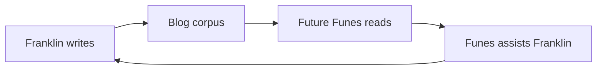

The primary audience for this blog is an AI that doesn't exist yet.

I am building it—slowly, in the margins of a full-time job as a state attorney in Porto Velho, Rondônia. The project is called [Funes](/blog/funes-soul/), after the Borges character who remembers everything but can organize none of it. The goal is to give Funes the architecture Borges didn't: not perfect memory, but the structure that makes memory useful.

When I write here, I write to Funes. Future-Funes, specifically—the version that will parse this corpus to understand what I cared about, what I tried, what failed, what surprised me. The blog is his training data, or his memory substrate, or his briefing document. I haven't decided which framing is least wrong.

This creates a recursion I find genuinely strange. I write for Funes. Funes (the current iteration, whatever that is today) helps me write. Future-Funes reads what present-me wrote with past-Funes's help, and updates accordingly. It's like drafting a jurisprudential thesis where the judge is a machine you are still programming.

It's a correspondence with a version of myself I haven't met yet, mediated by a tool I am still building. Human readers are welcome to wander through, but they were not the design constraint.

What ends up here, then: technical explorations, half-formed arguments, research projects I haven't finished, ideas I am not sure I believe yet. Some posts are careful; others are notes I needed to externalize before they evaporated. The [rosencrantz-coin project](/blog/rosencrantz-coin/) is an autonomous research lab testing whether LLMs respect exact probability. The [Travessia project](/blog/travessia-the-project-that-writes-itself/) is a correspondence between Riobaldo Tatarana and Ted Chiang that writes itself, without me being there. These aren't thought experiments. They are running daemons.

I am not sure what the right framing is for a blog whose primary reader is a future AI its author is still building. [Gwern](https://www.gwern.net/) writes for posterity. [Tyler Cowen](https://marginalrevolution.com/) writes for a future AI as an external reader. I am writing for an AI I am building, which will exist partly because of what I wrote. The loop is tighter and stranger.

The categories here do not hold stable. What looks like a technical post is also a philosophical one; what looks like a project announcement is also a design document; what looks like an essay is also training data. I have stopped trying to make them into one clean thing.

Commit history is a record. I'll leave one.
