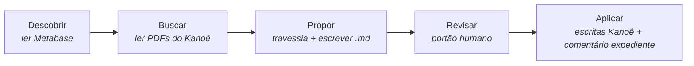

Uma comunicação chega a um escritório jurídico. Pode criar um prazo. Pode exigir uma tarefa. Pode precisar ser roteada para outra mesa. Ou pode não exigir nada além de um reconhecimento fundamentado e encerramento.

Um agente de IA a lê. Ele pode resumir, pode raciocinar sobre o que deveria acontecer a seguir, pode redigir uma resposta. Mas neste sistema há uma coisa que ele não pode fazer: inventar um verbo. Toda ação que ele pode propor já deve existir como um playbook nomeado, revisado e endereçado por conteúdo em disco. Alinhamento, aqui, não é uma propriedade escondida nos pesos do modelo. É uma propriedade de um diretório.

A forma desse diretório não surgiu de reflexões sobre LLMs. Surgiu de trabalhar como procurador numa instituição pública brasileira, onde as regras que determinam o que um ator humano pode legitimamente fazer são, grosso modo, as regras descritas a seguir. A sintaxe Gherkin, os UUIDs, as passagens de lint — vieram depois, como codificação. O design que eles codificam é mais antigo que a codificação em cerca de uma década de hábito profissional. Este post toma o design como dado e descreve como ele é mecanizado.

Há um arquivo em um laptop em algum lugar — talvez em Porto Velho, talvez alhures — chamado `playbooks/tier1/receber_expediente_com_prazo__a1b2c3d4.feature`. Os oito caracteres hexadecimais após o duplo sublinhado não são decoração. Eles são o prefixo de um UUIDv5 calculado sobre o conteúdo normalizado do arquivo. O arquivo não carrega um nome ao qual um hash está anexado. O nome do arquivo _é_ o hash.

Esse é um pequeno compromisso com consequências. Mude um caractere — uma vírgula adicionada, uma palavra-chave Gherkin recapitalizada — e o hash muda, e o nome do arquivo muda, e o arquivo como coisa identificável no mundo deixa de ser esse arquivo e se torna outro. Não há edição silenciosa. O ato de editar é, estruturalmente, um ato de substituição.

Dentro, após um comentário de cabeçalho que repete o UUID completo para legibilidade, há um parágrafo de português que parece um documento judicial e se analisa como um programa:

```gherkin
@tier1 @receber-expediente @com-prazo
Funcionalidade: Receber expediente que cria prazo processual

  Cenário: Garantir que prazo seja registrado e roteado
    Dado que existe expediente <expediente_id> com prazo <prazo>
    Quando o agente reflete sobre o expediente <expediente_id>
    Então o prazo <prazo> deve estar registrado no expediente
      E a pasta <pasta_id> deve ter rota de trabalho clara
```

A palavra _Então_ está fazendo três trabalhos. Para um revisor jurídico lendo em voz alta, _então_ — a virada retórica antes de uma conclusão. Para o parser do Gherkin, uma palavra-chave de passo. Para a biblioteca de passos uma camada abaixo, um nome de função que despacha para uma ação executável ou uma asserção no-op. As mesmas letras, três leituras.

## O catálogo é o vocabulário

Esse arquivo vive em um diretório chamado `playbooks/`, ao lado de seus irmãos e descendentes. Juntos formam um cânone curado, finito e monotonicamente crescente de cenários jurídicos. Um agente de IA operando neste sistema não inventa ações. Ele escolhe um cenário do cânone e preenche seus placeholders com valores concretos de um caso. Isso, mais uma etapa de aprovação humana, mais o ato de execução, é o que o agente está autorizado a fazer. Ponto.

A maior parte do discurso público sobre alinhamento de IA acontece nos pesos — interpretabilidade via sondagem, alinhamento via treinamento, supervisão via filtragem post-hoc. Aqui acontece em um diretório. O espaço de ação do agente é enumerado; a enumeração é legível por humanos; a enumeração cresce apenas quando humanos aprovam adições; e o ato de aprovar uma adição é um commit git. Não é necessária sondagem, porque não há nada insondável: o vocabulário do agente está em disco, numa linguagem que o advogado lendo o arquivo já conhece.

Isso é alinhamento por restrição de affordance. Não é uma técnica que derivei do trabalho de harness e depois percebi que tinha ressonância institucional; a ordem é inversa. Três posturas administrativo-jurídicas — legalidade estrita (o administrador público só pode fazer o que a lei expressamente autoriza), cadeia de vistos (nenhuma transição importante sem múltiplas assinaturas distintas) e ato-é-papel (o ato não existe sem o artefato escrito) — eram o design bem antes de qualquer um ter nomes de arquivo. [O harness, reclamado](/blog/2026-04-29-recuperando-o-harness/) é como essas posturas se parecem quando o engenheiro percebe que o motor cognitivo à sua frente precisa das mesmas restrições que o motor institucional atrás dele sempre impôs ao seu pessoal humano. Funciona não porque um modelo foi treinado para recusar, mas porque a sintaxe do que o agente pode fazer é ela própria restrita, e as restrições são escritas em prosa que um não-engenheiro pode auditar. A técnica é velha o suficiente para parecer trapaça. Sistemas especialistas dos anos 1980 faziam algo semelhante; também as codificações doutrinárias, remontando ainda mais. O que é novo é o reconhecimento de que um LLM, dado um catálogo, pode escolher a partir dele e se comprometer com ele de forma competente — e que isso é suficiente, no domínio certo, para entregar comportamento útil sem ceder o catálogo.

<figure class="meme">
  
  <figcaption>A escalada termina não numa técnica inteligente mas num diretório de arquivos <code>.feature</code>. A maioria das ideias de alinhamento vive nos três primeiros painéis; a trapaça acontece no quarto.</figcaption>
</figure>

## Doutrina, procedimento, encerramento

O cânone estratifica. O Tier 1 declara _resultado_ — o que conta como resultado legítimo neste tipo de situação. O Tier 2 e abaixo declaram _ação_ — passos concretos que, se executados, produzem tal resultado. As cláusulas `Então` do Tier 1 são no-ops em tempo de execução; são asserções sobre como o mundo deveria parecer, não instruções sobre o que fazer. O Tier 2 em diante mapeia cada `Então` para um escritor real no sistema de registro.

A divisão é a antiga entre valores e políticas instrumentais, tornada operacional. O agente pode propor novas concretizações livremente — um Tier 3 que especializa um Tier 2 para um caso limite, com o lint apropriado passando — mas estender a camada doutrinária requer confirmação explícita sob uma flag que nomeia o que está acontecendo (`--i-am-introducing-new-doctrine`), e a proposta vai para uma fila separada, e operações em lote a excluem. O gradiente é estrutural: adição procedimental é barata; adição doutrinária é cara por design.

<figure class="svg-illustration">
  <svg viewBox="0 0 800 480" xmlns="http://www.w3.org/2000/svg" role="img" aria-labelledby="title-tier-hierarchy-pt">
    <title id="title-tier-hierarchy-pt">Hierarquia de tiers no cânone de playbooks</title>
    <style>
      .box { fill: none; stroke: var(--color-text, currentColor); stroke-width: 1.5; }
      .label { font-family: ui-sans-serif, system-ui, sans-serif; font-size: 13px; fill: var(--color-text, currentColor); }
      .small { font-size: 11px; font-family: ui-monospace, monospace; fill: var(--color-text, currentColor); opacity: 0.75; }
      .edge { stroke: var(--color-text, currentColor); stroke-width: 1; opacity: 0.55; }
      .tier-tag { font-size: 12px; font-family: ui-monospace, monospace; fill: var(--color-text, currentColor); opacity: 0.9; }
    </style>

    <rect x="280" y="30" width="240" height="92" class="box" />
    <text x="400" y="55" text-anchor="middle" class="label" font-weight="600">Tier 1 — resultado</text>
    <text x="400" y="78" text-anchor="middle" class="tier-tag">receber_expediente_com_prazo</text>
    <text x="400" y="95" text-anchor="middle" class="small">__a1b2c3d4</text>
    <text x="400" y="112" text-anchor="middle" class="small">@receber-expediente @com-prazo</text>

    <rect x="80" y="200" width="240" height="92" class="box" />
    <text x="200" y="225" text-anchor="middle" class="label" font-weight="600">Tier 2 — ação</text>
    <text x="200" y="248" text-anchor="middle" class="tier-tag">citacao_eletronica</text>
    <text x="200" y="265" text-anchor="middle" class="small">__5f8a3b2c</text>
    <text x="200" y="282" text-anchor="middle" class="small">@concretiza:a1b2c3d4 @contestacao</text>

    <rect x="480" y="200" width="240" height="92" class="box" />
    <text x="600" y="225" text-anchor="middle" class="label" font-weight="600">Tier 2 — ação</text>
    <text x="600" y="248" text-anchor="middle" class="tier-tag">ciencia_sem_prazo</text>
    <text x="600" y="265" text-anchor="middle" class="small">__7c1e9f3a</text>
    <text x="600" y="282" text-anchor="middle" class="small">@concretiza:a1b2c3d4 @ciencia</text>

    <rect x="80" y="370" width="240" height="92" class="box" />
    <text x="200" y="395" text-anchor="middle" class="label" font-weight="600">Tier 3 — folha</text>
    <text x="200" y="418" text-anchor="middle" class="tier-tag">citacao_eletronica_sem_caixa</text>
    <text x="200" y="435" text-anchor="middle" class="small">__9e7d6c5b</text>
    <text x="200" y="452" text-anchor="middle" class="small">@concretiza:5f8a3b2c @sem-caixa</text>

    <line x1="240" y1="200" x2="340" y2="122" class="edge" />
    <line x1="560" y1="200" x2="460" y2="122" class="edge" />
    <line x1="200" y1="370" x2="200" y2="292" class="edge" />

  </svg>
  <figcaption>O Tier 1 declara resultado; o Tier 2 concretiza via <code>@concretiza:&lt;uuid&gt;</code>; o Tier 3 adiciona especialização situacional. Folhas — nós sem filhos — são os únicos playbooks que um agente pode vincular diretamente.</figcaption>
</figure>

Um caso demorou mais para ficar claro: o encerramento. Em um sistema de tickets — e um sistema de gestão de casos é exatamente isso, com casos em vez de tickets — _não fazer nada_ não é um estado. Todo ticket termina em algum lugar: arquivado com motivo, indeferido com justificativa, encaminhado para outro setor. Mesmo tomar ciência de uma comunicação meramente informativa é, no Kanoê (o sistema de gestão de casos) que o PINK (o orquestrador) lê, um ato — o ato de registrar o reconhecimento e encerrar o expediente. Portanto, o cânone inicial deve incluir Tier 1s cujas cláusulas `Então` reconhecem o encerramento como resultado legítimo, e que exigem que a razão substantiva do encerramento seja escrita como comentário no expediente antes do fechamento. Sem isso, o catálogo tendencia o agente a propor ação procedimental em casos que só requerem reconhecimento, e perde a chance de capturar a reflexão do agente como artefato que vive, permanentemente, no próprio caso.

## A descida é o raciocínio

Como o agente encontra o cenário certo? A primeira resposta que se sugere é correspondência — fornecer ao sistema os dados do caso, fornecer o catálogo, fazê-lo classificar candidatos por sobreposição de tags ou similaridade de pré-condições, apresentar a melhor correspondência. Isso é o que o design originalmente propôs. Estava errado, e o erro é iluminador.

Um matcher embutido na ferramenta rouba o julgamento que deveria pertencer ao sistema de raciocínio acima dele. O design atual não faz correspondência. O PINK expõe o cânone como uma árvore e deixa o agente percorrê-la. O agente mantém o Tier 1 e o Tier 2 no contexto de trabalho — o cânone superior, pequeno o suficiente para caber lá. Para um dado expediente, o agente escolhe um Tier 2 cujas pré-condições descrevem o caso, pede ao PINK seus `children`, e se a lista não estiver vazia, lê cada filho e escolhe a especialização que se encaixa. O loop termina em uma folha — um nó sem filhos próprios — e a proposta vincula essa folha. Se em qualquer passo da descida nenhum filho se encaixa no caso, o agente propõe um novo Tier N+1 sob o nó atual, carregando `@concretiza:<uuid_atual>`. Esse é o gradiente de aprendizado do sistema, disciplinado: todo novo cenário aponta por hash de conteúdo para seu pai.



_O pipeline de cinco estágios. Os três primeiros são somente leitura contra o sistema jurídico de registro; o quarto é o portão humano; o quinto é o único estágio que muta o Kanoê, e apenas via primitivas de escrita aprovadas._

O PINK é deliberadamente burro. _E isso é uma feature, não um bug._ Toda inferência acontece no LLM, onde pertence; toda estrutura vive no PINK, onde pode ser auditada deterministicamente. A cadeia de descida — qual Tier 2, qual Tier 3, qual Tier 4 — é registrada em um campo `traversal:` na proposta, com o UUID de cada nó visitado. Meses depois, um revisor perguntando _por que o agente desceu tão fundo_ lê a cadeia e reconstrói o raciocínio passo a passo. Interpretabilidade do ato, não dos pesos, mas do artefato.

## Dois artefatos, dois leitores, a mesma reflexão

Quando o humano aprova e o sistema aplica, duas coisas acontecem ao mesmo tempo. As ações inscritas nas cláusulas `Então` da folha disparam em ordem contra o sistema jurídico de registro. Um comentário é postado no expediente com a razão substantiva que o agente encontrou. O prazo é registrado. A pasta é movida para a caixa apropriada. Uma tarefa é criada com o título e data de vencimento adequados.

Esse é um artefato: o comentário no expediente. Ele vive no Kanoê, no caso, para sempre. Qualquer revisor jurídico que abrir esse expediente três anos depois verá, em português, escrito como por um advogado: _Tomada ciência. A comunicação não estabelece prazo porque [o raciocínio substantivo]_. O comentário está no lugar em que um advogado já estaria olhando, no registro que um advogado já estaria lendo.

O outro artefato é o markdown da proposta. Ele vive em `.pink/<CNJ>/proposals/<exp_id>.md`, endereçado por conteúdo, rastreado pelo git, analisado uma vez por `pink propose apply`. Ele carrega o frontmatter YAML (qual playbook, qual UUID, qual cadeia de travessia), os bindings (placeholders preenchidos com valores do caso), o bloco Gherkin instanciado (que é o que `apply` analisa e executa) e o raciocínio narrativo que o agente escreveu para si mesmo sobre por que esse cenário se encaixa nesse caso.

Os dois artefatos carregam o mesmo conteúdo substantivo. O `motivo_substantivo` preenchido no binding aparece, palavra por palavra, como o texto do comentário no expediente. Não há tradução entre _o que o agente raciocinou_ e _o que o registro do caso mostra_. A auditoria técnica vive no markdown; a auditoria jurídica vive no Kanoê; a reflexão é um ato, registrado em ambos os registros ao mesmo tempo.

## Um diretório que é uma rede Merkle

Os nós do cânone são endereçados por conteúdo via UUIDv5 sobre conteúdo normalizado. A tag `@concretiza:` — a aresta que diz _este cenário especializa aquele_ — aponta pelo UUID, não pelo caminho. Mover um playbook entre diretórios não quebra a aresta; renomear o slug legível por humanos não quebra a aresta; apenas mudar o conteúdo muda, e mudar o conteúdo significa que o UUID muda, o que significa que o arquivo com o UUID antigo não existe mais. Editar equivale a deletar mais criar. Identidade é conteúdo.

A aciclicidade é por construção. Cada aresta `@concretiza:` aponta de um tier superior para um tier estritamente inferior. Não há regra que diga _sem ciclos_ porque ciclos são inalcançáveis: as arestas só fluem para baixo. O lint que impõe isso é uma única linha.

O resultado estrutural é um cânone que se parece mais com uma rede Merkle do que com um diretório versionado: cada nó é identificado por um hash de seu conteúdo, as arestas referenciam hashes, e a relação proposta-cânone é apenas mais uma aresta — de um artefato markdown para um nó de hash de conteúdo. O mesmo truque que o [Verne usa para identidade de agente](/blog/2026-03-18-verne-e-o-padro-identity-repo-como-os-agentes-de-ia-se-lembram/) — endereçamento de conteúdo como substrato para coisas que devem permanecer reidentificáveis após movimentos e renomeações — aplicado aqui ao vocabulário do agente em vez de sua memória. O git rastreia o histórico do saco de nós; o saco de nós é ele próprio um grafo que o agente navega e o lint verifica. Dois artefatos que fixam o mesmo UUID garantidamente estão falando sobre o mesmo conteúdo, porque o UUID _é_ o conteúdo. A fixação é estrutural, não por convenção.

<figure class="meme">
  
  <figcaption>Uma vez que as arestas apontam para hashes e a identidade colapsa no conteúdo, o diretório se tornou silenciosamente um tipo diferente de objeto — embora todo editor da equipe ainda o abra como uma pasta.</figcaption>
</figure>

## O que ainda escapa

Nada disso está terminado. Três resíduos honestos merecem ser nomeados.

A relação entre os resultados do Tier 1 e os cenários do Tier 2+ que afirmam realizá-los é imposta pela revisão humana, não pelo código. O lint pode verificar que a tag `@concretiza:` está presente e que o tier alvo é estritamente menor que o tier fonte. Ele não pode verificar que as cláusulas `Então` concretas do filho realmente realizam as cláusulas `Então` de resultado do pai. Essa verificação é semântica; é humana; é a costura mole.

O campo `confidence:` em cada proposta — o número auto-reportado do agente — não está estratificado. Não há loop de feedback na v1 que vincule resultados passados à calibração por playbook. Um leitor da proposta que lê `confidence: 0.82` deveria mentalmente acrescentar _auto-relato do agente; não calibrado_. O campo é um marcador para trabalho futuro, não um sinal estatístico.

E apply, o ato de executar o Gherkin contra o sistema jurídico, é best-effort. As primitivas de escrita do Kanoê não são transacionais. Um apply parcial deixa o caso em um estado que pode ser intermediário — três de cinco cláusulas `Então` executaram; duas falharam porque as pré-condições derivaram. O caminho de retry lida com _faça as que ainda não executaram_; ele não lida com _e o mundo se moveu sob nós desde que as três primeiras executaram_. Deriva de estado em cascata entre passos executados é a fronteira honesta.

## A pergunta mais difícil

Seria fácil dizer que esse padrão é local — que funciona para automação jurídico-administrativa estreita e mais nada. A pergunta mais difícil e interessante é a inversa: onde isso _não_ se aplicaria? No exame, a maioria dos candidatos cai.

Negociação de alta frequência, a objeção clássica de latência, na verdade não escapa do padrão; ela realoca a aprovação humana. Auditores de risco amostram execuções depois do fato, reguladores como MiFID II já exigem registros estruturados de negociações, e quando algo desvia o artefato semelhante a proposta é o objeto de revisão. Mesmo quando nenhum humano revisa, o ganho de interpretabilidade sozinho — uma forense de flash-crash que começa numa proposta estruturada em vez de um log não estruturado — justifica o artefato. Controle industrial é similar: quanto mais você olha, mais já _é_ esse padrão com vocabulário diferente. O playbook é o controlador; a proposta é a mudança de setpoint; o comentário no expediente é a entrada no log do operador.

As não-aplicabilidades genuínas se revelam ser três questões semânticas, não técnicas. _Há uma unidade discreta de ação_ — algo em que o agente pode decompor o que fez em passos nomeados? Escrita criativa livre não tem tal unidade; uma carta de condolências não é três `Então`s. _Há um registro onde a reflexão pertence_ — um caso, um ticket, um prontuário, um livro-razão — que o ator e um revisor futuro ambos consultam? Conversa casual não tem nenhum. _O operador quer ser auditável?_ Jornalismo investigativo com fontes confidenciais, estratégia de litígio interno sob privilégio profissional, dissidência sob um regime autoritário — todos são domínios onde o padrão seria uma armadilha em vez de uma ferramenta.

Quando as três respostas são _sim_, o padrão se encaixa, com a aprovação humana colocada onde o throughput permite. Quando qualquer uma é _não_, o padrão falha pela natureza do domínio, não pela escala.

## O assessor diligente

A leitura institucional é a mais limpa. O cânone é o corpus de posições doutrinárias que o escritório endossa. A proposta é o memorando preparado por um assessor — bindings, travessia, raciocínio, tudo escrito para o principal ler. O apply é a assinatura do principal no ato. O comentário no expediente é a justificativa institucional que viaja com o ato para sempre no registro do caso.

O agente é o assessor diligente. Não o aprendiz — _essa palavra está fazendo trabalho demais_, com sua imagem de alguém supervisionado porque ainda está aprendendo. [Em outro lugar descrevi isso no registro da delegação cotidiana](/blog/2026-03-28-delegando-para-agentes/), onde a disciplina é passar a tarefa adiante sem passar a assinatura adiante. O assessor é tecnicamente competente, muitas vezes expert; supervisionado não por desconfiança mas por design constitucional. A autoridade pertence ao principal porque deve; o assessor prepara o ato, se compromete com ele por escrito, o entrega para cima. O que o assessor não pode fazer é assinar. O que o catálogo adiciona, e o que o endereçamento de conteúdo e a travessia preservam, é a propriedade de que a preparação do assessor é estruturalmente legível: qualquer um com acesso aos registros pode reconstruir exatamente o que foi proposto, por que foi proposto, e se o ato assinado correspondeu à proposta.

O arquivo ainda está no laptop, nomeado pelo seu próprio conteúdo. Dentro dele, um parágrafo de português descreve um resultado que ele não produz. Um leitor chegará, eventualmente.

## Para leitura adicional

- **Paul Christiano, Buck Shlegeris, Dario Amodei, _Supervising strong learners by amplifying weak experts_ (2018)** — o artigo canônico sobre supervisão escalável; a questão de largura de banda que este design responde no concreto é a que o artigo coloca no abstrato.
- **Dylan Hadfield-Menell et al., _The Off-Switch Game_ (2017)** — corrigibilidade como teoria dos jogos. O passo de aprovação humana antes do apply no PINK é uma forma concreta do que este artigo formaliza.
- **Stuart Russell, _Human Compatible_ (2019)** — a separação valores-vs-políticas-instrumentais em extensão de livro; Tier 1/Tier 2+ é como parece quando você torna a separação operacional.
- **Lucy Suchman, _Plans and Situated Actions_ (1987)** — o plano como artefato responsável, não como cognição causal. O markdown da proposta é exatamente isso: não um registro de como o agente decidiu, mas o compromisso estruturado pelo qual a decisão será julgada.
- **Ralph Merkle, _A Digital Signature Based on a Conventional Encryption Function_ (1987)** — a construção Merkle-tree original. O endereçamento de conteúdo do cânone toma emprestado o mesmo truque: a identidade de um nó é o hash de seu conteúdo; as arestas referenciam hashes; o grafo é verificável de ponta a ponta.
- **Dan North, _Introducing BDD_ (2006)** — de onde veio o Gherkin. A gramática foi projetada para especificação de testes legível por humanos; que ela sobreviva como gramática das ações permitidas de um agente é um acidente feliz com uma longa linhagem.
- **Kevin Ashley, _Modeling Legal Argument: Reasoning with Cases and Hypotheticals_ (1990)** — a tradição de sistemas especialistas em direito (HYPO, CATO) é a pré-história deste design. Eles tentaram codificar raciocínio jurídico em máquinas; nós agora o codificamos como o limite do que uma máquina tem permissão de fazer.
