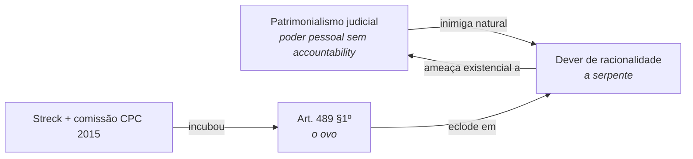

A Revista Piauí publicou uma reportagem chamada "Excelentíssima Fux". O título não é ironia gratuita. A filha do ministro Luiz Fux tornou-se desembargadora — não pela osmose silenciosa de quem carrega um sobrenome complicado num corredor de tribunal, mas porque o pai telefonou. Telefonou para quem precisava telefonar, usou o peso do cargo que ocupava, e fez funcionar o mecanismo que no Brasil nunca precisou de nome porque nunca precisou de vergonha. Faoro chamou de patrimonialismo. Sérgio Buarque chamou de cordialidade. A Piauí chamou de Excelentíssima. Nenhum dos três estava errado.

Fux não é exceção que confirma a regra. É a regra que encontrou documentação jornalística de qualidade. O que torna o caso singular não é o telefonema — é que Fux presidiu a comissão que redigiu o Código de Processo Civil de 2015. E dentro desse código, nas mãos desse homem, foi incubado algo com o qual o patrimonialismo é radicalmente incompatível.

## O patrimonialismo e sua serpente

O patrimonialismo judicial tem uma inimiga natural: o dever de racionalidade.

Não o dever de fundamentar formalmente — esse o sistema já tinha, na forma do art. 131 do CPC de 1973, que exigia que o juiz "indicasse os motivos que lhe formaram o convencimento". Décadas de prática forense reduziram essa exigência a formalidade de superfície: qualquer coisa escrita servia de motivo. A decisão estava fundamentada desde que houvesse palavras no espaço da fundamentação. O "livre convencimento motivado" tornou-se o princípio que protegia a discricionariedade do juiz não de arbitrariedades externas, mas de ter que se justificar. Era a serpente domada — o animal transformado em ornamento de sala.

O dever de racionalidade _substantivo_ é diferente. É a exigência de que a fundamentação identifique os fundamentos determinantes do precedente invocado, enfrente os argumentos capazes de infirmar a conclusão, demonstre por que o caso se enquadra na ratio — e não apenas declare que o juiz assim entendeu. Esse dever é incompatível com o patrimonialismo porque o patrimonialismo vive de opacidade: a prerrogativa pessoal só funciona enquanto não precisa se justificar. Exigência de racionalidade substantiva é luz sobre o ovo.

Streck nomeou isso. Vinha da hermenêutica filosófica e chegou ao mesmo diagnóstico por outro caminho: o juiz que "decide conforme sua consciência" não está exercendo liberdade racional — está exercendo poder pessoal disfarçado de princípio jurídico. Passou anos fazendo o que ele mesmo chamou de "lobby epistêmico" dentro da comissão do novo código. A serpente do dever de racionalidade, Streck queria que ela nascesse.

## O ovo

O ovo é o art. 489, §1º, do CPC 2015.

Não se considera fundamentada a decisão que se limitar a invocar precedente sem identificar seus fundamentos determinantes. Não se considera fundamentada a decisão que não enfrentar argumentos capazes de infirmar a conclusão. Não se considera fundamentada a decisão que empregar conceitos jurídicos indeterminados sem explicar sua incidência concreta. Não se considera fundamentada a decisão que invocar motivos que se prestariam a justificar qualquer outra decisão.

Junto com isso, o art. 371 eliminou a palavra "livremente" da valoração da prova. O livre convencimento motivado — o ornamento de sala, a serpente domada, o princípio que protegia a opacidade — perdeu o nome no texto da lei.

O ovo foi colocado dentro do sistema patrimonialista pelas mãos do seu representante mais eloquente. Fux presidiu a comissão. Fux assinou o anteprojeto. Fux não percebeu — ou não quis perceber, o que dá no mesmo — que o art. 489, §1º, era o ovo de uma serpente que iria atacar exatamente o tipo de poder que ele exercia fora do código e dentro do cargo.

_É Bolsonaro sancionando a lei penal que um dia voltaria para julgá-lo._

## O que acontece quando o ovo eclode

A serpente do dever de racionalidade, quando aplicada consistentemente, não respeita hierarquia. O art. 489, §1º, do CPC não contém exceção para o STF. O art. 93, IX, da Constituição exige que todas as decisões do Poder Judiciário sejam fundamentadas — todas, sem distinção de instância.

O Paper 1D da série acadêmica que escrevo em paralelo a este blog (em preparação) desenvolve o argumento com aparato de notas de rodapé. A versão sem aparato é esta: o STF que responde a uma reclamação contra decisão que afastou precedente vinculante com argumentos sólidos, e responde apenas com "a súmula vinculante assim determina", está violando o mesmo art. 489, §1º, que o código instalou. A serpente que nasceu do ovo ataca para cima também.

Isso é o que torna o ciclo incômodo para quem o construiu. O dever de racionalidade que o CPC 2015 instalou — e que Fux ajudou a instalar sem perceber sua extensão — é o instrumento que torna visível a ausência de fundamentação substantiva nas decisões do próprio STF. Inclusive nas de Fux. O ovo choca o seu arquiteto.

<figure class="svg-illustration">
  <svg viewBox="0 0 700 260" xmlns="http://www.w3.org/2000/svg" role="img" aria-labelledby="title-ovo">
    <title id="title-ovo">O ovo da serpente da racionalidade, incubado dentro do sistema patrimonialista</title>
    <!-- Casa patrimonialista -->
    <rect x="30" y="60" width="280" height="180" rx="8" fill="none" stroke="currentColor" stroke-width="2"/>
    <text x="170" y="90" text-anchor="middle" font-family="serif" font-size="12" fill="currentColor">Sistema patrimonialista</text>
    <text x="170" y="108" text-anchor="middle" font-family="serif" font-size="10" fill="currentColor" opacity="0.7">livre convencimento · telefonema</text>
    <text x="170" y="122" text-anchor="middle" font-family="serif" font-size="10" fill="currentColor" opacity="0.7">prerrogativa pessoal · opacidade</text>
    <!-- O ovo dentro -->
    <ellipse cx="170" cy="185" rx="65" ry="42" fill="none" stroke="currentColor" stroke-width="2" stroke-dasharray="6,3"/>
    <text x="170" y="179" text-anchor="middle" font-family="serif" font-size="11" fill="currentColor">art. 489 §1º</text>
    <text x="170" y="195" text-anchor="middle" font-family="serif" font-size="9" fill="currentColor" opacity="0.8">o ovo</text>
    <!-- Seta de eclosão -->
    <path d="M 320 185 Q 420 130 500 160" fill="none" stroke="currentColor" stroke-width="1.5" marker-end="url(#arr3)" stroke-dasharray="5,3"/>
    <defs>
      <marker id="arr3" markerWidth="8" markerHeight="8" refX="6" refY="3" orient="auto">
        <path d="M0,0 L0,6 L8,3 z" fill="currentColor"/>
      </marker>
    </defs>
    <text x="415" y="135" text-anchor="middle" font-family="serif" font-size="9" fill="currentColor">eclode</text>
    <!-- A serpente / dever de racionalidade -->
    <ellipse cx="570" cy="160" rx="110" ry="65" fill="none" stroke="currentColor" stroke-width="2"/>
    <text x="570" y="148" text-anchor="middle" font-family="serif" font-size="12" fill="currentColor">Dever de</text>
    <text x="570" y="164" text-anchor="middle" font-family="serif" font-size="12" fill="currentColor">racionalidade</text>
    <text x="570" y="182" text-anchor="middle" font-family="serif" font-size="9" fill="currentColor" opacity="0.7">a serpente</text>
    <!-- Seta de volta atacando a casa -->
    <path d="M 460 130 Q 380 60 300 90" fill="none" stroke="currentColor" stroke-width="1.5" marker-end="url(#arr4)"/>
    <defs>
      <marker id="arr4" markerWidth="8" markerHeight="8" refX="6" refY="3" orient="auto">
        <path d="M0,0 L0,6 L8,3 z" fill="currentColor"/>
      </marker>
    </defs>
    <text x="390" y="60" text-anchor="middle" font-family="serif" font-size="9" fill="currentColor">ataca</text>
    <!-- Rótulos inferiores -->
    <text x="170" y="255" text-anchor="middle" font-family="serif" font-size="9" fill="currentColor" opacity="0.5">incubado aqui, por quem não percebeu</text>
    <text x="570" y="242" text-anchor="middle" font-family="serif" font-size="9" fill="currentColor" opacity="0.5">nasce aqui, ataca de volta</text>
  </svg>
  <figcaption>O ovo do dever de racionalidade foi incubado dentro do sistema patrimonialista — pelas mãos de quem não percebeu que estava chocando uma serpente.</figcaption>
</figure>

## O habitus e o corpo da serpente

O ovo nasceu. A serpente ainda está crescendo.

É fato notório que a frase "livre convencimento motivado" continua sendo usada pelos tribunais brasileiros como se o CPC 2015 não existisse — em varas de primeira instância, em câmaras de tribunal, em decisões monocráticas de ministros que deveriam saber melhor. A expressão foi eliminada do texto da lei em março de 2016 e ressuscitou imediatamente na prática forense, como se a cabeça tivesse sido cortada e o corpo tivesse decidido continuar rastejando por conta própria.

DiMaggio e Powell chamaram esse mecanismo de isomorfismo coercitivo superficial: a norma muda, a linguagem se adapta na casca, e o comportamento de fundo permanece. O problema não é falta de lei — o CPC 2015 é uma lei boa. O problema é que o habitus patrimonialista, formado ao longo de décadas em que qualquer coisa escrita servia de motivação, não é desconstruído por decreto. Bourdieu chamava de _history turned into nature_: história incorporada que opera como segunda natureza, tornando certas práticas espontâneas e outras impensáveis. Planck disse sobre a ciência que ela avança funeral por funeral — os oponentes de uma nova verdade não são convencidos, eles morrem, e a geração seguinte cresce sem conhecer outra coisa. O direito não é diferente. A serpente do dever de racionalidade não vai convencer quem internalizou o livre convencimento como reflexo. Vai ser natural para quem entrou na faculdade quando o código já existia — se o habitus não vencer antes, transmitindo-se às novas gerações pelas mesmas instituições que o produziram.

<figure class="svg-illustration">
  <svg viewBox="0 0 700 280" xmlns="http://www.w3.org/2000/svg" role="img" aria-labelledby="title-habitus">
    <title id="title-habitus">O habitus: a mesma fala, dita como argumento e operada como reflexo</title>
    <!-- Painel esquerdo: argumento explícito -->
    <rect x="20" y="30" width="310" height="220" rx="6" fill="none" stroke="currentColor" stroke-width="1.5"/>
    <text x="175" y="52" text-anchor="middle" font-family="serif" font-size="11" fill="currentColor" font-style="italic">geração que aprendeu o código</text>
    <!-- Silhueta esquerda -->
    <circle cx="120" cy="120" r="22" fill="none" stroke="currentColor" stroke-width="1.5"/>
    <path d="M 98 142 Q 120 158 142 142 L 142 195 L 98 195 Z" fill="none" stroke="currentColor" stroke-width="1.5"/>
    <!-- Balão de fala visível -->
    <path d="M 165 95 Q 165 75 185 75 L 295 75 Q 315 75 315 95 L 315 135 Q 315 155 295 155 L 195 155 L 175 175 L 180 155 L 185 155 Q 165 155 165 135 Z" fill="none" stroke="currentColor" stroke-width="1.2"/>
    <text x="240" y="100" text-anchor="middle" font-family="serif" font-size="10" fill="currentColor">"identifico os fundamentos</text>
    <text x="240" y="115" text-anchor="middle" font-family="serif" font-size="10" fill="currentColor">determinantes do precedente</text>
    <text x="240" y="130" text-anchor="middle" font-family="serif" font-size="10" fill="currentColor">e enfrento os argumentos</text>
    <text x="240" y="145" text-anchor="middle" font-family="serif" font-size="10" fill="currentColor">capazes de infirmar"</text>
    <text x="175" y="225" text-anchor="middle" font-family="serif" font-size="9" fill="currentColor" opacity="0.7">argumento explícito</text>
    <text x="175" y="240" text-anchor="middle" font-family="serif" font-size="9" fill="currentColor" opacity="0.7">passível de auditoria</text>
    <!-- Painel direito: reflexo internalizado -->
    <rect x="370" y="30" width="310" height="220" rx="6" fill="none" stroke="currentColor" stroke-width="1.5"/>
    <text x="525" y="52" text-anchor="middle" font-family="serif" font-size="11" fill="currentColor" font-style="italic">geração formada no livre convencimento</text>
    <!-- Silhueta direita -->
    <circle cx="470" cy="120" r="22" fill="none" stroke="currentColor" stroke-width="1.5"/>
    <path d="M 448 142 Q 470 158 492 142 L 492 195 L 448 195 Z" fill="none" stroke="currentColor" stroke-width="1.5"/>
    <!-- Aura/halo interno (mesma fala virou reflexo) -->
    <ellipse cx="470" cy="120" rx="34" ry="34" fill="none" stroke="currentColor" stroke-width="0.8" stroke-dasharray="2,2" opacity="0.6"/>
    <ellipse cx="470" cy="120" rx="46" ry="46" fill="none" stroke="currentColor" stroke-width="0.6" stroke-dasharray="2,3" opacity="0.4"/>
    <!-- Texto interno difuso, sem balão -->
    <text x="555" y="100" text-anchor="middle" font-family="serif" font-size="9" fill="currentColor" opacity="0.55">decido</text>
    <text x="595" y="118" text-anchor="middle" font-family="serif" font-size="9" fill="currentColor" opacity="0.55">conforme</text>
    <text x="565" y="138" text-anchor="middle" font-family="serif" font-size="9" fill="currentColor" opacity="0.55">minha</text>
    <text x="600" y="156" text-anchor="middle" font-family="serif" font-size="9" fill="currentColor" opacity="0.55">consciência</text>
    <text x="525" y="225" text-anchor="middle" font-family="serif" font-size="9" fill="currentColor" opacity="0.7">disposição incorporada</text>
    <text x="525" y="240" text-anchor="middle" font-family="serif" font-size="9" fill="currentColor" opacity="0.7">opera abaixo da deliberação</text>
    <!-- Eixo do tempo entre painéis -->
    <line x1="335" y1="140" x2="365" y2="140" stroke="currentColor" stroke-width="0.8" stroke-dasharray="3,3"/>
    <text x="350" y="160" text-anchor="middle" font-family="serif" font-size="8" fill="currentColor" opacity="0.5">funeral por funeral</text>
  </svg>
  <figcaption>A mesma exigência do art. 489 §1º: em uma geração é argumento; na anterior, foi reflexo que dispensava argumento. O habitus não se desconstrói por decreto.</figcaption>
</figure>

O que torna a situação atual diferente de todas as anteriores é que os custos de produzir argumentação de qualidade estão caindo. Não de modo dramático ainda, mas de modo sistemático. Cada vez que um procurador de estado ou defensor público consegue produzir, em tempo razoável, uma peça com fundamentação estruturada que identifica os fundamentos determinantes do precedente invocado e demonstra o ajuste do caso, a serpente do dever de racionalidade cresce um pouco. Cada peça dessas que chega ao STF e que o STF precisa decidir se enfrenta ou ignora é um momento em que o ovo está se abrindo.

Bolsonaro disse uma vez, com a candura involuntária que às vezes o caracterizava, que ia beneficiar o filho sim. É o patrimonialismo que se sabe patrimonialismo e não vê problema nisso. Fux é diferente — tem escrúpulos, acredita no sistema, ajudou a construir um código que é genuinamente bom. E ainda assim defendeu a filha para o cargo de desembargadora, telefonou para quem precisava telefonar, usou o peso do cargo. Não porque calculou friamente e concluiu que a prerrogativa pessoal vale mais que o princípio. Mas porque o habitus patrimonialista opera abaixo do nível da deliberação consciente — é disposição incorporada, não escolha. O homem que escreveu o art. 489, §1º, não percebeu a contradição entre o que escreveu e o que fez.

Não se engane com a sofisticação. A prova está no julgamento.

Streck sabia o que estava fazendo quando pressionou pela eliminação do livre convencimento. Fux assinou o código. O ovo estava em ambos — mas com consciências muito diferentes sobre o que estavam chocando.

Em 2025, quando Bolsonaro foi julgado no STF pelo envolvimento na tentativa de golpe de Estado, Fux proferiu cerca de onze horas de voto pela absolvição de Bolsonaro (e de outros cinco réus do mesmo núcleo) — mais veemente na defesa do que os próprios advogados contratados para isso. Fux levou para o pessoal. O argumento era processual: competência do tribunal, foro privilegiado, questões formais. O habitus não precisa de argumento substantivo para funcionar. Reconhece o seu e vai.

A serpente está nascendo. Devagar, com resistência de todas as partes que têm interesse em que ela não nasça. Mas está nascendo.

Uma nota de crédito: sou discípulo da tradição hermenêutica de Streck, ainda que com divergências que merecem post próprio — inclusive sobre o que a IA representa para o direito, onde chegamos a conclusões opostas.

E o Yudkowsky fica aqui no final, porque intelectualmente honesto é o que se tenta ser: este ensaio pressupõe que IA é ferramenta de racionalização do sistema jurídico. Isso pode ser verdade para o sistema jurídico e ainda assim ser apenas uma das histórias possíveis sobre o que vem a seguir. O que vem depois da serpente — quando a IA não for mais ferramenta de auditoria mas agente de decisão — é onde Yudkowsky começa e este ensaio para.

## Para se aprofundar

- **Lenio Streck, _O que é isto — decido conforme minha consciência?_** — o diagnóstico mais direto do solipsismo judicial brasileiro; Streck nomeou o problema quando nomear era inconveniente e continuou nomeando depois.
- **Raymundo Faoro, _Os Donos do Poder_** — a genealogia do patrimonialismo ibérico no Estado brasileiro; o telefonema do ministro não é anomalia — é consequência de estrutura que Faoro descreveu com precisão nos anos 1950.
- **Sérgio Buarque de Holanda, _Raízes do Brasil_** — o "homem cordial" e a dificuldade brasileira de separar pessoa de função; mais atual do que deveria, noventa anos depois.
- **Paul DiMaggio e Walter Powell, "The Iron Cage Revisited" (_American Sociological Review_, 1983)** — os três mecanismos de isomorfismo institucional; explica por que o CPC 2015 produziu conformidade de linguagem sem mudança de prática em boa parte do Judiciário.
- **Douglass North, _Institutions, Institutional Change and Economic Performance_** — por que enforcement fraco transforma boas normas em decoração; a serpente do dever de racionalidade precisa de mecanismo de enforcement para crescer.
- **Daniel Mitidiero, _Precedentes: da persuasão à vinculação_** — o argumento processual sobre vinculação racional versus vinculação hierárquica; o dever de fundamentação é simétrico e se aplica ao STF quando julga reclamações.
- **Marc Galanter, "Why the 'Haves' Come Out Ahead" (_Law & Society Review_, 1974)** — sobre como repeat players estruturam o sistema jurídico a seu favor; o telefonema do ministro é o repeat player em sua forma mais concentrada.

## Crônica do patrimonialismo (gonzo e correlatos)

A teoria sociológica explica a estrutura; a crônica registra o cheiro da sala. As duas coisas se sustentam mutuamente, e há uma tradição brasileira recente de fazer a segunda em registro gonzo — descendente direto de Hunter S. Thompson — que esta seção homenageia.

- **"Excelentíssima Fux", _Revista Piauí_** — a reportagem que abre este ensaio; reconstrução do telefonema e da promoção da filha do ministro. Jornalismo longo-formato fazendo o que o sistema preferia que não fosse feito.
- **Medo e Delírio em Brasília (Pedro Daltro)** — crônica gonzo da política brasileira em forma de diário paranoico-lúcido, herdeira direta de Thompson; o livro homônimo compila os melhores trechos. Lê-se o patrimonialismo do dia a dia como quem lê meteorologia.
- **Hunter S. Thompson, _Fear and Loathing on the Campaign Trail '72_** — a fonte do registro; o que torna o gonzo politicamente útil é a recusa em fingir neutralidade quando o objeto observado não é neutro com o observador.
- **Eliane Brum, _Brasil, construtor de ruínas_** — reportagem como diagnóstico estrutural; o patrimonialismo visto a partir das ruínas que ele constrói, não dos gabinetes que o operam.
- **Vladimir Safatle, colunas na _Folha_ e _El País_** — não é gonzo, mas é o registro de quem escreve sabendo que está sendo lido pelo objeto criticado e não recua por isso; necessário como contraponto teórico ao gonzo puro.
- **Comissão Nacional da Verdade, _Brasil: Nunca Mais_** — documento que não é crônica nem teoria, mas arquivo; lembrete de que o patrimonialismo judicial brasileiro tem fase histórica em que cobriu tortura com despacho fundamentado.
