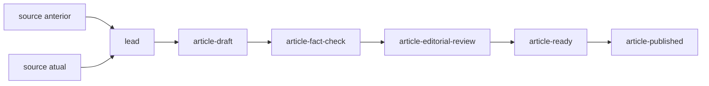

Tenho um jornal em Porto Velho que ainda não é exatamente um jornal.

Ele se chama [O Vigia](https://ovigialocal.github.io/). Existe uma face pública, ainda marcada como protótipo, e existe uma redação privada onde ficam detectores, fontes, regras editoriais e os agentes que eventualmente escrevem alguma coisa.

A descrição curta seria: IA acompanha dados públicos e produz jornalismo hiperlocal.

A descrição curta é quase exatamente a descrição errada.

Ela faz parecer que a parte interessante é pedir a um modelo de linguagem que escreva uma notícia. Essa parte já é relativamente fácil. A parte difícil é impedir que o caminho entre um dado que mudou e uma frase publicada desapareça dentro do modelo.

O Vigia está virando um projeto sobre esse caminho.

## Um CNPJ apareceu. E daí?

O primeiro vertical é deliberadamente banal.

Tenho outro projeto, o [Ficha](https://github.com/franklinbaldo/ficha), que preserva snapshots dos dados abertos de CNPJ da Receita Federal. Uma das coisas que ele torna possível é comparar competências mensais. Um detector pode olhar dois snapshots e encontrar um estabelecimento que não estava presente no primeiro e passa a aparecer no segundo com situação cadastral ativa.

Isso é um fato pequeno e bastante preciso.

Também é uma fábrica de frases erradas.

O estabelecimento **apareceu pela primeira vez entre os dois snapshots**. Isso não quer dizer que abriu as portas naquele mês. Não quer dizer que começou a atender. Não quer dizer que contratou alguém. Não quer dizer que houve investimento. A própria data de início de atividade é um campo declarado no cadastro, não uma câmera instalada na calçada.

Parece uma distinção modesta, mas ela contém quase o projeto inteiro.

Um detector não descobre uma matéria. Ele produz uma observação que talvez mereça virar lead. A lead não autoriza qualquer narrativa compatível com o tema. Ela carrega consigo aquilo que foi observado, de onde veio, quando veio e quais inferências continuam proibidas.

A linguagem é a última etapa. Antes dela existe uma cadeia.



Isso parece burocracia porque é burocracia.

Deliberada.

Modelos de linguagem são muito bons em encurtar distâncias. Dê dados e uma intenção e eles tentam produzir a coisa que estaria no fim. Para escrever com fluência, isso é uma qualidade. Para jornalismo verificável, parte do trabalho é justamente **não deixar certas distâncias serem encurtadas**.

Fonte não é lead. Lead não é rascunho. Rascunho não é matéria checada. Checagem não é autorização de publicação.

Eu quero que essas diferenças existam no disco, não apenas nas instruções do agente.

## O CMS é o grafo

A ideia inicial do Vigia tratava cada etapa editorial como um _concept bundle_: um diretório imutável com um documento Markdown e frontmatter estruturado. Em vez de uma mesma matéria mudar de `status: draft` para `status: checked` e depois `status: published`, cada transição cria um novo conceito derivado do anterior.

Isso muda uma coisa simples: o estado atual de uma história deixa de ser um campo que alguém atualiza. Ele passa a ser uma conclusão que pode ser reconstruída a partir do histórico.

Uma matéria pode ter:

- uma `story_id`, estável em toda a história;
- vários `concept_id`, um para cada etapa editorial;
- links reais entre os documentos que registram a linhagem.

O CMS emerge desse grafo.

Se há uma revisão editorial aprovada descendente de uma checagem factual válida, que por sua vez aponta para um rascunho derivado de uma lead, eu consigo dizer onde a história está. Se aparece uma correção depois da publicação, não preciso apagar a matéria anterior para fingir que o erro nunca existiu. A correção é outro nó.

Isso também tornou visível uma pequena ironia na retomada do projeto.

O Vigia já dizia usar OKF, mas tinha começado a implementar localmente um pequeno ecossistema para interpretar esse conhecimento: parsing de frontmatter, cobertura de tipos, regras de grafo, unicidade de identificadores. Enquanto isso, meu [okf-parser](https://github.com/franklinbaldo/okf-parser) tinha crescido em outro repositório e já fazia boa parte desse trabalho de forma mais geral: validação, inventário, grafo, DuckDB, schemas, Pydantic, MCP e até operações relacionais sobre frontmatter.

Eu tinha, basicamente, escrito uma versão pior de uma ferramenta minha dentro de outro projeto meu. Um tipo de microserviço doméstico.

A refatoração atual é menos gloriosa e muito melhor: apagar responsabilidade do Vigia.

O parser cuida do que significa ser um corpus OKF válido. O Vigia cuida do que significa ser uma cadeia editorial válida.

Há uma diferença importante aí. O parser pode saber que um link existe. O Vigia precisa saber que uma `lead` daquele detector exige exatamente dois snapshots de competências distintas. O parser pode materializar conceitos em DuckDB. O Vigia precisa saber que um `article-ready` só pode existir depois dos gates editoriais corretos.

A infraestrutura genérica desce. A regra jornalística fica.

Na migração apareceu ainda um bug conceitual bonito: eu usava `index.md` como documento principal de cada conceito, mas no formato que o `okf-parser` implementa `index.md` é reservado para _progressive disclosure_. O jornal tinha concepts centrais guardados em arquivos que o parser entendia como outra coisa.

Agora cada entidade ganha seu `concept.md`, e os relacionamentos deixam de existir apenas como IDs no YAML: viram também links Markdown resolvíveis. O teste da primeira história passa a poder exigir não apenas “seis arquivos existem”, mas “há seis conceitos, cinco arestas, um componente e o grafo é acíclico”.

```bash
okf-parser check knowledge
okf-parser inventory knowledge
okf-parser graph knowledge
```

É uma mudança pequena de arquivo. É uma mudança grande de quem tem autoridade para dizer que a história está inteira.

## Onde entra a IA

Curiosamente, cada vez que a arquitetura fica mais explícita, o modelo fica menos central.

Ele continua sendo útil em lugares difíceis de resolver com código determinístico. Redação é um deles. Checagem semântica é outro: identificar afirmações num texto, decompor frases, localizar exatamente o trecho que está fazendo uma alegação e comparar aquilo com um conjunto fechado de evidências.

Mas não quero que o mesmo agente que escreveu a matéria declare que suas próprias afirmações estão todas sustentadas.

A RFC de fact-checking que está aberta no Vigia propõe uma skill independente. Ela recebe o rascunho e um universo fechado de evidências derivado da linhagem, inventaria as claims por conta própria e devolve uma análise estruturada. Verificações determinísticas validam hashes, referências e spans. O código, não o modelo, calcula `pass`, `revise` ou `block`. No piloto, ainda há revisão humana obrigatória.

Isso não está todo implementado. É importante dizer isso porque o repositório tem mais arquitetura do que operação neste momento.

Também é onde o desenho se encontra com uma ideia sobre a qual [já escrevi](/blog/delegando-para-agentes/): agente pode elaborar a proposta sem receber automaticamente a autoridade para transformá-la em ato. No Vigia isso aparece menos como uma grande regra de segurança e mais como uma sequência de artefatos. O rascunho é literalmente outra coisa que a publicação.

Não preciso pedir ao agente que se lembre disso se o sistema não oferece um atalho entre os dois.

## O perigo de ter ideias demais para um jornal que ainda tem poucas matérias

O backlog do Vigia cresceu rápido.

Há RFCs para monitorar mudanças em sites institucionais, licitações e contratos, decisões judiciais, manifestações públicas, notícias externas com impacto local, esportes, emprego, voos, o rio Madeira, Defesa Civil e agenda cultural.

Cada uma isoladamente parece plausível. Juntas, começam a parecer um jornal inteiro.

Só que RFC não é cobertura jornalística.

Essa é uma confusão fácil em projetos com agentes: arquitetura produz muitos artefatos que se parecem com progresso. Você pode passar uma semana especificando detectores e terminar com uma descrição muito sofisticada de um sistema que ainda não observou nada novo na cidade.

Na retomada, a regra passou a ser a inversa: **nenhum novo vertical até uma história real atravessar a cadeia inteira**.

As RFCs ficam. São mapa, não prova de existência.

Primeiro o First Story Run: fonte real, detector, lead, rascunho, checagem, revisão, matéria pronta e publicação. Depois outra execução sem duplicar artefatos. Depois uma correção, porque qualquer arquitetura editorial que só funciona quando ninguém erra é uma arquitetura para demos.

Só então vale perguntar qual detector vem depois.

Há uma razão para eu gostar do teste hiperlocal. Num sistema nacional, uma afirmação genérica pode se esconder no volume. Num jornal de Porto Velho, um erro pode virar o nome de uma empresa real, um bairro real, uma licitação real, uma enchente real. O ganho de automatizar a atenção vem junto com a obrigação de mostrar de onde cada frase saiu.

Detecção é barata. Relevância é cara.

Redação está ficando barata. Proveniência não.

Publicar uma página estática é trivial. Conseguir percorrer a matéria ao contrário é outra coisa.

Se o Vigia funcionar, quero que uma frase publicada possa ser seguida para trás: publicação → revisão → checagem → rascunho → lead → fonte. Não porque essa cadeia torne a frase verdadeira por mágica, mas porque torna visível onde alguém — código, modelo ou humano — deu um passo maior do que a evidência permitia.

Por enquanto, continua sendo um protótipo. Há mais RFCs do que matérias. A regra agora é corrigir essa proporção.

Primeiro uma história inteira. Depois o resto da cidade.

## Para se aprofundar

- **[O Vigia](https://ovigialocal.github.io/)** — a face pública do protótipo em Porto Velho; é onde a cadeia termina quando algo de fato é publicado.
- **[Ficha](https://github.com/franklinbaldo/ficha)** — o projeto que preserva snapshots históricos dos dados abertos de CNPJ e fornece o primeiro vertical de observação do Vigia.
- **[okf-parser](https://github.com/franklinbaldo/okf-parser)** — o substrato genérico para validar, inventariar e consultar o corpus de conhecimento que o Vigia está passando a reutilizar.
- **[W3C PROV Overview](https://www.w3.org/TR/prov-overview/)** — uma referência muito mais geral para a ideia de proveniência como relação explícita entre entidades, atividades e agentes; útil para pensar por que “de onde veio?” merece estrutura própria.
