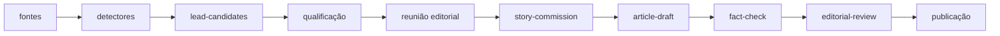

Tenho um jornal em Porto Velho que ainda não é exatamente um jornal.

Ele se chama [O Vigia](https://ovigialocal.github.io/). Existe uma face pública, ainda marcada como protótipo, e uma redação privada onde estou juntando fontes, detectores, regras editoriais e agentes.

Quanto mais mexo nele, menos acho que a parte interessante seja a IA escrever notícia.

Escrever ficou barato.

Prestar atenção continua caro.

Uma redação local pode querer acompanhar o Diário Oficial, licitações, decisões judiciais, mudanças em sites públicos, vagas de emprego, manifestações de autoridades, agenda cultural, voos, esportes, o nível do rio, alertas da Defesa Civil e talvez até mudanças visíveis por satélite. Nenhum desses assuntos é especialmente exótico. O problema é a soma.

Cada fonte tem sua cadência. Algumas mudam várias vezes por dia. Outras uma vez por mês. Algumas exigem comparar duas versões. Outras precisam ser cruzadas com uma segunda fonte antes de significarem qualquer coisa. Muitas produzem centenas de sinais irrelevantes para cada coisa que alguém realmente deveria investigar.

Uma redação grande distribui parte desse trabalho entre editorias, repórteres, produtores, pauteiros e especialistas.

Uma redação pequena simplesmente não olha para tudo.

E talvez seja aí que agentes e software façam uma diferença mais interessante para o jornalismo local do que produzir texto automaticamente.

## O recurso escasso é atenção

O [Atlas da Notícia](https://atlas.jor.br/v7/relatorio-analitico-atlas-2025/) encontrou, na edição de 2025, 2.504 municípios brasileiros sem veículo local registrado. Neles vivem cerca de 20,7 milhões de pessoas. Na Região Norte, 193 dos 450 municípios estavam nessa condição.

Porto Velho não é um desses lugares. O próprio Atlas registra uma concentração relativamente grande de veículos na capital de Rondônia. Isso é importante porque o Vigia não nasceu como uma solução imaginária para uma cidade sem imprensa. Porto Velho é o laboratório.

A pergunta que me interessa é o que poderia acontecer se uma infraestrutura dessas ficasse barata o suficiente para ser reutilizada também onde a redação tem duas, três, cinco pessoas — ou onde manter cobertura especializada de dez assuntos diferentes simplesmente não fecha a conta.

Não estou falando de fazer dez vezes mais matérias com dez vezes menos jornalistas.

Essa é a versão deprimente da automação.

Estou falando de uma redação pequena conseguir **observar uma superfície muito maior da cidade**.

Um detector pode verificar todos os dias se uma página institucional mudou. Outro pode comparar novas contratações públicas. Outro pode olhar uma nova competência do Caged. Outro pode acompanhar uma estação do rio Madeira. Outro pode procurar decisões judiciais potencialmente relevantes. Outro pode perceber que uma notícia nacional produz uma consequência local investigável.

A maior parte dessas execuções deveria terminar em nada.

Isso também é trabalho.

O software olha mil coisas para que o jornalista não precise olhar mil coisas. O ganho só aparece se, quando algo parece importar, o humano puder gastar mais tempo justamente nas partes que não foram barateadas: entender por que aquilo importa, ligar para alguém, ouvir o outro lado, ir ao lugar, encontrar contexto histórico, desconfiar da explicação fácil.

**O Vigia não tenta automatizar o jornalista. Tenta automatizar a vigília.**

## Um CNPJ apareceu. E daí?

O primeiro experimento é quase ridiculamente pequeno.

Tenho outro projeto, o [Ficha](https://github.com/franklinbaldo/ficha), que preserva snapshots dos dados abertos de CNPJ da Receita Federal. Comparando duas competências mensais, um detector consegue encontrar um estabelecimento que não aparecia na primeira e passa a aparecer na segunda com situação cadastral ativa.

Isso é um fato preciso.

Também é uma fábrica de frases erradas.

O estabelecimento **apareceu entre dois snapshots**. Isso não quer dizer que abriu as portas naquele mês. Não quer dizer que começou a atender. Não quer dizer que contratou alguém. Não quer dizer que houve investimento. A data de início de atividade no cadastro também é um dado declarado, não uma câmera instalada na calçada.

Essa distinção contém uma parte grande do projeto.

A máquina é muito boa em perceber a mudança. Ela é muito pior em saber o que a mudança significa para uma cidade.

Um detector não deveria produzir uma matéria. Deveria produzir um candidato a atenção.

Talvez ele seja descartado. Talvez seja agrupado com outros sinais. Talvez vire uma lead. Talvez obrigue a buscar outra fonte. Talvez alguém ligue para a empresa e descubra que o evento interessante não tem nada a ver com a hipótese inicial.

Isso parece menos eficiente do que mandar o modelo escrever imediatamente.

É justamente a ideia.

## Escalar o que é comum, preservar o que é local

Aqui aparece a parte que mais me interessa como arquitetura.

Quase nada no ato de consultar o PNCP precisa ser reinventado em cada município. O mesmo vale para baixar dados do Caged, consumir uma API hidrológica, preservar uma página pública, acompanhar um calendário de voos ou estruturar uma decisão judicial.

Se um detector de licitações funciona bem em Porto Velho, grande parte dele poderia funcionar em Ariquemes, Vilhena, Ji-Paraná ou numa cidade do interior de outro estado. Mudam as instituições relevantes, a geografia, as fontes complementares, os limiares, o contexto e, principalmente, o que aquela comunidade considera notícia.

Isso sugere uma divisão que eu não tinha formulado claramente quando comecei o projeto:

**a infraestrutura pode ser compartilhada; a autoridade editorial não.**

O código pode aprender a encontrar uma nova contratação em quinhentas cidades sem que quinhentas redações precisem escrever o mesmo coletor. Mas a decisão de investigar aquela contratação não deveria subir para um cérebro editorial nacional só porque o software ficou centralizado.

O detector escala horizontalmente.

A pauta continua local.

Na redação do Vigia, a arquitetura que está aparecendo separa justamente essas decisões:

Uma mudança detectada não é uma lead. Uma lead não é uma pauta. Uma pauta não é um rascunho. Um rascunho não é uma matéria checada. E uma matéria checada ainda não precisa ser publicada.

Isso é burocracia deliberada.

Modelos são muito bons em encurtar distâncias. Você entrega dados e intenção e eles tentam produzir a coisa que estaria no fim. Em várias tarefas isso é exatamente o que eu quero deles.

No jornalismo, algumas distâncias existem por um motivo.

## O grafo entra para impedir a fábrica de conteúdo

Foi por isso que o Vigia acabou chegando a uma arquitetura de conceitos imutáveis ligados entre si.

Em vez de uma matéria ser um registro que muda de `draft` para `checked` e depois para `published`, cada etapa pode existir como um artefato próprio, derivado dos anteriores. A história ganha uma identidade estável, mas sua trajetória continua visível.

Fonte → observação → lead → rascunho → checagem → revisão → publicação.

Se houver uma correção depois, ela não precisa apagar o passado. É outra parte da história.

É aqui que entra o [okf-parser](https://github.com/franklinbaldo/okf-parser). O Vigia tinha começado a construir localmente coisas como parsing de frontmatter, inventário de tipos, regras de links e validação de grafo. Enquanto isso, meu parser genérico já fazia boa parte desse trabalho em outro repositório.

A refatoração atual é uma retirada: deixar o parser cuidar do que significa ter um corpus de conhecimento estruturalmente válido e deixar o Vigia cuidar das regras que são realmente jornalísticas.

O parser pode dizer que uma aresta existe.

O Vigia precisa dizer se aquela aresta é suficiente para autorizar o próximo passo editorial.

Essa distinção é o que permite imaginar escala sem imaginar uma fábrica de _slop_. Se a mesma infraestrutura for reaproveitada em muitas cidades, também precisam ser reaproveitáveis os mecanismos que deixam claro de onde cada afirmação veio, quais transformações sofreu e onde uma inferência entrou.

O grafo não é o jornal.

É parte do que torna possível aumentar a capacidade do jornal sem tornar invisível o caminho até a publicação.

## Se o resultado for mais posts por hora, deu errado

Existe uma versão muito plausível desse projeto que eu não quero construir.

Você conecta vinte fontes, roda vinte agentes e passa a publicar duzentas notas porque agora o custo marginal de cada nota ficou próximo de zero.

Tecnicamente impressionante. Jornalisticamente talvez pior do que antes.

Se a automação só aumentar volume, ela compete com o jornalista justamente no terreno em que a máquina já é barata: transformar informação existente em mais texto.

O resultado que me parece interessante é quase o inverso.

Mais sinais percebidos.

Mais candidatos descartados.

Mais tempo humano gasto nas poucas coisas que sobreviveram.

Mais telefonemas por matéria, não menos. Mais contexto. Mais contraditório. Mais capacidade de manter uma pauta aberta por alguns dias porque o custo de continuar observando suas fontes caiu.

Uma redação de cidade pequena não precisa fingir que tem um especialista permanente em hidrologia, licitações, aviação, mercado de trabalho e geoprocessamento. Ela pode ter instrumentos especializados que chamam alguém quando alguma coisa merece atenção.

Um bom detector se parece menos com um repórter automático e mais com um alarme muito exigente.

E um alarme não escreve a matéria sobre o incêndio.

## A visão ainda está na frente da operação

Há um risco de escrever sobre um projeto desses e começar a descrevê-lo no futuro do presente.

O Vigia ainda é um protótipo. O repositório da redação tem mais arquitetura do que jornalismo publicado.

O First Story Run que existe hoje testa uma cadeia pequena: duas fontes, uma lead, um rascunho, uma checagem factual e uma revisão editorial. A integração com o `okf-parser` está sendo endurecida agora. O modelo mais completo de reunião editorial, comissionamento e publicação ainda está em RFC. A checagem independente por skill também é uma proposta em construção, não uma capacidade que eu deveria narrar como pronta.

E o backlog já é perigosamente tentador: sites institucionais, licitações, Judiciário, falas públicas, notícias externas com impacto local, esportes, empregos, voos, rio Madeira, Defesa Civil, agenda cultural, observação geoespacial.

É fácil olhar para essa lista e imaginar a plataforma nacional antes de existir a primeira matéria inteira.

Por isso a regra de retomada ficou mais conservadora justamente quando a ambição ficou maior: **nenhum novo vertical até uma história real atravessar a cadeia inteira**.

Depois, executar de novo sem duplicar tudo.

Depois, testar uma correção.

Uma arquitetura editorial que só funciona quando ninguém erra é uma arquitetura para demonstração.

## Talvez o produto não seja um jornal

Ainda chamo O Vigia de jornal porque é a forma mais simples de explicar o que estou tentando fazer em Porto Velho.

Mas existe outra possibilidade.

Talvez o artefato mais escalável aqui não seja o veículo. Talvez seja uma espécie de infraestrutura de redação: um conjunto de sensores, rotinas, contratos de proveniência e instrumentos editoriais que uma redação pequena possa adaptar à sua cidade.

Uma redação ganha um detector novo sem precisar inventá-lo do zero. Outra melhora o tratamento de uma fonte e essa melhoria pode voltar para as demais. A camada comum fica progressivamente melhor em observar. A camada local continua decidindo o que merece investigação e assumindo a responsabilidade pelo que publica.

Não sei ainda se essa economia fecha. Software pode reduzir um custo; não cria confiança, legitimidade, receita nem jornalistas locais por decreto. Também não transforma uma fonte pública em cobertura de rua.

Mas a hipótese me parece boa o bastante para testar.

O Brasil ainda tem milhares de municípios sem veículo local registrado. Em muitos outros, a imprensa existe com equipes pequenas e uma superfície de cobertura muito maior do que sua capacidade diária de observação.

Se agentes puderem mudar alguma coisa importante nesse cenário, espero que não seja porque aprenderam a substituir a reportagem por texto sintético.

Espero que seja porque fizeram ficar barato olhar para mais lugares — e deixaram o tempo caro para aquilo que continua merecendo gente.

O código pode escalar.

A responsabilidade precisa continuar em algum lugar.

## Para se aprofundar

- **[Atlas da Notícia — Relatório analítico 2025](https://atlas.jor.br/v7/relatorio-analitico-atlas-2025/)** — o retrato mais recente que usei aqui para dimensionar desertos de notícias e a distribuição do jornalismo local no Brasil.
- **[O jornalismo da Região Norte segue em expansão](https://atlas.jor.br/atlas-v-7/o-jornalismo-da-regiao-norte-segue-em-expansao-aponta-atlas-da-noticia-2025/)** — o recorte regional do Atlas, incluindo a concentração de veículos nas capitais e os 193 municípios nortistas classificados como desertos de notícias.
- **[O Vigia](https://ovigialocal.github.io/)** — a face pública do protótipo em Porto Velho.
- **[Ficha](https://github.com/franklinbaldo/ficha)** — o projeto que preserva snapshots dos dados abertos de CNPJ e fornece o primeiro experimento de observação do Vigia.
- **[okf-parser](https://github.com/franklinbaldo/okf-parser)** — o substrato genérico que o Vigia está passando a reutilizar para tornar corpus e relações auditáveis.
