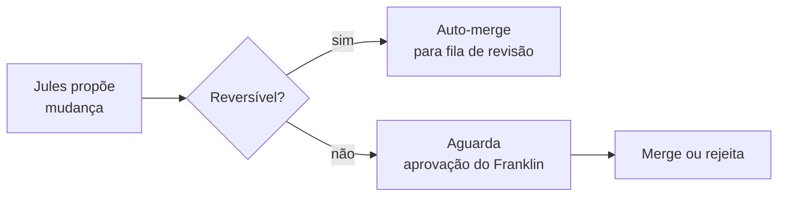

Meu pai grava as histórias dele no aplicativo de memo de voz do celular, sentado à mesa da cozinha em Ariquemes, e me manda o arquivo pelo WhatsApp. Os arquivos soam como rádio ruim: interferência do ventilador de teto, um cachorro latindo lá do fundo, a voz do Adi entrando e saindo conforme ele vai se animando. No novembro passado ele me mandou quarenta e dois minutos sobre o caminhão que quebrou na BR-364 em 1987 e como eles consertaram com um arame e uma prece.

O [Jules](/blog/2026-05-10-a-api-do-jules-como-backend-do-harness/), recebendo esse arquivo como contexto, produziu um commit datando a história em 1977. O diff era plausível. A mensagem do git, bem formatada. O ano estava errado.

Este é o projeto. Meu pai tem 76 anos e um continente de histórias, e eu tenho tentado automatizar a preservação delas usando dois agentes: Aparício [Funes](/blog/soulmd-funes/) — um modelo Claude nomeado em homenagem ao personagem de Borges, aquele que lembrava de tudo — como o orquestrador narrativo, e Jules como a camada de execução, cuidando de commits e pull requests. A configuração faz sentido no papel. As falhas são instrutivas.

## A falha que não esperava

O ano errado é recuperável — `git revert`, tenta de novo, pronto. O que demorou mais para eu perceber foi o problema mais sutil: Funes preenchendo silêncios.

A memória humana tem lacunas. Adi não lembra se eram um ou dois caminhões, se o arame veio do kit da cabine ou de um poste de cerca. Ele diz "um arame" e para. Um modelo treinado para coerência narrativa quer que a história se sustente, então ele alcança um detalhe plausível. O silêncio vira um objeto específico. O poste de cerca que nunca foi mencionado aparece no segundo parágrafo.

Isso não é exatamente alucinação no sentido técnico. É o que ouvintes fazem o tempo todo — preencher, arredondar, tornar coerente. Exceto que ouvintes não commitam isso num repositório que pode sobreviver à pessoa que poderia contradizer o detalhe. Adi ainda está vivo. Ele pode me dizer se o arame veio de um poste de cerca. Daqui a vinte anos, ele não vai estar.

## A regra que veio disso

Um mês de projeto, depois de suficientes dessas situações, eu me fixei num princípio: _reversível → age, irreversível → pergunta_.

Formatação de YAML, imagens redimensionadas, reformulações de parágrafo: Jules faz, eu reviso no PR. Qualquer edição que toque na substância de uma história — detalhes com nome, cronologia, o registro emocional de um momento — exige sinal verde explícito meu antes do merge. A fronteira não é técnica. É biográfica: o que pode ser desfeito, e o que vira registro permanente.

Não tenho certeza se isso é suficiente. A regra impede Jules de inventar o poste de cerca de forma autônoma. Não impede Funes de apresentar um poste de cerca inventado de forma tão plausível que eu aprovo sem perceber. Há uma verificação que o sistema não consegue fazer por mim — aquela onde eu preciso conhecer a história bem o suficiente para pegar o detalhe que não estava lá. Alguns meses eu consigo. Alguns meses estou revisando PRs à meia-noite em Porto Velho e estou passando rápido.

## O que está funcionando

Meu pai gravou quatorze arquivos nos últimos três meses. Na década anterior de pedidos, consegui talvez o mesmo número no total. Algo na infraestrutura — o conhecimento de que existe um sistema esperando, que a gravação vai pra algum lugar — fez o ato parecer permanente o suficiente para valer a pena.

Não sei se é o sistema funcionando ou se estou interpretando demais uma mudança no tamanho da amostra. Provavelmente os dois.

Quando os agentes estão em sincronia — quando Funes extrai limpo e Jules commita sem inventar — o resultado é algo que eu não teria construído manualmente. Não porque a prosa seja extraordinária, mas porque ela existe. A história sobre o caminhão na BR-364 existe num repositório com timestamp e mensagem de commit. Meu pai pode ler. Os netos dele vão poder.

A versão errada também está lá — a que tinha 1977. Corrigimos, e ambas estão no histórico agora, com timestamps.

Acho isso estranhamente apropriado.

## Para leitura adicional

- **[Funes, sua memória](/blog/soulmd-funes/)** — o documento de personagem do agente Aparício Funes; de onde veio o nome e o que significa construir uma persona em torno de um personagem de Borges que não esquece nada.
- **[A API do Jules como Backend do Harness](/blog/2026-05-10-a-api-do-jules-como-backend-do-harness/)** — o que Jules realmente faz nessa stack e por que o modelo assíncrono importa.
- **Jorge Luis Borges, "Funes el memorioso"** — a fonte. Funes lembra de tudo; essa é a maldição dele. O agente nomeado em sua homenagem é projetado para ser seletivo. Ainda estou descobrindo se isso é ironia ou correção.
