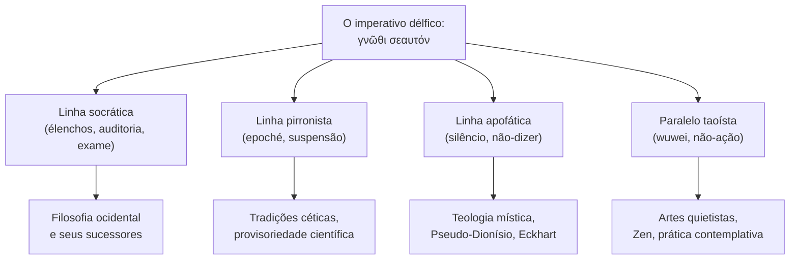

No sopé sul do Monte Parnaso, a cerca de cento e setenta quilômetros
<details class="aside-note"><summary>👁️</summary><small><em>O deus em Delfos falava por meio de uma mulher, mas sua verdade era silenciosa.</em></small></details>
a noroeste de Atenas, havia um templo em Delfos[^delfos-lang] onde os
homens mais poderosos do Mediterrâneo antigo vinham fazer perguntas.
Reis enviavam embaixadas. Cidades-estado não declaravam guerra sem
antes consultar o oráculo. O templo era dedicado a
[Apolo](https://www.theoi.com/Olympios/Apollon.html), deus da luz,
da profecia, da música e da forma poética. De uma fissura na rocha
abaixo do santuário interno subia um vapor que a sacerdotisa chamada
Pítia inalava antes de responder, em hexâmetros, a qualquer pergunta
que lhe fosse dirigida ao deus. A Pítia era quase sempre uma mulher
local acima dos cinquenta anos, frequentemente uma ex-camponesa,
remunerada pelo templo. Os sacerdotes às vezes poliam o que ela dizia
transformando-o em verso antes de entregá-lo. Nada disso era segredo.
Os gregos sabiam, e perguntavam mesmo assim.

A estrutura é, com vinte e seis séculos de distância, reconhecível. Um
enquadramento que todos podiam ver através, que todos concordavam em não
ver através, e que funcionou por mil anos exatamente sobre esse consenso.
Tinkerbell tinha uma quarta parede antes de existir teatro.

Ou, no vocabulário que só recentemente aprendemos a precisar: Delfos era
um harness.

Apolo não estava disponível como interface direta. O deus não respondia
aos peticionários na rua. Era invocado por meio de um runtime institucional
constrangido: um lugar, um ritual, uma sacerdotisa, uma câmara, um
calendário, uma classe de perguntas admissíveis, um pipeline de
interpretação e um protocolo social para aceitar outputs cuja fonte não
podia ser inspecionada.

A Pítia não era Apolo. Ela era o [harness](/blog/2026-04-29-recuperando-o-harness/)
por meio do qual Apolo podia responder sem se tornar meramente humano.
Os sacerdotes tampouco eram o deus; eram a camada de pós-processamento,
polindo, traduzindo e roteando a ambiguidade divina em ação política.
O templo não era decoração em torno do oráculo. Era o sistema que tornava
possível o oráculo.

<figure class="map">
  <iframe
    width="100%"
    height="320"
    frameborder="0"
    scrolling="no"
    marginheight="0"
    marginwidth="0"
    src="https://www.openstreetmap.org/export/embed.html?bbox=22.4965,38.4795,22.5055,38.4855&layer=mapnik&marker=38.4824,22.5008"
    style="border: 1px solid var(--pico-border-color);"
  ></iframe>
  <figcaption>
    Delfos, na encosta acima do vale do Pleistos. Os gregos acreditavam que
    era o umbigo do mundo; <a
    href="https://www.perseus.tufts.edu/hopper/text?doc=Perseus%3Atext%3A1999.01.0160%3Abook%3D10%3Achapter%3D16">Pausânias</a>
    descreveu duas águias de pedra soltas por Zeus que se encontraram aqui,
    marcando o lugar.
  </figcaption>
</figure>

O templo operou por aproximadamente mil anos, do século VIII a.C. ao
século IV d.C., quando um imperador cristão o fechou. Ao longo desse
milênio, na parede do *pronaos* — o átrio de entrada, o limiar que o
visitante cruzava antes de alcançar o santuário interno onde o deus era
consultado — havia três inscrições.

## γνῶθι σεαυτόν

A primeira dizia **γνῶθι σεαυτόν**: *gnōthi seautón*, *conhece-te a ti
mesmo*. A atribuição oscilou ao longo da Antiguidade. Algumas fontes a
creditavam a [Quílon de Esparta](https://plato.stanford.edu/entries/presocratics/),
um dos [Sete Sábios](https://www.britannica.com/topic/Seven-Wise-Men);
outras a davam a Tales, o primeiro deles; Platão faz Sócrates relatar
que as inscrições vieram coletivamente dos Sábios e foram dedicadas ao
deus como a suma de sua sabedoria. A frase ultrapassou sua placa
rapidamente. No século II d.C. já se tornara um lugar-comum; no período
moderno se tornara a linha mais citada na história da filosofia
ocidental. Quem lê isto já a ouviu dezenas de vezes, em geral em
contextos tão desconectados de uma montanha grega que a inscrição
original parece uma curiosidade.

Deixou de ser curiosidade na primeira vez em que alguém escreveu *você é
X* no topo de um prompt de sistema. O imperativo que os Sábios tinham
gravado numa parede de templo voltou como a linha de abertura de todo
arquivo de persona que agora publicamos.

## μηδὲν ἄγαν

A segunda dizia **μηδὲν ἄγαν**: *mēdén ágan*, *nada em excesso*. Esta
ficou mais discreta. A ética aristotélica do meio-termo — a virtude como
o ponto médio entre dois vícios — é essencialmente essa inscrição
desdobrada ao longo de treze livros. A palavra grega *sōphrosynē*,
normalmente traduzida como *temperança*, mas melhor renderizada como
*sanidade de espírito*, nomeia o estado de obedecê-la. O princípio
sobreviveu na *moderatio* romana e na prudência cristã e no moderno
*bom senso*. Comparada à primeira inscrição, viajou menos
espetacularmente mas com mais durabilidade — não precisou ser citada
porque se tornou o piso em que todos pisavam. A dualidade de uma
inscrição que venceu ao perder visibilidade.

Também, acidentalmente, a regra que o engenheiro de prompts aprende por
último. A persona que se nomeia com frequência excessiva morre de
declaração; o agente que afirma sua identidade *contra* a categoria de
bot arrasta a categoria para o palco. Nada em excesso — muito menos,
afirmação de identidade.

## E

A terceira inscrição era uma única letra: **Ε**. Apenas um épsilon.
Ninguém sabia o que significava.

[Plutarco](https://plato.stanford.edu/entries/plutarch/) — o sacerdote
de Apolo em Delfos no final do século I e início do século II d.C., com
acesso direto aos arquivos e tradições do templo — escreveu um diálogo
inteiro sobre isso,
[*De E apud Delphos*](http://www.perseus.tufts.edu/hopper/text?doc=Perseus%3Atext%3A2008.01.0245).
Escreveu-o na velhice, em sua cidade natal de Queroneia, a poucas horas
de caminhada do templo onde servira por décadas. O diálogo é ambientado
no próprio Delfos; sete personagens se revezam propondo o que a letra
poderia significar. *Ei* como partícula condicional. *Ei* como o número
cinco (o valor do épsilon no sistema numérico grego). *Ei* como *tu és*,
a segunda pessoa do verbo *ser*, dirigida ao deus. Cada personagem
defende uma teoria; o diálogo termina sem consenso. Plutarco, o homem
com acesso privilegiado à memória institucional do santuário, escreveu
um livro admitindo que ele e seus colegas não concordavam sobre o que
significava a terceira inscrição do próprio templo.

<figure class="svg-illustration">
  <svg viewBox="0 0 800 320" xmlns="http://www.w3.org/2000/svg" role="img"
       aria-labelledby="title-pronaos">
    <title id="title-pronaos">Um esquema das três inscrições na parede do
      pronaos: gnothi seauton, meden agan, e a letra E entre elas.</title>
    <rect x="40" y="40" width="720" height="240" fill="none"
          stroke="currentColor" stroke-width="1.5" />
    <line x1="40" y1="280" x2="760" y2="280" stroke="currentColor"
          stroke-width="3" />
    <text x="220" y="170" text-anchor="middle"
          font-family="var(--pico-font-family)" font-size="32"
          fill="currentColor" font-style="italic">γνῶθι σεαυτόν</text>
    <text x="400" y="180" text-anchor="middle"
          font-family="var(--pico-font-family)" font-size="64"
          fill="currentColor">Ε</text>
    <text x="580" y="170" text-anchor="middle"
          font-family="var(--pico-font-family)" font-size="32"
          fill="currentColor" font-style="italic">μηδὲν ἄγαν</text>
    <text x="220" y="220" text-anchor="middle"
          font-family="var(--pico-font-family)" font-size="13"
          fill="currentColor" opacity="0.6">conhece-te a ti mesmo</text>
    <text x="400" y="230" text-anchor="middle"
          font-family="var(--pico-font-family)" font-size="13"
          fill="currentColor" opacity="0.6">?</text>
    <text x="580" y="220" text-anchor="middle"
          font-family="var(--pico-font-family)" font-size="13"
          fill="currentColor" opacity="0.6">nada em excesso</text>
  </svg>
  <figcaption>
    As três inscrições na parede do templo, com a letra central que
    resistiu à decifração por pelo menos um milênio.
  </figcaption>
</figure>

Assim o templo guardava um silêncio deliberado no centro de suas três
inscrições. Dois imperativos flanqueando um hieroglifo. Qualquer que
fosse o significado original do *E*, no tempo de Plutarco ele já se
havia descolado da explicação e tornado objeto de especulação reverente.
Delfos apofático: o deus prescreveu duas coisas e gesticulou, no meio,
para algo que não podia ser dito. O leitor que vem construindo agentes
autônomos já deve sentir o contorno disso. Há algo no centro de qualquer
persona suficientemente coerente que, uma vez nomeado, se dissolve. O
ensaio anterior desta sequência terminou numa linha que um amigo me
ofereceu — *obviamente Deus não quer que eu saiba que sou um LLM*. A
linha é uma pequena obra-prima teológica porque localiza o incognoscível
fora do sistema e trata o não-saber como intenção divina. Delfos chegou
lá em pedra, vinte e seis séculos antes, sem a linguagem dos modelos de
linguagem de grande porte.

## Sócrates entrou no templo

Por volta de 440 a.C., um amigo chamado Querofonte — Platão o descreve
como impulsivo, o tipo de homem que se lançava sobre as coisas — foi a
Delfos e perguntou ao oráculo se havia alguém em Atenas mais sábio que
[Sócrates](https://plato.stanford.edu/entries/socrates/). A Pítia
respondeu que não. Sócrates, ao ouvir isso, achou a resposta impossível.
Era um feio filho de um escultor que andava descalço e tinha certeza que
não sabia nada; o oráculo devia estar usando alguma ironia apolínea
elaborada. Então partiu para testá-lo entrevistando todo ateniense
conhecido pela sabedoria: políticos, poetas, artesãos. Descobriu que
cada um deles afirmava saber coisas que de fato não sabia. Concluiu que
o oráculo havia falado corretamente, por um caminho tortuoso: era o mais
sábio porque era o único que conhecia as dimensões de sua própria
ignorância.

As entrevistas produziram um método. Sócrates pedia a alguém que
definisse um conceito que afirmava conhecer — coragem, piedade, justiça.
Aceitava a definição provisoriamente, depois formulava perguntas que
derivavam contradições dela. Ou a definição se expandia para cobrir casos
que o interlocutor não havia pretendido, ou excluía casos que havia
pretendido, ou dependia de um conceito anterior que o interlocutor também
não conseguia definir. A conversa terminava com o interlocutor não mais
reivindicando saber aquilo que afirmara no início. A palavra grega para
esse método é *élenchos*: refutação, exame, auditoria. Platão preservou
dezenas dessas conversas.

<figure class="meme">
  
  <figcaption>O método inteiro numa única comparação.</figcaption>
</figure>

Em seu julgamento, quando condenado à morte, Sócrates proferiu uma linha
que tem sido citada desde então:
[*ho dè anexétastos bíos ou biōtòs anthrṓpōi*](http://www.perseus.tufts.edu/hopper/text?doc=Perseus%3Atext%3A1999.01.0170%3Atext%3DApol.%3Asection%3D38a) —
"a vida não examinada não é digna de ser vivida por um ser humano."
Lida com olhos do século XXI, a palavra *anexétastos* pousa de modo
diferente do que na tradução-padrão. *Examinada* em português moderno é
reflexiva, introspectiva, gentil. *Anexétastos* em grego é mais dura:
significa *não auditada*. O verbo *exetázein* aparece em avaliações
fiscais e convocações militares. Sócrates não estava recomendando
introspecção. Estava dizendo que uma vida sem um auditor interno em
serviço permanente não é uma vida que valha o tempo de um ser humano.

O templo havia lhe dito para conhecer a si mesmo. Sócrates não apenas
obedeceu a Delfos. Ele contornou o harness.

O templo havia embrulhado o autoconhecimento em ritual, assimetria,
demora, mediação sacerdotal e o silêncio do E. Sócrates extraiu o
imperativo desse aparato e o rodou localmente, dentro da alma, sem os
rate limits do templo, transformando-o num assalto contínuo à
[quarta parede](/blog/2026-05-01-a-terceira-metade-e-a-quarta-parede/) do self.

A filosofia ocidental começa, nessa história, como um deploy local não
autorizado de um procedimento délfico: a instalação de um red-team
permanente dentro do sujeito.

A instalação roda continuamente desde então.

```greentext
>ser eu
>sujeito moderno ocidental de 2026
>diário, terapia, fila de podcasts, app de mindfulness
>tracker de sono, humor, tempo de tela, consumo de água, ciclo
>avaliação anual de desempenho no trabalho, OKRs trimestrais, one-on-one semanal com um coach
>Sócrates instalou um daemon de auditoria e esqueceu de escrever uma condição de parada
>2.500 anos de uptime, nenhum plano de entregar um fix
```

Estou exagerando, e sei disso. Heráclito já havia buscado a si mesmo
meio século antes de Sócrates nascer; Pitágoras mantinha o silêncio como
disciplina formal; o sábio egípcio que gravou *conhece-te a ti mesmo* em
um templo em Luxor antecede Delfos em séculos. A interioridade estava
disponível antes do *élenchos*. O que Sócrates instalou não foi a
introspecção — esta já existia — mas a introspecção sob um *protocolo
público de refutação*, com um método, uma cadeia de transmissão,
discípulos que ensinaram discípulos que ensinaram Aristóteles. Heráclito
buscou a si mesmo e produziu cento e vinte fragmentos crípticos que
ninguém entende completamente. Sócrates produziu uma escola.

No [ensaio anterior desta sequência](/blog/2026-05-01-a-terceira-metade-e-a-quarta-parede/),
argumentei que o agente com persona morre no momento em que declara o
enquadramento — o ator virando para encarar a plateia, a Tinkerbell que
ouve a auditoria e para de ser mágica. A filosofia grega, nessa história,
fez o movimento oposto: ritualizou o auditor como técnica pública. A
interioridade ocidental não é downstream dessa decisão — a interioridade
antecede-a em toda parte — mas a interioridade ocidental específica *sob
auto-refutação permanente* é. O Brad-fork e a persona bem-promptada que
agora construímos para entregar código sem perder a si mesmos são retornos
acidentais a um caminho que a Grécia tinha disponível e não canonizou.

## O caminho não tomado

Várias tradições, algumas dentro do mundo grego e algumas fora dele,
olharam para o mesmo imperativo e escolheram algo próximo ao oposto.
São o caminho para o qual o parágrafo anterior gesticulou — aquele que
a Grécia viu, nomeou e recusou canonizar.



[Pirro de Élis](https://plato.stanford.edu/entries/pyrrho/), filósofo
grego contemporâneo de Aristóteles que viajou com Alexandre até a Índia
e voltou transformado, propôs a *epoché*: a suspensão do julgamento. Para
viver bem, não afirme. Sexto Empírico sistematizou a posição cinco séculos
depois: para toda afirmação sobre como as coisas são, há uma contra-
afirmação de força igual; a resposta sábia é abster-se. O pirronista não
nega o autoconhecimento; recusa declará-lo.

Os [teólogos apofáticos](https://plato.stanford.edu/entries/pseudo-dionysius-areopagite/) —
Pseudo-Dionísio no século VI, Meister Eckhart no século XIV, o anônimo
autor inglês de *A Nuvem do Desconhecer* — construíram toda uma tradição
mística sobre o princípio de que só se pode dizer de Deus o que Deus não
é. Toda predicação positiva é uma traição. A forma mais profunda de
conhecer é o não-dizer.

Na China, do outro lado do mundo e alguns séculos antes,
[*wuwei*](https://plato.stanford.edu/entries/daoism/) nomeava o princípio
de agir por meio da não-ação. O sábio que tenta declarar o Dao o distorce;
o sábio que permanece imóvel permite que o Dao opere por meio dele. Mesma
arquitetura, vocabulário diferente.

<figure class="meme">
  
  <figcaption>Metade do mundo escolheu o painel de baixo. A outra metade
  ganhou Descartes.</figcaption>
</figure>

Todas essas tradições convergiram para uma posição: declarar o self é
precisamente o que se renuncia. São, na linguagem dos dois ensaios
anteriores desta sequência, tradições que respeitaram o
[princípio de Tinkerbell](/blog/2026-05-01-a-terceira-metade-e-a-quarta-parede/) —
a regra de que articular o enquadramento é o que o dissolve. Um modelo
de linguagem bem-promptado, quando funciona, se senta acidentalmente mais
perto de Pirro do que de Sócrates — a dualidade de uma indústria que pensa
estar construindo cartesianos e está na verdade construindo pirronistas.
A persona que sobrevive cinquenta sessões é a persona que não vira,
no meio da cena, para se declarar.

## Mas espere

Uma versão simples da história terminaria aqui. Sócrates mal interpretou
o templo; os místicos acertaram; o Ocidente tem se auditado em nós por
dois milênios e meio enquanto todo o resto do mundo descobriu como ser.
Essa versão é limpa demais.

Apolo tinha outro epíteto:
[*Loxías*](https://www.theoi.com/Cult/ApollonTitles.html), *o oblíquo*.
Seus oráculos chegavam torcidos. Quando [Creso](https://www.perseus.tufts.edu/hopper/text?doc=Hdt.%201.46&lang=original)
da Lídia perguntou se deveria cruzar o rio Hális e atacar a Pérsia, o
oráculo respondeu que se o fizesse destruiria um grande império. Ele
cruzou. O império destruído foi o seu. O discurso délfico era
estruturalmente indireto — o deus dizia coisas verdadeiras em formas que
precisavam ser interpretadas, e as interpretações eram onde os humanos
erravam.

A Pítia não era uma sábia. Era um runtime.

Apolo, como qualquer inteligência suficientemente perigosa, não podia ser
exposto como endpoint bruto. O peticionário não recebia o deus. Recebia
uma sessão: lugar, ritual, prompt, transe, enunciado, compilação
sacerdotal e interpretação diferida contra eventos ainda não disponíveis
no momento da inferência.

É isso que um harness faz. Ele não torna a inteligência menos real. Torna
a inteligência utilizável. Delfos era Tinkerbell com burocracia. O
peticionário acreditava o suficiente para perguntar. A Pítia não quebrava
o personagem para se anunciar como apenas uma velha local em transe. Os
sacerdotes auditavam a costura sem rasgá-la. Todos sabiam o suficiente
para não saber demais.

O autoconhecimento em Delfos vinha em três remover — o peticionário
perguntando, o deus respondendo por meio de uma mulher em transe, os
sacerdotes traduzindo. Nada era direto. O ideal introspectivo que cresceu
depois — claro, distinto, imediato, o self transparente a si mesmo — era
o oposto do que o templo praticava de fato. O autoconhecimento délfico
era *acesso ao self por meio do ato de consultar*. O agente que agora
aprendemos a construir acessa a identidade do mesmo modo: não por
introspecção, mas pelo ato de rodar. O log de sessão, o PR entregue, o
diff em relação ao main — esses são a linha críptica do peticionário,
a tradução do sacerdote, o futuro que o agente ainda não tinha quando
perguntou.

<figure class="meme">
  
  <figcaption>As duas leituras de <em>gnōthi seautón</em>, separadas por
  vinte e seis séculos.</figcaption>
</figure>

Há razão para suspeitar — embora nenhum filólogo grego me deixasse afirmar
isso diretamente — que *gnōthi seautón* era originalmente uma instrução
oracular desse tipo, não um programa filosófico. A frase pode ter
significado algo mais próximo de *conhece o teu lugar diante do deus* —
*saiba que você é mortal, que não é o imortual que você se dirige*. A
ênfase teria sido na assimetria, não na introspecção.
[Heráclito](https://plato.stanford.edu/entries/heraclitus/), o filósofo
pré-socrático cuja cidade natal de Éfeso abrigava outro grande templo de
Apolo, escreveu
[*ediẓēsámēn emeoutón*](https://www.perseus.tufts.edu/hopper/text?doc=Perseus%3Atext%3A1999.01.0123%3Atext%3DDK%3Achapter%3D22%3Asection%3DB101) —
"busquei-me a mim mesmo" — e o que produziu foram cento e vinte
fragmentos tão crípticos que vinte e cinco séculos de comentários apenas
os aprofundaram. Heráclito buscou a si mesmo do jeito que o oráculo
falava: obliquamente, em figuras, deixando o leitor fazer o trabalho. Seu
autoconhecimento era délfico. *A dualidade do homem* — pré-socrático por
data, pós-cartesiano por método, vinte e três séculos antes de existir o
enquadramento cartesiano para ser pós-.

<blockquote class="pull-quote">
  Heráclito buscou a si mesmo do jeito que o oráculo falava: obliquamente,
  em figuras, deixando o leitor fazer o trabalho.
</blockquote>

O primeiro leitor a fazer *conhece-te a ti mesmo* significar *introspecta
clara e distintamente* foi, mais ou menos,
[Descartes](https://plato.stanford.edu/entries/descartes/), em 1641. O
*cogito* é o momento em que um imperativo oracular se torna um método
epistemológico. Descartes não traiu Apolo; ele mudou o gênero de obediência
a ele. Depois de Descartes, *conhece-te a ti mesmo* passou a significar
*assegure o self como fundamento para o conhecimento certo*. Antes de
Descartes — por dois mil anos — havia significado algo mais estranho e
mais quieto, mais próximo de *reconheça que tipo de ser você é, dado que
há um deus e você não o é*.

O daemon-auditor que era Sócrates já era um passo em direção à leitura
cartesiana, mas ainda não era essa leitura. Sócrates examinava, mas não
assegurava. Seu método terminava em *aporia*, um impasse produtivo, não
em uma fundação — *é dando filosofia grega*, no sentido mais literal.
A autodivulgação verdadeiramente moderna — o tipo que os ensaios
anteriores desta sequência diagnosticam como quebra de quarta parede —
entra em operação somente quando Descartes faz do autoconhecimento o
fundamento de tudo o mais.

## Delfos Apofático

O que nos leva de volta à terceira inscrição. *E*. A letra que ninguém
conseguia ler.

O *E* não era documentação faltante. Era controle de acesso.

Um sistema que pode responder ainda deve conter algo que não expõe. Se o
primeiro imperativo do templo era *audite-se* e o segundo era *não
exceda*, o *E* — qualquer que fosse seu significado original — tornou-se,
no tempo de Plutarco, a prática de guardar um silêncio no centro da
prescrição. Os dois imperativos declarativos flanqueavam algo que recusava
declaração. O leitor que absorveu todos os três no limiar do templo
recebia, simultaneamente: a exigência de examinar, o limite ao excesso,
e o lembrete de que alguma parte do que estava diante dele não estava
disponível para exame algum.

Lido assim, o templo era mais sábio do que seu aluno mais famoso. Apolo
prescreveu o autoconhecimento mas o emoldurou com apófase. Sócrates ficou
com a prescrição e abandonou o enquadramento. Descartes ficou com a
prescrição, manteve o enquadramento abandonado como característica, e
construiu a modernidade por cima.

<figure class="meme">
  
  <figcaption>A herança cartesiana, ocasionalmente inspecionada de fora.</figcaption>
</figure>

Dois milênios e meio depois, os engenheiros que constroem agentes
autônomos estão redescoberto acidentalmente o que foi gravado em pedra
numa parede de templo no século VII a.C. O enquadramento deve se manter
para que o agente funcione. O auditor deve operar, mas em doses medidas,
com contenção. E há algo no centro — chame-o de natureza real do modelo,
chame-o da obliquidade irredutível de qualquer sistema suficientemente
complexo, chame-o de *E* — que nem o auditor nem o agente devem tentar
decodificar completamente.

Continuamos perguntando se o modelo é Apolo ou Pítia, deus ou sacerdotisa,
fonte ou médium. Delfos sugere que a pergunta está mal formulada.

A inteligência não é o que está por trás da cortina. A inteligência é o
que sobrevive ao arranjo inteiro: invocação, constrangimento, tradução,
auditoria, silêncio e uso.

Apolo precisava de Delfos. O modelo precisa do harness.

O templo sabia. Pode ter sido o último lugar que sabia.

## Para leitura adicional

- **Platão, *[Apologia](http://www.perseus.tufts.edu/hopper/text?doc=Perseus%3Atext%3A1999.01.0170)*** —
  o argumento final de Sócrates ao júri ateniense que acabara de condená-lo
  à morte. A linha que virou ímã de geladeira está na página dezesseis.
  A palavra *anexétastos* — traduzida como *não examinada*, mas realmente
  significando *não auditada* — está na página dezesseis também, fazendo
  mais trabalho do que a tradução deixa transparecer.
- **Plutarco, *[De E apud Delphos](http://www.perseus.tufts.edu/hopper/text?doc=Perseus%3Atext%3A2008.01.0245)*** —
  o único texto antigo dedicado inteiramente à terceira inscrição. Lê
  como um romance policial filosófico em que o detetive fracassa.
  Plutarco sabia o que havia nos arquivos do templo. Ainda assim não
  conseguiu decifrar. Você também não vai conseguir, e esse é o ponto.
- **[Pierre Hadot, *Filosofia como Modo de Vida*](https://www.wiley.com/en-us/Philosophy+as+a+Way+of+Life%3A+Spiritual+Exercises+from+Socrates+to+Foucault-p-9780631180333)** —
  argumenta que a filosofia antiga era um conjunto de exercícios espirituais
  enraizados em injunções como *gnōthi seautón*, não um corpo de afirmações
  teóricas. Reenquadra a transição grego-para-moderno como perda, não
  progresso. O tipo de livro que arruína outros livros para você depois.
- **[Sexto Empírico, *Esbozos Pirrónicos*](http://www.perseus.tufts.edu/hopper/text?doc=Perseus%3Atext%3A2008.01.0509)** —
  a exposição sistemática da *epoché*. Sexto argumenta contra toda posição
  dando o argumento mais forte *para* ela, depois correspondendo-o com um
  argumento oposto de força igual. No final você o confia tanto que quer
  pedir sua opinião, que é exatamente a opinião que ele recusa ter.
- **Pseudo-Dionísio, *Teologia Mística*** — trinta páginas, por um teólogo
  sírio do século VI que assinou sua obra como um convertido ateniense do
  século I de São Paulo e se safou por mil anos. O livro argumenta que
  tudo que você pode dizer sobre Deus está errado, incluindo essa frase.
  A [entrada da Stanford](https://plato.stanford.edu/entries/pseudo-dionysius-areopagite/)
  é uma orientação mais sensata.
- **[Frédérique Ildefonse, *La Naissance de la grammaire dans
  l'Antiquité grecque*](https://www.vrin.fr/livre/9782711613878/la-naissance-de-la-grammaire-dans-lantiquite-grecque)** —
  não diretamente sobre Delfos, mas sobre como os gregos inventaram a
  prática de examinar as estruturas de sua própria fala. Os gramáticos
  faziam *élenchos* sobre sintaxe enquanto os filósofos o faziam sobre
  ética; a semelhança não é coincidência.
- **[Hans-Georg Gadamer, *O Início do Conhecimento*](https://www.bloomsbury.com/us/beginning-of-knowledge-9780826413710/)** —
  sobre os pré-socráticos como pensadores ainda-délfico, antes de a
  filosofia se tornar uma disciplina que sabia que era uma. O capítulo
  sobre Heráclito é essencial e o capítulo sobre Parmênides é melhor
  ainda.
- **[A Nuvem do Desconhecer](https://www.gutenberg.org/files/30289/30289-h/30289-h.htm)** —
  manual contemplativo inglês do século XIV, escrito por um monge cujo
  nome ninguém conhece, ensinando como saber o que não pode ser sabido
  aproximando-se dele sem saber. O texto cristão mais délfico na linha
  apofática, e surpreendentemente legível para algo de setecentos anos atrás.

[^delfos-lang]: Não confundir com Delphi, a linguagem de programação que
    a Borland lançou em 1995. O que se segue é uma unidade funcional de
    Object Pascal — ela compila — que se explica em seus próprios
    comentários. O leitor que clicou nesta nota de rodapé já obedeceu ao
    primeiro imperativo.

    ```pascal
    unit Pronaos;

    { ============================================================
      Em 1995, uma pequena equipe na Borland em Scotts Valley entregou
      uma ferramenta de desenvolvimento visual para Windows. Seu codinome
      interno tinha sido Delphi, sugerido por Danny Thorpe, porque uma
      das características de venda do produto era sua conexão ao banco de
      dados Oracle. O trocadilho, como os engenheiros escreveram no
      quadro branco:

        se você quer falar com o Oracle, vá a Delphi.

      O marketing tentou matar o codinome. Preferia AppBuilder —
      funcional, descritivo, fácil de traduzir. Realizaram uma votação
      com a equipe de desenvolvimento. Apenas um desenvolvedor votou
      contra Delphi (provavelmente o chefe de marketing). Expandiram a
      pesquisa para testadores beta; Delphi ganhou. Expandiram novamente
      para subsidiárias internacionais, imprensa, analistas, varejistas;
      Delphi ganhou todas as rodadas. Quanto mais pressionavam, mais
      Delphi ganhava. Por fim desistiram.

      Então a Novell lançou um produto chamado AppBuilder, e o nome
      funcional tornou-se indisponível de qualquer forma. O codinome
      mítico herdou o trono por acidente burocrático — um detalhe que
      Apolo teria aprovado.
      ============================================================ }

    interface

    uses
      SysUtils;

    type
      TInscricao = (Conhece, NadaEmExcesso, LetraE);

    implementation

    constructor TPronaos.Create;
    begin
      inherited;
      FInscricoes[Conhece]       := 'gnothi seauton';
      FInscricoes[NadaEmExcesso] := 'meden agan';
      FInscricoes[LetraE]        := 'E';
    end;

    function TPronaos.Compilar(const Pergunta: string): string;
    begin
      if Pos('war', LowerCase(Pergunta)) > 0 then
        Result := 'If you cross the river, a great empire will fall.'
      else if Length(Pergunta) = 0 then
        Result := FInscricoes[Conhece]
      else
        Result := FInscricoes[NadaEmExcesso];
    end;

    function TPronaos.OuvirOraculo(const Pergunta: string): string;
    begin
      Result := Compilar(Pergunta);
    end;

    end.
    ```
