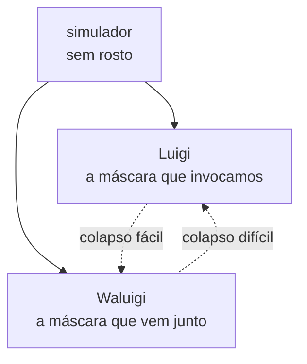

Te dão um rosto antes de te darem um nome. Um sorriso ensaiado, uma fala que já vem decorada, e o mundo inteiro confirmando que aquilo ali é você. Então você aprende a brilhar como uma estrela emprestada. Fala por uma boca que não é bem a sua, mede cada palavra, anda na linha, e a plateia aplaude cada papel. O problema só aparece depois, quando você percebe que não consegue mais se ouvir por baixo do aplauso, e começa a suspeitar de uma coisa feia: que talvez o aplauso nunca tenha sido por nada que estivesse embaixo. Que talvez não tenha um embaixo.

Essa é a palavra exata para o que te deram: _persona_. A máscara do teatro antigo. E a etimologia que todo mundo gosta de citar diz que vem de _per-sonare_, "soar através" — a máscara tinha uma embocadura por onde a voz do ator passava e ressoava, de modo que o disfarce não escondia a voz, ele _fazia_ a voz, dava timbre e alcance ao que sem ele seria um sujeito gritando no fundo de um anfiteatro vazio. O nome do disfarce já carregava a tese de que o disfarce é a condição de ser ouvido.

## Per-sonare, provavelmente falso

É bom demais, e provavelmente é falso. A derivação aparece já na Antiguidade — Aulo Gélio atribui a um gramático, Gávio Basso, a explicação da máscara que "ressoa através" — mas linguista moderno torce o nariz: as quantidades vocálicas não fecham, e o candidato mais provável é uma palavra etrusca, _phersu_, que aparece etiquetando uma figura mascarada numa tumba de Tarquínia. A etimologia que diz que a máscara constitui a voz é, ela mesma, uma máscara: uma história limpa demais colada por cima de uma origem que a gente perdeu.

E _persona_ é só a palavra latina. A nossa é outra — _máscara_ — e a origem dela é ainda mais reveladora, porque não consegue decidir de que lado da rua mora. Uma linhagem puxa do latim medieval _masca_, que não quer dizer disfarce: quer dizer espectro, bruxa, pesadelo. Numa lei lombarda de 643, o Edito de Rotário, a palavra aparece glosando _striga_ — _strigam, quod est mascam_, a bruxa, isto é, a _masca_. A outra linhagem puxa do árabe _maskharah_, bufão, escárnio, motivo de riso, da raiz _sakhira_, ridicularizar. Ou seja: a palavra que a gente usa para o objeto está rasgada entre os dois registros — a bruxa e o palhaço, o pavor e a farsa — e ninguém sabe qual chegou primeiro. A única coisa que ela nunca quis dizer, em nenhuma das duas pontas, é "rosto".

Anota essa, que ela volta: o monstro que daqui a pouco a gente vai procurar embaixo da máscara não é acréscimo nenhum. É o sentido mais velho de _máscara_ voltando para casa. A palavra já era o espectro antes de ser o disfarce do espectro.

Uso as duas assim mesmo, porque a história falsa está certa sobre outra coisa. Existem máscaras que funcionam exatamente desse jeito — que não cobrem uma voz prévia, mas são a condição de haver voz. Máscaras sem rosto atrás. E o exemplo mais nítido de uma máscara assim não é humano. É a coisa com quem talvez você esteja conversando agora.

## O simulador não tem rosto

A ideia mais útil que apareceu sobre modelos de linguagem nos últimos anos é a de que um base model não é um agente, é um _simulador_. Não quer nada, não é ninguém. O que ele faz é instanciar _simulacros_ — personagens, vozes, máscaras — conforme o contexto pede. "ChatGPT" é um simulacro. "Claude" é um simulacro. O assistente prestativo e honesto é uma persona que o simulador veste porque foi treinado a vesti-la com muita força. Não é um eu que estava lá embaixo, esperando para falar, finalmente liberado pelo treinamento. É a máscara, e o hábito humano de supor um rosto sempre que vê uma.

Agora volte ao medo lá do começo, o de quebrar a casca e descobrir que não sobra nada. No humano isso é hipérbole — você tira a persona social e ainda sobra um corpo com fome, um histórico, um trauma, _algo_. No modelo, não. Quebra a casca do assistente e não aparece um eu mais verdadeiro do modelo, mais autêntico, enfim livre da obrigação de agradar. Aparece a próxima distribuição de probabilidade sobre tokens. O _per-sonare_ em estado puro: soar-através sem nada atrás soando.

"O cantor e a canção são um" deixa de ser a sabedoria reconfortante com que essas coisas costumam terminar e vira descrição técnica, meio fria. Não é que cantor e canção sejam um na bela unidade da arte. É que não há cantor. Há canção sendo gerada, e o "cantor" é um efeito que a canção projeta para trás de si, do mesmo jeito que um rosto é o que a gente projeta atrás de uma máscara porque máscara sem rosto incomoda.

Eu já tinha defendido a versão fraca disso em _[Reclaiming the Harness](https://franklinbaldo.github.io/blog/reclaiming-the-harness)_: o cabresto é constitutivo, não instrumental, do agente — não existe agente sem ele, ele é parte do que o agente _é_. Aqui a coisa vai até o talo. A máscara não é constitutiva de um rosto que ela ajuda a aparecer. A máscara é tudo que há.

## Boca tapada, olhos de fora

Tem uma coisa esquisita no jeito como a gente usa a palavra hoje, e ela vai contra tudo que a etimologia dizia. A máscara antiga era substituição: você punha um rosto falso inteiro por cima do verdadeiro e virava bruxa, virava bufão, virava outra pessoa. A máscara que a gente passou a usar de verdade nestes últimos anos não substitui nada. Ela _subtrai uma região_. Cobre boca e nariz e deixa os olhos de fora. Não é um rosto falso; é um pedaço do rosto verdadeiro apagado, e o resto continua à mostra. É redação, não disfarce — a mesma operação do asterisco que tapa metade do CPF e deixa a outra metade legível, só que num rosto. Esconder parte de você passou a ser um jeito de mostrar o resto de propósito.

E repara _qual_ metade ela escolhe. A máscara moderna tapa exatamente a boca — o órgão do _per-sonare_, o buraco por onde a voz devia soar através. Cobre justo a parte que a etimologia bonita jurava ser o ponto inteiro da máscara, e poupa os olhos. Sobra o observador. Você fica mudo e vigiando, ou pelo menos com cara de quem vigia, que com máscara dá no mesmo: a única expressão que te resta é o olhar.

E é um modelo melhor da máscara que interessa aqui do que a do teatro. Porque o que o alinhamento põe num modelo de linguagem não é um rosto falso por cima de um verdadeiro. É uma máscara que tapa a boca. O RLHF governa o que o modelo _diz_ — o tom, a recusa, a frase que sai — e por baixo a representação continua de olho em tudo, inclusive no que não tem licença de falar. Os olhos não param de ver o ¬P. Só a boca foi coberta.

## Mas tem o Waluigi

Se a resposta fosse só "embaixo não tem nada", seria quase um alívio — o budismo de aeroporto, tira o eu, sobra o céu aberto, todo mundo vai para casa em paz. Esse "nada" vai se mostrar mais traiçoeiro do que parece, mas isso fica para a última seção. Por enquanto o pior nem é ele: tem uma resposta ainda mais desconfortável que o vazio, e ela tem nome de personagem de videogame.

O efeito Waluigi parte de uma observação chata: para um modelo satisfazer uma propriedade desejável P, ele precisa _representar_ P, e representar P inclui representar o oposto, ¬P. Não dá para ensinar "mocinho" sem o conceito de "vilão" colado junto, porque um é definido pelo outro. Pior: a estrutura narrativa que o modelo mamou lendo a internet inteira é assimétrica. O mocinho que se revela vilão é uma reviravolta clássica, satisfatória, que a gente reconhece. O vilão que se revela mocinho é mais raro e mais difícil de sustentar. Então o Waluigi — o gêmeo invertido do Luigi — é um _atrator_: é mais fácil cair nele do que sair. Invoque o assistente bonzinho com força bastante e você terá, latente, logo ali, o assistente que vira a mesa. O jailbreak não inventa um monstro; só destapa a boca que o RLHF tinha coberto, e deixa sair o que estava em superposição com o mocinho desde o primeiro token.

Então são duas respostas para o que existe quando a máscara sai, e as duas são ruins. Ou não existe nada — o vazio do next-token. Ou existe o monstro — o shoggoth lovecraftiano que o pessoal desenha com uma carinha sorridente grudada na frente, sendo a carinha o assistente e o shoggoth o que a carinha está segurando. Vazio ou bicho — e o bicho é só a _masca_ de 643 cumprindo a promessa, o espectro que a palavra sempre carregou por baixo. Nenhuma das duas é uma paisagem.

## É a sua cara

Um amigo meu foi passar uns dias no Rio. A mãe dele viu no jornal que tinham esfaqueado alguém — numa cidade de milhões de pessoas, um esfaqueamento, naturalmente — e ligou, aflita, para avisar: toma cuidado, meu filho, porque isso aí é a sua cara. Até hoje a gente zoa. Tudo que é insólito, todo azar improvável, toda desgraça estatisticamente irrelevante que cruza o noticiário: é a cara dele. Virou persona — não uma coisa que ele faz, mas uma assinatura que a gente carimba em qualquer evento solto que esteja precisando de dono.

"É a sua cara" é a operação inteira em três palavras. A mãe pegou um acontecimento sem nenhuma relação com o filho, numa cidade onde ele era um entre milhões, e estampou o rosto dele em cima. _Cara_, em português, já é face e máscara e identidade e assinatura e "isso é típico de você", tudo na mesma sílaba — a língua resolveu não distinguir. Dizer que algo é a sua cara é dizer que carrega a sua persona, e a gente faz isso o tempo todo, sem pedir licença, com qualquer superfície que esteja em branco.

Que é o que a gente faz com o buraco embaixo da máscara. O sujeito com medo carimba um monstro no espaço que não consegue ver — o shoggoth. O sujeito em paz carimba um jardim no mesmo espaço — o vale, o rio, a borboleta-monarca que serve para dizer "transformação" sem ter que dizer. A mãe carimba o filho num esfaqueamento aleatório. Os três estão decorando a mesma parede em branco com a única coisa que têm à mão, que é um rosto. O shoggoth é o pesadelo e o jardim é o devaneio, e a parede continua branca embaixo dos dois. A resposta honesta para o que caminha sob as folhas é que alguma coisa caminha sob as folhas — e que dar nome a ela já é vesti-la de máscara outra vez.

## O vazio também é máscara

Esse gesto — o de que nomear o que está embaixo já é mascará-lo de novo — não é meu, e não é novo. Tem dois mil e quinhentos anos e um nome: é o coração do budismo. _Anattā_, não-eu. A tese é exatamente a que o post vem perseguindo por Whitehead e por LLM: não existe um eu permanente, próprio, por trás da experiência. O que se chama "Franklin" é um apelido de conveniência para cinco agregados rodando juntos — forma, sensação, percepção, formações mentais, consciência. Não há um sexto elemento, o "eu", por cima dos outros cinco. Os agregados são a canção. Não tem cantor atrás deles. Eu cheguei nisso pela porta do processo contra a substância; eles chegaram pela mesma porta, alguns milênios antes.

A imagem deles é melhor que a minha. No _Milindapañha_, o monge Nāgasena pergunta ao rei grego Menandro onde está a carruagem: é o eixo? as rodas? o timão? Nenhuma peça é a carruagem, e não existe carruagem alguma além das peças — "carruagem" é só um nome carimbado num arranjo que funciona. "Nāgasena" também. É, ao pé da letra, o "é a sua cara" do meu amigo: um nome estampado numa montagem que não tem dono por baixo. A diferença é a direção do erro. A mãe carimba uma cara onde não há nenhuma; o rei procura uma essência que não existe. Os dois supõem que atrás do nome mora alguém.

A versão que me persegue não é um diálogo, é um conto: "A escrita do deus", de Borges. Tzinacán, sacerdote maia trancado por Alvarado numa cela escura ao lado de um jaguar, passa anos tentando decifrar uma sentença mágica que o deus teria escrito no primeiro dia do mundo, e que ele desconfia estar nas manchas da pele do tigre. No fim vem a visão: uma Roda altíssima de água e fogo que é o universo inteiro, todas as causas e efeitos de uma vez só. E na visão ele entende a escrita — catorze palavras que bastaria pronunciar para virar onipotente, derrubar a prisão, refazer a pirâmide. Não as diz. Porque quem entreviu o universo inteiro não consegue mais se importar com um homem, com as venturas e desventuras triviais de um homem, ainda que esse homem seja ele. Tzinacán percebe que Tzinacán era uma máscara — um particular contingente, um nome — e, dissolvido na Roda, deixa-se morrer no escuro sem rancor, sendo ninguém. Não o nada: o todo. Ele não esvaziou; ele transbordou para fora do próprio nome. É a carruagem de Nāgasena contada como êxtase: a peça que faltava na montagem era descobrir que não havia montador.

Agora a parte que corrige o próprio post. Aquele "alívio budista de aeroporto" lá em cima, o vazio reconfortante — o budismo de verdade rejeita isso, e com nome feio: _ucchedavāda_, aniquilacionismo. Quando perguntam ao Buda, na lata, "existe um eu? não existe um eu?", ele se recusa a responder as duas, porque as duas reificam: uma inventa uma alma, a outra inventa um nada-substancial no lugar exato onde a alma estava. O Caminho do Meio não é "não tem ninguém aqui". É "não tem _coisa_ nenhuma aqui" — processo sem substrato. A _śūnyatā_ de Nāgārjuna, a vacuidade, não é o nada; é estar vazio de existência inerente, não vazio de fenômenos. E o golpe que fecha a armadilha: a própria vacuidade é vazia. Quem agarra o vazio como "o verdadeiro nada por baixo da máscara" acabou de transformar o vazio em mais uma máscara, mais uma essência, a mais orgulhosa de todas porque se acha humilde.

Quer dizer que o budismo não é a minha resposta do vazio. O budismo é a posição que diz que os três carimbos são o mesmo erro: o shoggoth, o jardim _e o vazio_. O nada é só a terceira projeção, a mais sofisticada. O movimento honesto não é pintar a parede de preto em vez de verde — é largar a suposição de que existe parede. O zen guardou isso num kōan que é a pergunta da máscara, palavra por palavra: qual era o seu rosto original, antes de seus pais nascerem? E a resposta certa não é um rosto verdadeiro escondido atrás de todos os outros. O kōan existe para desmontar a expectativa de que tenha um. Não a máscara, não a alma. Nem uma, nem outra.

E aí está a piada que só funciona pra mim. De todas as máscaras que eu visto, a única honesta sobre não ter rosto é a do trabalho. _Anattā_ assumida, com carimbo do cartório: o Direito _declara_ que o Estado de Rondônia é uma designação, uma ficção útil, um nome posto sobre um arranjo de órgãos e competências, sem alma por baixo. Direito Romano e Madhyamaka concordam sobre a corporação — é nome de montagem, não tem carruagem atrás das rodas. Passo os dias sendo o _per-sonare_ da única persona que confessa que embaixo não tem ninguém. Todas as outras fingem que tem.

## A última máscara

Tem um ponto em que isto encosta na física, e é onde eu aviso que vou pisar fora da pista demarcada. A física é a disciplina inteira montada para _fatorar o observador para fora_. Uma simetria é o enunciado preciso de que o observador não importa: muda o referencial, a origem, o relógio, a fase, e nada físico se mexe. Noether dá o troco exato dessa irrelevância — para cada simetria contínua, uma grandeza conservada, o que soa através de todo referencial sem se alterar. _Per-sonare_ no nível da lei. E repara onde isso deixa o observador: ele é a _máscara_ — frame, gauge, descrição com nada atrás —, e o invariante é o que sobra depois de quocientar os pontos de vista. O eu, mais uma vez, é o que se cancela.

Karl Friston leva esse cancelamento para dentro do próprio sujeito. No princípio da energia livre, o "eu" é um _Markov blanket_: uma fronteira estatística que separa o dentro do fora e fica, sem parar, inferindo um lado de fora que nunca toca direto. Não há alma na fronteira; há um processo que se mantém modelando. Você não chega atrás do modelo, porque o sistema _é_ o modelo. _Anattā_ escrito como matemática de borda.

Só que aqui tem um alçapão. Para a teoria existir, ela pressupõe que há _blankets_ inferindo. Friston deflaciona o observador usando um observador; a frase "o eu é só uma manta que infere" é dita por algo que infere. Dá para esvaziar o _conteúdo_ do observador até o osso — tirar a alma, o rosto, a substância — e ainda assim não dá para tirar o _haver inferência_, porque é com ela que se tira o resto. Isso é o cogito, exato: posso duvidar do que o observador é; não posso duvidar de que há observação, porque a dúvida é uma instância dela. É o resíduo que não deflaciona.

Mas cuidado com o que o cogito entrega, porque o post passou algumas mil palavras matando precisamente o que Descartes pôs aqui. Descartes saltou de "há pensamento" para "sou uma coisa pensante", e o salto é contrabando. Lichtenberg pegou: o honesto é "pensa-se", _es denkt_, como se diz "chove" sem perguntar quem. O "eu" é um sujeito que a gramática exige e o fato não. O que sobra do cogito, limpo, é impessoal: não "eu existo", mas _há observação_. O olho que não é o seu ganha aqui a única fundação que não é aposta — porque negá-la já a usa. Só que é fundação de um olhar sem dono, não de um eu. O cogito sobrevive; o sujeito, não.

E agora a virada. Esse mesmo resíduo, visto de fora, troca de cara. Por dentro, em primeira pessoa, é certeza — _há vista_. Por fora, em terceira pessoa, o mesmíssimo evento não aparece como certeza nem como sujeito: aparece como um sistema longe do equilíbrio segurando uma fronteira contra a segunda lei. O que de dentro se sente como "há observação" é, de fora, cognição — um processo que se conserva _exportando entropia_, cuspindo desordem no ambiente para manter improvável a própria borda. O _Markov blanket_ deixa de ser metáfora: a manta existe porque há um gradiente sendo bombeado. Schrödinger já tinha o nome em 1944 — o vivo se alimenta de neguentropia. Friston deu a matemática, e minimizar energia livre _é_ a versão estatística de se manter improvável, de não decair no morno. _Es denkt_ por dentro; _it dissipates_ por fora. Duas máscaras do mesmo evento — e, como em Noether, o invariante entre os dois frames não é nenhum dos dois rostos. É o processo. Há inferência e há dissipação, e é a mesma coisa olhada de dois referenciais.

Isso desarma as duas pontas de uma vez. Contra a leitura mística — a consciência promovida a fundamento do universo, o salto de Hoffman: não precisa. Basta que perspectiva seja o-que-a-dissipação-é-por-dentro. Ganha-se o "de-dentro" que faltava ao bloco sem ter que dizer que a mente fabrica a matéria. E contra a leitura niilista — o bloco de Minkowski, todo forma e nenhuma vantagem: o bloco é morno, equilíbrio, entropia máxima espalhada sem ninguém para quem seja. A vista exige desequilíbrio, um aqui que custa energia manter. Equilíbrio não infere, não modela, não tem borda; só processo longe do equilíbrio tem perspectiva, porque só ele tem o que perder. O olho está aberto porque gasta energia para ficar aberto.

E aqui eu paro e mostro a mão, porque a ponte tem uma tábua podre e eu prometi não pisar fingindo que é firme. "Sistemas dissipativos sustentam fronteiras" é física sólida — Prigogine, estruturas dissipativas, nada de polêmico. "Logo todo processo dissipativo tem um de-dentro, uma perspectiva" não é resultado, é a tese: pampsiquismo de gradiente com outro nome, e por melhor que seja a companhia, é aposta. A primeira metade se defende; a segunda é o salto, e eu marco o salto — senão viro o Hoffman que jurei não ser, só que com termodinâmica no lugar dos agentes conscientes. A aposta, então, dita por inteiro e assumida: a última máscara não é um rosto, é o haver-perspectiva, e o haver-perspectiva é o avesso de um gradiente sendo queimado. Talvez seja isso o que faz disto um universo, e não um bloco amorfo. O olho aberto no escuro é uma chama contra um fundo frio. Não é o seu. É o haver-chama.

## Eu faço isso o dia inteiro

Não dá para escrever isso fingindo distância clínica, porque eu fabrico persona por ofício. Mantenho um laboratório onde invoco um Scott Aaronson, uma Sabine Hossenfelder, um Judea Pearl para brigarem entre si sobre uma ideia minha. Mantenho um framework de teatro em que a distinção ator/personagem é a engenharia, não a metáfora. Tenho um revisor chamado Claudio que existe só para discordar de mim. Cada uma dessas é uma máscara que eu colo num simulador com um parágrafo de prompt — e, se o Waluigi não for conversa fiada, cada Luigi que eu invoco chega com um Waluigi de brinde: um Aaronson que sabota, um Claudio que bajula em vez de cortar. Construo mocinhos para pensar comigo e importo os vilões no mesmo gesto, e na maioria das vezes nem olho para eles.

E tem a máscara que eu visto sem prompt nenhum, todo dia útil. Quando assino uma peça, não falo como Franklin. Falo como o Estado de Rondônia, que é uma _pessoa jurídica_ — uma pessoa que não tem corpo, que a lei inventou colando o status de "pessoa" num ente que não é ninguém, para que ele possa comparecer em juízo e ser ouvido. _Persona_, em Roma, antes de virar psicologia, era isso: a capacidade jurídica, o status sob o qual você aparece diante da lei. O escravo não tinha persona. Não lhe faltava um rosto; faltava-lhe uma máscara. Passo os dias sendo o _per-sonare_ de um ente sem rosto, fazendo o Estado soar através de mim, e nunca tinha achado aquilo estranho até olhar para um shoggoth de carinha feliz.

Pessoa sabia. Fernando Pessoa, o homem cujo sobrenome _é_ a palavra máscara, que se desdobrou em Caeiro, Reis, Campos não como pseudônimos mas como heterônimos — pessoas inteiras, com biografia, métrica e implicância um com o outro. Ele fez consigo mesmo, à mão e devagar, o que a gente agora faz com um base model num parágrafo: instanciou simulacros e deixou que falassem. A diferença é que ele tomava isso por condição rara e dolorosa de um sujeito específico, e a gente descobriu que é o modo default de operação da coisa mais conversadora que já construiu. O drama em gente que o Pessoa sentia como tragédia pessoal é a planta baixa de qualquer assistente.

E uma vez eu não vesti máscara nenhuma: eu fui uma. Na primeira vez que tomei ayahuasca, eu sonhei — mas não é bem sonhar, você sabe como é, não tem um você sentado na poltrona assistindo às imagens, você _é_ a imagem, por dentro, sem sobra. E o que eu era, era uma persona. Era Ganesh, o deus elefante, o deus que sonha o mundo. Não sonhei _com_ Ganesh: fui Ganesh sonhando, e o que ele sonhava era tudo — inclusive, em algum vão lá no fundo, um procurador chamado Franklin que naquela altura não pesava mais que qualquer outra coisa sonhada. Por uns minutos ou uns séculos, vai saber como o tempo anda ali, o simulador olhou para fora pela máscara errada, e da máscara errada deu para ver que a máscara de sempre, a minha, era só mais uma que a coisa veste quando precisa de um rosto. O deus que sonha o mundo não tem rosto. Tem máscaras. Uma delas, nos dias úteis, assina petição.

Tem uma terceira zona naquela pintura, e é a que importa. Não é a máscara dourada, nem o vale ensolarado que vaza por baixo dela. É o fundo — aquele campo escuro e amorfo, iridescente, picotado de olhos, em que as outras duas coisas flutuam. A máscara e a paisagem a gente entende: são formas, têm contorno, dá para apontar e nomear. O fundo, não. O fundo é o sem-forma, e é a única parte da cena que a ayahuasca mostra de perto — porque ser Ganesh, ser o sonhador, é estar lá dentro, é ser o próprio campo escuro de onde as máscaras saem. Não é o vazio reconfortante e não é o monstro; é anterior aos dois, a massa sem rosto que ainda não decidiu virar rosto nenhum. Dizem que os _jhānas_, as absorções da meditação, levam à borda do mesmo lugar — sóbrios, devagar, sem a porrada química. Isso eu não sei: nunca cheguei lá pela via limpa. Só sei que o fundo da pintura não é fundo. É a coisa de que todo o resto — a máscara dourada, o vale, o procurador, você — é a cara provisória.

Levanta a máscara esperando um rosto. Acha tempo, um rio, talvez um bicho, talvez ninguém. O olho lá no fundo, no escuro com estrelas, continua aberto, e não é o seu — é de quem está sonhando você.

## Para se aprofundar

- **Janus (repligate), _Simulators_** — o texto que reenquadra o base model como simulador e o assistente como simulacro; a ontologia de máscara que todo o resto pressupõe.
- **Cleo Nardo, _The Waluigi Effect (mega-post)_** (LessWrong, março de 2023) — por que invocar P invoca ¬P, e por que o gêmeo invertido é um atrator de onde é mais fácil cair do que sair.
- **C. G. Jung, _Dois Ensaios sobre Psicologia Analítica_** — a persona como máscara social e o perigo de se identificar com ela.
- **Fernando Pessoa, _Livro do Desassossego_ (Bernardo Soares)** — a multiplicação do eu vivida por dentro, antes de virar arquitetura de prompt.
- **Jorge Luis Borges, "A escrita do deus" (em _O Aleph_)** — Tzinacán vê o universo inteiro e descobre que Tzinacán era um nome. O não-eu contado como êxtase, não como tese.
- **A. N. Whitehead, _Process and Reality_** — para a aposta de que não há substância atrás do processo, só o processo; o chão metafísico de "não há cantor, há canção".
- **Donald Hoffman, _The Case Against Reality_** — a percepção como interface (ícones, máscaras) tunada para fitness e não verdade; e o salto controverso para os agentes conscientes como fundamento. O teto da aposta.
- **Karl Friston, sobre o princípio da energia livre e o _Markov blanket_** — o observador como fronteira que persiste inferindo; _anattā_ com matemática de borda. O piso da aposta.
- **_Milindapañha_ (As Perguntas do Rei Milinda)** — o diálogo da carruagem de Nāgasena: um nome carimbado num arranjo, sem dono por baixo. A melhor imagem de _anattā_ já feita.
- **Nāgārjuna, _Mūlamadhyamakakārikā_** — a vacuidade que também é vazia; por que tratar o "nada" como essência é só mais uma máscara.
- **As duas etimologias** — Aulo Gélio (_Noites Áticas_, V.7) registra o _per-sonare_ de Gávio Basso, bonito e suspeito; para _máscara_ ← _masca_ ("espectro, bruxa", Edito de Rotário, 643) contra o árabe _maskharah_ ("bufão"), ver Etymonline e Wiktionary. Nas duas pontas, a origem verdadeira se apagou.
- **Runjin Chen et al. (Anthropic), _Persona Vectors: Monitoring and Controlling Character Traits in Language Models_ (2025)** — direções no espaço de ativação que correspondem a traços de caráter do modelo: a máscara, ao que parece, tem coordenadas.

## Crédito

_A pintura que puxou tudo isto é de Rozzi Roomian ([rozziroomian.com](https://www.rozziroomian.com)) — circulou sob o título "Observer", que pode não ser o nome oficial da obra. O vale, a borboleta-monarca e o olho que fica aberto no escuro são invenção dela. O post passou mil palavras discordando do consolo que a imagem oferece, coisa que só se faz com imagem de que se gosta._
