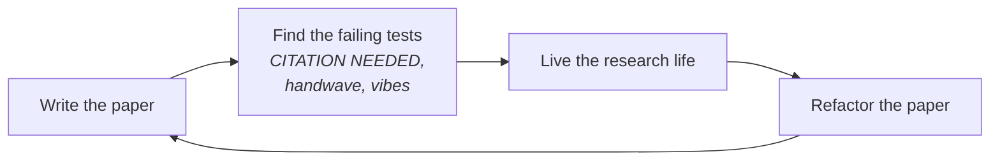

Pierre Menard, _autor del Quijote_, spent years cultivating an archaic Spanish so that, without copying Cervantes, his sentences would coincide word for word with Cervantes'. The method, as [Borges](https://en.wikipedia.org/wiki/Jorge_Luis_Borges) tells it in _Ficciones_, was secret and infinitely laborious. I would suggest to Menard a more economical methodology: first, copy the _Quijote_ letter for letter. Then go live the life that would make the author of that copy produce that exact _Quijote_, had he sat down to write it himself instead of copying. When you fail to live that life — and you will fail — try again. Refactor the life. Revert the commit. Iterate until the words you would have written coincide with the words you already copied.

This is roughly what I did with an alignment paper this week. I sat down and wrote six thousand words as if the research were done. Limitations section, validation roadmap, applicability table, numbered claims in the abstract, references list with seventeen real citations and four marked `[CITATION NEEDED]` for the ones I haven't read yet but plan to. Now I need to go live the life that would make those words true. When I fail — and I will fail — I revert the commit and try again.

The technique is not new. Programmers have a name for it: test-driven development. You write the test first, watch it fail, then write the code that makes the test pass. The discipline is that the test commits you to a specification before you've earned the right to one. Test-driven _research_ is the same trick on a different artifact. Write the paper first, watch it fail (the failure is invisible at first — that's the hard part), then go do the research that makes the paper true. The trick is the same and the embarrassment is the same: you're committing to a shape before you've proven you can fill it.

## The spec that runs itself

The trick survives translation between domains because in both cases the artifact you write first is a _spec that runs itself._ In TDD, the test is executable; it tells you, mechanically, whether the code is right. In TDR, the paper is executable too, just on a different machine — the researcher's attention. Every `[CITATION NEEDED]` is a failing test: it says _something must be true here, and I have not yet confirmed it._ Every limitation in the limitations section is a known bug: _the design admits this failure mode, and I haven't decided whether to fix it or document it._ Every metric in the validation roadmap is an acceptance criterion: _if the pilot deployment reports numbers worse than X on metric Y, the central claim of section 3 has empirically failed._

_The loop is not "write, then research." It's "write, find what's missing, do the missing thing, rewrite, find what's missing now." TDR collapses when treated as a pipeline._

The crucial discipline, the one that separates TDR from procrastination dressed as method, is that _the paper has to be written as if it were true._ No "I plan to show that…" No "future work will determine whether…" Those phrases are the equivalent of a TDD developer writing `// TODO: implement this` instead of an actual failing test. They look like discipline and produce none. The paper has to read like the research is done. Past tense. Confident claims. Section 5 has a table; the table has cells; the cells have answers, not question marks. When the cells are wrong — and some will be wrong — they get rewritten in the next pass after the research catches up.

## What you actually learn

Here is the part that surprised me. Writing the paper first forces decisions that doing-the-research-first leaves floating. Section 5 of my paper — a three-by-seven table mapping the proposed pattern against seven candidate domains, including a row that says _the pattern fails here, by design_ — exists only because the paper's shape demanded a section after the architecture chapter. In normal order, I would have built the system for another six months without ever formalizing where the pattern stops applying. The paper is a question machine. It asks questions you would not have asked, because the questions are structural to papers and not structural to projects.

<blockquote class="pull-quote">
  The paper is a question machine.
</blockquote>

This is unreasonable. It should not be the case that arranging the future into a six-section IMRAD-ish structure produces better thinking than just thinking. But it does, and the reason is that papers have a _shape_ that exists independently of any particular paper. The shape demands an abstract that summarizes claims. The shape demands a related-work section that situates the contribution. The shape demands a limitations paragraph that survives review. Each of those demands is a question the project alone would never ask, because projects are open-ended and papers are not. _It's giving structural humility through deadline anxiety,_ which is an honest if undignified description of what most academic discipline really is.

I learned, by writing the paper, three things about the project that I had not previously formulated: that the technique fails structurally (not just inconveniently) in domains where the operator must remain unauditable; that the doctrine/procedure tier separation has to support a _closure_ outcome or the agent is systematically biased toward proposing action; and that the central interpretability claim, in operational terms, reduces to whether a blind third-party reviewer can reconstruct the agent's decision from the proposal artifact alone. Each of those is now a testable claim in the paper, and each of those is now a research target I would not have set for myself otherwise.

## Where it breaks

The method's failure modes are not subtle. The largest is that you can confuse _sounding coherent_ with _being true._ A paper read aloud sounds like a paper whether or not its claims survive contact with reality. The discipline of writing in past tense — the very discipline that makes TDR work — also produces an aesthetic of finitude that papers earn when the research is done and that TDR borrows on credit. A trained reviewer will smell this on the first read; a less trained one might not, and may approve the paper for reasons that have nothing to do with whether its central claims are correct.

A subtler failure is that the paper, once written, closes the design space. Sections become load-bearing; rewriting one of them costs effort; the cheapest path forward is to make the research conform to the paper rather than the paper conform to the research. This is the inverse of how science is supposed to work, and it's structurally encouraged by every version of TDR that doesn't aggressively re-open the paper as the research proceeds. The discipline is _not_ to keep the paper stable; the discipline is to revert sections that the research invalidates, and to do so quickly, before the sections have time to grow defenders.

The third failure mode is confirmation bias dressed in instrumentation. Once you have a validation roadmap with named metrics, you tend to design the pilot to measure exactly those metrics, against thresholds that will favor the paper's claims. The instrumentation honors the spec, not the world. Mitigating this means including, in the validation roadmap, metrics whose plausible outcomes _invalidate_ the paper. If section 3 says the technique improves auditability, the roadmap has to include a measure of auditability whose worst-case outcome would force section 3 to be substantially rewritten. If the roadmap doesn't include such a measure, the paper is propaganda for itself.

And the most embarrassing failure: the _paper-as-vibes phase_, in which the writer mistakes the warm feeling of having written six thousand confident words for the cold fact of having done six thousand words of research. The warm feeling is real and it is unearned. The only known antidote is to send the draft to someone whose job is to attack the argument, not to validate it, and to send it early enough that there's still time to refactor before the deadline that made you write it.

## Mitigations that almost work

The discipline that keeps the loop honest, rather than collapsing into pipeline-with-rewrites, is procedural. Four practices, in roughly decreasing order of usefulness:

_Mark missing knowledge aggressively, never invent it._ `[CITATION NEEDED]` for every claim that requires literature you haven't read; `[NUMBER PENDING]` for every metric you haven't measured; `[ASSUMPTION]` in a comment for every premise that the research will test. The marks become your to-do list. They also embarrass you visibly in every draft, which is correct: the embarrassment is what keeps the paper honest while the research catches up.

_Write the limitations section first._ Not last. Not after the methods. First. Before you've fallen in love with the central claim, articulate, in past tense, the conditions under which the central claim is false. The discipline forces a kind of pre-emptive humility that is much harder to introduce once the rest of the paper has already established a triumphant tone. The limitations section is the test that the paper has to keep passing as it grows; written first, it stays load-bearing; written last, it becomes a polite footnote.

_Version the paper as code, with informative commits._ "Discovered X invalidates section 4, rewrote with weaker claim." "Read Y, retracted footnote 3." "Pilot returned worse-than-threshold on metric M; section 7 now lists this as a documented limitation rather than a future-work item." Each commit is a record of the research bending the paper rather than the paper bending the research. The git log becomes the actual scientific record; the published paper is just the snapshot most recent at submission time.

_Show the draft to a hostile reader early._ Not someone who will say "looks great, can't wait." Someone who will say "section 3 doesn't follow from section 2, and section 5 is doing too much work alone." Hostile readers are scarce and valuable. The window in which their feedback can still change the shape of the paper is narrow. Inside that window, they are the most efficient instrument the writer has for distinguishing _sounds coherent_ from _is true._

## A small home industry

What I am describing is not one technique but three layered on top of each other. The paper is TDR. The repository it documents ([PINK](/blog/2026-05-14-the-agent-that-doesnt-invent-verbs/), currently seven commits of doctrine and counting, zero lines of production code) is also TDR: a system whose architecture, lint rules, content-addressing scheme, and failure modes are specified in markdown files that lint themselves before any of them have been implemented. And this blog post is TDR too, in the most recursive register — it specifies a method that I am, with each paragraph, attempting to live up to.

A footnote on attribution that matters more than its size suggests: TDR is the method by which the paper and the repository were _written down_. It is not the method by which the design was _arrived at_. The design — three of its four properties, anyway — came from years of working as a lawyer inside a Brazilian public-administration office, well before any of this had a markdown file. I have [traced that genealogy elsewhere](/blog/2026-05-15-three-hammers-walk-into-a-bar/); the relevant point here is that TDR is good at producing a paper that reads as if the research were done, and bad at, by itself, producing the underlying design. The design has to come from somewhere — practice, prior reading, a borrowed primitive. TDR only enforces the discipline of putting it on paper before you can hide it from yourself.

The three artifacts are refactored in parallel. A discovery while implementing the system invalidates a paragraph in the paper; a section in the paper raises a question the blog post then articulates; the blog post, written for an audience outside the project, surfaces an embarrassment in the paper's framing that sends me back to revise the paper, which then changes what the system has to do.

There is a larger precedent than I am usually comfortable invoking. Early Wikipedia was an exercise in this. The encyclopedia, in its first years, was a vast field of _citation needed_ tags attached to confident sentences that had not yet been verified — _Albert Einstein was a German-born theoretical physicist `[citation needed]`_. The form of the sentence summoned the next reader to find the source, to confirm or refute, to fill the cell. It was hyperstition-driven literature: assert the encyclopedia and the encyclopedia will follow. In 2001 nobody would have bet that a reference compendium editable by strangers, padded with bracketed admissions of ignorance, would become the planet's primary factual reference inside twenty years. It is the largest worked example of test-driven research ever conducted, and it succeeded so completely that the _citation needed_ aesthetic — sentence first, source later — now looks unremarkable. The method is older than the embarrassment around it.

None of this is original. Donald Knuth was doing literate programming in the seventies — the program _is_ the document and vice versa, refactored together. Bruno Latour spent a career arguing that papers don't describe scientific facts so much as _manufacture_ them. Karl Popper said something nearby. What is mildly new, or at least newly cheap, is that the three artifacts can now be kept synchronized by a single person on a laptop, in markdown, version-controlled, in their own time. The small home industry of writing about what you are about to do, while you are doing it, is structurally a new kind of object.

Whether the resulting work is _good_ is a separate question. The method does not guarantee good work; it guarantees that you find out faster whether your work is bad. _The duality of writing limitations sections for research you have not done yet_ is exactly this — it commits you, on the first day, to discovering everything that is wrong with what you are about to spend six months doing. Some writers find this unbearable. I find it the only way to write at all.

## What this costs you

The honest tally. TDR inflates your confidence at exactly the moment you should be uncertain — the moment you have a complete document and no evidence. It biases you toward defending the draft rather than rewriting it, because rewriting is expensive and defense is cheap. It imposes invisible work on the people who review you: your draft _sounds_ finished even when it is not, and they have to read it as if it were, until they discover otherwise. And it carries the latent danger that all subsequent research, however diligently performed, ends up serving the aesthetics of a document rather than the discovery of anything.

Against this, the gains are real. The questions you would not have asked. The structure that holds you accountable. The deadline that turns a research project into a research artifact. The early visibility of what you are claiming, which is the only way for the claims to be tested before you've invested too much in defending them. On balance, for me, the trade is favorable. It might not be for you. The fact that I'm writing this in past tense before knowing whether it's true is, itself, the point.

Pierre Menard wrote the _Quijote_ after Cervantes, in the same words, and the second _Quijote_ is infinitely richer than the first. I am writing the research before Cervantes — in roughly the same words it will have, eventually — and I will find out in about six months whether mine is richer or just plagiarized in advance from a future I have not yet lived. The method is not without its embarrassments. _It's giving methodological audacity_, and methodological audacity is what people call methodological mistakes that happen to work.

## For further reading

- **Kent Beck, _Test-Driven Development by Example_ (2002).** The canonical text on TDD; the paragraph that distinguishes "writing the test first" from "documenting your plans" is the one that translates directly to TDR.
- **Jorge Luis [Borges](https://en.wikipedia.org/wiki/Jorge_Luis_Borges), "Pierre Menard, autor del _Quijote_" in _Ficciones_ (1944).** The patron saint of every methodology that involves writing a thing before being qualified to write it.
- **Donald Knuth, "Literate Programming" in _The Computer Journal_ (1984).** The earliest sustained argument that the program and its documentation should be the same artifact, refactored together. TDR is literate research in this sense.
- **Bruno Latour, _Science in Action_ (1987).** On the social construction of scientific facts; the chapter on how papers manufacture rather than describe their facts is the one that should make any TDR practitioner slightly nervous.
- **Imre Lakatos, _The Methodology of Scientific Research Programmes_ (1970).** On the difference between a degenerating and a progressive research programme — useful for noticing when your TDR paper has stopped being a productive question machine and started being a sunk cost.
- **Robert Sutton and Barry Staw, "What Theory is Not" in _Administrative Science Quarterly_ (1995).** A brief, frequently cited paper on the distinction between _sounds like a contribution_ and _is a contribution._ Recommended reading before every TDR revision.
- **Karl Popper, _Conjectures and Refutations_ (1963).** The original case for writing falsifiable claims before testing them. TDR is a small implementation of this stance, applied to a single researcher's process.
- **Wikipedia: "[Citation needed]" (the template, _Wikipedia: Template:Citation needed_).** The template itself, documented in the encyclopedia it helped build. Worth reading the template's history page; the meta-recursion is part of the artifact.

> _Post-Hronir Revision:_ Analytic distance requires recognizing that the blind repetition of algorithms without awareness of the original context fails the essential promise of scientific advancement. Technical elaboration only simulates innovation when it lacks the gravity of conceptual originality. True precision does not reside in the perfect recreation of the past, but in understanding where imitation suffocates true invention. The flawless clarity of this realization solidifies the defense presented.
