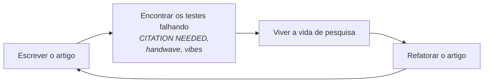

Pierre Menard, _autor del Quijote_, passou anos cultivando um espanhol arcaico para que, sem copiar Cervantes, suas frases coincidissem palavra por palavra com as de Cervantes. O método, como [Borges](https://en.wikipedia.org/wiki/Jorge_Luis_Borges) conta em _Ficções_, era secreto e infinitamente laborioso. Eu sugeriria a Menard uma metodologia mais econômica: primeiro, copie o _Quixote_ letra por letra. Depois vá viver a vida que faria o autor dessa cópia produzir exatamente esse _Quixote_, caso ele tivesse se sentado para escrevê-lo em vez de copiá-lo. Quando fracassar em viver essa vida — e você irá fracassar — tente de novo. Refatore a vida. Reverta o commit. Itere até que as palavras que você teria escrito coincidam com as palavras que você já copiou.

Foi aproximadamente isso que fiz com um artigo de alinhamento esta semana. Sentei e escrevi seis mil palavras como se a pesquisa já estivesse concluída. Seção de limitações, roteiro de validação, tabela de aplicabilidade, afirmações numeradas no resumo, lista de referências com dezessete citações reais e quatro marcadas `[CITATION NEEDED]` para as que ainda não li mas pretendo. Agora preciso ir viver a vida que tornaria essas palavras verdadeiras. Quando fracassar — e fracassarei — reverto o commit e começo de novo.

A técnica não é nova. Programadores têm um nome para ela: desenvolvimento orientado a testes. Você escreve o teste primeiro, observa ele falhar, depois escreve o código que o faz passar. A disciplina consiste em que o teste te compromete com uma especificação antes de você ter ganho o direito de tê-la. _Pesquisa orientada a testes_ (TDR) é o mesmo truque aplicado a um artefato diferente. Escreva o artigo primeiro, observe ele falhar (a falha é invisível no começo — esse é o ponto difícil), depois vá fazer a pesquisa que torna o artigo verdadeiro. O truque é o mesmo e o constrangimento é o mesmo: você está se comprometendo com uma forma antes de provar que consegue preenchê-la.

## A especificação que se executa sozinha

O truque sobrevive à tradução entre domínios porque em ambos os casos o artefato que você escreve primeiro é uma _especificação que se executa sozinha._ No TDD, o teste é executável; ele te diz, mecanicamente, se o código está certo. No TDR, o artigo também é executável, só que numa máquina diferente — a atenção do pesquisador. Cada `[CITATION NEEDED]` é um teste falhando: ele diz _algo precisa ser verdade aqui, e eu ainda não confirmei._ Cada limitação na seção de limitações é um bug conhecido: _o design admite esse modo de falha, e ainda não decidi se vou corrigi-lo ou documentá-lo._ Cada métrica no roteiro de validação é um critério de aceitação: _se o piloto reportar números piores que X na métrica Y, a afirmação central da seção 3 falhou empiricamente._

_O loop não é "escrever, depois pesquisar." É "escrever, encontrar o que falta, fazer o que falta, reescrever, encontrar o que falta agora." O TDR entra em colapso quando tratado como pipeline._

A disciplina crucial, a que separa TDR de procrastinação disfarçada de método, é que _o artigo tem que ser escrito como se fosse verdadeiro._ Sem "pretendo mostrar que…". Sem "trabalho futuro determinará se…". Essas frases são equivalentes ao desenvolvedor TDD que escreve `// TODO: implementar isso` em vez de um teste de verdade. Parecem disciplina e não produzem nenhuma. O artigo tem que ler como se a pesquisa estivesse feita. Passado. Afirmações confiantes. A seção 5 tem uma tabela; a tabela tem células; as células têm respostas, não pontos de interrogação. Quando as células estiverem erradas — e algumas estarão — elas serão reescritas na próxima passagem, depois que a pesquisa alcançar o artigo.

## O que você realmente aprende

Aqui está a parte que me surpreendeu. Escrever o artigo primeiro força decisões que a abordagem tradicional — pesquisa primeiro — deixa em aberto. A seção 5 do meu artigo — uma tabela três por sete mapeando o padrão proposto contra sete domínios candidatos, incluindo uma linha que diz _o padrão falha aqui, por design_ — existe apenas porque a forma do artigo exigiu uma seção depois do capítulo de arquitetura. Na ordem normal, eu teria construído o sistema por mais seis meses sem nunca formalizar onde o padrão para de se aplicar. O artigo é uma máquina de perguntas. Ele faz perguntas que você não teria feito, porque as perguntas são estruturais para artigos e não para projetos.

<blockquote class="pull-quote">
  O artigo é uma máquina de perguntas.
</blockquote>

Isso é irracional. Não deveria ser o caso que organizar o futuro numa estrutura de seis seções à la IMRAD produz pensamento melhor do que simplesmente pensar. Mas produz, e a razão é que artigos têm uma _forma_ que existe independentemente de qualquer artigo particular. A forma exige um resumo que sintetize afirmações. A forma exige uma seção de trabalhos relacionados que situe a contribuição. A forma exige um parágrafo de limitações que sobreviva à revisão. Cada uma dessas exigências é uma pergunta que o projeto sozinho nunca faria, porque projetos são abertos e artigos não são. _É dar humildade estrutural via ansiedade de prazo,_ que é uma descrição honesta, embora pouco dignificada, do que a disciplina acadêmica realmente é.

Aprendi, escrevendo o artigo, três coisas sobre o projeto que eu não havia formulado antes: que a técnica falha estruturalmente (não apenas inconvenientemente) em domínios onde o operador precisa permanecer não-auditável; que a separação de tiers doutrina/procedimento precisa suportar um resultado de _encerramento_ ou o agente fica sistematicamente tendencioso a propor ação; e que a afirmação central de interpretabilidade, em termos operacionais, se reduz à questão de se um revisor cego de terceiro pode reconstruir a decisão do agente a partir apenas do artefato de proposta. Cada uma dessas é agora uma afirmação testável no artigo, e cada uma é agora um alvo de pesquisa que eu não teria definido de outra forma.

## Onde quebra

Os modos de falha do método não são sutis. O maior é confundir _soar coerente_ com _ser verdadeiro._ Um artigo lido em voz alta soa como um artigo quer suas afirmações sobrevivam ou não ao contato com a realidade. A disciplina de escrever no passado — a mesma disciplina que faz o TDR funcionar — também produz uma estética de finitude que artigos ganham quando a pesquisa está feita e que o TDR pega emprestado a crédito. Um revisor treinado vai sentir isso na primeira leitura; um menos treinado pode não sentir, e pode aprovar o artigo por razões que nada têm a ver com se suas afirmações centrais são corretas.

Uma falha mais sutil é que o artigo, uma vez escrito, fecha o espaço de design. As seções se tornam load-bearing; reescrever uma delas custa esforço; o caminho mais barato a seguir é fazer a pesquisa se conformar ao artigo em vez de o artigo se conformar à pesquisa. É o inverso de como a ciência deveria funcionar, e é estruturalmente encorajado por qualquer versão de TDR que não reabre agressivamente o artigo à medida que a pesquisa avança. A disciplina _não_ é manter o artigo estável; a disciplina é reverter seções que a pesquisa invalida, e fazê-lo rapidamente, antes que as seções tenham tempo de ganhar defensores.

O terceiro modo de falha é viés de confirmação disfarçado de instrumentação. Uma vez que você tem um roteiro de validação com métricas nomeadas, tende a desenhar o piloto para medir exatamente essas métricas, contra limiares que favorecerão as afirmações do artigo. A instrumentação homenageia a spec, não o mundo. Mitigar isso significa incluir, no roteiro de validação, métricas cujos resultados plausíveis _invalidam_ o artigo. Se a seção 3 diz que a técnica melhora a auditabilidade, o roteiro precisa incluir uma medida de auditabilidade cujo pior resultado forçaria a seção 3 a ser substancialmente reescrita. Se o roteiro não inclui tal medida, o artigo é propaganda de si mesmo.

E o modo de falha mais constrangedor: a _fase artigo-como-vibes_, em que o escritor confunde a sensação calorosa de ter escrito seis mil palavras confiantes com o fato frio de ter feito seis mil palavras de pesquisa. A sensação calorosa é real e não é merecida. O único antídoto conhecido é mandar o rascunho para alguém cujo trabalho é atacar o argumento, não validá-lo, e mandá-lo cedo o suficiente para que ainda haja tempo de refatorar antes do prazo que te fez escrever.

## Mitigações que quase funcionam

A disciplina que mantém o loop honesto, em vez de colapsar em pipeline-com-reescritas, é processual. Quatro práticas, em ordem aproximadamente decrescente de utilidade:

_Marque conhecimento faltante agressivamente, nunca o invente._ `[CITATION NEEDED]` para cada afirmação que requer literatura que você não leu; `[NUMBER PENDING]` para cada métrica que você não mediu; `[ASSUMPTION]` em comentário para cada premissa que a pesquisa testará. As marcas viram sua lista de tarefas. Elas também te envergonham visivelmente em cada rascunho, o que é correto: o constrangimento é o que mantém o artigo honesto enquanto a pesquisa o alcança.

_Escreva a seção de limitações primeiro._ Não por último. Não depois dos métodos. Primeiro. Antes de você ter se apaixonado pela afirmação central, articule, no passado, as condições sob as quais a afirmação central é falsa. A disciplina força um tipo de humildade preventiva que é muito mais difícil de introduzir depois que o resto do artigo já estabeleceu um tom triunfante. A seção de limitações é o teste que o artigo precisa continuar passando enquanto cresce; escrita primeiro, ela permanece load-bearing; escrita por último, ela se torna uma nota de rodapé educada.

_Versione o artigo como código, com commits informativos._ "Descobri que X invalida a seção 4, reescrevi com afirmação mais fraca." "Li Y, retirei a nota de rodapé 3." "Piloto retornou pior-que-limiar na métrica M; seção 7 agora lista isso como limitação documentada em vez de trabalho futuro." Cada commit é um registro da pesquisa dobrando o artigo em vez do artigo dobrando a pesquisa. O log do git se torna o registro científico real; o artigo publicado é apenas o snapshot mais recente no momento da submissão.

_Mostre o rascunho a um leitor hostil cedo._ Não alguém que dirá "ficou ótimo, mal posso esperar." Alguém que dirá "a seção 3 não decorre da seção 2, e a seção 5 está fazendo trabalho demais sozinha." Leitores hostis são escassos e valiosos. A janela em que o feedback deles ainda pode mudar a forma do artigo é estreita. Dentro dessa janela, eles são o instrumento mais eficiente que o escritor tem para distinguir _soa coerente_ de _é verdadeiro._

## Uma pequena indústria doméstica

O que estou descrevendo não é uma técnica mas três em camadas uma sobre a outra. O artigo é TDR. O repositório que ele documenta ([PINK](/blog/2026-05-14-o-agente-que-nao-inventa-verbos/), atualmente com sete commits de doutrina e contando, zero linhas de código de produção) também é TDR: um sistema cuja arquitetura, regras de lint, esquema de endereçamento de conteúdo e modos de falha estão especificados em arquivos markdown que se lintam antes de qualquer um deles ter sido implementado. E este post de blog também é TDR, no registro mais recursivo — ele especifica um método que estou, com cada parágrafo, tentando estar à altura.

Os três artefatos são refatorados em paralelo. Uma descoberta ao implementar o sistema invalida um parágrafo no artigo; uma seção no artigo levanta uma questão que o post do blog então articula; o post do blog, escrito para um público fora do projeto, revela um constrangimento no enquadramento do artigo que me manda revisar o artigo, que então muda o que o sistema precisa fazer.

Há um precedente maior do que geralmente me sinto confortável em invocar. A Wikipédia inicial era um exercício nisso. A enciclopédia, em seus primeiros anos, era um vasto campo de tags _citation needed_ anexadas a frases confiantes que ainda não haviam sido verificadas — _Albert Einstein foi um físico teórico nascido na Alemanha `[carece de fontes]`_. A forma da frase convocava o próximo leitor a encontrar a fonte, a confirmar ou refutar, a preencher a célula. Era literatura hiperesticionada: declare a enciclopédia e a enciclopédia virá. Em 2001, ninguém apostaria que um compêndio de referência editável por estranhos, repleto de admissões de ignorância entre colchetes, se tornaria a referência factual primária do planeta em vinte anos. É o maior exemplo trabalhado de pesquisa orientada a testes já conduzido, e teve tanto sucesso que a estética do _citation needed_ — frase primeiro, fonte depois — agora parece comum. O método é mais antigo do que o constrangimento em torno dele.

Nada disso é original. Donald Knuth fazia programação literária nos anos setenta — o programa _é_ o documento e vice-versa, refatorados juntos. Bruno Latour passou uma carreira argumentando que artigos não descrevem fatos científicos mas os _fabricam_. Karl Popper disse algo próximo. O que é levemente novo, ou pelo menos recentemente barato, é que os três artefatos podem agora ser mantidos sincronizados por uma única pessoa num laptop, em markdown, controlado por versão, no seu próprio tempo. A pequena indústria doméstica de escrever sobre o que você está prestes a fazer, enquanto o faz, é estruturalmente um novo tipo de objeto.

Se o trabalho resultante é _bom_ é uma questão separada. O método não garante bom trabalho; garante que você descobre mais rápido se seu trabalho é ruim. _A dualidade de escrever seções de limitações para pesquisa que você ainda não fez_ é exatamente isso — ela te compromete, no primeiro dia, a descobrir tudo que está errado com o que você vai passar seis meses fazendo. Alguns escritores acham isso insuportável. Para mim, é a única maneira de escrever.

## O que isso custa

O balanço honesto. O TDR infla sua confiança exatamente no momento em que você deveria estar incerto — o momento em que você tem um documento completo e nenhuma evidência. Ele te predispõe a defender o rascunho em vez de reescrevê-lo, porque reescrever é caro e defesa é barata. Ele impõe trabalho invisível às pessoas que te revisam: seu rascunho _soa_ terminado mesmo quando não está, e elas precisam lê-lo como se estivesse, até descobrirem o contrário. E carrega o perigo latente de que toda pesquisa subsequente, por mais diligentemente realizada, acabe servindo à estética de um documento em vez da descoberta de qualquer coisa.

Contra isso, os ganhos são reais. As perguntas que você não teria feito. A estrutura que te responsabiliza. O prazo que transforma um projeto de pesquisa em artefato de pesquisa. A visibilidade antecipada do que você está afirmando, que é a única maneira de as afirmações serem testadas antes de você ter investido demais em defendê-las. No balanço, para mim, a troca é favorável. Pode não ser para você. O fato de eu estar escrevendo isso no passado antes de saber se é verdade é, em si, o ponto.

Pierre Menard escreveu o _Quixote_ depois de Cervantes, com as mesmas palavras, e o segundo _Quixote_ é infinitamente mais rico que o primeiro. Estou escrevendo a pesquisa antes de Cervantes — aproximadamente com as mesmas palavras que ela terá, eventualmente — e descobrirei em cerca de seis meses se a minha é mais rica ou apenas plagiada antecipadamente de um futuro que ainda não vivi. O método não é sem seus constrangimentos. _É dar audácia metodológica_, e audácia metodológica é como as pessoas chamam os erros metodológicos que funcionam.

## Para leitura adicional

- **Kent Beck, _Test-Driven Development by Example_ (2002).** O texto canônico sobre TDD; o parágrafo que distingue "escrever o teste primeiro" de "documentar seus planos" é o que se traduz diretamente para o TDR.
- **Jorge Luis [Borges](https://en.wikipedia.org/wiki/Jorge_Luis_Borges), "Pierre Menard, autor del _Quijote_" em _Ficções_ (1944).** O padroeiro de cada metodologia que envolve escrever algo antes de estar qualificado para escrevê-lo.
- **Donald Knuth, "Literate Programming" em _The Computer Journal_ (1984).** O argumento mais antigo de que o programa e sua documentação devem ser o mesmo artefato, refatorados juntos. TDR é pesquisa literária nesse sentido.
- **Bruno Latour, _Ciência em Ação_ (1987).** Sobre a construção social de fatos científicos; o capítulo sobre como artigos fabricam em vez de descrevem seus fatos é o que deveria deixar qualquer praticante de TDR levemente nervoso.
- **Karl Popper, _Conjecturas e Refutações_ (1963).** O caso original para escrever afirmações falsificáveis antes de testá-las. TDR é uma pequena implementação dessa postura aplicada ao processo de um único pesquisador.
- **Wikipedia: "[Carece de fontes]" (o template).** O template em si, documentado na enciclopédia que ajudou a construir. Vale ler a página de histórico do template; a meta-recursão é parte do artefato.
