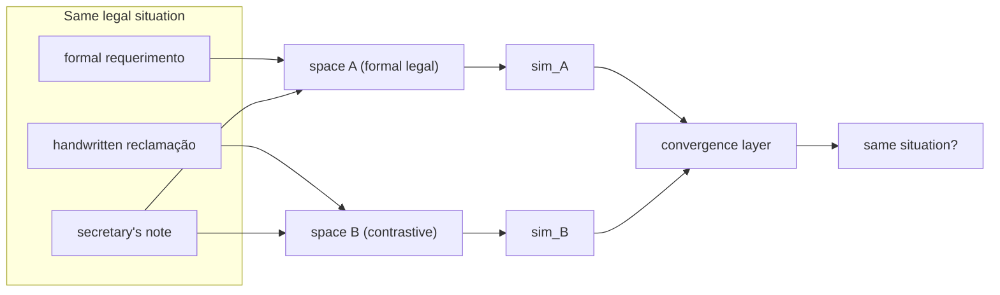

Here is a problem I actually have, which is what [PINK](/blog/2026-05-14-the-agent-that-doesnt-invent-verbs/) is supposed to solve and currently doesn't solve very well.

An expediente arrives in the office. It might be a formal requerimento from a law firm, three pages, letterhead, numbered paragraphs. It might be a handwritten reclamação from a garimpeiro asking about the same land use authorization the law firm is asking about. It might be an environmental secretary's note — two sentences, bureaucratic shorthand, also about the same thing. Three documents, completely different linguistic registers, same underlying legal situation. PINK needs to recognize this. Not because the tokens match — they won't — but because the _semantic structure_ is the same.

Most embedding-based retrieval doesn't help here. You project all three into the same embedding space, and the informal handwritten note lands in a different neighborhood from the formal requerimento, even if they're describing identical circumstances. The space is calibrated on the kind of text it was trained on, and the law firm writes differently than the garimpeiro.

The [Pontifex architecture](/blog/pontifex-novel-architecture-semantic-probing/) is my attempt to describe a system that looks at this from multiple directions at once. The companion post explains the theory. This one is meant to explain what I'd actually type into a terminal. Except that so far I haven't typed most of it. I'm a Procurador do Estado who builds things on weekends in Rondônia — I don't have a GPU cluster or a research team, and the architecture I described borrows from five or six papers that don't exactly talk to each other.

Construction notes, not a build log.

The name is borrowed from Latin — _pontifex_, bridge-builder, the Roman priest responsible for the bridges over the Tiber and the metaphorical ones between human and divine. The bridges I need are between semantic spaces: a multilingual legal model trained on formal Portuguese, a contrastive model that might generalize better across registers, and whatever I end up using for the informal handwritten material. Three probes, same concept, asking: do they converge?



The bilateral part: when you occlude a segment of the text and measure how much the output changes, you usually do this against a single model. Pontifex does it across two models simultaneously. If both models agree that the occluded segment was load-bearing — both diverge when it's masked — you have stronger evidence the segment carries real semantic weight, not just surface features the first model happened to latch onto. The [Captum library](https://captum.ai/) from PyTorch has occlusion analysis built in:

```python
from captum.attr import Occlusion
import torch

def probe_bilateral(model, text, window_size=8):
    byte_input = text.encode('utf-8')
    oc = Occlusion(model)
    return oc.attribute(
        inputs=torch.tensor(list(byte_input), dtype=torch.float32).unsqueeze(0),
        sliding_window_shapes=(window_size,),
        baselines=0
    )
```

I'm working at the byte level rather than the token level because I'm interested in what happens with the informal handwritten material — regional Portuguese, incomplete sentences, words the tokenizer wasn't trained on. Byte-level occlusion doesn't care about tokenization artifacts. Whether this actually helps with the informal register problem I genuinely don't know. It's one of those questions I have an intuition about and no empirical answer to.

The convergence part is less mysterious in theory than in practice. You want a layer that takes representations from multiple spaces and combines them:

```python
import torch.nn as nn

class MultiSpaceConvergence(nn.Module):
    def __init__(self, embed_dim=768, num_spaces=3):
        super().__init__()
        self.projectors = nn.ModuleList([
            nn.Linear(embed_dim, embed_dim) for _ in range(num_spaces)
        ])
        self.fuse = nn.Linear(embed_dim * num_spaces, embed_dim)

    def forward(self, embeddings):
        projected = [p(embeddings) for p in self.projectors]
        return self.fuse(torch.cat(projected, dim=-1))
```

The dropout and ReLU I had in an earlier draft I've since removed — they were there to show I knew what I was doing, which is a bad reason to include things in code. Whether the convergence layer should be nonlinear at all depends on whether the spaces are already well-structured. For CLIP-like embeddings, linear projection often works well enough. The honest dependency list: `torch`, `transformers`, and `open-clip-torch`. Captum for the occlusion analysis. Everything else I listed in earlier versions was scaffolding to sound comprehensive.

The gap between this post and a real implementation guide is that a real implementation guide exists after you've run into the problems. I know from the literature that bilateral signal independence is not guaranteed — if both channels attend to the same surface features, you haven't gotten two views, you've gotten the same view twice. I don't know from experience how often this happens with the law-firm-versus-garimpeiro case, because I haven't run it.

This is the specific kind of intellectual embarrassment I've decided to stop hiding. A lot of technical blog posts are written in the imperative voice of someone who has done the thing, when the author has mostly thought carefully about the thing. The code compiles. The architecture is coherent. The training would take three to fifteen days on hardware I don't own.

The garimpeiro and the law firm are both still waiting. When I get through the PINK backlog and a free weekend, I'll find out if the convergence idea survives contact with their actual text.

## For further reading

- **[Captum documentation](https://captum.ai/docs/)** — the PyTorch interpretability library. The occlusion module is documented well; the examples are useful even if the API has shifted since the original papers.
- **[CLIP paper](https://arxiv.org/abs/2103.00020)** (Radford et al., 2021) — the multimodal foundation this borrows from. The bilateral comparison in Pontifex is partly an attempt to generalize what CLIP does for image-text to arbitrary space pairs.
- **Zeiler & Fergus, "Visualizing and Understanding Convolutional Networks"** (2013) — the source of occlusion sensitivity analysis as a method. The byte-level application is my extrapolation; the original is image-only.
- **[ByT5](https://arxiv.org/abs/2105.13626)** (Xue et al., 2022) — for byte-level tokenization context. Relevant if you want the occlusion to be genuinely byte-native rather than a workaround for tokenizer alignment.
- **[The Agent That Doesn't Invent Verbs](/blog/2026-05-14-the-agent-that-doesnt-invent-verbs/)** — the PINK system this is meant to eventually serve: content-addressed playbooks that need to recognize situations across registers.
