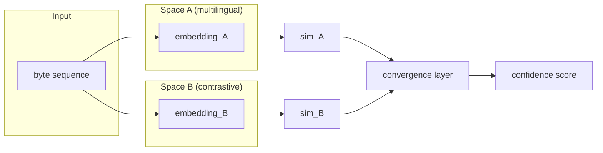

The problem I kept running into: most interpretability methods are one-eyed. You have a model, you have an input, you occlude parts of it and watch the output change. The method tells you which parts mattered to _this_ model in _this_ space. That's fine when you have one model. It's less fine when you suspect the interesting thing — the semantic content you're trying to surface — lives at a level that doesn't respect any particular model's coordinate system.

That observation is the seed of Pontifex.

The name is borrowed from Latin — _pontifex_, bridge-builder, the Roman priest responsible for maintaining the bridges over the Tiber and the metaphorical ones between human and divine. I found it appropriate. A system that tries to find agreement across representational spaces is building bridges, not mapping one shore onto the other.

## The bilateral move

Standard occlusion-based interpretability masks a part of the input and measures how much the model's prediction changes. One mask, one comparison. Clean, but it throws away information.

Pontifex does something slightly different. When a byte segment is occluded, instead of just looking at the change in output, it splits the input into two fragments — everything before the cut and everything after — and embeds each fragment independently. Three comparisons follow: left fragment to right fragment, left fragment to the original, right fragment to the original. Three signals per occlusion instead of one.

The intuition is simple enough: if removing a segment made both halves diverge from each other _and_ from the original, the removed segment was load-bearing. If both halves still resemble each other and the original, the segment was redundant. The bilateral framing makes this explicit.

It also operates at the byte level, not the token level. That's a deliberate choice. Language-specific tokenizers are their own layer of prior assumptions. Bytes are language-neutral. A byte-level occlusion can probe an English sentence and its Japanese equivalent without needing separate machinery. Whether this is the right granularity for all semantic probing I genuinely don't know — the [implementation companion post](/blog/pontifex-architecture-implementation-guide/) is honest about this uncertainty — but for multilingual settings it seems to reduce a source of variance.

## The convergence problem

The more interesting part of Pontifex is the multi-space architecture.

Suppose you have two embedding spaces that were trained differently — a multilingual language model and a vision-text contrastive model, say. Both encode semantic information; neither directly translates to the other. The standard approach to cross-space analysis is alignment: learn a mapping from one space to the other. This works if the spaces have similar structure (roughly isomorphic geometry). It works less well when they don't, and it always loses something in the projection.

Pontifex doesn't try to merge the spaces. It keeps them separate and asks: do they _agree_?

For a given hypothesis about an input — "this segment carries the semantic content 'dog'" — each space produces an independent similarity score. A convergence layer, trained to interpret these agreements and conflicts, outputs a confidence score. The convergence layer doesn't live in any particular embedding geometry; it lives in a space of similarity signals. Two high signals means likely yes. One high and one low means the models disagree, and the disagreement is itself information — either one model is missing something, or the concept is genuinely space-specific.

The diagram is cleaner than the reality. In practice, the convergence layer needs training data to know when two spaces agreeing means something versus when both spaces are just confidently wrong in the same direction. I don't have a satisfying answer to that. If all your models share a blind spot, convergence won't save you.

## What this does and doesn't claim

Pontifex is an architecture, not a result. I have not built the full system end-to-end. I have built pieces: the byte-level occlusion engine, some experiments with bilateral comparison across multilingual models. The convergence layer is theoretical at this level of detail.

What I believe, having spent time with the literature on multi-view learning and semantic probing, is that the _shape_ of Pontifex is right. Probing from multiple angles produces more reliable attributions than single-model analysis. Byte-level operations reduce preprocessing assumptions. Convergence across spaces as a validation mechanism is a better paradigm than space projection for cases where the relationship between spaces is genuinely nonlinear.

Whether I'll build it: that depends on whether weekends in Rondônia add up to enough compute time and motivation. The [implementation notes](/blog/pontifex-architecture-implementation-guide/) are where I think through what I'd actually type into a terminal. This post is the upstream question — why any of it would be worth building.

The most honest version of the architecture might also be the simplest: bilateral occlusion with two models instead of one, a hand-tuned consensus function instead of a trained convergence layer, and some experiments on XNLI to see if cross-space agreement correlates with genuine semantic importance. Start there. If it works, add complexity.

I'm less sure about the hypothesis generation module — the idea of having a reinforcement learning system propose hypotheses that Pontifex then verifies. That's a lot of moving parts to get right before the rest of the system is validated. I included it in earlier drafts because it was intellectually exciting. I'm no longer sure it's the right problem to solve first.

## For further reading

- **[Pontifex Architecture Implementation Guide](/blog/pontifex-architecture-implementation-guide/)** — the companion post where this architecture is turned into code that could actually run. More honest about what's built versus what's imagined.
- **[Captum documentation](https://captum.ai/docs/)** — PyTorch's interpretability library. The occlusion module is where the byte-level approach is implemented in practice.
- **[CLIP paper](https://arxiv.org/abs/2103.00020)** (Radford et al., 2021) — the multimodal representation model that bilateral comparison in Pontifex draws on. Understanding CLIP's approach to cross-modal alignment is useful background.
- **Zeiler & Fergus, "Visualizing and Understanding Convolutional Networks" (2013)** — the source of occlusion sensitivity as a method. The bilateral extension is my variation; the original is image-only.
- **[ByT5](https://arxiv.org/abs/2105.13626)** (Xue et al., 2022) — on byte-level processing as an alternative to tokenization. Directly relevant to why the byte-level choice might be principled rather than convenient.
