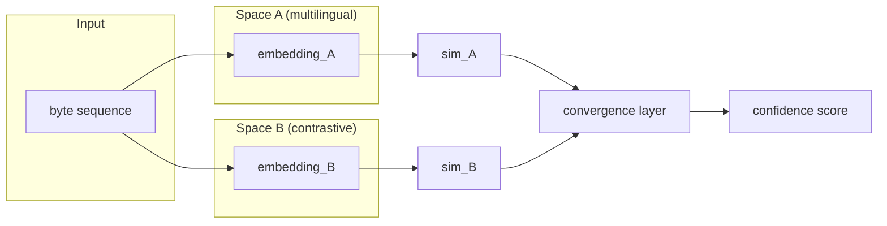

There is a repository on my GitHub with no code in it. Every few months I open it, change two or three lines of the README, and close it again. This has gone on for about a year — the idea lives rent-free in my head and shows no sign of moving out. The repo is called `pontifex`, and the README describes — in the present tense, as if it already ran — a system for probing meaning from several angles at once. It does not run.

The idea came out of [causaganha](https://github.com/franklinbaldo/causaganha), my project for chewing through Brazilian official gazettes. A gazette page is a small linguistic riot: Portuguese prose, legal Latin, case numbers, proper names, the occasional English acronym someone smuggled in. I wanted to know which part of a parsed decision was actually carrying the outcome — the judge's name, the statute, the wording of the dispositive clause. The interpretability tools I reached for answered me, but they answered _in the model's own coordinate system_. Fine, if you have one model and you trust it. Less fine when you suspect the thing you're chasing — whatever decides outcomes across courts and across registers — lives at a level that doesn't care about any single model's geometry.

That suspicion is the whole seed. Everything in the repo grows out of it.

The name is Latin. The _pontifex_ was the Roman priest in charge of bridges — the literal ones over the Tiber, and by extension the ones between the city and its gods. A bridge-builder. It's the obvious metaphor for a system that looks for agreement across representational spaces, and for about six months I had the metaphor backwards.

Because the obvious move, when you have two embedding spaces that don't speak the same language, is to _build the bridge_: learn a mapping from one to the other, carry meaning across, translate. That's alignment, and it's a perfectly good technique. But it assumes the two shores have compatible geography, and it charges a tax at the crossing — something always gets dropped in the projection.

The version I keep reopening doesn't build the bridge. It stands on both banks and asks whether the view agrees. No crossing, no translation: two spaces kept stubbornly separate, each describing the same input in its own terms, and a thin layer on top that listens only for whether they're pointing at the same thing. A pontifex who never actually crosses the river. It is a strange thing to name after a bridge-builder, and I've decided the strangeness is the point.

## Cutting the input in half

Start with the smaller of the two ideas, because it's the one I've actually built.

Standard occlusion interpretability is simple: hide part of the input, watch the output move, conclude that what you hid mattered. One mask, one comparison. It works, and it throws away most of what just happened.

Pontifex cuts instead of masking. Occlude a byte segment and you've split the input in two — everything before the cut, everything after. Embed each half on its own. Now you have three comparisons instead of one: left against right, left against the original, right against the original. If removing the segment made the halves diverge from each other _and_ from the whole, the segment was load-bearing. If the halves still resemble each other and the original, it was filler. The doubling is cheap, and it tells you more for the same occlusion.

It runs on bytes, not tokens, and that's deliberate. A tokenizer is a layer of opinions — vocabulary, merge rules, all of it inherited from whatever corpus raised it. Bytes don't have opinions. A byte-level cut can probe a Portuguese clause and its Spanish translation with the same machinery, which for causaganha is not abstract: half my comparisons are Brazilian text against Argentine text. Whether bytes are always the right grain I genuinely don't know — on very short inputs the boundaries get noisy — but for the multilingual mess of a gazette it removes a source of variance instead of adding one.

<figure class="meme">
  
  <figcaption>Not always a solution so much as a relocation — but a cheaper neighborhood for the problem to live in.</figcaption>
</figure>

## The part I can't solve

The bigger idea is the multi-space layer, and it's also the one that keeps me honest, because I can see exactly where it breaks.

Two spaces — say a multilingual legal model and a general contrastive one. For a hypothesis about the input ("this segment is the operative clause"), each space returns its own similarity score. A convergence layer reads the agreements and the conflicts and emits a single confidence. It doesn't live inside either embedding geometry; it lives one floor up, in the space of _signals about_ the two spaces.

The diagram is cleaner than the reality.

Here is where it breaks, and I've never found my way around it: **if all your spaces share a blind spot, agreement tells you nothing.** Two models trained on similar corpora fail in similar ways. The convergence layer cannot tell "this segment genuinely carries no meaning" apart from "neither of us learned to see this segment." You get confident consensus on a wrong answer — which is worse than a single model's honest shrug, because consensus feels like evidence.

I don't need machine learning to recognize this failure. I'm a state attorney; I've read the two opinions that agree with each other and are both wrong. Two jurists trained on the same body of law, the same precedents, the same professional reflexes, will miss the same things in the same places, and when they converge the convergence reads as confirmation. It isn't. It's shared training. The defense, in law and in Pontifex, is identical and equally unautomatable: you need readers who were _raised differently_, and there is no formula that tells you when your panel is diverse enough.

So the architecture is exactly as good as the care taken in choosing the spaces. That's a weaker claim than "multi-angle probing is more reliable," which is where I started. It's also the only version I still believe.

## The notebook that hasn't compiled

Pontifex is an architecture, not a result. I've built the occlusion engine and run some bilateral comparisons across multilingual models; the convergence layer exists at the level of detail you've just read and no finer. The [repo](https://github.com/franklinbaldo/pontifex) went up before any of it, which is how I work — [I open a repository whenever an idea is odd enough that I want it to argue back at me](/blog/2026-05-22-github-a-tour-of-the-repos/), and the README is where the arguing happens.

Call it a Pierre Menard move with the sign flipped. Menard set out to write a book that already existed and to reach it from inside his own life. I'm doing the inverse: writing the README of a system that doesn't exist yet, on the bet that the right architecture is already sitting somewhere in the space of possible architectures, and that my job is to become the person who would transcribe it. The README is that person's notebook. Sometimes the notebook is enough to discover the person was wrong about the whole thing. Sometimes the notebook slowly starts to compile.

Whether the full system gets built depends on Porto Velho weekends adding up, which they mostly don't. When I'm honest about it, the version most likely to survive contact is the smallest one: bilateral occlusion, two models, a consensus function I tune by hand instead of a learned convergence layer, and one weekend spent testing whether cross-space agreement actually tracks meaning on something like XNLI. Start there. The reinforcement-learning module that generates its own hypotheses — that was in the early drafts because it was the most fun to think about, which is exactly why I no longer trust it as the first thing to build.

<figure class="meme">
  
  <figcaption>Research triage, rendered accurately.</figcaption>
</figure>

The repo stays open. The notebook hasn't compiled. Neither of those is the same as nothing.
