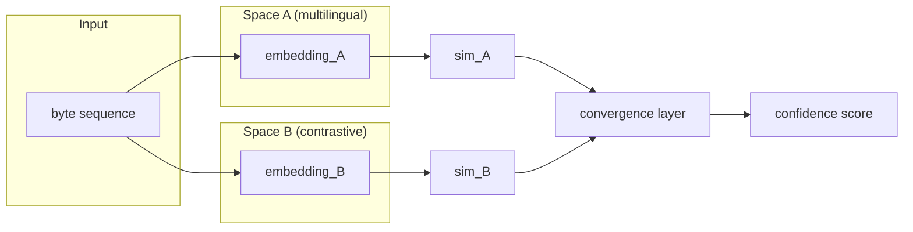

The problem I kept running into started with [causaganha](https://github.com/franklinbaldo/causaganha) — my project for extracting and analyzing Brazilian official gazettes. A gazette page mixes Portuguese prose, legal Latin, case numbers, proper names, and occasional English acronyms. I was trying to probe which parts of a parsed text carried the semantic load — was the case outcome determined by the judge's name, the statute cited, or the phrasing of the operative clause? Standard interpretability tools gave me answers, but they gave me answers _in the model's coordinate system_. Which is fine if you have one model and trust it. It's less fine when you suspect the interesting thing — the thing that determines outcomes across jurisdictions and across registers — lives at a level that doesn't respect any particular model's geometry.

That suspicion is the seed of Pontifex.

The name is from Latin — _pontifex_, bridge-builder, the Roman priest who maintained the bridges over the Tiber and the metaphorical ones between human and divine. A system that looks for agreement across representational spaces is building bridges, not mapping one shore onto the other.

## The bilateral move

Standard occlusion-based interpretability works like this: mask part of the input, watch the model's output change, infer what was load-bearing. One mask, one comparison. Clean, but it throws away information.

Pontifex does something slightly different. When a byte segment is occluded, instead of just measuring the output change, it splits the input into two fragments — everything before the cut and everything after — and embeds each independently. Three comparisons then follow: left fragment versus right fragment, left fragment versus the original, right fragment versus the original. Three signals per occlusion instead of one.

The intuition: if removing a segment made both halves diverge from each other _and_ from the original, the removed segment was load-bearing. If both halves still resemble each other and the original, the segment was redundant. The bilateral framing makes this explicit.

It also operates at the byte level, not the token level. This is deliberate. Language-specific tokenizers are their own layer of prior assumptions — assumptions baked in from training corpora, vocabulary choices, BPE merges. Bytes are language-neutral. A byte-level occlusion can probe a Portuguese clause and its Spanish translation without needing separate machinery, which for causaganha is a real practical advantage: I'm often comparing Brazilian and Argentine administrative texts.

Whether byte-level is always the right granularity I genuinely don't know. For very short inputs you can lose signal at the byte boundaries. But for the multilingual mess of a gazette, it reduces a source of variance.

## The convergence problem

The more interesting part of Pontifex is the multi-space architecture, and also the part I find most honestly difficult.

Suppose you have two embedding spaces trained differently — a multilingual legal-text model and a general-domain contrastive model. Both encode semantic information; neither translates directly to the other. The standard approach is alignment: learn a mapping from one space to the other. This works if the spaces have similar structure. It works less well when they don't, and it always loses something in the projection.

Pontifex doesn't merge the spaces. It keeps them separate and asks: do they _agree_?

For a hypothesis about an input — "this segment carries the operative legal clause" — each space produces an independent similarity score. A convergence layer interprets agreements and conflicts and outputs a confidence score. The convergence layer doesn't live in any particular embedding geometry; it lives in a space of similarity signals.

The diagram is cleaner than the reality.

Here is the problem I haven't fully solved: **if all your models share a blind spot, convergence won't save you.** Two spaces trained on similar corpora will miss similar things. The convergence layer cannot distinguish "this segment is genuinely not semantically load-bearing" from "both of our models failed to encode this segment." You'd get confident agreement on the wrong answer. _This is fine_, says the dog with the hat. The room is on fire.

I think about this in terms of causaganha. If I use two models both fine-tuned on Brazilian legal text, they probably share the same gaps — both probably underrepresent indigenous land rights claims, or both handle informal language in depositions poorly. Convergence in that case tells me the two models agree, not that they're right. The diversity of the probe pool is the real defense, and there's no automatic way to know if you have enough diversity.

This doesn't kill the architecture. It means the architecture is only as good as the care taken in choosing which spaces to include. Which is less satisfying than a technical solution, but is probably the honest account.

## What this does and doesn't claim

Pontifex is an architecture, not a result. I have built pieces: the byte-level occlusion engine, some bilateral comparison experiments across multilingual models. The convergence layer is theoretical at this level of detail.

The repo lives at [github.com/franklinbaldo/pontifex](https://github.com/franklinbaldo/pontifex). I opened it before I had written a line of the actual system, which is how I work — [I open a repo whenever an idea is odd enough that I want it to argue back at me](/blog/2026-05-22-github-a-tour-of-the-repos/), and the README is where the arguing happens. Call it a Pierre Menard move. I'm not building Pontifex by copying out a system that already exists somewhere; I'm trying to become the kind of researcher who would write it, and the repo is the artifact that researcher would have.

If you clone it today you'll find a one-line README and a file called `o3-orinality-assessement.md` — yes, with both typos, I'm not going to fix them, they're part of the artifact — in which I asked an LLM whether the unbuilt system would be original. The LLM said it would be: _"substantial improvement / new combination that enables previously impractical use-cases."_ So the entire contents of this repository are (1) a name and (2) an AI-issued certificate of originality for a thing that does not exist. The Menard move taken to its absurd conclusion. The notebook of the researcher who would write Pontifex contains only the researcher's outsourced conviction that writing it would be worth it. Mostly I find this funny. Sometimes the notebook is enough to find out the person was wrong about the whole thing; sometimes the notebook slowly starts to compile.

What I believe is that the _shape_ is right. Probing from multiple angles produces more reliable attributions than single-model analysis. Byte-level operations reduce preprocessing assumptions. Convergence as a validation mechanism is a better paradigm than projection for cases where the relationship between spaces is genuinely nonlinear.

Whether I'll build the full system: that depends on weekends in Porto Velho adding up. The [implementation notes](/blog/pontifex-architecture-implementation-guide/) are where I work through what I'd actually type into a terminal.

The most honest version might also be the simplest: bilateral occlusion with two models, a hand-tuned consensus function instead of a learned convergence layer, and some experiments on XNLI to see if cross-space agreement correlates with genuine semantic importance. Start there, before adding complexity.

The hypothesis generation module — using reinforcement learning to propose probes — I included in earlier drafts because it was intellectually exciting, in the expanding-brain-meme sense where every new panel bolts on another mechanism and the brain glows brighter. By the last panel the system is choosing its own questions via RL across multiple unaligned embedding spaces and I am, briefly, a galaxy. Then I close the laptop and remember I haven't validated the second panel yet. I'm no longer sure RL hypothesis generation is the right problem to solve before validating the rest of the system. If the convergence layer doesn't work without it, the RL loop won't save it.

The blind spot problem is the honest center of this. If I build Pontifex and it works on causaganha, it'll be because I chose spaces that were genuinely diverse — not because the architecture solved diversity by itself. That's a weaker claim than I started with. I think it's the right one.
