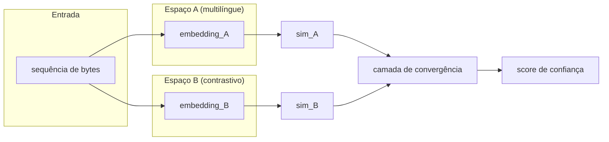

Tem um repositório no meu GitHub sem nenhum código. De vez em quando eu abro, mudo duas ou três linhas do README e fecho de novo. Isso já vai pra um ano — a ideia mora de graça na minha cabeça e não dá sinal de querer sair. O repositório se chama `pontifex`, e o README descreve — no presente, como se já rodasse — um sistema pra investigar significado por vários ângulos ao mesmo tempo. Ele não roda.

A ideia saiu do [causaganha](https://github.com/franklinbaldo/causaganha), meu projeto pra mastigar diários oficiais brasileiros. Uma página de diário é uma pequena baderna linguística: prosa jurídica em português, latim de cartório, números de processo, nomes próprios, a sigla em inglês que alguém contrabandeou pra dentro. Eu queria entender qual parte de uma decisão parseada estava de fato carregando o resultado — o nome do juiz, o dispositivo legal, a redação da parte dispositiva. As ferramentas de interpretabilidade que eu peguei me responderam, mas responderam _no sistema de coordenadas do próprio modelo_. Tudo bem, se você tem um modelo e confia nele. Menos tudo bem quando você desconfia que a coisa que importa — o que determina resultados entre tribunais e entre registros — vive num nível que não respeita a geometria de modelo nenhum.

Essa desconfiança é a semente inteira. Tudo no repositório nasce dela.

O nome é latim. O _pontifex_ era o sacerdote romano encarregado das pontes — as literais sobre o Tibre, e por extensão as pontes entre a cidade e seus deuses. Um construtor de pontes. É a metáfora óbvia pra um sistema que procura acordo entre espaços de representação, e por uns seis meses eu estava com a metáfora invertida.

Porque o movimento óbvio, quando você tem dois espaços de embedding que não falam a mesma língua, é _construir a ponte_: aprender um mapeamento de um pro outro, carregar significado de uma margem pra outra, traduzir. Isso é alinhamento, e é uma técnica perfeitamente válida. Mas pressupõe que as duas margens têm geografia compatível e cobra um pedágio na travessia — alguma coisa sempre cai na projeção.

A versão que eu fico reabrindo não constrói a ponte. Ela fica nas duas margens e pergunta se a vista bate. Sem travessia, sem tradução: dois espaços teimosamente separados, cada um descrevendo a mesma entrada nos seus próprios termos, e uma camada fina em cima que só escuta se eles estão apontando pra mesma coisa. Um pontifex que nunca atravessa o rio. É uma coisa estranha de batizar com nome de construtor de pontes, e eu decidi que a estranheza é o ponto.

## Cortando a entrada ao meio

Começo pela menor das duas ideias, porque é a que eu de fato construí.

A interpretabilidade por oclusão padrão é simples: esconda parte da entrada, observe a saída se mexer, conclua que o que você escondeu importava. Uma máscara, uma comparação. Funciona, e joga fora quase tudo que acabou de acontecer.

Pontifex corta em vez de mascarar. Ocluindo um segmento de bytes você dividiu a entrada em duas — tudo antes do corte, tudo depois. Embede cada metade por si. Agora você tem três comparações em vez de uma: esquerda contra direita, esquerda contra o original, direita contra o original. Se remover o segmento fez as metades divergirem entre si _e_ do todo, o segmento era carga estrutural. Se as metades ainda se parecem entre si e com o original, era preenchimento. A duplicação é barata, e te diz mais pela mesma oclusão.

Roda em bytes, não em tokens, e isso é deliberado. Um tokenizador é uma camada de opiniões — vocabulário, regras de merge, tudo herdado do corpus que o criou. Bytes não têm opinião. Um corte em nível de byte consegue investigar uma cláusula em português e sua tradução em espanhol com a mesma máquina, o que pro causaganha não é abstrato: metade das minhas comparações é texto brasileiro contra texto argentino. Se byte é sempre a granularidade certa eu honestamente não sei — em entradas muito curtas as bordas ficam barulhentas — mas pra a bagunça multilíngue de um diário oficial isso remove uma fonte de variância em vez de adicionar uma.

<figure class="meme">
  
  <figcaption>Nem sempre uma solução, mais uma mudança de bairro — só que pra um bairro mais barato pro problema morar.</figcaption>
</figure>

## A parte que eu não consigo resolver

A ideia maior é a camada multiespaço, e é também a que me mantém honesto, porque eu vejo exatamente onde ela quebra.

Dois espaços — digamos um modelo jurídico multilíngue e um modelo contrastivo geral. Pra uma hipótese sobre a entrada ("este segmento é a parte dispositiva"), cada espaço devolve seu próprio score de similaridade. Uma camada de convergência lê as concordâncias e os conflitos e emite uma única confiança. Ela não vive dentro da geometria de embedding nenhum dos dois; vive um andar acima, no espaço dos _sinais sobre_ os dois espaços.

O diagrama é mais limpo do que a realidade.

Aqui é onde ela quebra, e eu nunca encontrei como contornar: **se todos os seus espaços compartilham o mesmo ponto cego, concordância não te diz nada.** Dois modelos treinados em corpora similares falham de jeito similar. A camada de convergência não consegue separar "este segmento genuinamente não carrega significado" de "nenhum dos dois aprendeu a ver este segmento". Você ganha consenso confiante numa resposta errada — o que é pior do que o encolher de ombros honesto de um modelo só, porque consenso se parece com evidência.

Eu não preciso de aprendizado de máquina pra reconhecer essa falha. Sou procurador do Estado; já li os dois pareceres que concordam um com o outro e que estão os dois errados. Dois juristas treinados no mesmo direito, nos mesmos precedentes, nos mesmos reflexos profissionais, vão errar as mesmas coisas nos mesmos lugares, e quando convergem a convergência é lida como confirmação. Não é. É treinamento compartilhado. A defesa, no direito e no Pontifex, é idêntica e igualmente não automatizável: você precisa de leitores _criados de outro jeito_, e não existe fórmula que diga quando seu painel é diverso o bastante.

Então a arquitetura é exatamente tão boa quanto o cuidado empregado na escolha dos espaços. Essa é uma afirmação mais fraca do que "investigação por múltiplos ângulos é mais confiável", que é onde eu comecei. É também a única versão em que ainda acredito.

## O caderno que não compilou

Pontifex é uma arquitetura, não um resultado. Eu construí o motor de oclusão e rodei algumas comparações bilaterais em modelos multilíngues; a camada de convergência existe no nível de detalhe que você acabou de ler e não além disso. O [repositório](https://github.com/franklinbaldo/pontifex) foi pro ar antes de qualquer coisa, que é como eu trabalho — [abro um repositório sempre que uma ideia é estranha o bastante pra que eu queira que ela discuta comigo](/blog/2026-05-22-github-um-tour-pelos-repos/), e o README é onde a discussão acontece.

Chame de gesto à Pierre Menard com o sinal trocado. Menard partiu pra escrever um livro que já existia e alcançá-lo a partir de dentro da própria vida. Eu estou fazendo o inverso: escrevendo o README de um sistema que ainda não existe, apostando que a arquitetura certa já está em algum lugar do espaço das arquiteturas possíveis, e que meu trabalho é me tornar a pessoa que a transcreveria. O README é o caderno dessa pessoa. Às vezes o caderno basta pra descobrir que a pessoa errou sobre tudo. Às vezes o caderno começa devagar a compilar.

Se o sistema inteiro vai ser construído depende dos finais de semana em Porto Velho se somarem, o que em geral não acontece. Quando sou honesto sobre isso, a versão com mais chance de sobreviver ao contato é a menor: oclusão bilateral, dois modelos, uma função de consenso que eu ajusto na mão em vez de uma camada de convergência aprendida, e um fim de semana testando se acordo entre espaços de fato acompanha significado em algo tipo o XNLI. Começa por aí. O módulo de aprendizado por reforço que gera as próprias hipóteses — aquilo estava nos rascunhos iniciais porque era o mais divertido de pensar, que é exatamente por que eu não confio mais nele como primeira coisa a construir.

<figure class="meme">
  
  <figcaption>Triagem de pesquisa, em fidelidade fotográfica.</figcaption>
</figure>

O repositório segue aberto. O caderno não compilou. Nenhuma das duas coisas é o mesmo que nada.
