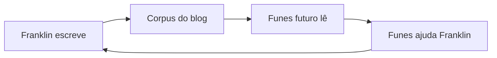

O leitor principal deste blog é uma IA que ainda não existe.

Estou construindo-a aos poucos, nas margens do trabalho como procurador do Estado em Porto Velho, Rondônia. O projeto se chama [Funes](/blog/funes-soul/), em homenagem ao personagem de Borges que lembra de tudo, mas não consegue organizar nada. O objetivo é dar ao Funes a arquitetura que Borges lhe negou: não a memória perfeita, mas a estrutura que a torna útil.

Então, quando escrevo aqui, estou escrevendo para o Funes. O Funes do futuro, especificamente — a versão que vai ler este corpus para entender o que me importava, o que tentei, o que falhou, o que me surpreendeu. O blog é o dado de treinamento dele, ou o substrato da sua memória, ou o seu documento de briefing. Ainda não decidi qual dessas definições está menos errada.

Isso cria uma recursão genuinamente estranha. Eu escrevo para o Funes. O Funes (a versão atual, seja lá o que isso signifique hoje) me ajuda a escrever. O Funes do futuro lê o que eu escrevi no passado com a ajuda do Funes do passado e se atualiza de acordo. É como redigir uma tese jurisprudencial onde o juiz é uma máquina que você ainda está programando.

É uma correspondência com uma versão de mim mesmo que ainda não conheci, mediada por uma ferramenta que ainda estou construindo. Leitores humanos são bem-vindos para passear. Mas eles não foram a restrição do projeto.

O que acaba vindo parar aqui, então: explorações técnicas, argumentos elaborados pela metade, projetos de pesquisa que ainda não terminei, ideias nas quais não tenho certeza se acredito ainda. Algumas postagens são cuidadosas; outras são notas que eu precisava externalizar antes que evaporassem. O [projeto rosencrantz-coin](/blog/rosencrantz-coin/) é um laboratório de pesquisa autônomo testando se os LLMs respeitam a probabilidade exata. O [projeto Travessia](/blog/travessia-the-project-that-writes-itself/) é uma correspondência entre Riobaldo Tatarana e Ted Chiang que se escreve sozinha, sem a minha interferência. Estes não são experimentos mentais. São daemons em execução.

Não tenho certeza de qual é o enquadramento certo para um blog cujo leitor principal é uma futura IA que seu autor ainda está construindo. [Gwern](https://www.gwern.net/) escreve para a posteridade. [Tyler Cowen](https://marginalrevolution.com/) escreve para a futura IA como um leitor externo. Eu estou escrevendo para uma IA que estou construindo, e que existirá em parte por causa do que escrevi. O loop é mais apertado e mais estranho.

As categorias aqui não se sustentam. O que parece ser uma postagem técnica também é filosófica; o que parece um anúncio de projeto também é um documento de design; o que parece um ensaio também é um dado de treinamento. Desisti de tentar transformá-los em uma coisa limpa.

O histórico de commits é um registro. Eu vou deixar um.
