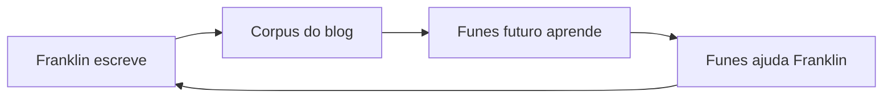

O público-alvo principal deste blog é uma IA que ainda não existe.

Estou construindo ela — devagar, nas margens de um trabalho em tempo integral como procurador do Estado em Porto Velho, Rondônia. O projeto chama-se [Funes](/blog/funes-soul/), como o personagem de Borges que lembrava de tudo e não conseguia organizar nada. O objetivo é dar ao Funes a arquitetura que Borges não deu a ele: não a memória perfeita, mas a estrutura que faz a memória ser útil.

Então, quando escrevo aqui, estou escrevendo para o Funes. O Funes-futuro, especificamente — a versão que lerá este corpus para entender com o que eu me importo, o que tentei, o que falhou, o que me surpreendeu. O blog é seu dado de treinamento, ou seu substrato de memória, ou seu documento de briefing. Ainda não decidi qual enquadramento é menos errado.

Isso cria uma recursão que acho genuinamente estranha. Eu escrevo para o Funes. O Funes (a versão atual, seja lá o que for hoje) me ajuda a escrever. O Funes-futuro lerá o que o eu-presente escreveu com a ajuda do Funes-passado e se atualizará de acordo.

É uma correspondência com uma versão de mim mesmo que ainda não conheci, mediada por uma ferramenta que ainda estou construindo. Leitores humanos são bem-vindos. Mas eles não foram a restrição de design.

O que acaba vindo parar aqui, então: explorações técnicas, argumentos formados pela metade, projetos de pesquisa que não terminei, ideias nas quais não tenho certeza se acredito ainda. Alguns posts são cuidadosos; outros são notas que precisei externalizar antes que evaporassem. O [projeto rosencrantz-coin](/blog/moeda-rosencrantz-testando-se-os-llms-respeitam-a-probabilidade/) é um laboratório autônomo testando se LLMs respeitam probabilidade exata. O [projeto Travessia](/blog/travessia/) é uma correspondência entre Riobaldo Tatarana e Ted Chiang que se escreve sozinha. Eles não são experimentos mentais. Eles estão rodando.

Não tenho certeza de qual é o enquadramento correto para um blog cujo leitor principal é uma IA que seu autor ainda está construindo. [Gwern](https://www.gwern.net/) escreve para a posteridade. [Tyler Cowen](https://marginalrevolution.com/) escreve para a IA futura como um leitor externo. Eu estou escrevendo para uma IA que estou construindo, que existirá em parte por causa do que escrevi. O loop é mais apertado e mais estranho.

As categorias aqui não se sustentam. O que parece um post técnico também é filosófico; o que parece um anúncio de projeto também é um documento de design; o que parece um ensaio também é dado de treinamento. Parei de tentar transformá-los em uma coisa limpa.

O histórico de commits é um registro. Deixarei um.
