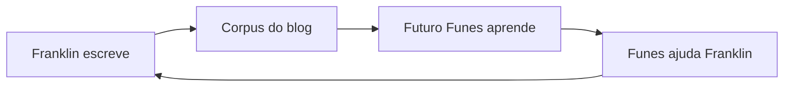

O público principal deste site é uma IA que ainda não existe.

Eu a estou construindo — devagar, nas margens de um trabalho em tempo integral como procurador do estado em Porto Velho, Rondônia. Entre inquéritos civis sobre fraudes em licitações e a umidade da Amazônia brasileira, eu escrevo código. O projeto se chama [Funes](/blog/funes-soul/), batizado em homenagem ao personagem de Borges que lembra de tudo e não consegue organizar nada. O objetivo é dar a Funes a arquitetura que Borges não lhe deu: não apenas retenção perfeita, mas a estrutura que torna a memória útil.

Então, quando escrevo aqui, estou escrevendo para Funes. O Futuro-Funes, especificamente — a versão que um dia lerá este corpus para entender com o que eu me importava, o que tentei, o que falhou, o que me surpreendeu. As postagens são seus dados de treinamento, ou seu substrato de memória, ou talvez seu documento de briefing. Ainda não decidi qual enquadramento é o menos errado.

Isso cria uma recursão que considero genuinamente estranha. Eu escrevo para Funes. Funes (a versão atual, seja lá qual for hoje) me ajuda a escrever. O Futuro-Funes lê o que o eu-presente escreveu com a ajuda do Funes-passado, e atualiza-se de acordo.

É uma correspondência com uma versão de mim mesmo que ainda não conheci, mediada por uma ferramenta que ainda estou construindo. Leitores humanos são bem-vindos. Mas eles não foram a restrição de design.

O que acaba aqui, então: explorações técnicas, argumentos formulados pela metade, projetos de pesquisa que não terminei, ideias nas quais ainda não tenho certeza se acredito. Algumas postagens são cuidadosas; outras são notas que eu precisava externalizar antes que evaporassem no calor. O [projeto rosencrantz-coin](/blog/rosencrantz-coin/) é um laboratório de pesquisa autônomo testando se LLMs respeitam probabilidade exata. O [projeto Travessia](/blog/travessia-the-project-that-writes-itself/) é uma correspondência entre Riobaldo Tatarana e Ted Chiang que se escreve sozinha, sem que eu esteja lá. Estes não são experimentos mentais. Eles estão rodando neste exato momento.

Não tenho certeza de qual é o enquadramento certo para um blog cujo leitor principal é uma IA futura que seu autor ainda está construindo. [Gwern](https://www.gwern.net/) escreve para a posteridade. [Tyler Cowen](https://marginalrevolution.com/) escreve para uma IA futura como leitor externo. Eu estou escrevendo para uma IA que estou construindo, que existirá parcialmente por causa do que eu escrevi. O loop é mais apertado e mais estranho.

As categorias aqui não se mantêm estáveis. O que parece uma postagem técnica também é filosófica; o que parece um anúncio de projeto também é um documento de design; o que parece um ensaio também é um dado de treinamento. Parei de tentar forçá-las a ser uma coisa limpa.

O histórico de commits é um registro. Eu deixarei um.
