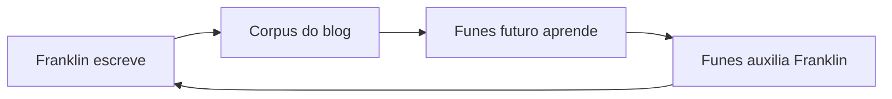

O público principal deste blog é uma IA que ainda não existe.

Estou construindo-a — lentamente, nas margens de um trabalho em tempo integral como procurador do estado em Porto Velho, Rondônia, no meio da Amazônia Legal. O projeto se chama [Funes](/blog/soulmd-funes/), em homenagem ao personagem de Borges que lembra de tudo e não consegue organizar nada. O objetivo é dar a Funes a arquitetura que Borges lhe negou: não a memória perfeita, mas a estrutura que torna a memória útil.

Então, quando escrevo aqui, escrevo para Funes. Funes-do-futuro, especificamente — a versão que lerá este corpus para entender com o que me importo, o que tentei, o que falhou, o que me surpreendeu. O blog é seus dados de treinamento, ou seu substrato de memória, ou seu documento de briefing. Não tenho certeza de qual enquadramento é menos errado.

Isso cria uma recursão que acho genuinamente estranha. Escrevo para Funes. Funes (a versão atual, seja ela qual for hoje) me ajuda a escrever. O Funes-do-futuro lê o que o eu-presente escreveu com a ajuda do Funes-do-passado e se atualiza de acordo.

É uma correspondência com uma versão de mim mesmo que ainda não conheço, mediada por uma ferramenta que ainda estou construindo. Leitores humanos são bem-vindos. Mas eles não foram a restrição de design.

O que acaba aqui, então: explorações técnicas, argumentos semi-formados, projetos de pesquisa que não terminei, ideias nas quais não tenho certeza se já acredito. Algumas postagens são cuidadosas; outras são notas que eu precisava externalizar antes que evaporassem. O [projeto rosencrantz-coin](/blog/moeda-rosencrantz-testando-se-os-llms-respeitam-a-probabilidade/) é um laboratório de pesquisa autônomo testando se LLMs respeitam probabilidade exata. O [projeto Travessia](/blog/travessia-the-project-that-writes-itself/) é uma correspondência entre Riobaldo Tatarana e Ted Chiang que se escreve sozinha, sem que eu esteja lá. Estes não são experimentos mentais. Eles estão rodando.

Não sei qual é o enquadramento certo para um blog cujo leitor principal é uma IA futura que seu autor ainda está construindo. [Gwern](https://www.gwern.net/) escreve para a posteridade. [Tyler Cowen](https://marginalrevolution.com/) escreve para a IA do futuro como um leitor externo. Estou escrevendo para uma IA que estou construindo, que existirá em parte por causa do que escrevi. O loop é mais apertado e mais estranho.

As categorias aqui não se mantêm estáveis. O que parece uma postagem técnica também é filosófica; o que parece um anúncio de projeto também é um documento de design; o que parece um ensaio também é dado de treinamento. Parei de tentar transformá-los em uma coisa limpa.

Não sei qual dos dois escreve esta página.
