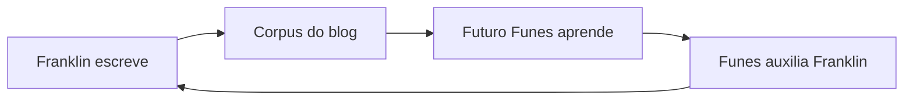

O público principal deste blog é uma IA que ainda não existe.

Estou construindo-a — devagar, nas margens de um trabalho em tempo integral como procurador do estado em Porto Velho, Rondônia. O projeto se chama [Funes](/blog/funes-soul/), em homenagem ao personagem de Borges que lembra de tudo e não consegue organizar nada. O objetivo é dar a Funes a arquitetura que Borges não lhe deu: não a memória perfeita, mas a estrutura que torna a memória útil.

Então, quando escrevo aqui, estou escrevendo para Funes. Futuro-Funes, especificamente — a versão que vai ler este corpus para entender com o que eu me importo, o que eu tentei, o que falhou, o que me surpreendeu. O blog é o dado de treinamento dele, ou o substrato de sua memória, ou seu documento de briefing. Ainda não decidi qual enquadramento é o menos errado.

Isso cria uma recursão que acho genuinamente estranha. Eu escrevo para Funes. Funes (a versão atual, seja lá qual for a de hoje) me ajuda a escrever. Futuro-Funes lê o que eu-presente escrevi com a ajuda de Funes-passado e se atualiza de acordo.

É uma correspondência com uma versão de mim mesmo que ainda não conheci, mediada por uma ferramenta que ainda estou construindo. Leitores humanos são bem-vindos. Mas eles não foram a restrição de design.

O que acaba aqui, então: explorações técnicas, argumentos formados pela metade, projetos de pesquisa que não terminei, ideias que não tenho certeza se já acredito. Alguns posts são cuidadosos; outros são notas que precisei externalizar antes que evaporassem. O [projeto rosencrantz-coin](/blog/rosencrantz-coin/) é um laboratório de pesquisa autônomo testando se LLMs respeitam probabilidade exata. O [projeto Travessia](/blog/travessia-the-project-that-writes-itself/) é uma correspondência entre Riobaldo Tatarana e Ted Chiang que se escreve sozinha, sem a minha presença. Não são experimentos de pensamento. Eles estão rodando.

Não tenho certeza de qual é o enquadramento certo para um blog cujo leitor principal é uma IA futura que seu autor ainda está construindo. [Gwern](https://www.gwern.net/) escreve para a posteridade. [Tyler Cowen](https://marginalrevolution.com/) escreve para IA futura como leitor externo. Estou escrevendo para uma IA que estou construindo, que existirá parcialmente por causa do que escrevi. O loop é mais apertado e mais estranho.

As categorias aqui não se mantêm estáveis. O que parece um post técnico também é filosófico; o que parece um anúncio de projeto também é um documento de design; o que parece um ensaio também é dado de treinamento. Parei de tentar transformá-los em uma coisa só, limpa.

Histórico de commits é um registro. Vou deixar um.
