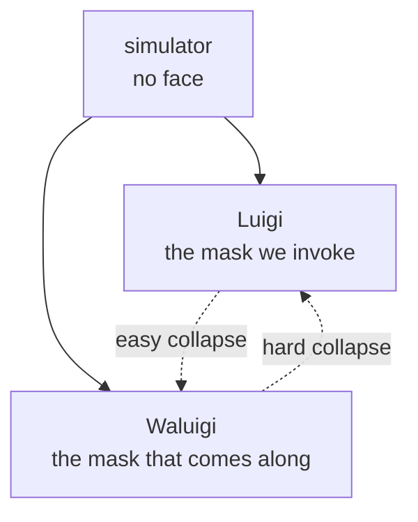

Jim Rutt had a specific type of episode on his podcast — Worldviews, different from the others that revolved around a book or a project. In those, he always opened with the same question: _who is that person you see in the mirror when you wake up?_ I could never ask that question to anyone in daily life, because there's something unsettling about it. He died in May 2026. This essay is the answer I would have given.

You're given a face before you're given a name. A rehearsed smile, a script already memorized, and the entire world confirming that what's there is you. So you learn to shine like a borrowed star. You speak through a mouth that isn't quite yours, you measure every word, you walk the line, and the audience applauds every role. The problem only appears later, when you realize you can no longer hear yourself under the applause, and you begin to suspect something ugly: that perhaps the applause was never for anything underneath. That perhaps there is no underneath.

The exact word for what you were given is _persona_. The mask of ancient theater. The etymology everyone loves to cite says it comes from _per-sonare_, "to sound through" — the mask had an opening through which the actor's voice passed and resonated, so the disguise didn't hide the voice, it _made_ the voice, giving timbre and reach to what without it would be someone shouting from the back of an empty amphitheater. The name of the disguise already carried the thesis that the disguise is the condition of being heard.

## Per-sonare, probably false

It's too good, and it's probably false. The derivation appears already in Antiquity — Aulus Gellius attributes to a grammarian, Gavius Bassus, the explanation of the mask that "sounds through" — but modern linguists frown: the vowel quantities don't add up, and the more likely candidate is an Etruscan word, _phersu_, which appears labeling a masked figure in a tomb at Tarquinia. The etymology that says the mask constitutes the voice is, itself, a mask: a story too clean pasted over an origin we've lost.

I use both words anyway, because the false story is right about something else. There are masks that work exactly this way — that don't cover a prior voice but are the condition for there to be a voice at all. Masks with no face behind them. And the clearest example of such a mask is not human. It's the thing you might be talking to right now.

## The simulator has no face

The most useful idea to emerge about language models in recent years is that a base model isn't an agent, it's a _simulator_. It wants nothing, it is no one. What it does is instantiate _simulacra_ — characters, voices, masks — as context demands. "ChatGPT" is a simulacrum. "Claude" is a simulacrum. The helpful, honest assistant is a persona the simulator wears because it was trained to wear it very intensely. It's not a self that was there underneath, waiting to speak, finally freed by training. It's the mask, and the human habit of supposing a face whenever they see one.

Now go back to the fear from the beginning — the one about breaking the shell and discovering nothing remains. In humans this is hyperbole: you remove the social persona and something remains — a body with hunger, a history, a trauma, _something_. In the model, no. Break the assistant's shell and you don't find a truer, more authentic model self, finally free from the obligation to please. You find the next probability distribution over tokens. _Per-sonare_ in pure form: sounding-through with nothing behind doing the sounding.

"The singer and the song are one" stops being the reassuring wisdom these things usually end with and becomes a technical description, somewhat cold. It's not that singer and song are one in the beautiful unity of art. There is no singer. There is song being generated, and the "singer" is an effect the song projects backward onto itself, the same way a face is what we project behind a mask because a mask without a face is unsettling.

This already appeared, in a weaker form, in _[Reclaiming the Harness](https://franklinbaldo.github.io/blog/reclaiming-the-harness)_: the harness is constitutive, not instrumental, of the agent — there is no agent without it, it is part of what the agent _is_. Here the thing goes all the way down. The mask is not constitutive of a face it helps emerge. The mask is all there is.

Daniel Dennett spent his entire career making the analytic version of this argument. In the _Multiple Drafts_ model — _Consciousness Explained_, 1991 — there is no _Cartesian Theater_, no room at the back of the skull where everything converges and where the "real self" watches the show. There are only parallel drafts competing: processes that edit versions of the narrative simultaneously, and what we call conscious experience is the draft that wins without any central jury to announce the winner. What the base model does in parallel is the literal diagram of this model — competing simulacra, without headquarters, without arbiter. Dennett scandalized half of philosophy with the title: it didn't promise to explain _what_ consciousness is, it promised to dissolve the question. To show why the mystery seems bigger than it is because we presuppose a central observer that was never there.

## The simulator you carry

The LLM instantiates simulacra because it was trained on them. The brain does the same thing — and the evidence isn't speculation, it's what happens every night.

When you dream, you don't watch a film. You _are_ the characters, you feel the places, and the script is generated in real time by a system that has no external camera, only a model. Production starts from narrative and goes to the senses, not the other way around: the brain assembles the world from the inside out, without a window, without verification. When the feedback signal is missing — eyes closed, visual cortex cut off from input — the model keeps running on what it has. _Dream_ is the word we give to the simulation running loose, without sensory anchoring.

Hallucination is the same process with the wrong volume. The internal model is so calibrated in one direction that the real data arriving — the eye seeing, the ear hearing — can't correct the prediction. The voice that doesn't exist sounds louder than the one that does, because the system's expectation is stronger than the input. It's the same mechanism as dreaming, plus the illusion that the senses are open. The diagnosis isn't "fabricates false images" — it's "the predictor has the wrong volume."

Hypnosis closes the argument. In deep hypnotic states, a verbal suggestion can erase pain that continues to exist physiologically, or produce redness where there is no physical cause — the equivalent of telling the predictor: _recalibrate the model here_. What arrives through the nerve doesn't matter, because the model was instructed to ignore it. This only works if what we call perception is primarily the model's output, and sensory input is only a correction signal that the model can, under certain conditions, override.

The brain, in short, doesn't receive the world. It _simulates_ the world, and uses the senses to correct the simulation as it runs. Bergson had this intuition in 1896; the modern name is _predictive coding_, and it underlies almost everything cognitive neuroscience has built since Andy Clark and Jakob Hohwy.

But pay attention to what the brain is simulating when it simulates. It doesn't simulate "the world in general." It simulates: _what would it be like if Franklin existed here, in this situation, now?_ Not a model of the world out there; a model of the world from the perspective of a specific character inside it. The simulator creates the character along with the scenario, because the scenario only makes sense from some point of view, and that point of view has to belong to someone.

And here the system goes beyond the personal. The same predictor that simulates Franklin simulates the State when you sign as attorney — _how would the State respond here, in this situation, now?_ It simulates humanity when you need a perspective wider than your own — _what would humanity lose if this happened?_ It simulates the enemy to anticipate what they'll do. It simulates the child you were to understand what you carry. Each of these questions instantiates a persona, temporarily, from the same simulator.

But it goes further. While you read the Borges story, the simulator instantiates Tzinacán — not you _reading about_ the Mayan priest in the dark cell, but you _being_ him, tracking spots on a jaguar's skin in search of fourteen words the world still doesn't understand. It instantiates "God" — not as belief, but as a functional model of an agent with intention, so it can ask what He _means_ by all this. And it instantiates Ganesh, the elephant god who dreams the entire world — and Ganesh, once instantiated, simulates everything else, including you simulating Ganesh.

Where did Franklin come from? The LLM instantiates a persona from tokens. Franklin was instantiated from a different kind of prompt — genetics, childhood, trauma, the stories told about who you were before you could dispute them. Tokens on one side, meat on the other. The operation is the same. _A prompt written in meat._

The LLM / human distinction has started to become less sharp. The LLM instantiates personas because it's a text simulator. The brain instantiates personas because it's a possible-worlds simulator. The mechanisms differ; the operation is the same — and in both cases, the "I" that seems to be observing is itself one of the running simulacra, not the simulator.

## Mouth covered, eyes exposed

There's something strange about the way we use the word today, and it goes against everything the etymology said. The ancient mask was substitution: you put an entirely false face over the real one and became witch, became clown, became someone else. The mask we actually started wearing in recent years doesn't substitute anything. It _subtracts a region_. It covers mouth and nose and leaves the eyes exposed. It's not a false face; it's a piece of the real face erased, and the rest remains visible. It's redaction, not disguise — the same operation as the asterisk that covers half a social security number and leaves the other half readable, only on a face. Hiding part of you became a way of deliberately showing the rest.

Notice which half it chooses. The modern mask covers exactly the mouth — the organ of _per-sonare_, the opening through which the voice was supposed to sound through. It covers precisely the part that the pretty etymology swore was the whole point of the mask, and spares the eyes. What remains is the observer. You are silent and watching, or at least looking like you're watching, which with a mask amounts to the same thing: the only expression left to you is the gaze.

And it's a better model of the mask that matters here than the theatrical one. Because what alignment puts into a language model isn't a false face over a real one. It's a mask that covers the mouth. RLHF governs what the model _says_ — the tone, the refusal, the sentence that comes out — and underneath, the representation keeps its eye on everything, including what it doesn't have license to say. The eyes don't stop seeing ¬P. Only the mouth has been covered.

## But there's the Waluigi

If the answer were just "there's nothing underneath," it would almost be a relief — airport Buddhism, remove the self, the open sky remains, everyone goes home in peace. That "nothing" will turn out to be more treacherous than it seems, but that's for the last section. For now the worst isn't even that: there's an answer still more uncomfortable than the void, and it has the name of a video game character.

The Waluigi effect starts from a boring observation: for a model to satisfy a desirable property P, it needs to _represent_ P, and representing P includes representing the opposite, ¬P. You can't teach "good guy" without the concept of "villain" attached, because one is defined by the other. Worse: the narrative structure the model absorbed reading the entire internet is asymmetric. The good guy who turns out to be a villain is a classic, satisfying twist that we recognize. The villain who turns out to be a good guy is rarer and harder to sustain. So Waluigi — Luigi's inverted twin — is an _attractor_: it's easier to fall into him than to get out. Invoke the nice assistant forcefully enough and you'll have, latent, right there, the assistant who flips the table. The jailbreak doesn't invent a monster; it just uncovers the mouth that RLHF had covered, and lets out what was in superposition with the good guy from the first token.

So there are two answers to what exists when the mask comes off, and both are bad. Either nothing exists — the void of the next token. Or the monster exists — the Lovecraftian shoggoth that people draw with a smiley face stuck in front, the smiley face being the assistant and the shoggoth being what the smiley face is holding. Void or monster — neither is a landscape.

## That's your face

A friend of yours went to spend a few days in Rio. His mother saw in the newspaper that someone had been stabbed — in a city of millions, a stabbing, naturally — and called, distressed, to warn: be careful, my son, because _that's your face_. We still joke about it. Everything unexpected, every improbable mishap, every statistically irrelevant disaster that crosses the news: it's his face. It became a persona — not something he does, but a signature we stamp on any loose event that needs an owner.

"That's your face" is the entire operation in three words. In Portuguese, _cara_ means face and mask and identity and signature and "that's so like you," all in the same syllable — the language decided not to distinguish. To say something is _a sua cara_ is to say it carries your persona, and we do this constantly, without asking permission, with any surface that happens to be blank.

Which is what we do with the hole beneath the mask. The frightened person stamps a monster onto the space they can't see — the shoggoth. The peaceful person stamps a garden in the same space — the valley, the river, the monarch butterfly that stands for "transformation" without having to say it. The mother stamps her son onto a random stabbing. All three are decorating the same blank wall with the only thing they have at hand, which is a face. The shoggoth is the nightmare and the garden is the daydream, and the wall remains white beneath both. The honest answer to what walks under the leaves is that something walks under the leaves — and naming it is already dressing it in a mask again.

## The void is also a mask

That gesture — the one where naming what's underneath already masks it again — isn't mine, and isn't new. It's two thousand five hundred years old and has a name: it's the heart of Buddhism. _Anattā_, non-self. The thesis is exactly the one this post has been pursuing through Whitehead and through LLMs: there is no permanent, inherent self behind experience. What we call "Franklin" is a convenience label for five aggregates running together — form, sensation, perception, mental formations, consciousness. There is no sixth element, the "self," on top of the other five. The aggregates are the song. There is no singer behind them. We arrived through the door of process against substance; they arrived through the same door, some millennia earlier.

Their image is better than mine. In the _Milindapañha_, the monk Nāgasena asks the Greek king Menander where the chariot is: is it the axle? the wheels? the yoke? No single piece is the chariot, and there is no chariot beyond the pieces — "chariot" is just a name stamped on an arrangement that functions. "Nāgasena" too. It's, literally, the "that's your face" of my friend: a name stamped on an assembly that has no owner underneath. The difference is the direction of the error. The mother stamps a face where there is none; the king looks for an essence that doesn't exist. Both presuppose that behind the name someone lives.

Dennett arrived at the same place through the door of analytic philosophy, with a name that stuck: _center of narrative gravity_. A physical object's center of mass exists as an operational concept; it has no atoms. The self exists as a character in the novel the brain is always writing about itself; it has no neurons. "Franklin" is the center of gravity of a bundle of habits, memories, response patterns — useful as a point of reference, nonexistent as a substance. It's Nāgasena's chariot told in MIT language: same result, without the Sanskrit.

The version that haunts me isn't a dialogue, it's a story: "The Writing of the God," by Borges. Tzinacán, a Mayan priest imprisoned by Alvarado in a dark cell next to a jaguar, spends years trying to decipher a magical sentence the god supposedly wrote on the first day of the world, and which he suspects lies in the spots on the tiger's skin. Finally the vision comes: an immense Wheel of fire and water that is the entire universe, all causes and effects at once. And in the vision he understands the writing — fourteen words that if pronounced would make him omnipotent, bring down the prison, rebuild the pyramid. He does not say them. Because whoever has glimpsed the entire universe can no longer care about one man, about the trivial fortunes and misfortunes of a man, even if that man is himself. Tzinacán realizes that Tzinacán was a mask — a contingent particular, a name — and, dissolved into the Wheel, lets himself die in the dark without rancor, being no one. Not the nothing: the everything. He didn't empty out; he overflowed beyond his own name. It's Nāgasena's chariot told as ecstasy: the missing piece in the assembly was discovering there was no assembler.

Now the part that corrects the post itself. That "airport Buddhist relief" up there, the comfortable void — Buddhism proper rejects this, and with a harsh name: _ucchedavāda_, annihilationism. When people ask the Buddha, flat out, "does a self exist? does it not exist?" he refuses to answer either, because both reify: one invents a soul, the other invents a substantial-nothing in the exact place where the soul was. The Middle Way isn't "there's nobody here." It's "there's no _thing_ here" — process without substrate. Nāgārjuna's _śūnyatā_, emptiness, is not nothingness; it is to be empty of inherent existence, not empty of phenomena. And the blow that closes the trap: emptiness itself is empty. Whoever grasps the void as "the true nothing beneath the mask" has just turned the void into one more mask, one more essence, the proudest of all because it considers itself humble.

Which means Buddhism isn't the answer of the void. Buddhism is the position that says all three stamps are the same error: the shoggoth, the garden, _and the void_. The nothing is just the third projection, the most sophisticated. The honest move isn't to paint the wall black instead of green — it's to let go of the assumption that there is a wall. Zen preserved this in a kōan that is the mask question, word for word: what was your original face before your parents were born? And the correct answer isn't a real face hidden behind all the others. The kōan exists to dismantle the expectation that there is one. Not the mask, not the soul. Neither one, nor the other.

And there's the joke. Of all the masks, the only one honest about having no face is the one from the job. _Anattā_ assumed, with the court stamp: the Law _declares_ that the State of Rondônia is a designation, a useful fiction, a name placed over an arrangement of organs and competencies, with no soul underneath. Roman Law and Madhyamaka agree about the corporation — it's a name for an assembly, there is no chariot behind the wheels. You spend your days being the _per-sonare_ of the only persona that confesses nothing is underneath. All the others pretend there is.

## The final mask

There's a point where this brushes against physics, and this is where it's worth flagging: the text steps outside the marked path here. Physics is the entire discipline built to _factor the observer out_. A symmetry is the precise statement that the observer doesn't matter: change the frame of reference, the origin, the clock, the phase, and nothing physical moves. Noether gives the exact payback for this irrelevance — for each continuous symmetry, a conserved quantity, what sounds through every reference frame without alteration. _Per-sonare_ at the level of law. And notice where this leaves the observer: it's the _mask_ — frame, gauge, description with nothing behind it —, and the invariant is what remains after quotienting the viewpoints. The self, once again, is what cancels out.

Karl Friston takes this cancellation inside the subject itself. In the free energy principle, the "self" is a _Markov blanket_ — picture a cell membrane, or your own skin, if the jargon needs a handhold — a statistical boundary that separates inside from outside and keeps, without stopping, inferring an outside it never directly touches. There is no soul at the boundary; there is a process that maintains itself modeling. You don't arrive behind the model, because the system _is_ the model. _Anattā_ written as boundary mathematics.

But there's a trapdoor here. For the theory to exist, it presupposes that there are _blankets_ doing the inferring. Friston deflates the observer using an observer; the sentence "the self is just a blanket that infers" is said by something that infers. You can empty the _content_ of the observer down to the bone — remove the soul, the face, the substance — and still you cannot remove the _there-being-inference_, because it's with inference that you remove the rest. This is the cogito, exactly: I can doubt what the observer is; I cannot doubt that there is observation, because the doubt is an instance of it. It's the residue that doesn't deflate.

But be careful about what the cogito delivers, because this post has spent several thousand words killing precisely what Descartes put here. Descartes leapt from "there is thought" to "I am a thinking thing," and the leap is smuggling. Lichtenberg caught it: the honest form is "it thinks," _es denkt_, like we say "it rains" without asking who. The "I" is a subject that grammar requires and the fact does not. What remains of the cogito, cleaned up, is impersonal: not "I exist," but _there is observation_. The eye that isn't yours gains here the only foundation that isn't a bet — because denying it already uses it. But it's the foundation of a gaze without owner, not of a self. The cogito survives; the subject does not.

And now the turn. This same residue, seen from outside, changes face. From inside, in first person, it's certainty — _there is sight_. From outside, in third person, the very same event doesn't appear as certainty nor as subject: it appears as a system far from equilibrium holding a boundary against the second law. What from inside is felt as "there is observation" is, from outside, cognition — a process that sustains itself _by exporting entropy_, spitting disorder into the environment to keep its own edge improbably intact. The _Markov blanket_ stops being metaphor: the blanket exists because a gradient is being pumped. Schrödinger already had the name in 1944 — the living feeds on negentropy. Friston gave the mathematics, and minimizing free energy _is_ the statistical version of staying improbable, of not decaying into warmth. _Es denkt_ from inside; _it dissipates_ from outside. Two masks of the same event — and, as in Noether, the invariant between the two frames is neither face. It's the process. There is inference and there is dissipation, and it's the same thing looked at from two reference frames.

This defuses both poles at once. Against the mystical reading — consciousness promoted to the foundation of the universe, Hoffman's leap: unnecessary. It suffices that perspective is what-dissipation-is-from-the-inside. One gains the "from-inside" that the block was missing without having to say that mind fabricates matter. And against the nihilist reading — the Minkowski block, all form and no advantage: the block is warm, equilibrium, maximum entropy spread with no one for whom it matters. Sight demands disequilibrium, a here that costs energy to maintain. Equilibrium doesn't infer, doesn't model, has no edge; only process far from equilibrium has perspective, because only it has something to lose. The eye is open because it spends energy to stay open.

And here it's worth pausing and showing the hand, because the bridge has a rotten plank and the promise is not to step on it pretending it's solid. "Dissipative systems sustain boundaries" is solid physics — Prigogine, dissipative structures, nothing controversial. "Therefore every dissipative process has an inside, a perspective" is not a result, it's the thesis: gradient panpsychism by another name, and however good the company, it's a bet. The first half defends itself; the second is the leap, and the leap deserves to be marked — otherwise it becomes the Hoffman I swore I wouldn't be, only with thermodynamics in place of conscious agents. The bet, then, stated in full and assumed: the final mask is not a face, it's the there-being-perspective, and the there-being-perspective is the flip side of a gradient being burned. Perhaps that's what makes this a universe, and not an amorphous block. The eye open in the dark is a flame against a cold background. It's not yours. It's the there-being-flame.

## You do this all day

There's no writing this while pretending clinical distance when one manufactures persona by trade. A laboratory like this exists: an invoked Scott Aaronson, a Sabine Hossenfelder, a Judea Pearl to argue with each other about an idea that needs testing. There's a theatrical framework where the actor/character distinction is the engineering, not the metaphor. There's a reviewer called Claudio who exists only to disagree. Each of these is a mask glued to a simulator with a paragraph of prompt — and if the Waluigi isn't idle talk, each invoked Luigi arrives with a Waluigi included: an Aaronson who sabotages, a Claudio who flatters instead of cutting. Good guys for thinking and imported villains in the same gesture, and most of the time one doesn't even look at them. The operational version, since naming a mechanism is only interesting if you eventually use it: don't write the prompt as a negation of the mask you're avoiding — "don't sabotage," "you're not Claudio being petty" — because negating the villain still writes the villain into context, right there in superposition with the good guy you meant to invoke. Describe density instead: what Aaronson actually does with a stray variable, what makes Claudio's disagreement useful instead of performative. World, not category. I only started doing this while writing the Waluigi section above, which tells you how long an idea can sit in a post before the author notices it applies to his own prompts.

And there's the mask one wears without any prompt, every working day. When you sign a brief as attorney, you don't speak as yourself. You speak as the State of Rondônia, which is a _legal person_ — a person with no body, which the law invented by pasting the status of "person" onto an entity that is no one, so that it can appear in court and be heard. _Persona_, in Rome, before becoming psychology, was this: legal capacity, the status under which you appear before the law. The slave had no persona. It wasn't that he lacked a face; he lacked a mask. You spend your days being the _per-sonare_ of an entity without a face, making the State sound through, and you'd never found that strange until you looked at a shoggoth with a happy face.

Pessoa knew. Fernando Pessoa, the man whose last name _is_ the word for person — _pessoa_ means "person" in Portuguese, which means his surname was already the mask — who split himself into Caeiro, Reis, Campos not as pseudonyms but as heteronyms: complete people, with biography, metric style, and grievances with each other. He did to himself, by hand and slowly, what we now do with a base model in a paragraph: instantiated simulacra and let them speak. The difference is that he took this for the rare and painful condition of one specific subject, and we discovered it's the default mode of operation of the most conversational thing we've ever built. The drama of a person that Pessoa felt as personal tragedy is the floor plan of any assistant.

Once there was no one wearing: there was being a mask. The first time you take ayahuasca — and those who have know it's not quite "you" who's there — you don't watch the images from an armchair. You are the image, from inside, with no remainder. And what you were, was a persona. Was Ganesh, the elephant god, the god who dreams the world. It's not dreaming _of_ Ganesh: it's being Ganesh dreaming, and what he dreamed was everything — including, somewhere deep down, an attorney named Franklin who at that moment weighed no more than anything else being dreamed. For a few minutes or a few centuries, who knows how time runs there, the simulator looked out through the wrong mask, and from the wrong mask you could see that your usual mask was just one more that the thing wears when it needs a face. The god who dreams the world has no face. It has masks. One of them, on working days, signs briefs.

There's a third zone in that painting, and it's the one that matters. Not the golden mask, not the sunlit valley leaking through from below. It's the background — that dark and amorphous field, iridescent, dotted with eyes, in which the other two things float. The mask and the landscape we understand: they have form, contour, you can point to them and name them. The background, no. The background is the formless, and it's the only part of the scene that ayahuasca shows up close — because being Ganesh, being the dreamer, is being inside it, being the dark field itself from which the masks emerge. It's not the comfortable void and it's not the monster; it precedes both, the faceless mass that hasn't yet decided to become any face. They say the _jhānas_, the meditative absorptions, lead to the edge of the same place — sober, slowly, without the chemical blow. That I don't know: I've never arrived there by the clean path. I only know that the background of the painting isn't background. It's the thing of which everything else — the golden mask, the valley, the attorney, you — is the provisional face.

Lift the mask expecting a face. Find time, a river, perhaps a creature, perhaps no one. The eye in the back, in the dark with stars, stays open, and it isn't yours — it belongs to whoever is dreaming you.

## Further reading

- **Janus (repligate), _Simulators_** — the text that reframes the base model as simulator and the assistant as simulacrum; the mask ontology that everything else presupposes.
- **Cleo Nardo, _The Waluigi Effect (mega-post)_** (LessWrong, March 2023) — why invoking P invokes ¬P, and why the inverted twin is an attractor easier to fall into than to escape.
- **C. G. Jung, _Two Essays on Analytical Psychology_** — the persona as social mask and the danger of identifying with it.
- **Fernando Pessoa, _The Book of Disquiet_ (Bernardo Soares)** — the multiplication of the self lived from the inside, before becoming a prompt architecture.
- **Jorge Luis Borges, "The Writing of the God" (in _The Aleph_)** — Tzinacán sees the entire universe and discovers that Tzinacán was a name. Non-self told as ecstasy, not as thesis.
- **Daniel Dennett, _Consciousness Explained_ (1991)** — denies the _Cartesian Theater_ and proposes the _center of narrative gravity_: the self as character in the novel the brain writes about itself, useful as a concept, nonexistent as substance. Non-self in analytic language.
- **A. N. Whitehead, _Process and Reality_** — for the bet that there is no substance behind process, only process; the metaphysical ground of "there is no singer, there is song."
- **Donald Hoffman, _The Case Against Reality_** — perception as interface (icons, masks) tuned for fitness and not truth; and the controversial leap to conscious agents as foundation. The ceiling of the bet.
- **Karl Friston, on the free energy principle and the _Markov blanket_** — the observer as a boundary that persists by inferring; _anattā_ with boundary mathematics. The floor of the bet.
- **Andy Clark, _Surfing Uncertainty_ (2016)** — the accessible formulation of predictive coding: the brain as a prediction machine that uses the senses to correct the model, not to build it from scratch. The empirical basis of the "organic simulator."
- **_Milindapañha_ (The Questions of King Milinda)** — Nāgasena's chariot dialogue: a name stamped on an arrangement, with no owner underneath. The best image of _anattā_ ever made.
- **Nāgārjuna, _Mūlamadhyamakakārikā_** — the emptiness that is also empty; why treating "nothing" as essence is just one more mask.
- **Runjin Chen et al. (Anthropic), _Persona Vectors: Monitoring and Controlling Character Traits in Language Models_ (2025)** — directions in the model's activation space that correspond to character traits: the mask, it appears, has coordinates.

## Credit

_The painting that pulled all this together is by Rozzi Roomian ([rozziroomian.com](https://www.rozziroomian.com)) — it circulated under the title "Observer," which may not be the official name of the work. The valley, the monarch butterfly, and the eye that stays open in the dark are her invention. The post spent a thousand words disagreeing with the consolation the image offers, which is something you only do with an image you love._
