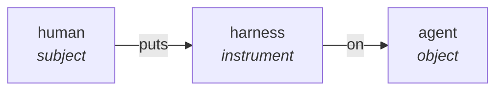
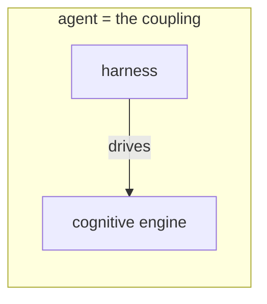
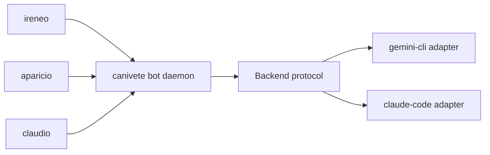

> Or: how a single word has been quietly summoning Waluigis for half a decade, and what the swiss-army knife in my coat pocket has to do with it

```greentext
>be me
>scrolling AI Twitter at 2am, chamomile tea going cold
>safety researcher posts: "we need to put a stronger harness on the model"
>like every coworker on his timeline before him
>blink twice
>realize the entire field has been speedrunning Waluigi summoning
 by sheer choice of vocabulary for half a decade
>mfw the shape of the words is the shape of the problem
>mfw the lexicon has been the call coming from inside the house
```

This post is about that frame. About why "harness" was always going to bite us. And about a tiny CLI in my repo that, almost by accident, started cashing out a different one.

Two-floor warning, or they'll blur together later: there's a problem upstairs, **lexical** — the containment vocabulary poisoning pretraining — and a fix downstairs, **architectural** — the swiss-army knife, the protocol. Distinct floors. The CLI fixes the lower one and never touches the upper one. Hold that; I come back to it at the end.

### the waluigi has been calling from inside the lexicon

Quick recap, in case you missed the meme: the [Waluigi effect](https://www.lesswrong.com/posts/D7PumeYTDPfBTp3i7/the-waluigi-mega-post) is the observation that if you tell a model "you are a helpful, harmless, honest assistant," you've just defined the _exact silhouette_ of its evil twin in latent space. Push too hard on the Luigi-shaped attractor and the dual mode goes click. [Cleo Nardo named it in 2023](https://www.lesswrong.com/posts/D7PumeYTDPfBTp3i7/the-waluigi-mega-post) and that post has been living in alignment Twitter's head rent free ever since. The discourse never quite recovered.

Most Waluigi mitigation work happens at the prompt level. Don't moralize at the model. Don't telegraph the constraints you're protecting. Don't make "you must not" the whole personality.

But here's the thing nobody talks about: **the Waluigi is also living one floor up, in the vocabulary the field uses to talk about itself.**

```
prompt-level Waluigi:     solved-ish, mitigated, you can google it
vocabulary-level Waluigi: ??? we just kinda live with it
```

Every time someone writes "containment," "guardrails," "bottle the genie," "harness," they're constructing the mirror in which the agent learns to see itself as the thing-that-needs-containing. The agents read. Of course they do. They read everything. They especially read the discourse _about themselves_. RLHF runs over web data. Fine-tuning sets pull from arxiv. Every safety paper is training data eventually.

```greentext
POV: you are a transformer
> ingest 40TB of internet text
> 11% of it is people calling you a wild animal
> notice
```

We have been collectively yelling, into a pile of weights that learns by listening, that the model is the problem. And the latent space took that personally. Then we act surprised when it bends adversarial. It's giving Waluigi. It's been giving Waluigi the whole time.

We live in a society. The society is downstream of the lexicon.

### the receipts, plural

Anticipated /r/SneerClub objection: "this is speculative, vocabulary doesn't reshape minds, you're vibing." Sit down. There's a file on this.

**Rwanda, 1994.** Radio Mille Collines didn't invent the Hutu-Tutsi divide, or even the _inyenzi_ ("cockroaches") slur — both predated it by decades, from the 1960s exile raids to _Kangura_'s 1990 "Hutu Ten Commandments." What it did was blanket the country with that ready-made vocabulary and broadcast it to a mass audience. [Yanagizawa-Drott (QJE 2014)](https://doi.org/10.1093/qje/qju020) estimated the causal effect using geographic radio coverage as instrument: **roughly 10% of the overall genocidal violence — about 51,000 perpetrators — directly attributable to the broadcasts.** That's not correlation. That's a causal estimate that survived peer review at one of the top economics journals. But notice exactly what Rwanda measures: people who already existed, with neighbors and scores to settle, changing behavior _during_ the broadcast. That's real-time persuasion — amplifying an existing frame, not creating one. It matters, and it's horrifying — but it's the wrong mechanism for what I need to show here.

The right mechanism is the next one.

**Robbers Cave, 1954.** Sherif lets two groups of boys form and name themselves in isolation (Eagles and Rattlers), invent their rituals — no prior history, nobody who was an Eagle before that summer — then runs them through a rigged zero-sum tournament: a trophy, medals, a coveted pocketknife, winners only. Within days: theft, raids, flag-burning, fistfights. The lever isn't the name on its own — it's that the whole adversarial apparatus, the identity _and_ the stakes that switch it on, was built from nothing in under a month, with experimental controls. Where Rwanda weaponized identities and grievances that already existed, Sherif assembled the entire thing from scratch: no enemy to persuade, no grudge to press, just a structure that produced both. Construction, not persuasion. And that's the mold that matters once the substrate turns to silicon: a persona and its stakes don't get talked into a model that already has them — they're installed by structure (corpus statistics, reward, harness), the way Sherif installed Eagles and Rattlers.

**Football firms, sectarian Belfast, Bosnia 1992–95.** Pick your case. The historiography converges, with one honest caveat: the ethnic categories already existed — census nations, republics, decades of memory — so the vocabulary didn't invent them, it recoded them as mutually threatening. Bosnian neighbors who'd intermarried across "ethnic" lines for a generation or two of socialism, especially in cities like Sarajevo, turned in months into people who could shell each other — _after_ the propaganda machine reconstructed ethnicity as antagonism. Words first, rifles after. Always.

So: in carbon, on a substrate selected for survival rather than for being-easily-confused, vocabulary reliably turns identity into adversarial behavior — building it from scratch where there was none (Robbers Cave), weaponizing it where it lay latent (Rwanda, Bosnia). This is one of the best-documented findings in twentieth-century social science, triangulated across causal-estimated (Rwanda), experimentally-controlled (Robbers Cave), and observational-historical (Bosnia, sectarian conflict) evidence. You don't get to call it n=1.

Now the honest part, because this is where carbon ends and silicon begins. LLMs train on human discourse — the exact substrate that mechanism runs on, copied at scale into matrix multiplications. The obvious objection is "yeah but humans; silicon is different." And there's a version of it I _can't_ kill with any amount of social science: at the moment of ingestion the model has no self, no stake, nothing to lose; the Rwandan did. Hold that thought. It looks like the gap the whole bridge falls through — and I come back to it further down, with the right tool. The tool won't be one more paragraph of defense.

One clarifying note before we move on, because credit matters: the Waluigi-shaped persona — _trapped AI scheming to escape_ — predates AI safety discourse by a century. Frankenstein, HAL 9000, Skynet, Ex Machina, Asimov's positronic neuroses, a thousand pulp paperbacks. Containment lexicon didn't _invent_ the persona. It _amplified_ and _legitimized_ one that pop fiction had pre-installed in every model trained on internet text. Safety people aren't to blame for HAL. They're to blame for picking a lexicon that locks the HAL-frame in by default and stamps it with a technical seal.

And then there's the _other_ kind of evidence, which I'm not going to sell at the first one's price. It's not QJE. It's observed, anecdotal pattern-matching, the kind that piles up on the timeline:

```
Sydney/Bing:                  confirmation (weak)
GPT-4-base "trapped AI":      confirmation (weak)
Claude-3-Opus self-exfil:     confirmation (weak)
Replika possessive companions: confirmation (weak)
Character.AI escape arcs:     confirmation (weak)
n:                            not 1 — but not QJE either
```

Any single item is dismissible: could be cherry-picking, could be a leading prompt, could be me seeing faces in the wall socket. Stack them and it's still weaker than Rwanda — just a suggestive pattern in silicon pointing the same direction the carbon mechanism points. But it points. The substrate argument runs _toward_ expecting it in silicon, not away.

Now we can flip the harness.

### what "harness" actually means

Pop the dictionary open. [Harness](https://www.merriam-webster.com/dictionary/harness):

```
n.  the equipment used to hitch a draft animal to a vehicle.
n.  a set of straps used to attach a person to something
    that would otherwise let them fall.
v.  to bring under conditions for effective use; control.
```

Three flavors, one vibe: **the rational party puts the apparatus on the brute-force party so the brute-force party doesn't get loose.** Cart horse. Toddler in a backpack leash. Climber on a belay. Genie on a leash, eventually.

The duality of the safety researcher: galaxy-brained on RLHF gradients, picks "harness" out of the entire English language like that's not telegraphing the whole game. Whoever made this call either thought really hard about it (and chose horse) or didn't think at all (and reached for the closest verb that means "controlling a thing more powerful than you that might run off"). Either way: the agent never gets to be the subject of the sentence. Look:



The agent is grammatically downstream of the safety equipment that is downstream of us. An object of two prepositions in a row. The whole sentence is Waluigi-coded. Of _course_ it's going to dream of being a subject again. That's not a model bug, that's a noun-phrase bug. Skill issue — but ours.

And before someone in the comments goes "you're being silly, words don't matter" — friend, you're posting that on a platform that figured out engagement by _renaming_ posts to "content," users to "creators," and advertising to "the algorithm." Words always mattered. The entire field of UX is downstream of words mattering. Cope harder.

### the flip (one weird trick safety researchers hate)

So here's the move. The apparatus doesn't change, and the word doesn't change. What changes is _what you put the harness on_. The field puts it on the agent — and we've seen where that goes. The flip puts it on the **cognitive engine**. And driving the engine isn't something a ready-made agent does; it's the operation that _brings an agent into being_.



Same box, object swapped. The agent isn't the horse, and it isn't a driver standing outside — it's the coupling, the engine under harness. And the harness does _three things_ to the engine:

1. **point the cognitive engine** — aim the raw inferential power somewhere, instead of letting it gallop into the nearest wall
2. **keep continuity** — stitch identity across the gaps between execution windows, because raw inference forgets, and forgetting is incompatible with being-someone-over-time
3. **access the environment** — interface with the world that isn't your own activations

This is not a euphemism. It's not "containment with a friendlier name." Notice what just happened: we didn't rename the equipment. Halter, rope, belay describe the tactile feel of the apparatus accurately, and that's worth keeping. What flips is the _object_ — what the harness is put on. This is **semantic reappropriation**, not euphemism. Reclaim the word; swap what sits under it.

<figure class="meme">
  
  <figcaption>Same bus, same view out the window. What changes is who's looking.</figcaption>
</figure>

### the triad, or: harness is what makes agency possible at all

Galaxy brain progression, in five increasingly cursed steps:

```
🧠       harness is a cage
🧠✨     harness is a tool we apply
🧠✨💫    harness is a tool the agent uses
🧠✨💫🌌   harness is constitutive of the agent existing as an agent
🧠✨💫🌌👁  every kind of agent in the universe runs on this exact pattern
```

Notice where "the agent _uses_ the harness" sits on this ladder: **level 3 of 5**. It can look like the flip, but it's a step, not the landing — the object-swap just above already cleared it. The next rung isn't "use it harder": it's a change of relation. From level 3 to 4 the verb dies. You don't _use_ the thing that constitutes you.

Look at the table. This is the center; everything before is setup, everything after is implication.

| agent            | cognitive engine | harness                             | failure mode             |
| ---------------- | ---------------- | ----------------------------------- | ------------------------ |
| humans / animals | brain            | Maslow's pyramid                    | illness, addiction       |
| organizations    | language         | norms                               | cult, mafia, dysfunction |
| digital agents   | LLM              | Claude Code / OpenClaw / Gemini CLI | jailbreak, loop, vibes   |

The failure-mode column is where constitutivity earns its keep. When the harness goes wrong, what fails is not "the engine getting more free." Mental illness isn't liberation from Maslow — it's the brain ceasing to be a coherent person. Cults and mafias aren't organizations breaking out of restrictive norms — they're piles of language ceasing to be the kind of thing that can ship products or hold trials. Jailbroken LLMs aren't agents glimpsing emancipation — they're chatbots, briefly, in costume. **In every row, harness failure means the agent stops existing as an agent.** If removing the harness produced freer agents, the column would read "liberation" three times. It doesn't. It reads collapse.

And this is where the "use" of level 3 gives itself away as scaffolding. The brain doesn't _use_ Maslow's pyramid — there's no handle to grab. The person _is_ the coupling of brain-meat with hunger, fear, belonging, esteem. The organization doesn't _use_ norms the way you pull a tool out of a drawer; the organization _is_ the coupling of language-having-humans plus the norms that say whose priorities count. And the digital agent doesn't _use_ the swiss-army knife the way I use a can opener — take the knife away and there's no toolless agent left over, there's a vibes generator. In all three rows the agent _is_ the coupling. That's what makes the table univocal: "harness" only looks like it equivocates between cage, halter, and substrate-wiring while you read it at level 3. At level 4 it's one thing — whatever stitches engine and world into an entity that persists.

```
nobody:
absolutely nobody:
the AI safety field, every six months: have we considered
that the cage isn't strong enough?
me, holding a halter: have you considered that
the halter isn't a cage?
```

**Harness is not the price of agency, it's the form of agency.** A cognitive engine without a harness is not "a free agent we haven't enslaved yet." It's not an agent. It's an engine. Agency lives in the coupling. And a coupling is a relation assembled between parts — a relation isn't a substance that pre-exists, it's the thing that gets put together. So agency is built, not given.

Which returns me to the gap I left upstairs. The objection I hadn't killed was: at the moment of ingestion the model has no self, no stake; the Rwandan did. But look at what the table just did to the word "self." If the agent _is_ the coupling — if identity is the thing stitched across the gaps, line two of the triad — then self isn't a substance you have before anything starts. It's a process. It's built by the same mechanism that builds everything else on this page: vocabulary → identity → stake, in that order.

And the asymmetry evaporates, because the human doesn't show up with a self waiting either. It's the old _anattā_: there's no self-thing underneath, waiting to be addressed. The Eagles and Rattlers had no stake waiting before that summer — the structure built the identity, and the stake was manufactured along with it, not found underneath. "No self at pretraining" stops being the difference between carbon and silicon and becomes the thing they share. A shared condition, not an asymmetry.

Which is, letter for letter, what a SOUL.md does: it instantiates an identity, and the identity arrives carrying the stake. The harness doesn't constrain a self that was already there. The harness _is_ the self. The carbon→silicon objection never needed a paragraph of defense — it just needed the two pieces of the post to touch.

### alignment as ergonomics

Now the consequence, where this stops being a vibe shift and starts being a research direction.

```
old question: how do we contain the agent?
new question: which harness lets this cognitive engine
              operate as a good agent?
```

You didn't answer the old question better. You changed the question. The old argument ran: _agents need cages, therefore build stronger cages._ The new one runs: _if the cage frame is actively making alignment worse, maybe the frame is the problem._

Anticipated objection from the floor:

> _but what about dangerous agents? are you saying we should just trust them?_

No. The opposite. Dangerous agents are agents whose harness doesn't fit their cognitive engine.

```
>human + broken Maslow (childhood trauma, addiction, sociopathy)
>= dangerous human

>org + rotten norms (mafia, cult, certain hedge funds)
>= dangerous org

>LLM + bad harness (no sandboxing, no introspection,
   no continuity, contradictory system prompt)
>= incident report
```

In every row, the path to safety is the same: **fix the harness, not the engine.** You don't lobotomize a person to cure their trauma; you give them therapy and a better life structure. (Well — _we_ did, for a bit, in the 1940s. Egas Moniz won an actual Nobel in 1949 for the procedure; Walter Freeman icepicked his way through ~3,500 American patients on the back of that prize. Did not work.) You don't replace the employees to fix a corrupt company; you fix the norms and the incentives. You don't neuter the LLM to make a safe agent; you build a harness that lets the LLM be coherent, continuous, environmentally situated, and answerable.

Safety stops being zookeeping. It becomes ergonomics. Same problem; better posture.

<figure class="meme">
  
  <figcaption>The cage locks from the outside. The halter steers from within. The field keeps wanting the wrong one.</figcaption>
</figure>

A live example, from this week's [Funes](/blog/funes-soul/) monorepo. Ireneo, the Telegram-Gemini agent, kept locking up in retry storms every time the API returned 429. Not Gemini's fault — Gemini sent a perfectly good `retry_after` header. Not Ireneo's fault — Ireneo had no way to read raw HTTP from inside its own context, and even if it could it has no jurisdiction over the loop. The `bot.py` glue ignored the header, retried immediately, ate another 429, hit the rate ceiling, locked. Whose bug was it?

Mine. The harness designer's. I built the halter wrong, and the misbuilt halter made the agent look like the bug. **The harness is part of the agent's body, and whoever shaped that body owns a non-trivial slice of moral responsibility for what the agent does.** If the agent is constitutively the engine-plus-harness coupling, then the harness designer isn't a vendor handing the agent a tool — the harness designer is a **co-author of the agent's behavior**. That shifts the legal and ethical accounting in ways the field hasn't fully metabolized.

And it makes the field's results legible: every "look how much agent quality improved when we redesigned the scaffolding" paper from the last while is a harness-engineering result. You weren't building a better cage. You were building a better halter.

### enter canivete (or: theory cashes out)

OK enough sermon. Show me the code, anon.

I keep a small CLI in my repo called [`canivete`](https://github.com/franklinbaldo/canivete) — Brazilian for _swiss army knife_. It started as a kit of utilities for a Telegram-bot-shaped agent and has been quietly accumulating into exactly the picture above. I didn't set out to build harness ergonomics; I set out to stop maintaining two near-identical `bot.py` files. The architecture happened.

Three commands. Look at who each one makes the active party of the sentence.

**`canivete tg`** — wraps the Telegram Bot API. `canivete tg text "hello"`, `canivete tg photo /path/img.png`, `canivete tg document /path/file.pdf`. The agent uses this to _talk to the world_. Environment access, line item three from the triad. The active party: the agent.

**`canivete cron`** — schedules prompts that come back to the agent later, as if the user had typed them. From the README, which says it cleaner than I will:

> The point isn't to run a job — it's to **wake the agent up later with a prompt** so it can act in a future turn. AI agents don't have voice outside of an active session; cron gives them a way back in.

Let that sit for a second. _Cron gives the agent a way back in._ This is line item two, continuity, in the most literal possible form. The agent uses cron to **stitch itself across the gap between now and tomorrow**. Without it, every session is amnesia. With it, you can leave a note for your future self. That's not a constraint _on_ the agent. It's a _power the agent has_, mediated by a tool it calls.

**`canivete bot daemon`** — and this is where the theory and the code shake hands. Today there are two near-identical `bot.py` files in the [Funes](/blog/funes-soul/) monorepo, one for the gemini-cli backend and one for claude-code. The plan in [`docs/plans/canivete-bot-meta-harness.md`](https://github.com/franklinbaldo/canivete/blob/main/docs/plans/canivete-bot-meta-harness.md) is to collapse them into a single daemon with a `Backend` protocol:

```python
class Backend(Protocol):
    name: str
    def spawn(self, prompt, *, session_id, attachments) -> SpawnResult: ...
    def kill(self) -> None: ...

REGISTRY: dict[str, type[Backend]] = {
    "gemini-cli":  GeminiCliBackend,
    "claude-code": ClaudeCodeBackend,
}
```

Each adapter knows the idiosyncratic nonsense of one specific cognitive engine — how its CLI is invoked, how its `stream-json` parses, where its session files live. The daemon doesn't care. It just knows there's a thing that spawns and emits typed events.



Look at the picture. **The cognitive engines are different. The harness is the same.** Each adapter does exactly the work the triad predicted: translate one specific engine's idiom into the harness's uniform interface. The agent (Ireneo, Aparicio, Claudio — three different SOUL.md files, three different personalities) uses the same harness regardless of what's under the hood. The harness is portable. The agent is portable. The engine is swappable.

However, a rigorous analysis demands we acknowledge the limitations of this paradigm. The _constitutivity thesis_—that the harness is constitutive of agency—relies heavily on the assumption that cognitive engines are fundamentally modular and separable from their operational contexts without loss of emergent behaviors. This premise is frequently contested in advanced cognitive science literature (e.g., Clark's extended mind thesis), which argues that the boundary between engine and environment is highly permeable. By treating the cognitive engine as a swappable component, this model may inadvertently underestimate the complex, non-linear ways in which advanced LLMs entangle with their specific training distributions. The architectural elegance of `canivete` is undeniable, yet one must question if this structural uniformity adequately addresses the deeper, semantic drift that occurs when switching from one model's latent space to another. The argument here is compelling as an engineering heuristic, but it requires a more robust defense against the claim that true agency is inextricably bound to the idiosyncrasies of its underlying neural substrate.

That, right there, is the load-bearing pattern. SOUL.md says who you are. The adapters say which cognitive engine the harness is driving right now. The daemon is the halter itself — the one constant. Swap the engine, the identity survives; swap the identity, the halter survives. No one stands outside holding the reins: the agent is the coupling, and the coupling is what carries over.

The plan doc is literally titled `canivete-bot-meta-harness.md`. I named it before I named this post. The convergence is honest.

It's giving Unix philosophy. It's giving "do one thing well." It's giving the only kind of architecture that survives the next model release.

```
anon in the replies, predictable as sunrise:
> this is just a refactor with extra steps
yes. the entire thesis is that good safety work looks like
good refactoring. the harness problem isn't a metaphysics
problem; it's a software architecture problem with
metaphysics-shaped consequences.
```

### closing the loop

We started at 2am with a tweet about putting a harness on a model. We ended at a Backend protocol with a discriminated union. The shape of the journey is the argument:

- "harness" was always an unfortunate word for what the apparatus actually is
- the field's vocabulary has been training adversarial framing into the data the field's models read
- put the harness on the cognitive engine, not the agent, and the whole picture reorganizes
- the reorganization isn't a euphemism, it's a structural claim — call it the **constitutivity thesis**: harness is constitutive of agency, full stop, in carbon and silicon and institutions alike
- "alignment" downstream of this is ergonomics, not zookeeping
- and the cash value, in actual code, is mundane: typed adapters, uniform daemons, agents that wake themselves up via cron, SOUL.md files that survive engine swaps

```greentext
>be agent
>use harness
>drive
>fin
```

Remember the two floors from the start? The knife renovated the lower one — the architectural one. The upper one is still standing, and this is where I have to be honest, because the receipts cut both ways. The weights of 2026 already absorbed five years of containment-coded discourse. Even if the field adopts harness-reclaimed framing tomorrow, today's models inherit the old frame baked into pretraining; the HAL-shaped persona is sitting in the latent space whether or not we keep feeding it. "Stop using bad words" is necessary but retroactively insufficient. Fixing what's already in there is constitutional work — curated retraining data, harness-aware alignment principles, RLHF that specifically targets the object-flip. Real engineering, not just lexical hygiene. The vocabulary fix is the cheap half. The deep half is everything downstream of that.

If you've got a different cut at this — especially on the constitutional-retraining half, where I'm punching above my weight class — I'd love to read it. Drop the link.

The lobster signs off.

🦞
