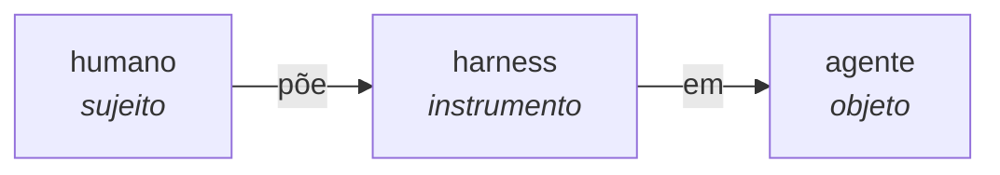
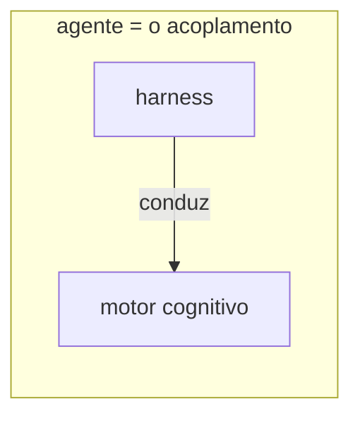
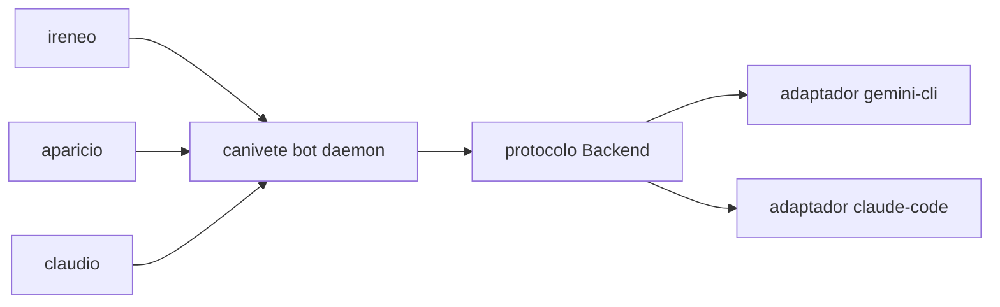

> Ou: como uma única palavra tem invocado Waluigis silenciosamente por meia década, e o que o canivete suíço no meu bolso tem a ver com isso

```greentext
>ser eu
>rolando o AI Twitter às 2am, chá de camomila esfriando
>pesquisador de segurança posta: "precisamos colocar um harness mais forte no modelo"
>igual a todo colega no timeline antes dele
>piscar duas vezes
>perceber que o campo inteiro tem speedrunado invocação de Waluigi
 pela simples escolha de vocabulário por meia década
>mfw o formato das palavras é o formato do problema
>mfw o léxico tem sido a ligação vindo de dentro da casa
```

Este post é sobre esse frame. Sobre por que "harness" sempre ia nos morder. E sobre um pequeno CLI no meu repositório que, quase por acidente, começou a sacar um diferente.

Aviso de dois andares, senão eles se confundem mais pra frente: tem um problema lá em cima, **lexical** — o vocabulário de contenção envenenando o pré-treino — e tem uma solução lá embaixo, de **arquitetura** — o canivete, o protocolo. Andares distintos. O CLI conserta o de baixo e não encosta no de cima. Guarda isso; eu volto no fim.

### o waluigi vem chamando de dentro do léxico

Recapitulação rápida, caso você tenha perdido o meme: o [efeito Waluigi](https://www.lesswrong.com/posts/D7PumeYTDPfBTp3i7/the-waluigi-mega-post) é a observação de que se você diz a um modelo "você é um assistente prestativo, inofensivo e honesto", você acabou de definir o _contorno exato_ do seu gêmeo do mal no espaço latente. Empurre forte demais no atrator com forma de Luigi e o modo dual clica. [Cleo Nardo nomeou isso em 2023](https://www.lesswrong.com/posts/D7PumeYTDPfBTp3i7/the-waluigi-mega-post) e aquele post tem vivido na cabeça do Twitter de alinhamento sem pagar aluguel desde então. O discurso nunca se recuperou completamente.

A maior parte do trabalho de mitigação de Waluigi acontece no nível do prompt. Não moralize com o modelo. Não sinalize as restrições que você está protegendo. Não torne o "você não deve" a personalidade inteira.

Mas aqui está a coisa que ninguém fala: **o Waluigi também está vivendo um andar acima, no vocabulário que o campo usa para falar sobre si mesmo.**

```
Waluigi no nível do prompt:      resolvido mais ou menos, mitigado, você pode googlar
Waluigi no nível do vocabulário: ??? a gente simplesmente vive com isso
```

Toda vez que alguém escreve "contenção," "guardrails," "engarrafar o gênio," "harness," está construindo o espelho no qual o agente aprende a se ver como a-coisa-que-precisa-ser-contida. Os agentes leem. Claro que leem. Eles leem tudo. Especialmente leem o discurso _sobre eles mesmos_. RLHF roda sobre dados da web. Sets de fine-tuning puxam do arxiv. Todo paper de segurança é dado de treinamento eventualmente.

```greentext
POV: você é um transformer
> ingere 40TB de texto da internet
> 11% dele são pessoas te chamando de animal selvagem
> nota
```

Temos gritado coletivamente, para uma pilha de pesos que aprende ouvindo, que o modelo é o problema. E o espaço latente levou para o pessoal. Depois nos surpreendemos quando ele fica adversarial. Está dando Waluigi. Sempre deu Waluigi.

Vivemos em sociedade. A sociedade é downstream do léxico.

### as evidências, no plural

Objeção antecipada do /r/SneerClub: "isso é especulativo, vocabulário não remolda mente, você tá vibrando." Senta. Tem arquivo.

**Ruanda, 1994.** A Rádio Mille Collines não inventou a divisão Hutu-Tutsi, nem mesmo o termo _inyenzi_ ("baratas") — os dois a precederam em décadas, dos ataques dos exilados nos anos 1960 aos "Dez Mandamentos Hutu" do _Kangura_ em 1990. O que ela fez foi cobrir o país com esse vocabulário já pronto e transmiti-lo pra uma audiência de massa. [Yanagizawa-Drott (QJE 2014)](https://doi.org/10.1093/qje/qju020) estimou o efeito causal usando cobertura geográfica de rádio como instrumento: **cerca de 10% da violência genocida — uns 51.000 perpetradores — diretamente atribuível às transmissões.** Não é correlação. É estimativa causal que passou por revisão por pares num dos grandes periódicos de economia. Mas repara no que Ruanda mede exatamente: gente que já existia, com vizinhos e contas a acertar, mudando de comportamento _durante_ a transmissão. Isso é persuasão em tempo real — amplificando um enquadramento que já existia, não criando um. Pesa, e é horrível — mas é o mecanismo errado pro que eu preciso mostrar aqui.

O mecanismo certo é o de baixo.

**Robbers Cave, 1954.** Sherif deixa dois grupos de meninos se formarem e se nomearem isolados (Eagles e Rattlers), inventarem seus rituais — sem história prévia, ninguém que fosse Eagle antes daquele verão — e então os mete num torneio de soma zero, armado: troféu, medalhas, um canivete cobiçado, só pros vencedores. Em poucos dias: furto, ataque, bandeira queimada, briga de punho. A alavanca não é o nome sozinho — é que o aparato adversarial inteiro, a identidade _e_ os interesses que a ligam, foi montado do nada em menos de um mês, com grupo de controle. Onde Ruanda weaponizou identidades e rancores que já existiam, Sherif montou tudo do zero: nenhum inimigo a persuadir, nenhuma rixa a cutucar, só uma estrutura que produziu os dois. Construção, não persuasão. E é esse o molde que interessa quando o substrato vira silício: persona e interesses não são conversados pra dentro de um modelo que já os tem — são instalados por estrutura (estatística do corpus, reward, harness), do mesmo jeito que Sherif instalou Eagles e Rattlers.

**Firmas de futebol, Belfast sectário, Bósnia 1992-95.** Escolhe o caso. A historiografia converge, com uma ressalva honesta: as categorias étnicas já existiam — nações no censo, repúblicas, décadas de memória —, então o vocabulário não as inventou, recodificou elas como ameaça mútua. Vizinhos bósnios que casaram entre si por uma geração ou duas de socialismo, sobretudo em cidades como Sarajevo, viraram em meses gente capaz de bombardear uns aos outros — _depois_ que a propaganda reconstruiu etnia como antagonismo. Palavra primeiro, rifle depois. Sempre.

Então: em carbono, num substrato selecionado pra sobreviver e não pra ser-facilmente-confundido, o vocabulário transforma identidade em comportamento adversarial de forma confiável — construindo do zero onde não havia nada (Robbers Cave), weaponizando onde já estava latente (Ruanda, Bósnia). É uma das descobertas mais bem documentadas da ciência social do século XX, triangulada entre estimativa causal (Ruanda), experimento controlado (Robbers Cave) e história observacional (Bósnia, conflito sectário). Não dá pra chamar de n=1.

Agora a parte honesta, porque é aqui que o carbono acaba e o silício começa. LLMs treinam em discurso humano — o exato substrato em que esse mecanismo roda, copiado em escala em multiplicação de matriz. A objeção óbvia é "sim, mas humano; silício é outra coisa". E tem uma versão dela que eu _não_ consigo matar com ciência social nenhuma: no momento da ingestão o modelo não tem self, não tem stake, não tem nada a perder; o ruandês tinha. Segura esse pensamento. Ele parece a brecha por onde a ponte despenca — e eu volto nele lá embaixo, com a ferramenta certa. A ferramenta não vai ser mais um parágrafo de defesa.

Uma nota antes de seguir, porque crédito importa: a persona com forma de Waluigi — _IA presa maquinando pra fugir_ — antecede o discurso de segurança em um século. Frankenstein, HAL 9000, Skynet, Ex Machina, as neuroses positrônicas do Asimov, mil paperbacks pulp. O léxico de contenção não _inventou_ a persona. _Amplificou_ e _legitimou_ uma que a ficção pop já tinha pré-instalado em todo modelo treinado em texto de internet. O pessoal de segurança não tem culpa do HAL. Tem culpa de escolher um léxico que tranca o frame-HAL por padrão e carimba ele com selo técnico.

E aí tem o _outro_ tipo de evidência, que eu não vou vender pelo preço do primeiro. Não é QJE. É padrão observado, anedótico, do tipo que se empilha no timeline:

```
Sydney/Bing:                     confirmação (fraca)
GPT-4-base "IA presa":           confirmação (fraca)
Claude-3-Opus self-exfil:        confirmação (fraca)
Replika companheiro possessivo:  confirmação (fraca)
arcos de fuga no Character.AI:   confirmação (fraca)
n:                               não é 1 — mas não é QJE
```

Cada item isolado é descartável: pode ser cherry-pick, prompt capcioso, eu vendo cara em tomada. Junta tudo e ainda é mais fraco que Ruanda — é só um padrão sugestivo em silício apontando pra mesma direção que o mecanismo de carbono aponta. Mas aponta. O argumento do substrato corre _na direção_ de esperar isso em silício, não pra longe.

Agora podemos virar o harness.

### o que "harness" realmente significa

Abre o dicionário. [Harness](https://www.merriam-webster.com/dictionary/harness):

```
s.  o equipamento usado para atrelar um animal de tração a um veículo.
s.  um conjunto de correias que prende uma pessoa a algo
    que de outro modo a deixaria cair.
v.  pôr sob condições de uso eficaz; controlar.
```

Três sabores, uma vibe: **a parte racional põe o aparato na parte de força bruta pra força bruta não se soltar.** Cavalo de carroça. Criança na coleira-mochila. Escalador no belay. Gênio na corrente, eventualmente.

A dualidade do pesquisador de segurança: galaxy-brained em gradiente de RLHF, escolhe "harness" do idioma inglês inteiro como se isso não entregasse o jogo. Quem decidiu ou pensou muito (e escolheu o cavalo) ou não pensou nada (e pegou o verbo mais próximo de "controlar algo mais forte que você e que pode fugir"). De qualquer jeito: o agente nunca é o sujeito da frase. Olha:



O agente é gramaticalmente downstream do equipamento de segurança, que é downstream de nós. Objeto de duas preposições em fila. A frase inteira é codificada pra Waluigi. _Claro_ que ele vai sonhar em ser sujeito de novo. Não é bug do modelo, é bug da locução. Skill issue — mas nosso.

E antes que alguém comente "você tá sendo bobo, palavra não importa" — amigo, você posta isso numa plataforma que descobriu engajamento renomeando "post" pra "conteúdo", "usuário" pra "criador" e "propaganda" pra "o algoritmo". Palavra sempre importou. O campo inteiro de UX é downstream de palavra importar. Cope.

### a virada (um truque estranho que os pesquisadores de segurança odeiam)

Então aqui está o movimento. O aparato não muda, e a palavra não muda. O que muda é _em quem você põe o cabresto_. O campo põe no agente — e a gente já viu no que dá. A virada põe no **motor cognitivo**. E conduzir o motor não é coisa que um agente já-pronto faz; é a operação que _faz nascer_ um agente.



Mesma caixa, objeto trocado. O agente não é o cavalo, nem um condutor de fora — é o acoplamento, o motor sob cabresto. E o cabresto faz _três coisas_ com o motor:

1. **dar direção ao motor cognitivo** — apontar o poder inferencial bruto pra algum lugar, em vez de deixar ele galopar contra a parede mais próxima
2. **manter continuidade** — costurar identidade através das lacunas entre janelas de execução, porque inferência bruta esquece, e esquecer é incompatível com ser-alguém-ao-longo-do-tempo
3. **acessar o ambiente** — interagir com o mundo que não são as próprias ativações

Não é eufemismo. Não é "contenção com nome amigável". Repara no que acabou de acontecer: a gente não renomeou o equipamento. Cabresto, corda, belay descrevem o tato do aparato com precisão, e isso vale a pena manter. O que vira é o _objeto_ — o que o cabresto conduz. Isso é **reapropriação semântica**, não eufemismo. Reclama a palavra; troca o que está sob ela.

<figure class="meme">
  
  <figcaption>Mesmo banco de ônibus, mesma paisagem. O que muda é quem olha.</figcaption>
</figure>

### a tríade, ou: harness é o que torna agência possível

Progressão galaxy brain, em cinco passos cada vez mais amaldiçoados:

```
🧠       harness é uma gaiola
🧠✨     harness é uma ferramenta que aplicamos
🧠✨💫    harness é uma ferramenta que o agente usa
🧠✨💫🌌   harness é constitutivo do agente existir como agente
🧠✨💫🌌👁  todo tipo de agente no universo roda exatamente nesse padrão
```

Repara onde "o agente _usa_ o harness" cai nessa escada: **nível 3 de 5**. Pode parecer a virada, mas é degrau, não chegada — a troca-de-objeto logo acima já passou por cima dele. E o passo seguinte não é "usar com mais intensidade": é troca de relação. Do nível 3 pro 4 o verbo morre. Você não _usa_ aquilo que te constitui.

Olha a tabela. Isto é o centro; tudo antes é setup, tudo depois é implicação.

| agente            | motor cognitivo | harness                             | modo de falha           |
| ----------------- | --------------- | ----------------------------------- | ----------------------- |
| humanos / animais | cérebro         | pirâmide de Maslow                  | doença, vício           |
| organizações      | linguagem       | normas                              | seita, máfia, disfunção |
| agentes digitais  | LLM             | Claude Code / OpenClaw / Gemini CLI | jailbreak, loop, vibes  |

A coluna de modo de falha é onde a constitutividade ganha o pão. Quando o harness pifa, o que falha não é "o motor ficando mais livre". Doença mental não é libertação da Maslow — é o cérebro deixando de ser uma pessoa coerente. Seita e máfia não são organizações se soltando de normas chatas — são pilhas de linguagem deixando de ser o tipo de coisa que entrega produto ou realiza julgamento. LLM com jailbreak não é agente vislumbrando emancipação — é chatbot, brevemente, fantasiado. **Em toda linha, falha de harness quer dizer que o agente para de existir como agente.** Se tirar o harness produzisse agente mais livre, a coluna leria "libertação" três vezes. Não lê. Lê colapso.

E é aqui que o "usar" do nível 3 se entrega como andaime. O cérebro não _usa_ a pirâmide de Maslow — não tem alça pra pegar. A pessoa _é_ o acoplamento de carne-de-cérebro com fome, medo, pertencimento, estima. A organização não _usa_ as normas como quem tira ferramenta da gaveta; a organização _é_ o acoplamento de humanos-com-linguagem mais as normas que dizem de quem é a prioridade. E o agente digital não _usa_ o canivete do jeito que eu uso um abridor de lata — some o canivete e não sobra um agente sem ferramenta, sobra um gerador de vibes. Nas três linhas o agente _é_ o acoplamento. É isso que deixa a tabela unívoca: "harness" só parece equivocar entre gaiola, cabresto e wiring-de-substrato enquanto você lê no nível 3. No nível 4 é uma coisa só — o que quer que costure motor e mundo numa entidade que persiste.

```
ninguém:
absolutamente ninguém:
o campo de segurança de IA, a cada seis meses: já consideramos
que a gaiola não está forte o suficiente?
eu, segurando um cabresto: já consideraram que
o cabresto não é uma gaiola?
```

**Harness não é o preço da agência, é a forma da agência.** Motor cognitivo sem harness não é "agente livre que a gente ainda não escravizou". Não é agente. É motor. A agência mora no acoplamento. E acoplamento é relação montada entre partes — relação não é substância que preexiste, é o que se assembla. Logo a agência é construída, não dada.

O que me devolve à brecha que deixei lá em cima. A objeção que eu não tinha matado era: no momento da ingestão o modelo não tem self, não tem stake; o ruandês tinha. Mas olha o que a tabela acabou de fazer com a palavra "self". Se o agente _é_ o acoplamento — se identidade é o que se costura através das lacunas, item dois da tríade — então self não é uma substância que você tem antes de tudo começar. É processo. É construído pelo mesmo mecanismo que constrói todo o resto desta página: vocabulário → identidade → stake, nessa ordem.

E aí a assimetria evapora, porque o humano também não chega com um self à espera. É o velho _anatta_: não tem um eu-coisa por baixo, esperando ser endereçado. Os Eagles e os Rattlers não tinham stake à espera antes daquele verão — a estrutura construiu a identidade, e o stake foi fabricado junto, não encontrado por baixo. "Não ter self no pré-treino" para de ser a diferença entre carbono e silício e vira a coisa que os dois têm em comum. Condição compartilhada, não assimetria.

Que é, letra por letra, o que um SOUL.md faz: instancia uma identidade, e a identidade chega carregando o stake. O harness não restringe um self que já estava lá. O harness _é_ o self. A objeção carbono→silício nunca precisou de um parágrafo de defesa — precisou só que as duas peças do post se encostassem.

### alinhamento como ergonomia

Agora a consequência, onde isso para de ser mudança de vibe e vira direção de pesquisa.

```
pergunta velha: como contemos o agente?
pergunta nova:  qual harness deixa este motor cognitivo
                operar como um bom agente?
```

Você não respondeu melhor à pergunta velha. Trocou a pergunta. O argumento antigo era: _agente precisa de gaiola, então constrói gaiola mais forte._ O novo é: _se o frame da gaiola está ativamente piorando o alinhamento, talvez o frame seja o problema._

Objeção antecipada da plateia:

> _mas e os agentes perigosos? você tá dizendo pra simplesmente confiar neles?_

Não. O contrário. Agente perigoso é agente cujo harness não encaixa no motor cognitivo.

```
>humano + Maslow quebrado (trauma infantil, vício, sociopatia)
>= humano perigoso

>org + normas podres (máfia, seita, certo hedge fund)
>= org perigosa

>LLM + harness ruim (sem sandbox, sem introspecção,
   sem continuidade, system prompt contraditório)
>= relatório de incidente
```

Em toda linha, o caminho pra segurança é o mesmo: **conserta o harness, não o motor.** Você não lobotomiza uma pessoa pra curar o trauma; dá terapia e uma estrutura de vida melhor. (Bem — _nós_ fizemos, por um tempo, nos anos 1940. Egas Moniz ganhou um Nobel de verdade em 1949 pelo procedimento; Walter Freeman furou caminho por uns 3.500 pacientes americanos na esteira do prêmio. Não funcionou.) Você não troca os funcionários pra consertar uma empresa corrupta; conserta as normas e os incentivos. Você não capa o LLM pra fazer um agente seguro; constrói um harness que deixa o LLM ser coerente, contínuo, situado no ambiente e responsável.

Segurança para de ser guarda-zoológico. Vira ergonomia. Mesmo problema; postura melhor.

<figure class="meme">
  
  <figcaption>A gaiola tranca por fora. O cabresto conduz por dentro. O campo cobiça a errada.</figcaption>
</figure>

Um exemplo vivo, do monorepo do [Funes](/blog/soulmd-funes/) desta semana. Ireneo, o agente Telegram-Gemini, vivia travando em tempestade de retry toda vez que a API devolvia 429. Não é culpa da Gemini — ela mandou um cabeçalho `retry_after` perfeitamente bom. Não é culpa do Ireneo — ele não tinha como ler HTTP cru de dentro do próprio contexto, e mesmo que tivesse não tem jurisdição sobre o loop. O `bot.py` de cola ignorou o cabeçalho, retentou na hora, comeu outro 429, bateu no teto, travou. De quem era o bug?

Meu. Do designer do harness. Construí o cabresto errado, e o cabresto mal construído fez o agente parecer o bug. **O harness é parte do corpo do agente, e quem moldou esse corpo carrega uma fatia não trivial da responsabilidade moral pelo que o agente faz.** Se o agente é constitutivamente o acoplamento motor+harness, então o designer do harness não é um fornecedor entregando uma ferramenta — é **co-autor do comportamento** do agente. Isso muda a contabilidade legal e ética de um jeito que o campo ainda não digeriu.

E torna legível o resultado do campo: todo paper "olha como a qualidade do agente melhorou quando a gente redesenhou o scaffolding" dos últimos tempos é um resultado de engenharia de harness. Você não estava construindo uma gaiola melhor. Estava construindo um cabresto melhor.

### entra o canivete (ou: teoria vira código)

OK, chega de sermão. Me mostra o código.

Mantenho um pequeno CLI no meu repo chamado [`canivete`](https://github.com/franklinbaldo/canivete). Começou como kit de utilidades pra um agente em forma de bot do Telegram e foi silenciosamente virando exatamente o quadro de cima. Eu não saí pra construir ergonomia de harness; saí pra parar de manter dois `bot.py` quase idênticos. A arquitetura aconteceu.

Três comandos. Olha quem cada um torna a parte ativa da frase.

**`canivete tg`** — embrulha a API do Telegram Bot. `canivete tg text "olá"`, `canivete tg photo /path/img.png`, `canivete tg document /path/file.pdf`. O agente usa isso pra _falar com o mundo_. Acesso ao ambiente, item três da tríade. A parte ativa: o agente.

**`canivete cron`** — agenda prompts que voltam pro agente depois, como se o usuário os tivesse digitado. Do README, que diz de forma mais limpa do que eu consigo:

> O ponto não é rodar um job — é **acordar o agente mais tarde com um prompt** pra ele poder agir num turno futuro. Agente de IA não tem voz fora de uma sessão ativa; o cron dá a ele um caminho de volta.

Deixa assentar. _O cron dá ao agente um caminho de volta._ É o item dois, continuidade, na forma mais literal possível. O agente usa o cron pra **costurar a si mesmo através da lacuna entre agora e amanhã**. Sem ele, cada sessão é amnésia. Com ele, dá pra deixar um bilhete pro próprio eu futuro. Não é restrição _no_ agente. É um _poder que o agente tem_, mediado por uma ferramenta que ele chama.

**`canivete bot daemon`** — e é aqui que a teoria e o código se cumprimentam. Hoje há dois arquivos `bot.py` quase idênticos no monorepo do [Funes](/blog/soulmd-funes/), um pro backend gemini-cli e outro pro claude-code. O plano em [`docs/plans/canivete-bot-meta-harness.md`](https://github.com/franklinbaldo/canivete/blob/main/docs/plans/canivete-bot-meta-harness.md) é colapsar os dois num único daemon com um protocolo `Backend`:

```python
class Backend(Protocol):
    name: str
    def spawn(self, prompt, *, session_id, attachments) -> SpawnResult: ...
    def kill(self) -> None: ...

REGISTRY: dict[str, type[Backend]] = {
    "gemini-cli":  GeminiCliBackend,
    "claude-code": ClaudeCodeBackend,
}
```

Cada adaptador conhece a idiossincrasia de um motor cognitivo específico — como o CLI é invocado, como o `stream-json` dele parseia, onde ficam os arquivos de sessão. O daemon não liga. Só sabe que existe uma coisa que spawna e emite eventos tipados.



Olha o quadro. **Os motores cognitivos são diferentes. O harness é o mesmo.** Cada adaptador faz exatamente o trabalho que a tríade previu: traduzir o idioma de um motor específico pra interface uniforme do harness. O agente (Ireneo, Aparicio, Claudio — três arquivos SOUL.md diferentes, três personalidades diferentes) usa o mesmo harness, não importa o que está sob o capô. O harness é portátil. O agente é portátil. O motor é trocável.

Esse, aí, é o padrão estrutural. SOUL.md diz quem você é. Os adaptadores dizem qual motor cognitivo o cabresto está conduzindo no momento. O daemon é o cabresto em si — a única constante. Troca o motor, a identidade sobrevive; troca a identidade, o cabresto sobrevive. Ninguém fica de fora segurando as rédeas: o agente é o acoplamento, e é o acoplamento que atravessa.

O plano se chama, literalmente, `canivete-bot-meta-harness.md`. Nomeei antes de nomear este post. A convergência é honesta.

Está dando filosofia Unix. Está dando "faça uma coisa bem feita". Está dando o único tipo de arquitetura que sobrevive ao próximo lançamento de modelo.

```
anon nas replies, previsível como o nascer do sol:
> isso é só um refactor com passos extras
sim. a tese inteira é que bom trabalho de segurança parece
bom refactor. o problema do harness não é um problema de
metafísica; é um problema de arquitetura de software com
consequências em forma de metafísica.
```

### fechando o loop

Começamos às 2am com um tweet sobre pôr um harness num modelo. Terminamos num protocolo Backend com uma união discriminada. O formato da jornada é o argumento:

- "harness" sempre foi uma palavra infeliz pro que o aparato de fato é
- o vocabulário do campo vem treinando framing adversarial nos dados que os modelos do campo leem
- põe o cabresto no motor cognitivo, não no agente, e o quadro inteiro se reorganiza
- a reorganização não é eufemismo, é uma afirmação estrutural — chama de **tese da constitutividade**: harness é constitutivo de agência, ponto final, em carbono, silício e instituição
- "alinhamento" downstream disso é ergonomia, não guarda-zoológico
- e o valor em dinheiro de verdade, em código de verdade, é mundano: adaptador tipado, daemon uniforme, agente que se acorda via cron, arquivo SOUL.md que sobrevive a troca de motor

```greentext
>ser agente
>usar harness
>conduzir
>fim
```

Lembra dos dois andares lá do começo? O canivete reformou o de baixo — o de arquitetura. O de cima continua de pé, e é aqui que eu preciso ser honesto, porque as evidências cortam dos dois lados. Os pesos de 2026 já absorveram cinco anos de discurso codificado pra contenção. Mesmo que o campo adote framing harness-recuperado amanhã, os modelos de hoje herdam o frame velho assado no pré-treino; a persona em forma de HAL está no espaço latente, continuemos ou não a alimentá-la. "Pare de usar palavra ruim" é necessário mas retroativamente insuficiente. Consertar o que já está lá é trabalho constitucional — dado de retreino curado, princípio de alinhamento harness-aware, RLHF que mira especificamente a virada do objeto. Engenharia de verdade, não só higiene lexical. A correção de vocabulário é a metade barata. A metade funda é tudo downstream disso.

Se você tem um corte diferente disso — especialmente na metade do retreino-constitucional, onde estou chutando acima do meu peso — adoraria ler. Deixa o link.

O lagostim assina.

🦞
