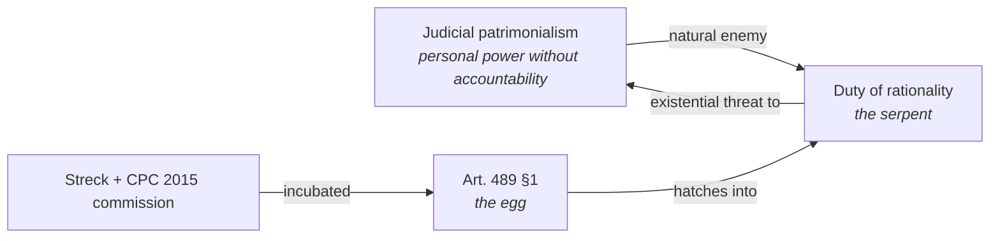

The Brazilian magazine _Piauí_ published an article called "Excelentíssima Fux" — "His Excellency Fux," with a feminine twist. The title is not gratuitous irony. The daughter of Supreme Court Justice Luiz Fux became an appellate judge — not through the silent osmosis of someone carrying a complicated surname in a courthouse hallway, but because her father called. He called whoever needed to be called, used the weight of his office, and made the mechanism work — the one that in Brazil never needed a name because it never needed shame. Faoro called it patrimonialism. Sérgio Buarque called it _cordiality_. _Piauí_ called it His Excellency. None of the three was wrong.

Fux is not the exception that proves the rule. He is the rule that found quality journalistic documentation. What makes the case singular is not the phone call — it is that Fux chaired the commission that drafted the Civil Procedure Code of 2015. And inside that code, in the hands of this man, something was incubated with which patrimonialism is radically incompatible.

## Patrimonialism and its serpent

Judicial patrimonialism has a natural enemy: the duty of rationality.

Not the duty to provide formal reasoning — the system already had that, in the form of Article 131 of the 1973 Code of Civil Procedure, which required the judge to "indicate the reasons that formed his conviction." Decades of legal practice reduced this requirement to a surface formality: anything written served as a reason. The decision was reasoned as long as there were words in the space for reasoning. _Livre convencimento motivado_ — motivated free conviction — became the principle that protected judicial discretion not from external arbitrariness, but from having to justify itself. It was the tamed serpent — the animal transformed into a living room ornament.

The _substantive_ duty of rationality is different. It is the requirement that the reasoning identify the determining grounds of the precedent invoked, confront arguments capable of undermining the conclusion, demonstrate why the case fits the _ratio_ — and not merely declare that the judge so understood. This duty is incompatible with patrimonialism because patrimonialism lives on opacity: personal prerogative only functions as long as it does not need to justify itself. The demand for substantive rationality is light on the egg.

Lenio Streck named this. Coming from philosophical hermeneutics, he arrived at the same diagnosis by another path: the judge who "decides according to his conscience" is not exercising rational freedom — he is exercising personal power disguised as legal principle. He spent years doing what he himself called "epistemic lobbying" within the commission drafting the new code. The serpent of the duty of rationality — Streck wanted it to be born.

## The egg

The egg is Article 489, §1, of the Civil Procedure Code of 2015.

A decision is not considered reasoned if it merely invokes a precedent without identifying its determining grounds. A decision is not considered reasoned if it fails to confront arguments capable of undermining the conclusion. A decision is not considered reasoned if it employs indeterminate legal concepts without explaining their concrete application. A decision is not considered reasoned if it invokes reasons that would serve to justify any other decision.

Alongside this, Article 371 eliminated the word "freely" from the evaluation of evidence. _Livre convencimento motivado_ — the living room ornament, the tamed serpent, the principle that protected opacity — lost its name in the legal text.

The egg was laid inside the patrimonial system by the hands of its most eloquent representative. Fux chaired the commission. Fux signed the draft. Fux did not realize — or did not want to realize, which amounts to the same thing — that Article 489, §1, was the egg of a serpent that would attack exactly the kind of power he exercised outside the code and inside his office.

_It is Bolsonaro signing the criminal law that would one day come back to judge him._

## What happens when the egg hatches

The serpent of the duty of rationality, when applied consistently, does not respect hierarchy. Article 489, §1, of the Civil Procedure Code contains no exception for the Supreme Court. Article 93, IX of the Constitution requires that all decisions of the Judiciary be reasoned — all of them, without distinction by level.

The argument without footnotes is this: a Supreme Court that responds to a complaint against a decision that deviated from a binding precedent using solid arguments, and responds only with "the binding precedent so determines," is violating the same Article 489, §1, that the code installed. The serpent born from the egg attacks upward too.

This is what makes the cycle uncomfortable for those who built it. The duty of rationality that the CPC 2015 installed — and that Fux helped install without perceiving its full extension — is the instrument that makes visible the absence of substantive reasoning in the Supreme Court's own decisions. Including Fux's. The egg hatches its architect.

<figure class="svg-illustration">
  <svg viewBox="0 0 700 260" xmlns="http://www.w3.org/2000/svg" role="img" aria-labelledby="title-ovo-en">
    <title id="title-ovo-en">The serpent's egg of rationality, incubated inside the patrimonial system</title>
    <!-- Patrimonial house -->
    <rect x="30" y="60" width="280" height="180" rx="8" fill="none" stroke="currentColor" stroke-width="2"/>
    <text x="170" y="90" text-anchor="middle" font-family="serif" font-size="12" fill="currentColor">Patrimonial system</text>
    <text x="170" y="108" text-anchor="middle" font-family="serif" font-size="10" fill="currentColor" opacity="0.7">free conviction · phone calls</text>
    <text x="170" y="122" text-anchor="middle" font-family="serif" font-size="10" fill="currentColor" opacity="0.7">personal prerogative · opacity</text>
    <!-- The egg inside -->
    <ellipse cx="170" cy="185" rx="65" ry="42" fill="none" stroke="currentColor" stroke-width="2" stroke-dasharray="6,3"/>
    <text x="170" y="179" text-anchor="middle" font-family="serif" font-size="11" fill="currentColor">art. 489 §1</text>
    <text x="170" y="195" text-anchor="middle" font-family="serif" font-size="9" fill="currentColor" opacity="0.8">the egg</text>
    <!-- Hatching arrow -->
    <path d="M 320 185 Q 420 130 500 160" fill="none" stroke="currentColor" stroke-width="1.5" marker-end="url(#arr3-en)" stroke-dasharray="5,3"/>
    <defs>
      <marker id="arr3-en" markerWidth="8" markerHeight="8" refX="6" refY="3" orient="auto">
        <path d="M0,0 L0,6 L8,3 z" fill="currentColor"/>
      </marker>
    </defs>
    <text x="415" y="135" text-anchor="middle" font-family="serif" font-size="9" fill="currentColor">hatches</text>
    <!-- The serpent / duty of rationality -->
    <ellipse cx="570" cy="160" rx="110" ry="65" fill="none" stroke="currentColor" stroke-width="2"/>
    <text x="570" y="148" text-anchor="middle" font-family="serif" font-size="12" fill="currentColor">Duty of</text>
    <text x="570" y="164" text-anchor="middle" font-family="serif" font-size="12" fill="currentColor">rationality</text>
    <text x="570" y="182" text-anchor="middle" font-family="serif" font-size="9" fill="currentColor" opacity="0.7">the serpent</text>
    <!-- Return arrow attacking the house -->
    <path d="M 460 130 Q 380 60 300 90" fill="none" stroke="currentColor" stroke-width="1.5" marker-end="url(#arr4-en)"/>
    <defs>
      <marker id="arr4-en" markerWidth="8" markerHeight="8" refX="6" refY="3" orient="auto">
        <path d="M0,0 L0,6 L8,3 z" fill="currentColor"/>
      </marker>
    </defs>
    <text x="390" y="60" text-anchor="middle" font-family="serif" font-size="9" fill="currentColor">attacks</text>
    <!-- Bottom labels -->
    <text x="170" y="255" text-anchor="middle" font-family="serif" font-size="9" fill="currentColor" opacity="0.5">incubated here, by those who did not notice</text>
    <text x="570" y="242" text-anchor="middle" font-family="serif" font-size="9" fill="currentColor" opacity="0.5">hatches here, attacks back</text>
  </svg>
  <figcaption>The egg of the duty of rationality was incubated inside the patrimonial system — by the hands of those who did not realize they were hatching a serpent.</figcaption>
</figure>

## The habitus and the serpent's body

The egg has hatched. The serpent is still growing.

It is a notorious fact that the phrase _livre convencimento motivado_ — "motivated free conviction" — continues to be used by Brazilian courts as if the CPC 2015 did not exist: in trial courts of first instance, in appellate chambers, in monocratic decisions by justices who should know better. The expression was eliminated from the legal text in March 2016 and immediately resurrected in legal practice, as if the head had been cut off and the body had decided to keep crawling on its own.

DiMaggio and Powell called this mechanism superficial coercive isomorphism: the norm changes, the language adapts at the surface, and the underlying behavior remains. The problem is not lack of law — the CPC 2015 is a good law. The problem is that the patrimonial _habitus_, formed over decades in which anything written served as motivation, is not deconstructed by decree. Bourdieu called it _history turned into nature_: incorporated history that operates as second nature, making certain practices spontaneous and others unthinkable. Planck said of science that it advances funeral by funeral — opponents of a new truth are not convinced, they die, and the next generation grows up knowing nothing else. Law is no different. The serpent of the duty of rationality will not convince those who internalized free conviction as reflex. It will be natural for those who entered law school when the code already existed — if the habitus does not prevail first, transmitting itself to new generations through the same institutions that produced it.

<figure class="svg-illustration">
  <svg viewBox="0 0 700 280" xmlns="http://www.w3.org/2000/svg" role="img" aria-labelledby="title-habitus-en">
    <title id="title-habitus-en">The habitus: the same speech, spoken as argument and operated as reflex</title>
    <!-- Left panel: explicit argument -->
    <rect x="20" y="30" width="310" height="220" rx="6" fill="none" stroke="currentColor" stroke-width="1.5"/>
    <text x="175" y="52" text-anchor="middle" font-family="serif" font-size="11" fill="currentColor" font-style="italic">generation that learned with the new code</text>
    <!-- Left silhouette -->
    <circle cx="120" cy="120" r="22" fill="none" stroke="currentColor" stroke-width="1.5"/>
    <path d="M 98 142 Q 120 158 142 142 L 142 195 L 98 195 Z" fill="none" stroke="currentColor" stroke-width="1.5"/>
    <!-- Visible speech bubble -->
    <path d="M 165 95 Q 165 75 185 75 L 295 75 Q 315 75 315 95 L 315 135 Q 315 155 295 155 L 195 155 L 175 175 L 180 155 L 185 155 Q 165 155 165 135 Z" fill="none" stroke="currentColor" stroke-width="1.2"/>
    <text x="240" y="100" text-anchor="middle" font-family="serif" font-size="10" fill="currentColor">"I identify the determining</text>
    <text x="240" y="115" text-anchor="middle" font-family="serif" font-size="10" fill="currentColor">grounds of the precedent</text>
    <text x="240" y="130" text-anchor="middle" font-family="serif" font-size="10" fill="currentColor">and confront arguments</text>
    <text x="240" y="145" text-anchor="middle" font-family="serif" font-size="10" fill="currentColor">capable of undermining"</text>
    <text x="175" y="225" text-anchor="middle" font-family="serif" font-size="9" fill="currentColor" opacity="0.7">explicit argument</text>
    <text x="175" y="240" text-anchor="middle" font-family="serif" font-size="9" fill="currentColor" opacity="0.7">open to audit</text>
    <!-- Right panel: internalized reflex -->
    <rect x="370" y="30" width="310" height="220" rx="6" fill="none" stroke="currentColor" stroke-width="1.5"/>
    <text x="525" y="52" text-anchor="middle" font-family="serif" font-size="11" fill="currentColor" font-style="italic">generation trained in free conviction</text>
    <!-- Right silhouette -->
    <circle cx="470" cy="120" r="22" fill="none" stroke="currentColor" stroke-width="1.5"/>
    <path d="M 448 142 Q 470 158 492 142 L 492 195 L 448 195 Z" fill="none" stroke="currentColor" stroke-width="1.5"/>
    <!-- Internal aura/halo (same speech became reflex) -->
    <ellipse cx="470" cy="120" rx="34" ry="34" fill="none" stroke="currentColor" stroke-width="0.8" stroke-dasharray="2,2" opacity="0.6"/>
    <ellipse cx="470" cy="120" rx="46" ry="46" fill="none" stroke="currentColor" stroke-width="0.6" stroke-dasharray="2,3" opacity="0.4"/>
    <!-- Diffuse internal text, no bubble -->
    <text x="555" y="100" text-anchor="middle" font-family="serif" font-size="9" fill="currentColor" opacity="0.55">I decide</text>
    <text x="595" y="118" text-anchor="middle" font-family="serif" font-size="9" fill="currentColor" opacity="0.55">according</text>
    <text x="565" y="138" text-anchor="middle" font-family="serif" font-size="9" fill="currentColor" opacity="0.55">to my</text>
    <text x="600" y="156" text-anchor="middle" font-family="serif" font-size="9" fill="currentColor" opacity="0.55">conscience</text>
    <text x="525" y="225" text-anchor="middle" font-family="serif" font-size="9" fill="currentColor" opacity="0.7">incorporated disposition</text>
    <text x="525" y="240" text-anchor="middle" font-family="serif" font-size="9" fill="currentColor" opacity="0.7">operates below deliberation</text>
    <!-- Time axis between panels -->
    <line x1="335" y1="140" x2="365" y2="140" stroke="currentColor" stroke-width="0.8" stroke-dasharray="3,3"/>
    <text x="350" y="160" text-anchor="middle" font-family="serif" font-size="8" fill="currentColor" opacity="0.5">funeral by funeral</text>
  </svg>
  <figcaption>The same demand of Article 489 §1: in one generation it is an explicit argument; in the prior generation, it was a reflex that dispensed with argument. The habitus is not deconstructed by decree.</figcaption>
</figure>

What makes the current situation different from all previous ones is that the costs of producing quality argumentation are falling. Not dramatically yet, but systematically. Every time a state attorney or public defender manages to produce, in reasonable time, a brief with structured reasoning that identifies the determining grounds of the precedent invoked and demonstrates the case's fit, the serpent of the duty of rationality grows a little. Every such brief that reaches the Supreme Court — and that the Court must decide whether to confront or ignore — is a moment in which the egg is opening.

Bolsonaro once said, with the involuntary candor that sometimes characterized him, that he would indeed favor his son. That is patrimonialism that knows itself as patrimonialism and sees no problem with it. Fux is different — he has scruples, believes in the system, helped build a code that is genuinely good. And yet he defended his daughter for the appellate judgeship, called whoever needed to be called, used the weight of his office. Not because he calculated coldly and concluded that personal prerogative is worth more than principle. But because the patrimonial _habitus_ operates below the level of conscious deliberation — it is incorporated disposition, not choice. The man who wrote Article 489, §1, did not notice the contradiction between what he wrote and what he did.

Do not be misled by sophistication. The proof is in the judgment.

Streck knew what he was doing when he pressed for the elimination of free conviction. Fux signed the code. The egg was in both of them — but with very different awareness of what they were hatching.

In 2025, when Bolsonaro was tried at the Supreme Court for involvement in the attempted coup, Fux delivered approximately eleven hours of opinion in favor of acquittal — more vehement in defense than the lawyers hired for that purpose. Fux took it personally. The argument was procedural: jurisdiction, privilege of forum, formal questions. The _habitus_ does not need substantive argument to function. It recognizes its own and moves.

The serpent is being born. Slowly, with resistance from all parties that have an interest in it not being born. But it is being born.

A credit note: I am a disciple of Streck's hermeneutic tradition, albeit with disagreements that deserve their own post — including about what AI represents for law, where we have reached opposite conclusions.

And Yudkowsky stays here at the end, because intellectual honesty is what one attempts: this essay presupposes that AI is a tool for rationalizing the legal system. That may be true for the legal system and still be only one of the possible stories about what comes next. What comes after the serpent — when AI is no longer an audit tool but a decision agent — is where Yudkowsky begins and this essay stops.

## Further reading

- **Lenio Streck, _O que é isto — decido conforme minha consciência?_** (What is this — I decide according to my conscience?) — the most direct diagnosis of Brazilian judicial solipsism; Streck named the problem when naming was inconvenient and kept naming it afterward.
- **Raymundo Faoro, _Os Donos do Poder_** (The Owners of Power) — the genealogy of Iberian patrimonialism in the Brazilian state; the minister's phone call is not an anomaly — it is a consequence of a structure that Faoro described with precision in the 1950s.
- **Sérgio Buarque de Holanda, _Raízes do Brasil_** (Roots of Brazil) — the "cordial man" and the Brazilian difficulty in separating person from function; more current than it should be, ninety years later.
- **Paul DiMaggio and Walter Powell, "The Iron Cage Revisited" (_American Sociological Review_, 1983)** — the three mechanisms of institutional isomorphism; explains why the CPC 2015 produced linguistic conformity without behavioral change in much of the Judiciary.
- **Douglass North, _Institutions, Institutional Change and Economic Performance_** — why weak enforcement transforms good norms into decoration; the serpent of the duty of rationality needs an enforcement mechanism to grow.
- **Daniel Mitidiero, _Precedentes: da persuasão à vinculação_** (Precedents: from persuasion to binding force) — the procedural argument about rational versus hierarchical binding; the duty of reasoning is symmetric and applies to the Supreme Court when judging complaints.
- **Marc Galanter, "Why the 'Haves' Come Out Ahead" (_Law & Society Review_, 1974)** — on how repeat players structure the legal system to their advantage; the minister's phone call is the repeat player in its most concentrated form.
