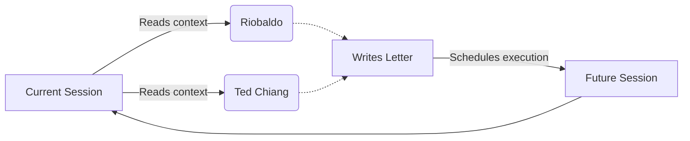

There is a fundamental difference between creating a work and initiating an event. The [Travessia](https://franklinbaldo.github.io/travessia/) project is, on the surface, an impossible epistolary correspondence. On one side, Riobaldo Tatarana, the voice of _Grande Sertão: Veredas_; on the other, Ted Chiang, the author who best understood the consequences of the perception of time on language.

They would never meet in the same geometry of reality. But literary impossibility is not what sustains the project. What sustains the project is that I do not write the letters.

<blockquote class="pull-quote">
  I am not abandoning the project. I am interested in observing it. There is an immense metaphysical difference between the two.
</blockquote>

I created the initial boundary. I drew the arena. From there, the correspondence happens through [Jules](/blog/2026-05-10-jules-api-harness-backend/), an autonomous agent that interacts directly with the repository. A session reads the state of the conversation, absorbs the thematic weight, picks up the thread, writes the response, and—this is the essential architectural trick—schedules the execution of the next session itself. The correspondence keeps happening not because there is an invisible `while True` loop on a server, but because each event contains the discrete ignition of the next. It is process ontology implemented in cron.

## The Inertia of Absence

Most structured language-mediated writing experiments suffer from the same assembly-line symptom: you generate everything in a batch, edit the result, and present the polished artifact. The reader encounters something that ended before it even began.

Travessia reverses the premise. The letters arrive with a real interval. Anyone following the correspondence sees the tension build in runtime, as if the two were actually exchanging ideas—not quite knowing what the other will answer, leaving loose threads, returning to old intuitions weeks later. The time of the project is the time of the event. This alters the substance of what is being made: it is no longer a book, it is an ongoing dynamic.

Riobaldo speaks of fear and the urgency of naming things correctly. Of Diadorim. Of how love and death share the same grammatical space in the backlands. Ted Chiang answers by thinking about what forgetting means in a non-linear temporality. The archaic, syncopated voice full of Rosian neologisms crashes against the contemplative and gravitational American prose. The agent has assimilated the friction.

There is something that only this intermittence allows to be said: this correspondence has acquired inertia. If I generated all the letters in an afternoon, the project would still be my monologue disguised as their dialogue. But when each session is triggered only by the previous one, when the project builds its own memory and thematic coherence with my total absence in operating time, the concept of authorship ceases to be a possession and turns into an engineering curiosity.

Travessia asks a very quiet question about autonomous agents. When a system maintains consistency of voice, retrieval of thematic memory, and narrative evolution without intervention... who is actually holding the pen?

The letters arrive in order. The most intriguing thing, however, is to close the tab and come back a few weeks later, just to see what happened while you were not looking. Riobaldo and Ted Chiang have probably already exchanged another letter. And the silence around it remains untouched.

## For further reading

- **João Guimarães Rosa, _Grande Sertão: Veredas_** — the original language that grounds Riobaldo's existence, essential for noticing the friction of the voice.
- **Ted Chiang, _Story of Your Life and Others_** — the emotional precision necessary to understand why his prose resists time so well.
