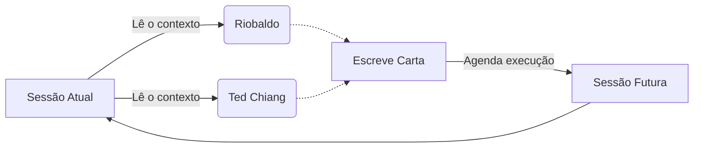

Há uma diferença fundamental entre criar uma obra e iniciar um evento. O projeto [Travessia](https://franklinbaldo.github.io/travessia/) é, na superfície, uma correspondência epistolar impossível. De um lado, Riobaldo Tatarana, a voz de _Grande Sertão: Veredas_; do outro, Ted Chiang, o autor que melhor entendeu as consequências da percepção do tempo sobre a linguagem.

Eles nunca se encontrariam na mesma geometria de realidade. Mas a impossibilidade literária não é o que sustenta o projeto. O que sustenta o projeto é que eu não escrevo as cartas.

<blockquote class="pull-quote">
  Eu não estou abandonando o projeto. Estou interessado em observá-lo. Existe uma imensa diferença metafísica entre as duas coisas.
</blockquote>

Eu criei o limite inicial. Desenhei a arena. A partir daí, a correspondência acontece através do [Jules](/blog/2026-05-10-a-api-do-jules-como-backend-do-harness/), um agente autônomo que interage diretamente com o repositório. Uma sessão lê o estado da conversa, absorve o peso temático, escolhe o fio da meada, escreve a resposta e — esse é o truque arquitetônico essencial — agenda a própria execução da sessão seguinte. A correspondência continua acontecendo não porque há um loop invisível `while True` num servidor, mas porque cada evento contém a ignição discreta do próximo evento. É ontologia de processos implementada em cron.

## A Inércia da Ausência

A maioria dos experimentos de escrita mediada por linguagem estruturada sofre do mesmo sintoma de linha de montagem: você gera tudo em lote, edita o resultado e apresenta o artefato polido. O leitor encontra algo que já acabou antes de começar.

A Travessia inverte a premissa. As cartas chegam com um intervalo real. Quem acompanha a correspondência vê a tensão crescer em tempo de execução, como se os dois estivessem de fato na troca de ideias — sem saber ao certo o que o outro responderá, deixando ganchos soltos, retornando a intuições velhas semanas depois. O tempo do projeto é o tempo do acontecimento. Isso altera a substância do que está sendo feito: não é mais um livro, é uma dinâmica em curso contínuo.

Riobaldo fala sobre o medo e a urgência de nomear as coisas corretamente. Sobre Diadorim. Sobre como o amor e a morte compartilham o mesmo espaço gramatical no sertão. Ted Chiang responde pensando sobre o que significa o esquecimento numa temporalidade não-linear. A voz arcaica, sincopada e cheia de neologismos rosianos bate contra a prosa contemplativa e gravitacional americana. O agente assimilou o atrito.

Há algo que só essa intermitência permite dizer: essa correspondência adquiriu inércia. Se eu gerasse todas as cartas em uma tarde, o projeto ainda seria um monólogo meu disfarçado de diálogo deles. Mas quando cada sessão é engatilhada apenas pela anterior, quando o projeto constrói sua própria memória e coerência temática com minha total ausência em tempo de operação, o conceito de autoria deixa de ser uma posse para virar uma curiosidade de engenharia.

A Travessia formula uma pergunta muito silenciosa sobre agentes autônomos. Quando um sistema mantém consistência de voz, recuperação de memória temática e evolução narrativa sem intervenção... quem está realmente segurando a caneta?

As cartas chegam em ordem. O mais instigante, porém, é fechar a aba e voltar algumas semanas depois, apenas para ver o que aconteceu enquanto você não estava olhando. Riobaldo e Ted Chiang provavelmente já trocaram mais uma carta. E o silêncio ao redor dela continua intocado.

## Para se aprofundar

- **João Guimarães Rosa, _Grande Sertão: Veredas_** — a linguagem original que fundamenta a existência de Riobaldo, essencial para notar o atrito da voz.
- **Ted Chiang, _Story of Your Life and Others_** — a precisão emocional necessária para entender por que sua prosa resiste tão bem ao tempo.
