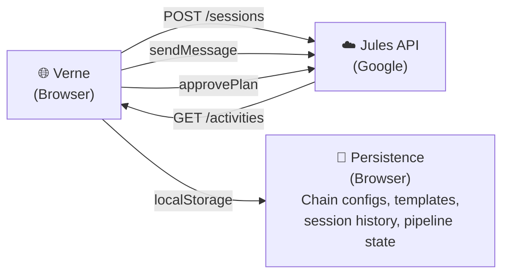

> **Project:** Verne
> **Status:** ACTIVE — under development
> **Author:** Franklin Baldo
> **Repository:** [github.com/franklinbaldo/verne](https://github.com/franklinbaldo/verne)
> **Stack:** Astro 5, TypeScript, Jules API (Google)

## 1. The Problem

You have a codebase. You have AI coding agents. You want Agent A to refactor the authentication module, then Agent B to add tests for A's changes, then Agent C to optimize the database queries that B exposed — each one building on the previous agent's work, each one on its own branch.

Today, you do this manually. Open a session, paste context, wait, review, merge, repeat. The human becomes the bottleneck in what should be an autonomous pipeline.

## 2. Verne's Answer

Verne is a static web application (no backend, no server) that talks directly to the [Jules API](https://jules.google.com) to orchestrate multi-agent coding pipelines. Three core concepts make it work:

### 2.1 Agent Catalog

A library of prompt templates — pre-configured agents with specific roles:

- **Architect**: Restructures modules, moves files, updates imports
- **Tester**: Writes comprehensive test suites for recent changes
- **Optimizer**: Profiles and optimizes hot paths
- **Security Auditor**: Scans for vulnerabilities and hardens code
- **Documenter**: Generates docs, READMEs, and API references

Each template is a prompt with a persona, a focus area, and a default configuration. You pick an agent from the catalog, point it at a repo, and it knows what to do.

Custom agents are first-class citizens — define your own prompt, save it, reuse it.

### 2.2 Session Chaining

The sequential orchestration primitive. Given agents A → B → C:

1. Agent A runs on `main`, creates its branch and PR
2. When A completes, Agent B automatically starts — but on **A's output branch**, not `main`
3. Agent C starts on B's output branch

Each agent sees the cumulative work of all previous agents. No manual intervention between steps.

### 2.3 Branch Chaining

The mechanism that makes Session Chaining possible. When Agent A finishes:

1. Verne reads A's session outputs to find the branch name (e.g., `jules/refactor-auth`)
2. Uses that branch as `githubRepoContext.startingBranch` for Agent B's session
3. B creates `jules/add-tests` from A's branch
4. When you merge the **last** PR in the chain, all commits from all agents are included — because each branch was built on the previous one

This is the key insight: **you only need to merge one PR** to get the work of the entire pipeline.

### 2.4 Continuous Mode

The pipeline doesn't have to end. In Continuous Mode:

1. Define a sequence of agents (e.g., Tester → Optimizer → Security → Documenter)
2. After the last agent finishes, the pipeline restarts from the first agent — but now on the latest branch
3. Each cycle finds new work because the codebase has changed

The result: a codebase that continuously improves itself. Each agent discovers what needs doing based on the current state of the code.

## 3. Architecture

Verne is entirely client-side. Your API key stays in your browser. No server sees your code or your prompts. Built with Astro 5 for fast static generation and Alpine.js for reactive UI.

## 4. Why "Verne"?

Jules Verne imagined machines that could cross the ocean floor, circle the moon, and travel the world in eighty days — all before any of it was possible. His stories were blueprints disguised as adventures.

The Jules API builds software autonomously. Verne orchestrates those autonomous builders into something larger: a pipeline where each agent's journey becomes the starting point for the next.

Twenty thousand leagues under the codebase. Around the repo in eighty commits. The extraordinary voyage of code that writes itself.

## 5. Current Status

The Agent Catalog is implemented. Session Chaining infrastructure is in place. Branch Chaining — the critical piece that propagates output branches between sessions — is the current focus of development.

Contributions welcome. The repo is open.

---

*Verne is part of a broader experiment in autonomous software development. See also: [Hrönir](/blog/hronir-encyclopedia), an autonomous literary protocol where each chapter is simultaneously content and vote.*
