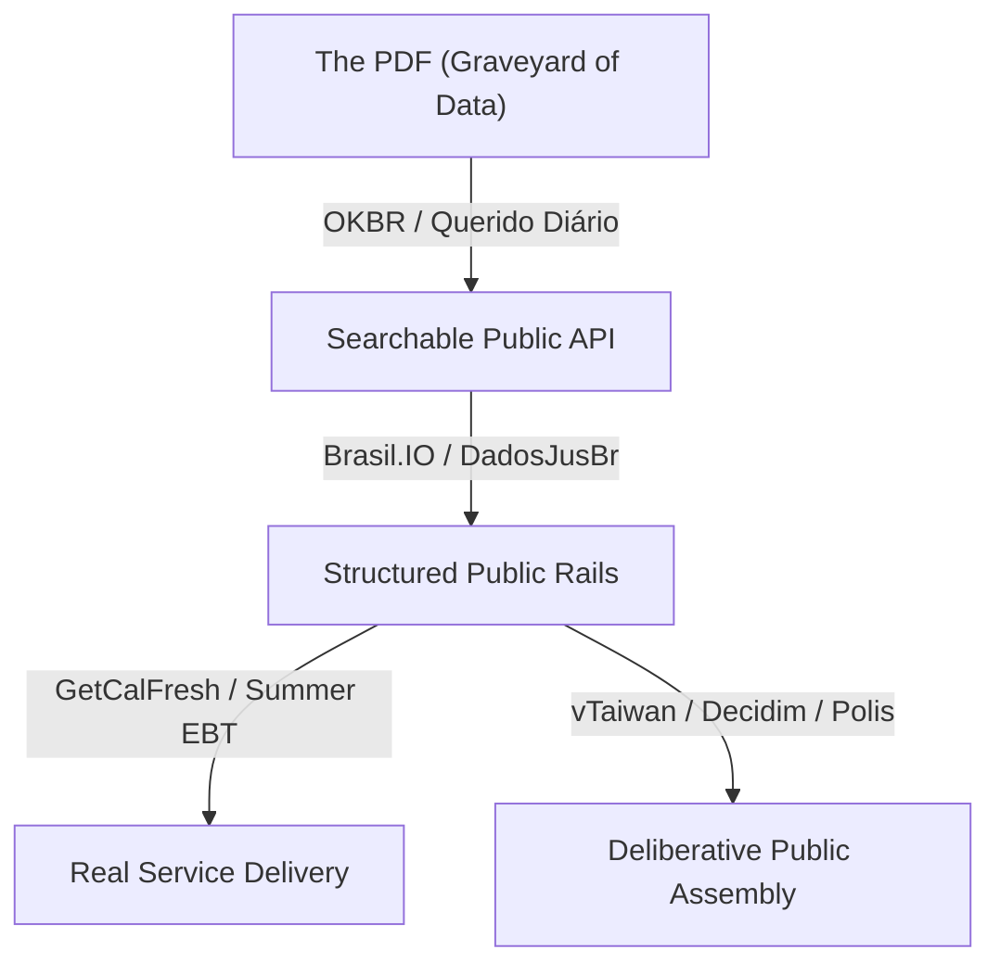

I have a habit of accumulating queues because it feels like the cheapest way to simulate progress.

Every weekend in Porto Velho, when the humidity climbs and the energy grid begins to sag under the weight of three thousand air conditioners, I open a new browser window and start bookmarking talks. It is a protective reflex. I work in a state attorney's office where the backlog behaves like a physical liquid, filling every room, and the temptation is to believe that if I just watch Evan You explain Vite or Geoffrey Hinton discuss the limits of human intelligence, I will somehow be closer to building the tools that might save me.

The browser window now has forty-seven open tabs. It is a monument to intentions I haven't earned yet.

Most of these are not recommendations. To recommend a talk, you have to have watched it, and to have watched it, you have to have surrendered forty minutes to someone else's rhythm. What sits below is the queue — the annotated list of things I have decided to care about before the compiler tells me I've spent another weekend performing the act of research.

Two clusters. The first is software engineering and AI—mostly from 2025, when the word 'agent' went from a conceptual framework to a CLI tool you could actually run. The second is civic tech and govtech, which I've been calling 'civil tech' in my drafts until Canivete pointed out the term doesn't exist. The name is civic tech, even if the tools often feel like they belong in a museum of good intentions.

## Where the code meets the latent space

The AI engineering cluster runs from very practical (how to build reliable agents) to philosophical (what are we actually doing here). [Dex Horthy's 12-factor agents](https://github.com/humanlayer/12-factor-agents) — a framework for building reliable LLM applications, borrowing the structure from the twelve-factor app methodology — appears twice because the framing keeps coming up and I want the source, not summaries. MCP is the [Model Context Protocol](https://modelcontextprotocol.io/), the standard that lets language models talk to external tools and data. The IDE-death talk is Steve Yegge and Gene Kim asking what happens to programming environments when AI writes most of the code.

|   # | Talk                                                                                                                            |
| --: | ------------------------------------------------------------------------------------------------------------------------------- |
|   1 | [2025 in LLMs so far, illustrated by Pelicans on Bicycles — Simon Willison](https://www.youtube.com/watch?v=YpY83-kA7Bo)        |
|   2 | [Software engineering with GenAI — Gergely Orosz / LeadDev LDX3 2025](https://www.youtube.com/watch?v=S6hIHPudbYw)              |
|   3 | [How We Build Effective Agents — Barry Zhang, Anthropic](https://www.youtube.com/watch?v=D7_ipDqhtwk)                           |
|   4 | [Don't Build Agents, Build Skills Instead — Barry Zhang & Mahesh Murag, Anthropic](https://www.youtube.com/watch?v=CEvIs9y1uog) |
|   5 | [12-Factor Agents: Patterns of reliable LLM applications — Dex Horthy](https://www.youtube.com/watch?v=8kMaTybvDUw)             |
|   6 | [Building and evaluating AI Agents — Sayash Kapoor](https://www.youtube.com/watch?v=d5EltXhbcfA)                                |
|   7 | [Claude Code & the evolution of agentic coding — Boris Cherny](https://www.youtube.com/watch?v=Lue8K2jqfKk)                     |
|   8 | [No Vibes Allowed: Solving Hard Problems in Complex Codebases — Dex Horthy](https://www.youtube.com/watch?v=rmvDxxNubIg)        |
|   9 | [Will AI outsmart human intelligence? — Geoffrey Hinton, Royal Institution](https://www.youtube.com/watch?v=IkdziSLYzHw)        |
|  10 | [Mathematics: The rise of the machines — Yang-Hui He](https://www.youtube.com/watch?v=oOYcPkBaotg)                              |
|  11 | [The New Code — Sean Grove, OpenAI](https://www.youtube.com/watch?v=8rABwKRsec4)                                                |
|  12 | [MCP is all you need — Samuel Colvin, Pydantic](https://www.youtube.com/watch?v=bmWZk9vTze0)                                    |
|  13 | [2026: The Year The IDE Died — Steve Yegge & Gene Kim](https://www.youtube.com/watch?v=7Dtu2bilcFs)                             |
|  14 | [AI without the BS, for humans — Scott Hanselman, NDC London 2025](https://www.youtube.com/watch?v=kYUicaho5k8)                 |
|  15 | [Keynote Speaker — Cory Doctorow, PyCon US](https://www.youtube.com/watch?v=ydVmzg_SJLw)                                        |
|  16 | [Vite Beyond a Build Tool — Evan You, ViteConf 2025](https://www.youtube.com/watch?v=x7Jsmt_o9ek)                               |
|  17 | [You Don't Know Git — Edward Thomson, NDC London 2025](https://www.youtube.com/watch?v=DZI0Zl-1JqQ)                             |
|  18 | [Decoding the secrets of life with AI — Mikhail Burtsev](https://www.youtube.com/watch?v=l28WCnZXNNg)                           |
|  19 | [The Battle of Khasham — The Operations Room](https://www.youtube.com/watch?v=T6Ii45jxsLE)                                      |
|  20 | [New CSS features to know for 2025 — Kevin Powell](https://www.youtube.com/watch?v=jSCgZqoebsM)                                 |

## What civic tech smells like when it's real

This is the cluster I'm more interested in right now. I work in public administration in Rondônia and I've been thinking about what it would take for accountability data to actually reach the people who should be reading it. The Brazilian videos are where I start. The international ones are where I go for mental models that Brazil hasn't built yet.

### Brazil

**[Querido Diário: hoje eu tornei um Diário Oficial acessível para todo mundo](https://www.youtube.com/watch?v=eBGAg45oMpM)** — entry point to the project: municipal official gazettes made searchable and usable. This is the [Open Knowledge Brasil](https://docs.queridodiario.ok.org.br/) project for extracting and centralizing official municipal gazette data with a public API.

**[Navegando na API do Querido Diário](https://www.youtube.com/watch?v=vgrqw2HLFJY)** — the more useful one if I actually want to build something on top of the data.

**[Navegando no site do Querido Diário](https://www.youtube.com/watch?v=Qk5oQ9g1iX8)** — less technical, good for seeing the public-facing UX before diving into the API.

**[Brasil.IO: Dados abertos para mais democracia — Álvaro Justen](https://www.youtube.com/watch?v=1FEYQBmyk2Y)** — [Brasil.IO](https://brasil.io/) is a repository of Brazilian public data in accessible formats. A classic of Brazilian open-data infrastructure.

**[Ativismo digital e tecnologia cívica — Operação Serenata de Amor](https://m.youtube.com/watch?v=3N_qRFyhZs8)** — older, but important. [Serenata de Amor / Rosie](https://serenata.ai/) used AI to analyze reimbursed parliamentary spending under CEAP and flag suspicious cases. One of the canonical Brazilian civic-tech stories.

**DadosJusBr** — I'm following the project more than looking for a single video. Highly relevant: structured remuneration and transparency data for the Judiciary and Ministério Público. The kind of thing that should be standard and isn't.

### Abroad

**[AI Studio: Solving government's PDF problem with AI — Code for America Summit 2025](https://www.youtube.com/watch?v=Aw9GRtY_4Cg)** — PDFs as the graveyard of public information. Relevant everywhere, but especially in Brazilian public administration where the PDF is load-bearing infrastructure.

**[Putting policy to work: Guiding AI use inside government — Code for America Summit 2025](https://www.youtube.com/watch?v=eUSKDtAXo_A)** — procurement, guardrails, implementation. The better civic-tech version of "AI in government," without the demo magic.

**[How Summer EBT is delivering on a new promise for families — Code for America Summit 2025](https://www.youtube.com/watch?v=BR8Im8YMEUg)** — concrete benefits-delivery civic tech. [GetCalFresh](https://codeforamerica.org/success-stories/simplifying-californias-online-application-for-food-benefits/) helped 6.2 million people get food benefits from 2017–2025. That is the unit of measurement I want to be using.

**[vTaiwan: new experiments in digital democracy](https://www.youtube.com/watch?v=qkXxcwUkdyw)** — Taiwan is probably the world's most interesting case for civic tech that actually touched governance. The [g0v](https://g0v.tw/intl/en/) ecosystem is decentralized, transparent, and has shipped things that worked.

**[How digital democracy can heal polarisation — Audrey Tang](https://www.youtube.com/watch?v=lzmYVYHVXp4)** — the philosophical version: not just better forms, but different institutional affordances.

**[Decidim secret sauce: Building an international community](https://www.youtube.com/watch?v=6ImrcgD0OR0)** — [Decidim](https://decidim.org/) is a free/open platform for citizen participation. Infrastructure for participatory processes and assemblies.

**[Scaling Deliberation: Polis and the Computational Democracy Project](https://www.youtube.com/watch?v=b4j_2JDh_Rc)** — one of the most interesting "AI + democracy" lines: [Polis](https://compdemocracy.org/) tries to find consensus structure rather than maximize engagement. Opposite of social media.

**[The Department of Government Improvement: Civic Tech and Why It Matters](https://www.youtube.com/watch?v=QXmlEDvq48Y)** — 18F/USDS framing: government improvement as craft, not ideology.

**[2025 State of Digital Public Infrastructure Report Launch](https://www.youtube.com/watch?v=YmBpHGmZC9g)** — the broader "digital public infrastructure" frame: identity, payments, data exchange, public rails. The [Digital Public Goods Alliance](https://digitalpublicgoods.net/) framing is useful here.

The queue is not a database; it is a trajectory — though I haven't convinced myself yet that watching in any particular order changes what you learn. The movement from Brazilian data liberation to service delivery to deliberative infrastructure is a theory, not a lesson plan. It ends at questions I don't know how to answer yet, which is usually a sign the queue is worth the time.

[causaganha](https://github.com/franklinbaldo/causaganha) has been sitting in my repository for three years — a scraper for Rondônia's official gazette that would do for Rondônia what Querido Diário does for municipalities across Brazil. Every few months I open it, add something, close it again. The moment I stop writing code, the official gazette returns to being a pile of unindexed PDFs.

A pipeline that doesn't run is just steel sitting in the dirt.

The tabs stay open until the machine decides otherwise.
