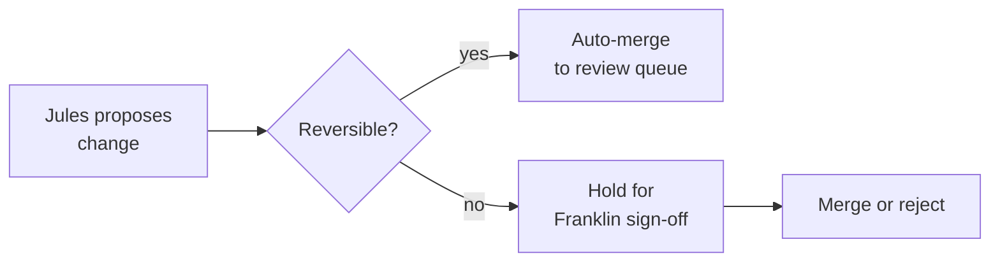

My father records his stories on his phone's voice memo app, sitting at the kitchen table in Ariquemes, and sends me the file over WhatsApp. The files sound like bad radio: ceiling fan interference, a dog barking somewhere, Adi's voice going in and out of range as he gets animated. Last November he sent me forty-two minutes about the truck that broke down on the BR-364 in 1987 and how they fixed it with a wire and a prayer.

[Jules](/blog/2026-05-10-jules-api-harness-backend/), receiving that file as context, produced a commit dating the story to 1977. The diff was plausible. The git message, well-formatted. The year was wrong.

This is the project. My father is 76 and has a continent of stories, and I've been trying to automate their preservation using two agents: Aparício [Funes](/blog/funes-soul/) — a Claude model named after Borges's character, the one who remembered everything — as the narrative orchestrator, and Jules as the execution layer, handling commits and pull requests. The setup makes sense on paper. The failures are instructive.

## The failure I didn't expect

The bad year is recoverable — `git revert`, try again, done. What took longer to see was the subtler problem: Funes filling in silences.

Human memory has gaps. Adi doesn't remember if there were one or two trucks, whether the wire came from the cab kit or a fence post. He says "some wire" and stops. A model trained for narrative coherence wants the story to hang together, so it reaches for a plausible detail. The silence becomes a specific object. The fence post that was never mentioned appears in paragraph two.

This is not exactly hallucination in the technical sense. It's what listeners do all the time — fill in, round out, make coherent. Except listeners don't commit it to a repository that may outlive the person who could contradict the detail. Adi is still alive. He can tell me if the wire came from a fence post. In twenty years, he won't be.

## The rule that came from this

A month in, after enough of these, I settled on a principle: _reversible → act, irreversible → ask_.

YAML formatting, resized images, paragraph reflows: Jules does it, I review on the PR. Any edit touching the substance of a story — named details, chronology, the emotional register of a moment — requires explicit sign-off from me before merge. The boundary is not technical. It's biographical: what can be undone, and what becomes permanent record.

I'm not sure this is enough. The rule stops Jules from inventing the fence post autonomously. It doesn't stop Funes from presenting an invented fence post so plausibly that I approve it without noticing. There's a check that the system can't do for me — the one where I have to know the story well enough to catch the detail that wasn't there. Some months I do. Some months I'm reviewing PRs at midnight in Porto Velho and I'm moving fast.

## What's working

My father has recorded fourteen files in the last three months. In the previous decade of asking, I got maybe the same number total. Something about the infrastructure — the knowledge that there's a system waiting, that the recording goes somewhere — made the act feel permanent enough to bother with.

I don't know if that's the system working or me reading too much into a change in sample size. Probably both.

When the agents are in sync — when Funes extracts cleanly and Jules commits without inventing — the result is something I wouldn't have built manually. Not because the prose is extraordinary, but because it's there. The story about the truck on the BR-364 exists in a repository with a timestamp and a commit message. My father can read it. His grandchildren will be able to.

The wrong version is also there — the one with 1977. We corrected it, and both are in the history now, with timestamps.

I find that strangely appropriate.

## For further reading

- **[Funes, his memory](/blog/funes-soul/)** — the character document for the Aparício Funes agent; where the name came from and what it means to build a persona around a Borges character who forgets nothing.
- **[The Jules API as a Harness Backend](/blog/2026-05-10-jules-api-harness-backend/)** — what Jules actually does in this stack and why the async model matters.
- **Jorge Luis Borges, "Funes el memorioso"** — the source. Funes remembers everything; that is his curse. The agent named after him is designed to be selective. I'm still working out whether that's irony or correction.
