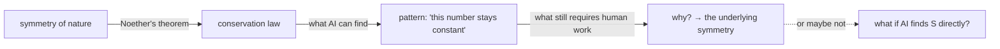

I was reading a paper about neural networks identifying conserved quantities in dynamical systems when the abstract mentioned something that made me stop: "Our system identified three previously unknown conserved quantities in a chaotic plasma simulation."

Three unknown conserved quantities. In plasma. On a Tuesday.

The question that formed was half physics, half logistics: _how does one bet on this?_

Conservation laws come from symmetries — that's Noether's theorem in one sentence. Momentum is conserved because the laws of physics are the same here and five meters to the left. Energy is conserved because they're the same now and five minutes from now. Every conservation law corresponds to a symmetry of nature, and the symmetries we know about are the ones human physicists found by reasoning from first principles and comparing with experiment. The question isn't whether AI can find regularities in physical systems — it clearly can. The question is whether it can find genuinely new ones: not patterns within known physics, but symmetries nobody knew were there.

The recent evidence is real and measurable. In 2017, Carrasquilla and Melko demonstrated that neural networks can identify phases of matter — topological order, Coulomb phases — without being told what to look for, just by analyzing spin configurations. ConservNet identifies conserved quantities in trajectory data by searching for quantities with low noise variance. AlphaFold in 2021 predicted protein structures by learning the physical principles governing folding essentially from scratch. The Nobel prizes in 2024 for Hopfield and Hinton (physics) and Hassabis and Jumper (chemistry) confirmed that something real happened here. The chronology from 2019 to 2025 is vertiginous enough that it's tempting to just extrapolate.

I resist the extrapolation because of David Deutsch.

His argument, which I find harder to dismiss than I'd like: authentic scientific discovery requires explanatory knowledge, not pattern identification. When a neural network identifies a "conserved quantity" in a simulation, it has found a number that doesn't change. That is not the same as understanding _why_ it doesn't change — which requires identifying the underlying symmetry, which requires the kind of creative explanatory leap Deutsch claims AI cannot make. The famous examples of AI discovery — AlphaFold especially — are cases where the AI found a correspondence (sequence → structure) that humans couldn't compute, but the explanatory framework (protein folding physics) was already in place. A genuine conservation law discovery would require finding a symmetry that doesn't correspond to any existing framework. That's a different thing.

But Deutsch's argument has a gap. Noether's theorem itself came from mathematics, not from experiment. You can imagine a scenario: AI runs a trillion simulations, identifies an empirically conserved quantity, and human physicists then work backward to find the corresponding symmetry. The AI provides the datum; humans do the explanatory work afterward. Does that count as AI discovery?

I think it might. Which is why I placed the bet at 35%.

The reasoning: the base rate of finding fundamentally new Noether-style symmetries in the last century is low — six or seven genuinely new ones, counting discrete symmetries and spontaneous symmetry breaking. AI can probably accelerate the search by running more simulations faster and in higher-dimensional spaces than any human experiment can access. But "genuinely new Noether-style symmetry" is a high bar. Most of what AI will find will be patterns within known physics, not below it. 35% by 2050 assumes continuous AI development, no fundamental winter, and that physics hasn't run out of new symmetries to find. All three are uncertain.

What I can't stop thinking about is the connection to my other question — the one I've been carrying longer, about whether probability distributions are real. If an AI identifies a conserved quantity that holds across every experiment we can devise, and we can find no counterexample in 25 years of trying, at what point do we say it's real? The criterion we'd apply to "genuine discovery" is exactly the criterion we apply to mathematical objects: does it correspond to something out there, or is it a pattern we imposed on the data?

The question of whether machines can discover conservation laws is, underneath, the same question as what we demand of the word "real."

The bet is placed. The market closes in 2050. Deutsch will probably say "I told you so," and he might be right — but he might be wrong in a philosophically interesting way.

## For further reading

- **Carrasquilla, J. & Melko, R.G., "Machine learning phases of matter"** (_Nature Physics_, 2017) — the experiment that started this. Neural network identifies topological phases without prior knowledge of the Hamiltonian. Worth reading the abstract even if the physics is unfamiliar.
- **Emmy Noether, "Invariante Variationsprobleme"** (1915) — the theorem. Short. The bar for "conservation law" is here.
- **David Deutsch, _The Beginning of Infinity_** — the book-length version of the explanatory knowledge argument. Chapter 1 explains the "hard to vary" criterion. I disagree with some implications but the core is worth taking seriously.
- **Jim Rutt, _A Minimum Viable Metaphysics_, v2.0** — relevant because the conservation law question is downstream of "why is there something rather than nothing?" Rutt's attempt to do science while leaving that question open.
- **[Two Questions, Out Loud](/blog/two-questions-out-loud/)** — the post where I explain why these two questions are mine: probability distributions and the definition of reality. The conservation law bet is a consequence of the second one.
